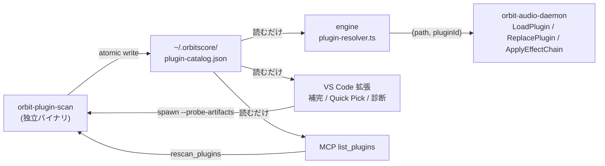
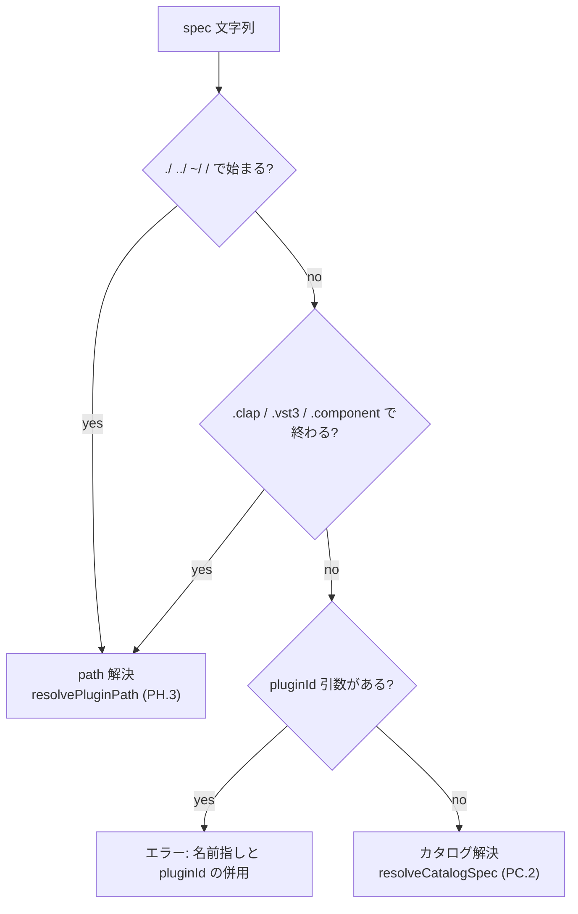

> **Note**: 本ページは 2026-09-01 時点での著者の reading の足跡です。code が真実、本ページはその時点の理解の snapshot に過ぎません。

# PH-3. プラグインカタログ — 名前指し・補完・差し替え

PH-1 で見た `seq.instrument()` / `global.effect()` は、当初はプラグインを**フルパス**で
書く必要がありました。本章はその上に積まれた 4 つの機能を追います。

| Issue | 何が入ったか |
|---|---|
| [#463](https://github.com/signalcompose/orbitscore/issues/463) | プラグインカタログ（スキャナ + `~/.orbitscore/plugin-catalog.json`）、DSL の名前指し、エディタ補完、MCP `list_plugins` / `rescan_plugins` |
| [#618](https://github.com/signalcompose/orbitscore/issues/618) | instrument をエンジン再起動なしに差し替える（daemon 機構 + TS 表面 + 実機 E2E） |
| [#625](https://github.com/signalcompose/orbitscore/issues/625) | effect insert の差し替え・削除（Stage 0〜D） |
| [#638](https://github.com/signalcompose/orbitscore/issues/638) | 「Browse Plugins」Quick Pick と、評価前に名前の誤りを知らせる診断 |

仕様の正本は `docs/core/INSTRUCTION_ORBITSCORE_DSL.md` の「Plugin Catalog」節（PC.1〜PC.5）と
PH.2d / PH.3 / PH.4、そして `docs/specs-v2/SIGNAL_CHAIN_DSL_SPEC_v1.md` の SC.10 です。
本章は「code が何をしているか」を読み、仕様は必要な箇所だけ引用します。



図の要点は一つで、**カタログを書くのはスキャナだけ**、engine・拡張・MCP はファイルを読むだけ
という分業です。この分業がなぜ必要だったのかは §1 の crash 隔離の話に出てきます。

## 1. カタログとは何か — スキャナと JSON の形

### 1.1 なぜ独立バイナリなのか

スキャナ crate の Cargo.toml 冒頭コメントが、設計の理由をそのまま語っています。

```toml
# rust/crates/orbit-plugin-scan/Cargo.toml:1-7
# orbit-plugin-scan — プラグインカタログスキャナ（#463 C1）。
#
# CLAP/VST3 バンドルをスキャンし ~/.orbitscore/plugin-catalog.json を生成する。
# スキャン・probe はプラグインロードを伴い crash リスクがあるため、daemon 本体でなく
# 短命な独立バイナリに隔離する（#397 の crash isolation 原則）。
#
# 正本: docs/core/INSTRUCTION_ORBITSCORE_DSL.md「Plugin Catalog」節 PC.1
```

プラグインの metadata を読むにはプラグインの共有ライブラリをロードする場面があり、それは
crash やハングのリスクを伴います。音を出している daemon の中でそれをやると、スキャン 1 回で
演奏が止まりかねません。そこで**短命な別プロセス**に切り出す、というのが `#397` 以来の
crash isolation 原則で、crate の `description` も
"Plugin catalog scanner: discovers CLAP/VST3 plugins and writes ~/.orbitscore/plugin-catalog.json (Issue #463)"
と、生成先のファイル名まで明記しています。

### 1.2 エントリの形

カタログ 1 エントリと、トップレベルのドキュメントは Rust 側でこう定義されています。

```rust
// rust/crates/orbit-plugin-scan/src/lib.rs:29-50
/// カタログ 1 エントリ（PC.1 JSON スキーマ）。
#[derive(Debug, Clone, Serialize, Deserialize)]
#[serde(rename_all = "camelCase")]
pub struct CatalogEntry {
    pub name: String,
    pub vendor: String,
    pub format: Format,
    pub path: String,
    pub plugin_id: String,
    pub roles: Vec<String>,
}

/// トップレベルのカタログドキュメント（PC.1）。
#[derive(Debug, Clone, Serialize, Deserialize)]
#[serde(rename_all = "camelCase")]
pub struct Catalog {
    pub version: u32,
    pub scanned_at: String,
    pub plugins: Vec<CatalogEntry>,
    #[serde(default)]
    pub artifacts: Vec<CatalogArtifact>,
}
```

`plugins` が spec PC.1 の言う `{ name, vendor, format, path, pluginId, roles }` で、
**1 バンドルに複数プラグインが入っていれば pluginId ごとに 1 エントリ**になります。
`artifacts` は catalog v2（#549 B1）で足された「見つけた全バンドルの台帳」で、probe の
状態（`staticSuccess` / `probePending` / `probeSucceeded` / `probeFailed`）と失敗理由を
持ちます。`#[serde(default)]` が付いているのは、v1 形式のファイルを読んでも壊れないように
するためです。`version` は `main.rs:64-69` が `2` を書き込みます。

`roles` の判定は format ごとに違います。CLAP は feature タグから決めていて、どちらとも
判定できないときは**安全側で両方入れる**のがポイントです。

```rust
// rust/crates/orbit-plugin-scan/src/lib.rs:571-584
/// CLAP feature タグから role (instrument/effect) を判定する。
/// 両方一致・どちらも不一致の場合は両方入れる（安全側・PC.1 の role フィルタで絞り込む前提）。
fn roles_from_clap_features(features: &[String]) -> Vec<String> {
    let has_instrument = features.iter().any(|f| f == "instrument");
    let has_effect = features
        .iter()
        .any(|f| f == "audio-effect" || f == "audio_effect");

    match (has_instrument, has_effect) {
        (true, false) => vec![ROLE_INSTRUMENT.to_owned()],
        (false, true) => vec![ROLE_EFFECT.to_owned()],
        _ => vec![ROLE_INSTRUMENT.to_owned(), ROLE_EFFECT.to_owned()],
    }
}
```

VST3 側の `roles_from_vst3_subcategories`（`lib.rs:922-940`）も同じ発想で、`Sub Categories` に
`Instrument` / `Synth` / `Generator` があれば instrument、それ以外があれば effect、
ヒントが無ければ両方、と判定します。「分からなければ両方」にしておけば、後段の role
フィルタ（§2）で `effect()` に instrument-only を渡したときだけ弾ける、という設計です。

### 1.3 どこを見に行くか — 非再帰・後勝ち

スキャン対象は macOS 標準の 4 ディレクトリと、`ORBIT_PLUGIN_PATH`（`:` 区切り）です。

```rust
// rust/crates/orbit-plugin-scan/src/lib.rs:187-198
/// スキャン対象ディレクトリのデフォルト（PC.1）。
/// `~` は `dirs_home` で解決する（HOME 環境変数が読めない場合はスキップ）。
fn default_scan_dirs(home: Option<&Path>) -> Vec<PathBuf> {
    let mut dirs = Vec::new();
    if let Some(home) = home {
        dirs.push(home.join("Library/Audio/Plug-Ins/CLAP"));
        dirs.push(home.join("Library/Audio/Plug-Ins/VST3"));
    }
    dirs.push(PathBuf::from("/Library/Audio/Plug-Ins/CLAP"));
    dirs.push(PathBuf::from("/Library/Audio/Plug-Ins/VST3"));
    dirs
}
```

各ディレクトリの走査は**直下のみ**で、サブディレクトリには降りません。spec PC.1 の
「各ディレクトリ直下のみ = 非再帰」がそのまま実装になっています。

```rust
// rust/crates/orbit-plugin-scan/src/lib.rs:228-253
/// 1 ディレクトリ直下（非再帰）を走査し、`.clap` / `.vst3` バンドル候補を列挙する。
/// ディレクトリが存在しない・読めない場合は空 Vec を返す（stderr warn のみ）。
pub fn list_bundle_candidates(dir: &Path) -> Vec<(PathBuf, Format)> {
    let entries = match fs::read_dir(dir) {
        Ok(entries) => entries,
        Err(error) => {
            // 存在しないデフォルトパスは珍しくない（プラグイン未インストール環境）ので debug 相当。
            tracing::debug!("[orbit-plugin-scan] ディレクトリを読めません: {dir:?}: {error}");
            return Vec::new();
        }
    };

    let mut found = Vec::new();
    for entry in entries.flatten() {
        let path = entry.path();
        let Some(extension) = path.extension().and_then(|e| e.to_str()) else {
            continue;
        };
        match extension.to_ascii_lowercase().as_str() {
            "clap" => found.push((path, Format::Clap)),
            "vst3" => found.push((path, Format::Vst3)),
            _ => {}
        }
    }
    found
}
```

`.component`（AU）はここで拾われないので、spec PC.5 の「AU はスキャン対象外」も
この `match` が根拠になります。

同じプラグインが 2 箇所にある場合の dedup は**後勝ち**です。

```rust
// rust/crates/orbit-plugin-scan/src/lib.rs:1037-1055
/// エントリ列を dedup する（後勝ち: 同キーの後続要素が前の要素を置き換える）。
pub fn dedup_entries(entries: Vec<CatalogEntry>) -> Vec<CatalogEntry> {
    let mut order: Vec<(u8, String, String)> = Vec::new();
    let mut map: std::collections::HashMap<(u8, String, String), CatalogEntry> =
        std::collections::HashMap::new();

    for entry in entries {
        let key = dedup_key(&entry);
        if !map.contains_key(&key) {
            order.push(key.clone());
        }
        map.insert(key, entry);
    }

    order
        .into_iter()
        .map(|key| map.remove(&key).expect("key was just inserted"))
        .collect()
}
```

ここで気をつけたいのは、dedup のキーが `(format, path, plugin_id)` であって**名前では
ない**という点です（`dedup_key` は `lib.rs:1028-1035`）。つまり同じ名前のプラグインが
別のパスに 2 つあれば、カタログには**両方**残ります。spec PC.5 の「多バージョン共存は
区別しない — スキャン順で最後に見つかった path が勝つ」という文と、この実装の関係は
§2.5 の #623 の話で戻ってきます。

### 1.4 書き込みは atomic

ファイルは tmp に書いてから rename する atomic write です。読み手（engine・拡張）が
書きかけの JSON を掴まないための最低限の防御です。

```rust
// rust/crates/orbit-plugin-scan/src/lib.rs:1854-1866
/// カタログを JSON にシリアライズして `path` へ atomic write（tmp + rename）する。
pub fn write_catalog(catalog: &Catalog, path: &Path) -> io::Result<()> {
    if let Some(parent) = path.parent() {
        fs::create_dir_all(parent)?;
    }
    let json = serde_json::to_string_pretty(catalog)
        .map_err(|error| io::Error::new(io::ErrorKind::InvalidData, error))?;

    let tmp_path = path.with_extension("json.tmp");
    fs::write(&tmp_path, json)?;
    fs::rename(&tmp_path, path)?;
    Ok(())
}
```

### 1.5 probe は明示的に頼んだときだけ — 23% から 99.1% へ

面白いのは、スキャナに `--probe-artifacts` フラグを付けたときと付けないときで挙動が
変わる点です。

```rust
// rust/crates/orbit-plugin-scan/src/main.rs:25-29
    // Native loading is opt-in. Unrelated/legacy argv remains ignored so unattended startup
    // cannot accidentally regress #463.
    let explicit_probe = first.as_deref() == Some(std::ffi::OsStr::new("--probe-artifacts"))
        || args.any(|arg| arg == std::ffi::OsStr::new("--probe-artifacts"));
    run_catalog_scan(explicit_probe)
```

この opt-in には経緯があります。2026-07-17 の C1 実装（WORK_LOG 6.269）では、VST3 を
実ロードして metadata を読む fallback を入れたところ、コンテンツ依存のプラグインが
**ネイティブダイアログを出す**実害が出て、その fallback は撤去されました。その結果
VST3 は `moduleinfo.json` を同梱するものしかカタログに入らず、`docs/research/PLUGIN_CATALOG_SCANNING.md`
の実測（2026-07-29）では 340 バンドル中 79 エントリ、**カバレッジ 23.2%** に留まっていました。

同 research doc の結論は「論点は probe するかしないかではなく **probe の深さ**」でした。
ダイアログが出るのは component 初期化の層で、factory descriptor（class 一覧・名前・
カテゴリ）を読むだけならそこまで到達しない、というのが調査の要点です。そこで
`moduleinfo.json` 無しを「非対応」ではなく「**まだ probe していない**（`probePending`）」と
表現し、明示 rescan のときだけ 1 artifact = 1 child プロセスで浅い probe を走らせる三段階
モデルに切り替えました（#549 B1・WORK_LOG 6.321）。結果は 80 → **339** エントリ、
instrument 9 → 72、カバレッジ **99.1%** です。

spec PC.1 はこの決定を規範として固定しています。

> **VST3 の native probe は明示スキャン時だけ行う**（規範）。コンテンツ依存プラグインが
> ネイティブダイアログを出し得るため（#463、実害確認 2026-07-17）、無人起動で
> moduleinfo 無し VST3 をロードしてはならない。

キャッシュの鍵となる fingerprint は `format + canonical bundle path + executable の相対パス
+ size/mtime + Info.plist の size/mtime + scanner schema version` で、コンテンツの hash は
**意図的に含めません**（`lib.rs:74-76` のコメントは「毎回およそ 16.5 GiB を読み直すことになる」
と理由を書いています）。schema version を上げると positive/negative 両方のキャッシュが無効に
なる、という説明も `SCANNER_SCHEMA_VERSION`（`lib.rs:52-61`）のコメントに残っています。
catalog の `version: 2` とは独立した番号で、role 判定や classes → entries の投影が変わったとき
にも上げる必要がある、と書かれています。

## 2. 名前指し — path か名前かをどう判別し、どう解く

### 2.1 engine 側のカタログ reader

engine はカタログを読むだけです。`plugin-catalog.ts`（`:18-73`）は型と I/O のみを持ち、
`~/.orbitscore/plugin-catalog.json` を mtime を鍵にした in-memory キャッシュで読むので、
rescan 後もプロセス再起動なしに新しい内容を拾います。パスは
「明示 override > `ORBIT_PLUGIN_CATALOG` 環境変数 > 既定」の順で解決され、環境変数は
テスト用の注入点として §3 の合意テストが使います。ファイルが無ければ `undefined` を返し、
呼び出し側がそれを「rescan してください」というエラーに変えます。

### 2.2 判別規則 — `looksLikePath()` を再利用しない理由

spec PC.2 の判別規則はこうです。

> **判別規則**: spec が path-direct 形（`./` `../` `~/` `/` **開始**）または既知拡張子
> （`.clap` `.vst3` `.component`）で終わる → 従来どおり path 解決（PH.3）。
> それ以外 → **カタログ名として解決**

実装はほぼ 1:1 です。

```typescript
// packages/engine/src/core/global/plugin-resolver.ts:68-80
const PATH_DIRECT_PREFIXES = ['./', '../', '~/', '/']

/**
 * PC.2 discriminator: path-direct specs start with `./`/`../`/`~/`/`/` or end with a known
 * plugin extension; everything else is a catalog name. Deliberately does NOT reuse audio's
 * `looksLikePath()` ("contains `/`" = path) — a vendor-qualified catalog name like
 * `"TAL Software/TAL Reverb 4"` contains `/` but is not a path.
 */
export function isPluginPathSpec(spec: string): boolean {
  if (PATH_DIRECT_PREFIXES.some((prefix) => spec.startsWith(prefix))) return true
  const lower = spec.toLowerCase()
  return KNOWN_PLUGIN_EXTENSIONS.some((ext) => lower.endsWith(ext))
}
```

audio 系には「`/` を含めば path」という `looksLikePath()` があるのですが、それを使うと
vendor 修飾 `"TAL Software/TAL Reverb 4"` が path 扱いになってしまいます。だから**開始形と
末尾拡張子だけ**を見る専用判別になっています。逆に言うと、カタログ名自体が `.clap` で
終わる（例: `"MyPlugin.clap"` という表示名）と path に倒れるのは既知の限界で、spec も
「path 指定で回避」と書いています。



### 2.3 正規化と修飾子

名前の比較は `trim → NFC → lowercase` です。NFC にするのは、macOS のファイルシステム
由来の NFD（結合文字が分解された形）と、エディタで打った NFC が一致しなくなるのを防ぐためです。

```typescript
// packages/engine/src/core/global/plugin-resolver.ts:91-93
export function normalizeCatalogKey(value: string): string {
  return value.trim().normalize('NFC').toLowerCase()
}
```

`"vst3/TAL Reverb 4"` のような **format 修飾**と `"TAL Software/TAL Reverb 4"` のような
**vendor 修飾**は、最初の `/` より前が既知 format 名（`clap` / `vst3`）かどうかで分かれます。

```typescript
// packages/engine/src/core/global/plugin-resolver.ts:115-128
function catalogQualifier(spec: string): CatalogQualifier {
  const slashIndex = spec.indexOf('/')
  const qualifierKey =
    slashIndex === -1 ? undefined : normalizeCatalogKey(spec.slice(0, slashIndex))
  const formatKey =
    qualifierKey !== undefined && KNOWN_PLUGIN_FORMATS.includes(qualifierKey)
      ? qualifierKey
      : undefined
  return {
    qualifierKey,
    formatKey,
    vendorKey: formatKey === undefined ? qualifierKey : undefined,
  }
}
```

`resolveCatalogCandidates`（`plugin-resolver.ts:130-199`）は、この修飾子で候補を絞ったあと
**未検出 → vendor 曖昧 → role 不一致 → v1 でホストできない format** の順に検査します。
順序は後述の診断（§3.4）がそのまま鏡写しにするので、覚えておく価値があります。

```typescript
// packages/engine/src/core/global/plugin-resolver.ts:157-172
  if (candidates.length === 0) {
    throw new Error(
      `No plugin named "${spec}" found in the plugin catalog (${catalogPath}). ${RESCAN_HINT}`,
    )
  }

  if (vendorKey === undefined) {
    const distinctVendors = new Set(candidates.map((entry) => normalizeCatalogKey(entry.vendor)))
    if (distinctVendors.size > 1) {
      const listed = candidates.map((entry) => `"${entry.vendor}/${entry.name}" (${entry.format})`)
      throw new Error(
        `Plugin name "${spec}" is ambiguous across multiple vendors: ${listed.join(', ')}. ` +
          'Qualify it as "vendor/name" to disambiguate.',
      )
    }
  }
```

同名別 vendor は「黙って先頭を選ばず、候補を列挙してエラー」です。未検出時の
`RESCAN_HINT` は `Run \`orbit-plugin-scan --probe-artifacts\` to (re)generate the plugin catalog, then retry.`
で、spec PC.2 の「rescan 手順を含む actionable メッセージ」に当たります。

```typescript
// packages/engine/src/core/global/plugin-resolver.ts:174-198
  const roleCandidates =
    role === undefined ? candidates : candidates.filter((entry) => entry.roles.includes(role))
  if (role !== undefined && roleCandidates.length === 0) {
    const foundRoles = [...new Set(candidates.flatMap((entry) => entry.roles))].join(', ') || 'none'
    throw new Error(
      `Plugin "${spec}" does not support the "${role}" role (catalog roles: ${foundRoles}).`,
    )
  }

  const accepted = acceptedFormatsForRole()
  const formatCandidates = roleCandidates.filter((entry) =>
    accepted.includes(entry.format.toLowerCase()),
  )
  if (formatCandidates.length === 0) {
    const foundFormats = [...new Set(roleCandidates.map((entry) => entry.format))].join(', ')
    throw new Error(
      `Plugin "${spec}" was found in the catalog only as [${foundFormats}], which ${role}() ` +
        `cannot host in v1 (accepts: ${accepted.join(', ')}).`,
    )
  }

  const chosen =
    formatCandidates.find((entry) => entry.format.toLowerCase() === 'clap') ?? formatCandidates[0]

  return { path: chosen.path, pluginId: chosen.pluginId, entries: candidates, entry: chosen }
```

最後の `chosen` が spec PH.3 / PC.2 の「同名同 vendor で複数 format があれば **CLAP > VST3**」
です。`acceptedFormatsForRole()` は role に関係なく `['clap', 'vst3']` を返します —
PH-1 の時点では effect が CLAP のみだったのですが、VST3 effect（#445）以降は両 role とも
同じ集合になっています。

### 2.4 解決の出力は `(path, pluginId)` の組

カタログ経由の解決は path だけでなく pluginId も返します。カタログは pluginId 単位で
1 エントリなので、名前が決まれば pluginId も一意に決まるからです。ゆえに**名前指しと
第 2 引数 `pluginId` の併用はエラー**になります。

```typescript
// packages/engine/src/core/global/plugin-resolver.ts:238-260
export function resolvePluginSpec(
  spec: string,
  pluginIdArg: string | undefined,
  audioPaths: readonly string[],
  documentDirectory: string,
  role: PluginRole,
  catalogPathOverride?: string,
): ResolvedPluginSpec {
  if (isPluginPathSpec(spec)) {
    return {
      path: resolvePluginPath(spec, audioPaths, documentDirectory, role),
      pluginId: pluginIdArg,
    }
  }
  if (pluginIdArg !== undefined) {
    throw new Error(
      `A catalog plugin name ("${spec}") resolves its pluginId automatically; do not pass a ` +
        'second pluginId argument together with it (explicit pluginId is only for path specs).',
    )
  }
  const resolved = resolveCatalogSpec(spec, role, catalogPathOverride)
  return { path: resolved.path, pluginId: resolved.pluginId }
}
```

呼び出し側の instrument manager を見ると、拡張子検証が **path-direct のときだけ**走るように
なっているのが分かります。カタログ名には拡張子が無いので、ここで弾いてはいけないからです。

```typescript
// packages/engine/src/core/global/plugin-instrument-manager.ts:53-91
  async instrument(
    seqName: string,
    spec: string,
    pluginId?: string,
    statePath?: string,
  ): Promise<void> {
    // 拡張子検証は path-direct spec にのみ適用する（#463 C2: カタログ名はここで弾かず、
    // resolvePluginSpec のカタログ解決に委ねる — effect-slot.ts の resolveEffectSpec と同型）。
    if (isPluginPathSpec(spec)) {
      validatePluginExtension(spec, 'instrument')
    }
    if (this.linkAudioManager.isEnabled()) {
      throw new Error('seq.instrument() cannot be used while LinkAudio is enabled in v1.')
    }

    const resolved = resolvePluginSpec(
      spec,
      pluginId,
      this.audioManager.getAudioPaths(),
      this.audioManager.getDocumentDirectory(),
      'instrument',
    )
    await this.slots.declare(
      seqName,
      {
        role: 'instrument',
        bus: undefined,
        normalizedName: normalizePluginInstanceName(spec),
        resolvedPath: resolved.path,
        pluginId: resolved.pluginId,
        // note 側 `resolveNoteTarget()` の port（`plugin:<seqName>`）と同じ規約。
        instance: `plugin:${seqName}`,
        // #540 P2: 保存済み state（音色）。相対パスは document directory 基準で解決する。
        statePath: statePath === undefined ? undefined : this.resolveStatePath(statePath),
      },
      () =>
        `Sequence '${seqName}' already has an instrument instance; replacing it requires the Rust engine backend.`,
    )
  }
```

ちなみに、pluginId を自動で補うようになったことで**カタログ経路でしか踏まない欠陥**が
2 件見つかっています（WORK_LOG 6.362）。VST3 child は pluginId を使わないので警告を出して
いたこと、そして daemon の stderr を chunk 境界で `split` していたため行が途中で切れて
ERROR に分類されていたことです。どちらも「E2E がフルパス直指定で本番経路を迂回していた
から見えなかった」欠陥で、E2E を `list_plugins` から取ったカタログ名へ寄せた瞬間に出ました。

### 2.5 v1 の制約と、`#623` の矛盾

spec PC.5 は制約を実装事実として開示しています。

> - 多バージョン共存（同名同 vendor 同 format の別バージョン）は区別しない —
>   スキャン順で最後に見つかった path が勝つ（バージョン規則は将来拡張）
> - ファイルシステム watch による自動 rescan なし・AU（`.component`）はスキャン対象外
>   （PH.3 の受理状況と整合してから追加）

ただし §1.3 で見たとおり、`dedup_entries` の鍵は path を含むので、**別 path の同名プラグインは
両方カタログに残り**、`resolveCatalogCandidates` はその中から `find` で最初の CLAP を選びます。
WORK_LOG 6.363 はこれを「dedup は後勝ち（PC.5）なのに resolve は先勝ち」という方針の矛盾として
[#623](https://github.com/signalcompose/orbitscore/issues/623) に起票しています。発端は実機で
`~/Library/Audio/Plug-Ins/CLAP/` に古いビルドが残留し、`clap.state` を持たない実体がカタログ順の
先頭として選ばれ、**state 保存まで進んで初めて分かった**という事故でした。E2E は緩和策として
「その表示名のカタログ候補が全体で 1 件であること」を setup で検査しています。

もう一つ、SC.3.2 の「カタログ名を英数字だけに正規化してメソッド形（`kick.TALReverb4()`）で指す」
規則は、#628 の SC.10.9 で**撤回**されました。理由は実名を正規化すると見た目が変わって元の名前で
検索できなくなること、そして正規化の衝突（別製品が同じ識別子になる）です。本章の名前指しは
すべて `"文字列"` 形で、`Gain(db: -6)` のような大文字呼び出しは**アプリ同梱の標準プラグイン**で
カタログとは別の語彙、という三分法（SC.10.1 規範 3）で読んでください。

## 3. エディタ側 — 補完・Browse Plugins・評価前診断

### 3.1 拡張は engine を import しない

拡張側にも `plugin-catalog-reader.ts` があり、engine 側と**同じ JSON 形・同じ mtime キャッシュ**を
別実装で持っています。冒頭コメントがその理由を説明しています。

```typescript
// packages/vscode-extension/src/plugin-catalog-reader.ts:1-15
/**
 * Plugin catalog reader for the VS Code extension (#463 C1b/C3).
 *
 * Deliberately independent from `packages/engine/src/core/global/plugin-catalog.ts`
 * (same JSON shape, same mtime-cache idea) rather than a cross-package import:
 * the extension and engine are separate build targets (engine ships as compiled
 * JS copied into `engine/dist/`, see `scripts/copy-daemon-bin.sh` / build:engine),
 * so this module reads the on-disk cache file directly instead of reaching into
 * engine source.
 *
 * Catalog file: `~/.orbitscore/plugin-catalog.json`, written by the
 * `orbit-plugin-scan` binary (rust/crates/orbit-plugin-scan). Consumers here
 * only read it — the extension's job is completion (C3) + MCP tools (PC.4) +
 * spawning a rescan (C1b), never writing the catalog itself.
 */
```

「補完はキャッシュファイル読取のみ（engine 起動不要）」という spec PC.3 の文は、この分離が
あるから成り立ちます。engine が立っていなくても、ファイルさえあれば補完は出ます。

### 3.2 Rescan コマンド — スキャナを直接 spawn する

`package.json` の `contributes.commands` に 2 つのコマンドが登録されています。

```json
// packages/vscode-extension/package.json:120-131
      {
        "command": "orbitscore.rescanPlugins",
        "title": "OrbitScore: Rescan Plugin Catalog",
        "icon": "$(refresh)",
        "category": "OrbitScore"
      },
      {
        "command": "orbitscore.browsePlugins",
        "title": "OrbitScore: Browse Plugins",
        "icon": "$(library)",
        "category": "OrbitScore"
      },
```

`rescanPlugins` はコマンドパレットに加えて `.orbs` の右クリックメニュー（`editor/context`・
`resourceExtname == .orbs`）にも出ます。実体の `runPluginScan()` は daemon を経由せず、
**拡張がスキャナバイナリを直接 spawn** します。バイナリの探索順は daemon の探索と同じ流儀です。

```typescript
// packages/vscode-extension/src/plugin-catalog-reader.ts:174-202
/**
 * Resolve the `orbit-plugin-scan` binary path. Candidate order mirrors
 * `resolveDaemonBinaryPath` in `packages/engine/src/audio/rust-engine/daemon-client.ts`:
 * explicit override → `ORBIT_PLUGIN_SCAN_PATH` env → monorepo release build
 * (dev workflow) → .vsix-bundled binary (scripts/copy-daemon-bin.sh).
 */
export function resolvePluginScanBinaryPath(explicitPath?: string): string {
  const searched: string[] = []
  const candidates: string[] = []
  if (explicitPath) candidates.push(explicitPath)
  const envPath = process.env.ORBIT_PLUGIN_SCAN_PATH
  if (envPath) candidates.push(envPath)

  // This compiled file sits at `<extension>/dist/plugin-catalog-reader.js` once
  // built (mirrors extension.ts's __dirname convention); monorepo root is 3
  // levels up: dist -> vscode-extension -> packages -> root.
  const monorepoRoot = path.resolve(__dirname, '../../../')
  candidates.push(path.join(monorepoRoot, 'rust/target/release/orbit-plugin-scan'))
  candidates.push(path.join(monorepoRoot, 'rust/target/debug/orbit-plugin-scan'))

  const platform = `${process.platform}-${process.arch}`
  candidates.push(path.join(__dirname, '../engine/bin', platform, 'orbit-plugin-scan'))

  for (const candidate of candidates) {
    searched.push(candidate)
    if (isExecutableFile(candidate)) return candidate
  }
  throw new PluginScanBinaryNotFoundError(searched)
}
```

spawn 時には必ず `--probe-artifacts` を付けます。つまり**エディタ / MCP からの rescan は
常に「明示スキャン」**で、§1.5 の浅い probe が走ります。`detached` にしているのは、probe の
子プロセス（さらにその helper）ごとプロセスグループで kill するためです。

```typescript
// packages/vscode-extension/src/plugin-catalog-reader.ts:259-266
    // `detached` makes the scanner its own process-group leader on Unix. A scanner supervises
    // native probe children (which can spawn helpers), so a parent timeout must kill the negative
    // process-group id rather than only the scanner PID or those descendants become orphans.
    const child = child_process.spawn(binaryPath, ['--probe-artifacts'], {
      detached: process.platform !== 'win32',
      stdio: ['ignore', 'pipe', 'pipe'],
    })
    activePluginScans.add(child)
```

スキャナは stdout に**ちょうど 1 行の JSON**（`count` / `artifactCount` / `cachePath` /
`skipped` / `failures` / `summary`）を出し、拡張はそれを parse して出力チャネルに
`success / pending / failure`、duration の p50/p95/max、timeout / crash 件数を書きます。
成功したら `clearPluginCatalogCache()` で in-memory キャッシュを捨て、次の補完から新しい
カタログが見えるようにします。

MCP の `list_plugins` / `rescan_plugins` も同じ `loadPluginCatalog()` / `runPluginScan()` を
共有しています。

```typescript
// packages/vscode-extension/src/mcp-server.ts:1037-1047
  server.registerTool(
    'list_plugins',
    {
      title: 'List Plugins',
      description:
        'List the installed CLAP/VST3 plugin catalog (#463 PC.1) — name, vendor, format, ' +
        'and roles (effect/instrument) for each entry — so an agent can pick real ' +
        'plugin names when composing effect()/instrument() calls. Returns an error ' +
        '(with a rescan hint) if the catalog has not been scanned yet.',
    },
    async () => {
```

### 3.3 補完 — ラックの中でも、複数行でも

補完の文脈判定は `plugin-catalog-completion.ts` にあり、vscode API を使わない純関数として
書かれています。#628 でラック形（`effect([...])`・複数行・`layer([...])` の入れ子）が入った
ため、単一行の正規表現では発火しなくなり、**有界の後方スキャナ**に置き換わりました。

```typescript
// packages/vscode-extension/src/plugin-catalog-completion.ts:44-45
/** ラック文脈で補完対象になる呼び出し。`layer` は構造なので role を決めない。 */
const RACK_CALL_WORDS = new Set(['effect', 'instrument', 'plugin', 'layer'])
```

```typescript
// packages/vscode-extension/src/plugin-catalog-completion.ts:68-87
export function detectRackArgContext(
  lines: readonly string[],
  line: number,
  character: number,
): PluginArgContext | null {
  const cursorLine = lines[line]
  if (cursorLine === undefined) return null

  const quote = findOpenQuote(cursorLine.slice(0, character))
  if (quote === null) return null

  const verb = resolveEnclosingVerb(lines, line, quote.quoteIndex)
  if (!verb) return null

  return {
    verb,
    typed: cursorLine.slice(quote.quoteIndex + 1, character),
    quoteStartChar: quote.quoteIndex + 1,
  }
}
```

判定は 2 段です。まずカーソル行で閉じていない `"` の中にいるか（文字列は行をまたがない）、
次に外側へ閉じていない括弧を遡って `effect(` / `instrument(` のどちらに到達するかで role を
決めます。`plugin(` と `layer(` は通過点で、role はさらに外側が決めます。遡る行数は
`RACK_SCAN_MAX_LINES = 50` で打ち切ります — 無制限にすると、閉じ括弧を書き忘れた文書で
1 打鍵ごとにファイル全体を舐めることになるからです。

候補の絞り込みと表示名の決め方が `filterCatalogEntries` です。

```typescript
// packages/vscode-extension/src/plugin-catalog-completion.ts:166-205
export function filterCatalogEntries(
  entries: readonly PluginCatalogEntry[],
  verb: PluginVerb,
  typed: string,
): PluginCatalogCompletionCandidate[] {
  const needle = typed.trim().toLowerCase()
  const roleEntries = entries.filter((entry) => entry.roles.includes(verb))
  const formatsByVendorAndName = new Map<string, Set<string>>()
  for (const entry of roleEntries) {
    const key = vendorAndNameKey(entry)
    const formats = formatsByVendorAndName.get(key) ?? new Set<string>()
    formats.add(normalizeCatalogKey(entry.format))
    formatsByVendorAndName.set(key, formats)
  }

  const baseCandidates = roleEntries.map((entry) => {
    const hasFormatCollision = (formatsByVendorAndName.get(vendorAndNameKey(entry))?.size ?? 0) > 1
    return {
      entry,
      label: hasFormatCollision ? `${entry.format.toLowerCase()}/${entry.name}` : entry.name,
    }
  })
  const vendorsByLabel = new Map<string, Set<string>>()
  for (const { entry, label } of baseCandidates) {
    const vendors = vendorsByLabel.get(normalizeCatalogKey(label)) ?? new Set<string>()
    vendors.add(normalizeCatalogKey(entry.vendor))
    vendorsByLabel.set(normalizeCatalogKey(label), vendors)
  }

  return baseCandidates.flatMap(({ entry, label: baseLabel }) => {
    const label =
      (vendorsByLabel.get(normalizeCatalogKey(baseLabel))?.size ?? 0) > 1
        ? `${entry.vendor}/${entry.name}`
        : baseLabel
    if (needle === '') return [{ entry, label, insertText: label }]
    const qualified = `${entry.vendor}/${entry.name}`.toLowerCase()
    if (!label.toLowerCase().includes(needle) && !qualified.includes(needle)) return []
    return [{ entry, label, insertText: label }]
  })
}
```

読み方はこうです。

1. role で絞る（`instrument(` なら roles に `instrument` を含むもの）。
2. **同一 vendor 内**で同名が CLAP と VST3 の両方にあれば、ラベルを `clap/名前` / `vst3/名前` にする。
3. それでも別 vendor とラベルが衝突すれば `vendor/名前` にする。
4. `label === insertText` を保つ。**表示したものと挿入するものを一致させる**のが spec PC.3 の要求で、
   ここで作った文字列がそのまま §2 の `resolveCatalogSpec` に通ります。

タイプ中の絞り込みは、provider が各 item に `range`（開き引用符の直後からカーソルまで）を
付けることで VS Code 側に任せています。カタログが無いときは候補を返さず、1 回だけ rescan を
促す案内を出します（`pluginCatalogHintShown` フラグで nag を防いでいます）。

```typescript
// packages/vscode-extension/src/extension.ts:3721-3731
        if (!pluginContext) return undefined

        const catalog = loadPluginCatalog()
        if (!catalog) {
          if (!pluginCatalogHintShown) {
            pluginCatalogHintShown = true
            vscode.window.showInformationMessage(
              'OrbitScore: no plugin catalog found. Run "OrbitScore: Rescan Plugin Catalog" to enable name completion.',
            )
          }
          return undefined
```

### 3.4 Browse Plugins — 274 個から探す入口（#638）

補完は「名前の断片を覚えている」ことが前提です。WORK_LOG 6.412 によれば実カタログは
**342 件**（effect **274** / instrument **74**、IK Multimedia だけで 130）で、この規模だと
「何を挿すか探している」ときの入口が別に要ります。それが `OrbitScore: Browse Plugins` の
Quick Pick です。

```typescript
// packages/vscode-extension/src/plugin-catalog-completion.ts:241-252
export function buildPluginPickItems(
  entries: readonly PluginCatalogEntry[],
  verb: PluginVerb,
): PluginPickItem[] {
  return filterCatalogEntries(entries, verb, '')
    .map(({ entry, label, insertText }) => ({
      label,
      description: `${entry.vendor} · ${entry.format.toUpperCase()}`,
      insertText,
    }))
    .sort((a, b) => a.label.localeCompare(b.label) || a.description.localeCompare(b.description))
}
```

行は `filterCatalogEntries` を**再利用**して作ります。補完が挿入する文字列と 1 文字も違わないため、
`format/name` / `vendor/name` の曖昧性解消がリストからの選択でも保たれる、というのが設計の
要点です。`browsePlugins()`（`extension.ts:2298-2362`）はカーソルが `effect(` / `instrument(` の
文字列の中にあればそこから role を取って打ちかけの断片を置換し、文脈の外なら種別を訊いて
`"名前"` を挿入します。

### 3.5 評価前診断 — Warning であって Error ではない

`effect(["存在しない名前"])` は、評価するまで分かりません。カタログ照合は engine の中で
実行時に起きるからです。#638 はこれを**編集時**に前倒ししました。

```typescript
// packages/vscode-extension/src/plugin-name-diagnostics.ts:8-20
 * 🔴 This module deliberately MIRRORS the engine's resolution rules
 * (`packages/engine/src/core/global/plugin-resolver.ts`) rather than importing
 * them: the extension ships as a standalone `.vsix` and must not depend on the
 * engine package at runtime. The duplication is pinned by an agreement test
 * (`tests/vscode-extension/plugin-name-diagnostics.spec.ts`) that drives BOTH
 * implementations over one corpus and asserts they accept and reject the same
 * specs — so a change to either side that drifts becomes a red test rather than
 * a silent divergence. This follows the existing precedent in
 * `tests/vscode-extension/dsl-method-catalog.spec.ts`.
 *
 * When #610 unifies diagnostics onto the engine parser, this module is the
 * thing that goes away.
 */
```

ここでも拡張は engine を import できないので、判別規則（`isPluginPathSpec` /
`isStateFileSpec`）と解決順序（未検出 → vendor 曖昧 → role 不一致 → ホスト不能 format）を
**ミラー**しています。複製は乖離するので、`tests/vscode-extension/plugin-name-diagnostics.spec.ts`
の `describe('agreement with the engine resolver')` が 1 つのコーパス（`['TAL Reverb 4', 'effect']`
から `['Kontakt 8', 'instrument']` まで）を**両実装に流し、受理・拒否が一致すること**を assert
します。どちらか片方だけが変われば赤くなる、という仕組みで乖離を「検出可能」にしています。

文書からカタログ名の文字列を拾う `findCatalogSpecSites` はフレームスタックで文脈を追います。
`effect(` / `instrument(` がカタログ文脈を開き、`plugin` / `layer` / `chain` はそれを継承し、
**それ以外の呼び出しはすべて文脈を閉じます**。この最後の規則が効いていて、`Gain(...)` のような
標準プラグイン（言語の語彙で解決され、カタログには当たらない）の中の文字列や、`seq.audio("path")`
の引数を誤って照合しません。

```typescript
// packages/vscode-extension/src/plugin-name-diagnostics.ts:262-275
export function analyzeUnknownPluginNames(
  text: string,
  entries: readonly PluginCatalogEntry[] | undefined,
): DiagnosticIssue[] {
  if (entries === undefined || entries.length === 0) return []
  const issues: DiagnosticIssue[] = []
  for (const site of findCatalogSpecSites(text)) {
    const verdict = classifyCatalogSpec(entries, site.spec, site.role)
    const message = messageFor(site, verdict)
    if (message === undefined) continue
    issues.push({ line: site.line, startCol: site.startCol, endCol: site.endCol, message })
  }
  return issues
}
```

カタログが無いときは**何も出しません**。「まだスキャンしていない」ことは名前が間違っている
証拠にならないからです。そして重大度は Error でなく **Warning** です。

```typescript
// packages/vscode-extension/src/extension.ts:4101-4117
  // these at evaluation time, but with 342 catalog entries a typo is the common
  // case and waiting until evaluation to learn about it is expensive.
  //
  // Severity is Warning, not Error, even though the engine throws: the
  // extension's catalog is a cached snapshot, so a name can be *correct* and
  // merely not scanned yet (a plugin installed since the last rescan). Warning
  // says "this looks wrong" without asserting a certainty the snapshot cannot
  // support; the message names the rescan command for exactly that case.
  for (const issue of analyzeUnknownPluginNames(text, loadPluginCatalog()?.plugins)) {
    diagnostics.push(
      new vscode.Diagnostic(
        new vscode.Range(issue.line, issue.startCol, issue.line, issue.endCol),
        issue.message,
        vscode.DiagnosticSeverity.Warning,
      ),
    )
  }
```

engine は実際に throw するのに Warning にしているのは、拡張の持つカタログが**キャッシュされた
スナップショット**だからです。名前が正しくてまだスキャンされていない、ということがあり得ます。

実は、この診断のテストは変異検証で「間違った理由で通っていた」ことが分かっています
（WORK_LOG 6.412）。path 接頭辞の判定を殺しても `./local.clap` が拡張子側で拾われ、state file
判定を殺しても `./tones/bass.vstpreset` が `./` で拾われて、テストが緑のまま残りました。
除外規則が複数あるとき、**すべてに該当する例ではどの規則も区別できない**ので、1 規則につき
それだけが救うケース（`./racks/my-chain` / `MyPlugin.clap` / `bass.vstpreset`）を置き直しています。

## 4. instrument の差し替え（#618）

### 4.1 spec が要求する失敗モデル

spec PH.4 は同一シーケンスへの再宣言についてこう定めています。

> 同一シーケンスの再宣言: 同一 path + pluginId + statePath は冪等（no-op・ライブ再評価の保護。
> **statePath もロード identity の一部** — 同じ plugin でも state が違えば別宣言・#540 P2）。
> 異なる path / pluginId / statePath は**後勝ちで差し替える**（SC.3.1 規範4）。差し替えは
> prepare → commit 型で、新インスタンスのロード成功まで旧インスタンスが鳴り続け、失敗時は
> 旧インスタンスが無傷で残る（= 失敗したら何も起きなかったのと同じ）。**差し替え要求の直前に**
> 旧インスタンスの state を自動保存してから要求を出す

「失敗したら何も起きなかったのと同じ」を成立させる鍵は、instrument slot が **N 個の同質
プール + `instance_index`（名前 → slot の間接層）** を持つことです。daemon 側の関数コメントが
機構を一文で言い切っています。

```rust
// rust/crates/orbit-audio-daemon/src/engine_wrap.rs:6010-6022
    /// #618: instrument plugin を目標 spec へ収束させる ensure 操作。
    ///
    /// 未割当/Empty は通常 load、同一 Active は no-op、異 spec Active は spare へ prepare して
    /// READY 後に `instance_index` を commit する。既存 `LoadPlugin` の Active-reject semantics は
    /// `load_outproc_plugin_impl` 側にそのまま残す。
    #[cfg(feature = "outproc-instrument")]
    pub fn replace_outproc_instrument_plugin(
        &self,
        path: PathBuf,
        plugin_id: Option<String>,
        instance: Option<String>,
        state: Option<PathBuf>,
    ) -> Result<ReplacedPluginSummary, WrapError> {
```

commit は `instance_index` という map の書き換えです。commit 前に旧 slot を一切触らないので、
「失敗 = 何も起きなかった」が構造的に成立します。commit 後、旧 slot は free-list へ返され、
以後の宣言に再利用されます（後始末の完了を確認できなかった slot は返却せず隔離され、
`ReplacedPluginSummary.quarantined_slot` で TS に伝わります）。

WORK_LOG 6.360 で面白いのは、当初の設計にあった「差し替え時に note-off を先出しする」案が
owner の提起で調査され、**不要と結論された**ことです。旧 child は kill でプロセスごと死ぬので
鳴りっぱなしは原理的に起きず、逆に先出しすると新インスタンスのロード失敗時に「旧は保持される
のに音だけ消えた」となって失敗モデルが壊れます。強制 note-off が要るのは note の**発生源**が
止まる場面（MUTE / LOOP 除外 / `play()` 差し替え / stop）であって、**宛先**が変わる場面では
ない、という原則で整理されました。

### 4.2 TS 表面 — `failurePolicy` と `beforeReplace`

TS 側の差し替えは `EffectChainMap` の `replacement` オプションで opt-in します。

```typescript
// packages/engine/src/core/global/effect-slot.ts:221-235
  /** Opt-in for in-place daemon replacement. */
  readonly replacement?: {
    readonly beforeReplace: (key: K, oldSlot: PluginSlot) => Promise<void>
    readonly onQuarantinedSlot?: (key: K) => void
    /**
     * Registry handling after ReplacePlugin rejects.
     *
     * Instrument replacement can retain the old declaration after a definitive
     * daemon rejection. Effect replacement cannot know whether teardown already
     * happened, so every rejection forgets the declaration and makes the next
     * declaration use ReplacePlugin as an ensure operation.
     */
    readonly failurePolicy: 'retain-on-reject' | 'forget-and-ensure'
  }
}
```

instrument は `'retain-on-reject'`（§4.1 の failure model どおり、daemon の明示拒否なら旧宣言を
保持する）です。`issueReplacement` の catch を見ると、policy によって台帳の扱いが分かれています。

```typescript
// packages/engine/src/core/global/effect-slot.ts:786-805
    try {
      result = await this.audioEngine.replacePlugin(
        resolvedPath,
        pluginId,
        role,
        ...(optionalArgs as [string?, string?, string?]),
      )
    } catch (error) {
      if (this.replacement!.failurePolicy === 'forget-and-ensure') {
        this.chains.delete(key)
        this.uncertainReplacements.set(key, {
          bus: role === 'effect' ? bus : undefined,
          forgottenSlot: existing ?? forgottenSlot,
        })
      } else if (!(error instanceof DaemonProtocolError)) {
        if (existing) this.chains.delete(key)
        this.uncertainReplacements.set(key, { bus: undefined })
      }
      throw error
    }
```

`retain-on-reject` でも、`DaemonProtocolError` **でない**失敗（transport 例外 = daemon が commit
したかどうか不明）では宣言を忘れて `uncertainReplacements` に立て、次の再宣言を ensure 意味論の
`ReplacePlugin` へ誘導します。WORK_LOG 6.361 の Critical はまさにここで、TS の `chains` は忘れた
のに engine 側の respawn 復元キャッシュ（`loadedPlugins`）が旧 A を覚えたままだと、respawn 後に
**鳴っているのは B ではなく A** になり、しかもエラーが出ないので気づけない、という欠陥でした。
「2 つの帳簿は同じ不確実性に同じ判断をしなければならない」というポリシーで塞がれています。

`beforeReplace` は `Global.prepareInstrumentReplacement`（`global.ts:1337-1378`）に配線され、
プラグイン UI が開いていれば閉じ、document directory があれば旧インスタンスの state を
project.yaml 配下へ保存してから差し替え要求を出します。spec の「保存点が commit の直前でなく
**要求の直前**である理由」は、daemon 側の差し替えが prepare → commit → teardown を単一の
原子的呼び出しとして実装され、途中に保存を差し込む点が無いためです。

### 4.3 E2E は「何が鳴っているか」を周波数で見る

#618 の gated E2E（`#618 E1-E6`）は CLAP → VST3 の format 跨ぎで差し替え、区間 RMS に加えて
**基本周波数**でオラクルを取ります。Codex がブリーフの弱点を報告してきたのがきっかけで、
指定した CLAP / VST3 の oracle は定常出力がどちらも `sin * 0.25` で RMS がほぼ同値なので、
「RMS が有意に異なる」は偽のアサーションになる、というものでした（WORK_LOG 6.361）。
代わりに VST3 側に +7 半音の state を持たせ、周波数で識別します。

```typescript
// tests/e2e/orbitstudio-mcp-gated.spec.ts:3403-3411
      const e4Hz = estimateFundamentalHz(capture, audioRange(segments.e4!))
      const e5Hz = estimateFundamentalHz(capture, audioRange(segments.e5!))
      expect(e1Hz, 'E1 CLAP baseline needs a measurable fundamental').toBeDefined()
      expect(e2Hz, 'E2 VST3 replacement needs a measurable fundamental').toBeDefined()
      expect(e4Hz, 'E4 surviving VST3 needs a measurable fundamental').toBeDefined()
      expect(e5Hz, 'E5 restored CLAP needs a measurable fundamental').toBeDefined()
      expect(Math.abs(e2Hz! - e1Hz!) / e1Hz!).toBeGreaterThan(0.25)
      expect(Math.abs(e4Hz! - e2Hz!) / e2Hz!).toBeLessThan(0.02)
      expect(Math.abs(e5Hz! - e1Hz!) / e1Hz!).toBeLessThan(0.02)
```

E2（音が変わった）・E4（失敗後も B が鳴り続けている）・E5（音色ループで A の state が戻った）は
RMS では区別できず、周波数でしか証明できません。宣言はすべて `list_plugins` から取った
**カタログ名**で、フルパスを直書きするのは失敗注入（存在しないパスを daemon の失敗経路まで
到達させる必要があり、カタログ名だと §2 の TS 解決で先に落ちる）だけです。

## 5. effect insert の差し替えと削除（#625 → #628）

### 5.1 instrument の機構が流用できない

#625 の設計書（`docs/archive/design/625-effect-replacement-design.md`）はまず、instrument の予備 slot
方式が effect には成立しないことを確認しています。effect は **bus 名で slot が位置固定**で、
render 側の `InsertBusStage` が processor を直接抱えるため、「名前 → slot」の間接層がありません。
張り替え先が無いので、採用されたのは**同一 ChildSlot の in-place 建て直し**でした。

```rust
// rust/crates/orbit-audio-daemon/src/engine_wrap.rs:5514-5522
    /// effect plugin を固定 slot 上で目標 spec へ収束させる ensure 操作。
    /// Active の異 spec だけを quiesce ack 後に同じ shm 上で建て直す。
    #[cfg(feature = "outproc-effect")]
    pub fn replace_outproc_effect_plugin(
        &self,
        path: PathBuf,
        plugin_id: Option<String>,
        bus: Option<String>,
        state: Option<PathBuf>,
```

手順は `engaged=false` で dry 素通しへ落とし、既存の quiesce ペア（stop/done）で RT の
transport 離脱を ack で待ち、supervisor detach + shm control reset のうえ同一 shm へ新 child を
attach する、というもので、**RT コード（`orbit-audio-native`）は無変更**です。この方式の帰結
として失敗モデルが instrument と変わります。解体**前**の失敗は旧 insert 無傷、解体**後**の失敗は
dry 縮退（無音にはならない）+ forget-and-ensure — だから TS 側の effect 3 manager は
`failurePolicy: 'forget-and-ensure'` を渡します。

```typescript
// packages/engine/src/core/global.ts:164-188
    this.pluginEffectManager = new PluginEffectManager(
      audioEngine,
      this.audioManager,
      this.linkAudioManager,
      {
        beforeReplace: (_key, oldSlot) => this.prepareEffectReplacement('master', oldSlot),
        failurePolicy: 'forget-and-ensure',
      },
    )
    this.sequenceEffectManager = new SequenceEffectManager(
      audioEngine,
      this.audioManager,
      this.linkAudioManager,
      {
        beforeReplace: (sequenceName, oldSlot) =>
          this.prepareEffectReplacement(sequenceName, oldSlot),
        failurePolicy: 'forget-and-ensure',
      },
    )
    this.mixerManager = new MixerManager(
      audioEngine,
      this.audioManager,
      this.linkAudioManager,
      (receiverId, oldSlot) => this.prepareEffectReplacement(receiverId, oldSlot),
    )
```

master / seq / sum / aux の **4 経路**が同じ hook を通ります。WORK_LOG 6.367 に、`SequenceEffectManager`
の `beforeReplace` が `sequenceName` でなく `'master'` を渡す変異が全テスト緑で生き残った話が
あります。実害は seq の旧 state が `master/effect/<name>/0` として登記され、旧 spec を再宣言しても
音色が戻らない（しかもエラーが出ない）ことでした。4 経路から呼ばれるのに identity を検証する
テストが 1 経路分しかなかった — 「呼ばれた事実だけでは経路の取り違えを検出できない」という
教訓が、4 経路を独立ケースにしたテストとして残っています。

### 5.2 Stage 0〜D と、その途中で見つかったもの

| Stage | 内容 | WORK_LOG |
|---|---|---|
| 0 | spec を先に更新（PH.2d 新設・SC.5 に失敗モデル 2 型を明記） | 6.365 |
| A | daemon: `replace_outproc_effect_plugin`（RT 無変更・quiesce ack） | 6.366 |
| B | wire `ReplacePlugin(role=effect)` + TS 4 経路 + `failurePolicy` | 6.367 |
| C | `remove("名前")` + wire `UnloadPlugin` | 6.368 |
| D | 実機 gated E2E R-E1〜R-E7（音のオラクル） | 6.369 |

Stage A では Codex の変異 8 種（すべて「削除」型）が全部 red だった後に、main の変異 9 種
（引数の取り違え・配線切断・順序・回数・境界）で **5 件**、Fable 監査でさらに **2 件** の欠陥が
出ています。同型 `Arc<AtomicBool>` の位置引数を入れ替えても型検査を通る、という欠陥クラスは
テストを足さず**引数を名前付き struct 1 つに畳んで表現不能**にしました。Fable の B-1
（latch と clear が store-buffering パターンで `Release`/`Acquire` では閉じない → `SeqCst` 化）
にはテストが無く、設計書の失敗モード表に「この行の検出器はテストではなくメモリ順序の指定」と
明記して通しています。テストが無いことを黙って通さない、という運用です。

### 5.3 #628 のラック化で何が変わったか

ここが本章で一番注意が要るところです。#625 は「1 child = 1 プラグイン」を前提にした in-place
型でしたが、直後の #628 で effect は**ラック**（`effect([A, B, ...])`）になり、1 つの rack child
（`orbit-effect-rack-child` — crate description は
"Out-of-process serial effect rack child hosting CLAP and macOS VST3 stages"）がチェーン全体を
持つようになりました。差し替えの機構は `ApplyEffectChain` に一本化され、protocol doc は
`ReplacePlugin(role=effect)` と `UnloadPlugin` を「#628 で退役」「`superseded by ApplyEffectChain (#628)`
の明示エラーを返す」と記しています。

```rust
// rust/crates/orbit-audio-daemon/src/engine_wrap.rs:5080-5088
    /// Apply one receiver's complete serial effect rack. Diff mode uses the live rack mailbox;
    /// rebuild mode (and an unhealthy Active slot) reuses the #625 quiesce/teardown path.
    #[cfg(feature = "outproc-effect")]
    pub fn apply_outproc_effect_chain(
        &self,
        bus: Option<String>,
        plan: crate::outproc_effect::EffectChainPlan,
        mode: crate::outproc_effect::ApplyEffectChainMode,
    ) -> Result<AppliedEffectChainSummary, WrapError> {
```

`diff` モードでは child 内の mailbox で新 stage list を prepare し、block 境界で 1 回だけ swap
します。つまり effect の差し替えも **prepare-commit 型**に昇格し、#625 の dry 窓は消えました。
#625 の quiesce/teardown 経路は `rebuild` モード（respawn 後に daemon の台帳が空のとき）と
不健全な Active slot の復旧用に残っています。

TS 側は `applyRack` が主経路です。

```typescript
// packages/engine/src/core/global/effect-slot.ts:459-472
  private async applyRackBody(key: K, rack: RackSpec): Promise<void> {
    if (!this.audioEngine.applyEffectChain) {
      throw new Error('Effect rack hosting requires the Rust engine backend.')
    }
    const bus = this.effectBus?.(key)
    // A failed post-respawn replay means the fresh daemon has no rack registry. Reuse the
    // existing per-declaration active seam so an idempotent evaluation joins uncertain recovery.
    if (this.audioEngine.isPluginActive?.('effect', bus) === false) {
      this.rackChains.delete(key)
      this.uncertainRacks.add(key)
    }
    const previous = this.rackChains.get(key) ?? []
    const mode: EffectChainApplyRequest['mode'] = this.uncertainRacks.has(key) ? 'rebuild' : 'diff'
    const pairs = mode === 'rebuild' ? [] : lcsPairs(previous, rack)
```

新旧の配列は名前の並びの **LCS（最長共通部分列）** で対応づけ（SC.10.5）、対応がついた要素は
音を止めず state を保ったまま生き残ります。対応のつかない旧要素だけが `dropPrevious` に入り、
その catalog 要素について `beforeReplace` が呼ばれます。

```typescript
// packages/engine/src/core/global/effect-slot.ts:639-641
    for (const previousIndex of [...dropPrevious].sort((a, b) => a - b)) {
      const old = previous[previousIndex]
      if (old?.kind === 'catalog') await this.replacement?.beforeReplace(key, old)
```

effect 側の `beforeReplace` は `prepareEffectReplacement` で、役目は消える insert の UI を閉じる
ことです。state 保存そのものは `ApplyEffectChain` の `save_dropped` として daemon が原子的に
行うので、instrument 側と違って TS で保存は呼びません。

```typescript
// packages/engine/src/core/global.ts:1380-1402
  /** Close a disappearing effect UI before ApplyEffectChain performs its atomic drop/save. */
  private async prepareEffectReplacement(receiverId: string, oldSlot: PluginSlot): Promise<void> {
    const session = this.pluginUiSessionForInstance(receiverId, oldSlot.instanceId)
    if (session) {
      const currentIndex = this.currentIndexForInstance(receiverId, oldSlot.instanceId)
      if (currentIndex === undefined) return
      try {
        await this.closePluginUi(receiverId, currentIndex)
      } catch (error) {
        const message = error instanceof Error ? error.message : String(error)
        if (!message.includes('timeout-without-save')) {
          this.openPluginUiSessions.delete(session.window)
          throw error
        }
        effectReplaceNotice(
          `Plugin UI for '${receiverId}' closed without a safepoint save; ApplyEffectChain will perform the required dropped-state save.`,
        )
      }
    }
    if (oldSlot.role !== 'effect') {
      throw new Error('Effect replacement received a non-effect slot.')
    }
  }
```

`effectReplaceNotice` は小さな関数ですが、存在理由が重要です。拡張は engine の stderr を
内容を見ずに `ERROR:` を付けて出力チャネルへ流すので、正常に継続する操作を `console.warn` で
報告した瞬間に ERROR として記録されます。#625 でこの再発が **4 回目**になり、R-E4「復旧は ERROR 行を
増やさない」が落ちたことから、「続行する通知」の唯一の出口として stdout に固定されました。

```typescript
// packages/engine/src/core/global/effect-replace-notice.ts:22-24
export function effectReplaceNotice(message: string): void {
  console.log(`[effect-replace] ⚠️ ${message}`)
}
```

### 5.4 削除は「配列から消す」— `remove()` は撤回

Stage C で入った `remove("名前")` は、#628 の SC.10.3c で**即時に撤去**されました。

> **規範**: insert の削除は、**ラックの配列からその要素を消して再評価する**ことで行う。専用の削除メソッドは設けない。削除された insert の state は、アンロードの直前に自動保存される（SC.5）ので、書き戻せば復元される。

> **規範**: `remove("名前")` は**即時に撤去**する（未知メソッドとして拒否される）。移行用の
> 専用エラー文言は設けない。

根拠は「ラック形では配列から消すことが削除であり、`remove()` は役割が重複する」こと、そして
出現順 `n` が DSL 表面に露出する唯一の箇所が `remove` の第 2 引数だったので、撤去でそれも消える
ことです。§3 で見た拡張の補完表（`dsl-method-catalog.ts`）にも `remove` は無く、engine の語彙と
一字一句一致することをテストが検査しています。

あわせて SC.10.3b が、文字列単発形 `effect("名前")` は `effect(["名前"])` と**完全に等価**で
チェーン全体の像を置き換える、と定めています。§4 の E2E や本章の Try it で `effect("名前")` と
書いているのはこの規則の上に乗っています。

### 5.5 E2E は音で判定し、#628 で期待が反転した

R-E1〜R-E7 は同一 WAV 内に `dry → A → B → 失敗 → 復旧 B → 戻した A → 削除 dry` の区間を記録し、
停止後にまとめて区間 RMS を測ります。A（CLAP・state gain 0.25）と B（VST3・state gain 0.5）の
両方を**非 unity** にしているのは、「B が正しく透過している」と「B がロードされたが一度も
適用されていない（`engaged` の配線切断）」を数値で区別するためです。

削除は `effect([])` です。

```typescript
// tests/e2e/orbitstudio-mcp-gated.spec.ts:3696-3702
        // 空のラックを適用するのが「外す」の表現になった。
        const removeA = await activeClient.call('evaluate_orbitscore', {
          code: 'fx625.effect([])',
        })
        expect(removeA.isError, removeA.text).toBe(false)
        // チェーンが空になる場合は child が退場する（teardown）— ここは #625 と同じ。
        await waitUntil(
```

削除後も `fx625.output("fx625out")` / `fx625.send("fx625send", 0.2)` の routing はエラー無く
再評価でき（R-E6）、bus が解放されないことを確認します。

#628 で期待が反転したのが R-E2 と R-E3 です。R-E2 は #625 時点では「旧 PID 消滅・新 PID 出現」を
見ていましたが、ラック化では**PID が変わらないこと**が「respawn していない = dry 窓が消えた」の
実機証明になります。

```typescript
// tests/e2e/orbitstudio-mcp-gated.spec.ts:3554-3567
        // ここは「旧 child が消えた」を待っていた。#628 のラック化では **1 child が
        // チェーン全体を持つ**ため、差し替えは同じ child の中で prepare-commit される。
        // **PID が変わらないことこそが「respawn していない = dry 窓が消えた」の実機証明**で、
        // 本 PR の中心的な成果そのもの（設計 §2.2）。
        const bChildPids = await effectChildPids(activeClient)
        expect(bChildPids.length, 'R-E2 must observe the effect child PID').toBeGreaterThan(0)
        expect(
          bChildPids[bChildPids.length - 1],
          'R-E2: 差し替えで child を作り直してはいけない（in-child 編集 = dry 窓なし）',
        ).toBe(aChildPids[aChildPids.length - 1])
        expect(
          processExists(aChildPids[aChildPids.length - 1]),
          'R-E2: 旧 child のプロセスは生き続けていなければならない',
        ).toBe(true)
```

R-E3（存在しないパスへの差し替え）は、#625 では「dry であって A でも B でもない」を主張して
いました。#628 で prepare-commit になってからは、**失敗しても B のまま鳴り続ける**ことを音で pin します。

```typescript
// tests/e2e/orbitstudio-mcp-gated.spec.ts:3912-3927

      // 🔴 R-E3: #628 で**期待が反転した**。失敗後は **B のまま鳴り続ける**。
      //
      // #625（in-place 型）は解体してから建て直すので、失敗すると dry へ縮退した — 旧テストは
      // 「dry であって A でも B でもない」を主張していた。ラック化で編集は **prepare-commit**
      // になり、load を全部済ませてから 1 回だけ swap するので、**失敗すれば旧チェーンが
      // 無傷のまま**である（設計 §2.2）。これは縮退の回避であり、本 PR の中心的な成果。
      //
      // 実測でも failedDry と B が **0.08% 差**で一致した（0.049822 / 0.049780）。
      // B は非 unity（gain 0.5 系）なので、「B のまま」と「dry」は数値で区別できる —
      // この主張が意味を持つのはそのおかげ。
      expect(failedDryRms, 'R-E3 failure must not stop the audio').toBeGreaterThan(0.01)
      expect(
        relativeDelta(failedDryRms, bRms),
        `R-E3: 失敗しても B が鳴り続ける = prepare-commit の実機証明 (failedDry=${failedDryRms}, B=${bRms})`,
      ).toBeLessThanOrEqual(withinTolerance)
```

core spec の PH.2d には #625 時点の記述（1 insert・`remove()`・dry 窓）と、#628 での移行後の
要点（後勝ち・LCS 対応・配列から消す・`enabled: false` は合成の単位元・ラックは値）が並べて
書かれています。読むときは「以下は #625 時点」の見出しに注意してください。

## 6. 試してみる — 最小の `.orbs`

> NOTE: unverified — needs confirmation（本節の手順は本ページ執筆時の環境では実機で実行して
> いません。構文は spec PC.2 / SC.10 と gated E2E の宣言に合わせています）

1. コマンドパレットで `OrbitScore: Rescan Plugin Catalog` を実行し、出力チャネルの
   `✅ Plugin catalog rescanned: N plugins; ...` を確認します（初回はここでカタログが生成されます）。
2. `.orbs` に `drums.effect("` まで打つと、カタログ名の候補が出ます。名前を思い出せないときは
   `OrbitScore: Browse Plugins` で一覧から選びます。

```js
var global = init GLOBAL
global.tempo(120)
global.beat(4 by 4)
global.audioPath("./samples")
global.start()

var drums = init global.seq
drums.audio("kick.wav").chop(1)
drums.effect("TAL Reverb 4")            // カタログ名（vendor/format 修飾も可）
drums.play(1, 1, 1, 1)
LOOP(drums)
```

3. 鳴らしたまま `drums.effect("ValhallaRoom")` を評価すると差し替え、
   `drums.effect(["TAL Reverb 4", Gain(db: -6)])` でラック、`drums.effect([])` で外れます。
   差し替えの直前に旧 insert の state は project.yaml 配下へ自動保存されるので、元の名前を
   再宣言すれば音色が戻ります（`get_log` に `[plugin-state] restoring '<seq>/effect/<name>/0'` が出ます）。
4. `drums.effect("存在しない名前")` は評価前に Warning が出て、評価すると
   `No plugin named "..." found in the plugin catalog (...)` で止まります。

## 次の深掘り候補

- `orbit-plugin-scan` の probe 側（`probe_artifact` / `scan_all_with_probes_and_cache`）— 1 artifact 1 child の supervision、20 秒 timeout、`PROBE_CONCURRENCY = 4`、negative cache の自己修復（`unsupportedArch` の根拠が消えたら再 probe）
- VST3 `moduleinfo.json` の静的読取（Steinberg の trailing-comma 方言と `strip_trailing_commas`）
- `#623` の解決方針（dedup 後勝ち vs resolve 先勝ち）が実装されたら、`resolveCatalogCandidates` の `chosen` がどう変わるか
- `ApplyEffectChain` の daemon 側（`EffectChainPlan` / mailbox / block 境界 swap）と rack child の内部 — PH-2 の UI 章との接続（`ui_index_binding`）
- `#610` で診断が engine パーサへ一本化されたときに、`plugin-name-diagnostics.ts` のミラーと合意テストがどう消えるか
- `layer([...])`（並列）が PDC とセットで入るときの補完・診断・LCS 対応の拡張

## Sources

- `rust/crates/orbit-plugin-scan/Cargo.toml:1-7` — スキャナを独立バイナリにする理由（crash isolation）
- `rust/crates/orbit-plugin-scan/src/lib.rs:29-50` — `CatalogEntry` / `Catalog`（PC.1 JSON スキーマ）
- `rust/crates/orbit-plugin-scan/src/lib.rs:52-61` — `SCANNER_SCHEMA_VERSION` とキャッシュ無効化の条件
- `rust/crates/orbit-plugin-scan/src/lib.rs:1028-1035` — `dedup_key`（format, path, pluginId）
- `rust/crates/orbit-plugin-scan/src/lib.rs:187-198` — 標準スキャンディレクトリ
- `rust/crates/orbit-plugin-scan/src/lib.rs:228-253` — 非再帰のバンドル列挙
- `rust/crates/orbit-plugin-scan/src/lib.rs:571-584` — CLAP feature → roles（不明なら両方）
- `rust/crates/orbit-plugin-scan/src/lib.rs:922-940` — VST3 Sub Categories → roles
- `rust/crates/orbit-plugin-scan/src/lib.rs:1037-1055` — `dedup_entries`（後勝ち）
- `rust/crates/orbit-plugin-scan/src/lib.rs:1854-1866` — atomic write
- `rust/crates/orbit-plugin-scan/src/main.rs:25-29` / `:64-69` — `--probe-artifacts` opt-in と catalog version 2
- `packages/engine/src/core/global/plugin-catalog.ts:18-73` — engine 側 reader（型・パス解決・mtime キャッシュ）
- `packages/engine/src/core/global/plugin-resolver.ts:68-80` — PC.2 判別規則 `isPluginPathSpec`
- `packages/engine/src/core/global/plugin-resolver.ts:91-93` — `normalizeCatalogKey`（trim / NFC / lowercase）
- `packages/engine/src/core/global/plugin-resolver.ts:115-128` — format / vendor 修飾子の判別
- `packages/engine/src/core/global/plugin-resolver.ts:157-198` — 未検出 → vendor 曖昧 → role → format の順の検査と CLAP 優先
- `packages/engine/src/core/global/plugin-resolver.ts:238-260` — `resolvePluginSpec`（名前指しと pluginId の併用禁止）
- `packages/engine/src/core/global/plugin-instrument-manager.ts:53-91` — path-direct のときだけ拡張子検証
- `packages/engine/src/core/global/effect-slot.ts:221-235` — `replacement` オプションと `failurePolicy`
- `packages/engine/src/core/global/effect-slot.ts:459-472` — `applyRackBody`（diff / rebuild と LCS）
- `packages/engine/src/core/global/effect-slot.ts:639-641` — drop される catalog 要素への `beforeReplace`
- `packages/engine/src/core/global/effect-slot.ts:786-805` — `issueReplacement` の失敗時台帳処理
- `packages/engine/src/core/global.ts:164-188` — effect 4 経路の hook 配線
- `packages/engine/src/core/global.ts:1337-1378` — `prepareInstrumentReplacement`（UI close → state 保存）
- `packages/engine/src/core/global.ts:1380-1402` — `prepareEffectReplacement`（UI close のみ）
- `packages/engine/src/core/global/effect-replace-notice.ts:1-24` — 「続行する通知」の唯一の出口
- `rust/crates/orbit-audio-daemon/src/engine_wrap.rs:5080-5088` — `apply_outproc_effect_chain`
- `rust/crates/orbit-audio-daemon/src/engine_wrap.rs:5514-5522` — `replace_outproc_effect_plugin`（#625 in-place）
- `rust/crates/orbit-audio-daemon/src/engine_wrap.rs:6010-6022` — `replace_outproc_instrument_plugin`（#618 prepare-commit）
- `packages/vscode-extension/src/plugin-catalog-reader.ts:1-15` / `:174-202` / `:259-266` — 拡張側 reader・バイナリ探索・`--probe-artifacts` spawn
- `packages/vscode-extension/src/plugin-catalog-completion.ts:44-45` / `:68-87` / `:166-205` / `:241-252` — ラック文脈スキャナ・候補フィルタ・Quick Pick 行
- `packages/vscode-extension/src/plugin-name-diagnostics.ts:8-20` / `:262-275` — 解決規則のミラーと合意テスト
- `packages/vscode-extension/src/extension.ts:3716-3726` / `:4096-4112` — カタログ不在の案内・Warning 診断
- `packages/vscode-extension/package.json:120-131` — `Rescan Plugin Catalog` / `Browse Plugins` コマンド
- `packages/vscode-extension/src/mcp-server.ts:1022-1032` — MCP `list_plugins`
- `tests/vscode-extension/plugin-name-diagnostics.spec.ts:192-225` — engine resolver との合意テスト
- `tests/e2e/orbitstudio-mcp-gated.spec.ts:3406-3414` — #618 E1-E6 の周波数オラクル
- `tests/e2e/orbitstudio-mcp-gated.spec.ts:3557-3570` / `:3699-3705` / `:3917-3932` — #625 R-E2 / R-E6 / R-E3（#628 で反転した期待）
- `docs/core/INSTRUCTION_ORBITSCORE_DSL.md` — PH.2d / PH.3 / PH.4 / PC.1〜PC.5
- `docs/specs-v2/SIGNAL_CHAIN_DSL_SPEC_v1.md` — SC.3.2 / SC.10.3 / SC.10.3b / SC.10.3c / SC.10.5 / SC.10.9
- `docs/research/PLUGIN_CATALOG_SCANNING.md` — 23.2% の実測と三段階モデルの根拠
- `docs/archive/design/625-effect-replacement-design.md` — 採用機構・却下案・決定 8 項目・Stage 0〜D
- `docs/research/ENGINE_DAEMON_PROTOCOL.md` — `ReplacePlugin` / `UnloadPlugin`（#628 で退役）/ `ApplyEffectChain`
- `docs/archive/WORK_LOG_2026-07.md` 6.268 / 6.269 / 6.278 / 6.279（#463 C1〜C3）・6.321（#549 B1）
- `docs/archive/WORK_LOG_2026-08.md` 6.360〜6.363（#618）・6.364〜6.369（#625）・6.412（#638）
- Issue [#463](https://github.com/signalcompose/orbitscore/issues/463) / [#549](https://github.com/signalcompose/orbitscore/issues/549) / [#618](https://github.com/signalcompose/orbitscore/issues/618) / [#623](https://github.com/signalcompose/orbitscore/issues/623) / [#625](https://github.com/signalcompose/orbitscore/issues/625) / [#628](https://github.com/signalcompose/orbitscore/issues/628) / [#638](https://github.com/signalcompose/orbitscore/issues/638)
