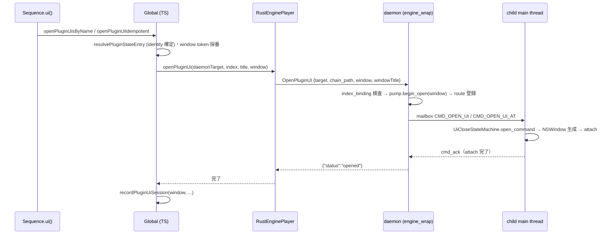
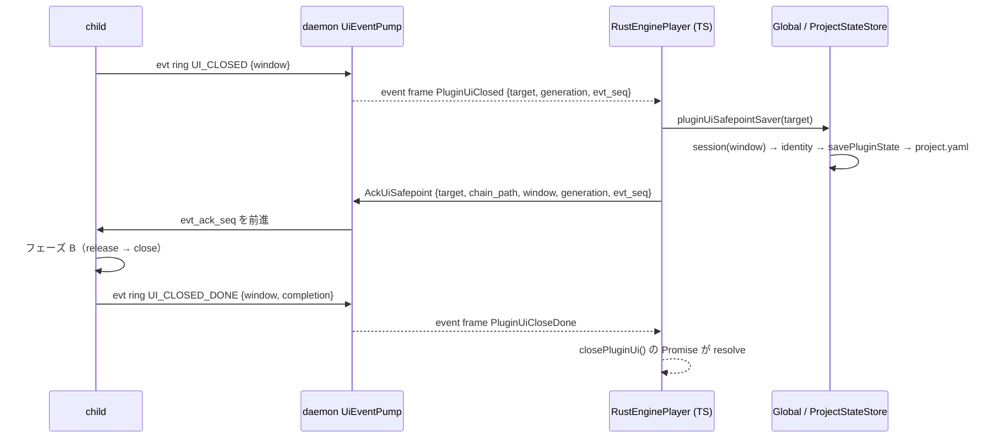

> **Note**: 本ページは 2026-09-01 時点での著者の reading の足跡です。code が真実、本ページはその時点の理解の snapshot に過ぎません。

# PH-2. プラグイン UI ホスティング — seq.ui() からウィンドウまで

PH-1 では、CLAP / VST3 プラグインが sandbox 化された out-of-process (OOP) child として
ホストされる全体像を見ました。本章はその child が **プラグインのネイティブ UI
（エディタウィンドウ）を開く**経路を追います。楽譜に `cb.ui()` と書いてから、child プロセスの
`NSWindow` にプラグインのビューが埋め込まれ、閉じると音色が保存される — その配線の全長です。

対象 Issue は 4 つあります。[#474](https://github.com/signalcompose/orbitscore/issues/474)
（UI open/close の本体・P0〜P6）、[#617](https://github.com/signalcompose/orbitscore/issues/617)
（DSL 面 `seq.ui()`）、[#628](https://github.com/signalcompose/orbitscore/issues/628)
（ラック化に伴う名前形への移行と child 側の多重ウィンドウ化）、
[#633](https://github.com/signalcompose/orbitscore/issues/633)（daemon 側 UI pump の
per-window 化）です。正本仕様は `docs/specs-v2/PLUGIN_UI_HOSTING_SPEC_v1.md`（UIH.n）と
core spec の PH.2c で、本章はそれらを code と突き合わせながら読みます。

## DSL 面: `seq.ui([名前][, open])`

まず利用者が触る面から見ましょう。core spec PH.2c の例はこうです。

```js
var cb = init global.seq
cb.instrument("Kontakt 8.vst3")
cb.ui()                       // instrument の UI を開く（無引数 = instrument）
cb.ui("ValhallaRoom")         // 名前が一致する insert の UI（複数一致ならすべて開く）
cb.ui("ValhallaRoom", false)  // 閉じる

sum("strings").ui("Pro-Q 3")  // mixer bus の insert
aux("verb").ui("ValhallaRoom")
```

ここで気をつけたいのは、**第 1 引数が数値の index ではなくカタログ名の文字列**である点です。
#617 の初期実装（2026-08-26）では `cb.ui(1)` のように chain index で指していましたが、
#628（2026-08-27）でラック形のエフェクトチェーン（配列・`layer` の入れ子）が入り、
「位置は 1 次元の index では指せない」という理由で数値形は撤回されました
（`SIGNAL_CHAIN_DSL_SPEC_v1.md` SC.10.10.1）。名前で指すと**同名が複数あっても曖昧に
ならない** — 選ばずに全部開くからです。

実装は `Sequence.ui()` にあります。

```typescript
// packages/engine/src/core/sequence.ts:701-721
  async ui(catalogName?: string, open = true): Promise<this> {
    const name = this.stateManager.getName() || 'sequence'
    if (catalogName !== undefined && typeof catalogName !== 'string') {
      throw new Error(
        'ui() expects a catalog plugin name string; numeric indexes are not supported.',
      )
    }
    if (catalogName === undefined) {
      if (open) await this.global.openPluginUiIdempotent(name, 0)
      else await this.global.closePluginUi(name, 0)
    } else if (open) {
      // 🔴 冪等（#619 レビュー・F2b/R2）: ライブコーディングでは**ブロックの再評価が常態**で、
      // 楽譜に書いた `cb.ui()` は評価のたびに走る。冪等の規則（fast path + already-open の
      // catch・staleness 対策）は `openPluginUiIdempotent` の1箇所に集約してある。
      // MCP の `open_plugin_ui` は冪等にしない（明示操作なので二重 open は loud に落とす）。
      await this.global.openPluginUisByName(name, catalogName)
    } else {
      await this.global.closePluginUisByName(name, catalogName)
    }
    return this
  }
```

読むと分かるとおり、`ui()` 自身は**新しい経路を作っていません**。無引数なら index 0
（= instrument スロット）、名前ありなら `Global.openPluginUisByName` へ委譲するだけです。
名前形は登記チェーンから一致する catalog 要素を全列挙し、1 件ずつ冪等 open を呼びます。

```typescript
// packages/engine/src/core/global.ts:1129-1139
  async openPluginUisByName(receiverId: string, requestedName: string): Promise<void> {
    if (typeof requestedName !== 'string') {
      throw new Error(
        'ui() expects a catalog plugin name string; numeric indexes are not supported.',
      )
    }
    const normalized = normalizePluginInstanceName(requestedName)
    for (const index of this.catalogIndicesByName(receiverId, requestedName)) {
      await this.openPluginUiIdempotent(receiverId, index, normalized)
    }
  }
```

### なぜ DSL の open だけ冪等なのか

ライブコーディングでは、楽譜のブロックを**何度も再評価する**のが普通です。`cb.ui()` と書いた
行は評価のたびに走るので、2 回目の評価で「もう開いている」とエラーになると、正当な操作が
毎回赤くなってしまいます（PH.2c が「実測」と書いているのはこの host 側エラー
`OPEN_UI requested while lifecycle is Open` です）。そこで DSL 面は
`openPluginUiIdempotent` を通り、既に開いていれば no-op で成功します。

```typescript
// packages/engine/src/core/global.ts:1166-1174
  async openPluginUiIdempotent(
    receiverId: string,
    index: number,
    expectedName?: string,
  ): Promise<void> {
    if (this.hasOpenPluginUi(receiverId, index)) return
    const window = allocatePluginUiWindowToken()
    try {
      await this.openPluginUi(receiverId, index, expectedName, window)
```

一方、MCP の `open_plugin_ui` は「開けと命じた」明示操作なので冪等にしません。二重 open は
loud に落とします。close はどちらの面でも冪等化しません（PH.2c）。同じ機構を通りながら
**経路によって意味論を変える判断を TS 層に置いている**のが、この設計の特徴です
（#628 設計書 R9 は「冪等 open を pump に実装する」案を、経路知識を持たない層に
経路依存の意味論を置かないという理由で却下しています）。

## なぜ UI は child プロセスに住むのか

DSL から下へ降りる前に、大前提を確認しておきましょう。**なぜプラグインの UI を daemon や
VS Code 拡張ではなく、child プロセスが開くのでしょうか。**

答えは macOS の制約にあります。`NSApplication` の runloop は**プロセスの先頭スレッド
（main thread）でなければならず**、VST3 の `IPlugView` も CLAP の `clap_plugin_gui` も
「UI 生成・破棄・state save / load はメインスレッドで」という規約を持っています
（UIH.1 に一次ソースの引用があります）。プラグインインスタンスは child プロセスの中に
いるので、その UI を開けるのも child だけです。

ところが #474 P1 より前の child は、main thread で audio の spin loop を回していました。UI を
開くには **audio を専用スレッドへ退かし、main thread を Cocoa runloop に明け渡す**必要が
あります。これが #474 P1（2026-07-30）の「実行モデル変更」で、4 つの child
（`orbit-clap-effect-child` / `orbit-clap-instrument-child` / `orbit-vst3-effect-child` /
`orbit-vst3-instrument-child`）と #628 で加わった `orbit-effect-rack-child` が共有する
`orbit-child-runtime` crate に集約されています。

```rust
// rust/crates/orbit-child-runtime/src/lib.rs:1-6
//! Shared execution model for the four out-of-process plugin children.
//!
//! On macOS the process main thread is given to an `NSApplication` runloop
//! (Accessory activation policy). A short main-runloop timer services the
//! command mailbox and process-liveness checks supplied by the child. Audio
//! processing runs on one dedicated user-interactive QoS thread.
```

main thread 側は `NSApplication` を **Accessory** ポリシー（Dock アイコンを出さない・
ウィンドウ表示とキー入力は可能）で立ち上げ、`NSTimer` で定期的に service コールバックを
呼びます。

```rust
// rust/crates/orbit-child-runtime/src/lib.rs:481-497
        let app = NSApplication::sharedApplication(mtm);
        if !app.setActivationPolicy(NSApplicationActivationPolicy::Accessory) {
            coordinator
                .stop_audio
                .store(true, std::sync::atomic::Ordering::Release);
            return Err(ChildRuntimeError::AccessoryPolicyRejected);
        }

        let timer = unsafe {
            NSTimer::timerWithTimeInterval_target_selector_userInfo_repeats(
                MAIN_TICK_INTERVAL.as_secs_f64(),
                &target,
                sel!(tick:),
                None,
                true,
            )
        };
```

```rust
// rust/crates/orbit-child-runtime/src/lib.rs:110-113
/// Main-runloop service interval. Mailbox commands and liveness changes are
/// control-plane work, so 20 ms avoids a busy main thread while remaining
/// responsive enough for UI commands.
pub const MAIN_TICK_INTERVAL: Duration = Duration::from_millis(20);
```

20 ms ごとの tick で child は何をするのでしょうか。`service_child_main` を見ると、コマンド
メールボックス（PH-1 で見た `SharedRegion` の `cmd_*` 群）を読み、`CMD_SAVE_STATE` は
state 保存へ、`CMD_OPEN_UI` / `CMD_CLOSE_UI` は UI サービスへ振り分け、最後に UI の状態機械を
1 tick 進めています。

```rust
// rust/crates/orbit-child-runtime/src/lib.rs:90-108
pub unsafe fn service_child_main<E: std::fmt::Display>(
    region: *mut orbit_audio_sandbox::SharedRegion,
    ui: &UiService,
    capture_state: impl FnOnce() -> Result<Vec<u8>, E>,
) -> bool {
    unsafe {
        orbit_audio_sandbox::service_command_mailbox(region, |kind, arg| match kind {
            orbit_audio_sandbox::CMD_SAVE_STATE => {
                Some(orbit_audio_sandbox::save_state_command(arg, capture_state))
            }
            orbit_audio_sandbox::CMD_OPEN_UI | orbit_audio_sandbox::CMD_CLOSE_UI => {
                Some(ui.handle_command(kind, arg))
            }
            _ => None,
        });
    }
    ui.tick(ui.now());
    false
}
```

audio スレッドはメールボックスもイベントリングも一切見ません（UIH.2 規律 1）。
「オーディオスレッドは `process` だけ、それ以外はすべて main」という CAP.5 の割り当てが、
そのままコードの構造になっています。

ちなみに、この P1 では実機のレイテンシゲートが約 118 倍退行して UIH.7 の停止条件が発動する
事件がありました（WORK_LOG 6.335）。真因は「`NSTimer` コールバックから呼ぶ
`NSApplication.stop(None)` は `-[NSApplication run]` を抜けさせない」— `stop` は「処理中の
NSEvent が完了した時点で抜ける」フラグで、timer 発火は NSEvent ではないため、
headless の Accessory child は永遠に検査点へ到達せず、teardown が 2 秒の reap timeout →
SIGKILL に落ちていたのです。修正はダミーの `NSEventTypeApplicationDefined` を post する
Cocoa の定石でした。ユニットテストは全緑で、実機ゲートだけが捕まえた欠陥です。

## 配線の全長: DSL → TS → daemon → child

では `cb.ui()` が呼ばれてから、ウィンドウが出るまでを一気に追ってみましょう。



### TS 層: identity の確定と window token

`Global.openPluginUi` は、まず `(receiver, index)` という**揮発的な位置**を、SC.5 の
インスタンス同一性（`instanceId`）と daemon の宛先へ解決します。UIH.5 が「位置アドレスは
登記キーではない」と強調するとおり、index はブロック再評価のたびにずれるので、**開けた時点の
identity を保存対象として確定**させ、以降の close / 保存では再解決しません。

daemon へ送る際には、ウィンドウタイトルと **window token** を添えます。

```typescript
// packages/engine/src/core/global.ts:1244-1250
    try {
      await this.audioEngine.openPluginUi(
        resolved.daemonTarget,
        index,
        `OrbitScore — ${actualName} (${receiverId}:${index})`,
        window,
      )
```

window token は #633 で導入された「開いているウィンドウ 1 枚」の安定識別子で、TS が open
ごとに採番します。

```typescript
// packages/engine/src/audio/rust-engine/plugin-ui-window-token.ts:17-27
export function allocatePluginUiWindowToken(): number {
  if (nextCounter >= COUNTER_LIMIT) {
    throw new Error('plugin UI window token counter exhausted for this engine process')
  }
  const token = BOOT_NAMESPACE * COUNTER_LIMIT + nextCounter
  nextCounter += 1
  if (!Number.isSafeInteger(token)) {
    throw new Error('plugin UI window token exceeded the JSON safe-integer range')
  }
  return token
}
```

上位に起動ごとに変わる 32 bit の乱数 namespace、下位 21 bit に単調カウンタを置くので、
1 つの TS プロセス内では token が再利用されません。TS だけ再起動して daemon が生き残る場合の
衝突確率は 1 / 2^32 で、しかも daemon 側に「使用中 token の再利用」を loud に拒否する
検査があるため、衝突しても silent な取り違えにはなりません。

open が成功すると、TS はセッション簿記に 1 枚ぶんの記録を残します。キーは window token です。

```typescript
// packages/engine/src/core/global.ts:60-66
type PluginUiSession = {
  window: number
  receiverId: string
  instanceId: string
  indexAtOpen: number
  resolved: ResolvedPluginStateTarget
}
```

`indexAtOpen` は名前のとおり「開けた時点の index」で、表示・ログ専用です。帰属には使いません
（この区別の理由は後述の #633 の節で詳しく見ます）。

### wire: `OpenPluginUI` / `ClosePluginUI` / `AckUiSafepoint`

TS → daemon の wire は既存の JSON request/response に 3 つのメソッドを足しただけで、宛先語彙は
`GetPluginState` と同じ `{role, bus?, instance?}` 形です。

```typescript
// packages/engine/src/audio/rust-engine/daemon-client.ts:620-633
  /** OPEN_UI の daemon 応答は view attach 完了後にだけ返る。 */
  async openPluginUi(
    target: PluginStateSaveTarget,
    index: number,
    windowTitle: string,
    window: number,
  ): Promise<void> {
    await this.request('OpenPluginUI', {
      target: this.wirePluginTarget(target),
      chain_path: this.pluginChainPath(target, index),
      window,
      windowTitle,
    })
  }
```

`chain_path` と `window` が**別フィールド**で運ばれる点に注目してください。前者は
「今どの stage を指しているか」（宛先）、後者は「どのウィンドウの話か」（帰属）で、
この 2 レイヤ分離が #633 の核心です。

### daemon 層: `open_outproc_plugin_ui`

daemon の `engine_wrap.rs` は `OpenPluginUI` を受けると、(1) child が READY か、
(2) ラック child なら `index_binding`（現 index → token）に既存の束縛がないか、を検査し、
(3) `UiEventPump::begin_open(window)` で lifecycle を `Opening` に予約し、(4) route registry に
`window → PluginUiTarget` を登録してから、(5) コマンドメールボックスへ `CMD_OPEN_UI`
（単発 child）または `CMD_OPEN_UI_AT`（ラック child・`{"index", "title", "window"}` の JSON
引数）を投函します。失敗経路はすべて予約を巻き戻します。

`OPEN_UI` は **view attach 完了時に ack** する完了型コマンドで、daemon の応答
`{"status": "opened"}` は「ウィンドウが実在する」まで返りません。これは後述の `CLOSE_UI`
（受理時 ack）と対照的な設計です。

### child 層: `UiService` と `WindowShell`

child 側で `CMD_OPEN_UI` を受けるのは `orbit-child-runtime` の `UiService` です。中身は
AppKit 非依存の状態機械 `UiCloseStateMachine`（次々節）と、その `UiHostActions` trait を
AppKit / VST3 / CLAP で実装した `UiActions` の組です。`open_ui` はプラグインの
`begin_open`（VST3 なら `createView("editor")` → `setFrame` → `getSize`）でサイズを取り、
`WindowShell` で `NSWindow` を作り、タイトルを設定し、`attach` で content view にビューを
埋め込みます。VST3 の `setFrame` を `attached` より前に呼ぶ順序は UIH.4 の規範で、
「attach の最中にプラグインがリサイズを要求しうる」という SDK 原文が根拠です。

`WindowShell` の delegate で一番大事なのは、**`windowShouldClose` が常に `NO` を返す**
ことです。

```rust
// rust/crates/orbit-child-runtime/src/window.rs:36-42
        #[unsafe(method(windowShouldClose:))]
        fn window_should_close(&self, _sender: &NSWindow) -> bool {
            // The callback enters (or defers entry into) the close state machine. AppKit
            // never owns destruction: every callback path returns NO, and Phase B later
            // calls NSWindow::close directly.
            (self.ivars().close_callback)()
        }
```

閉じるボタンを押しても、AppKit にはウィンドウを壊させません。代わりに状態機械へ「閉じる
要求」を渡し、保存（セーフポイント）が済んでから child 自身が `close()` を呼びます。

```rust
// rust/crates/orbit-child-runtime/src/window.rs:188-196
    /// Close without consulting `windowShouldClose`; Phase B already authorized destruction.
    pub fn close(&mut self) {
        let Some(window) = self.window.take() else {
            return;
        };
        window.setDelegate(None);
        window.close();
        self.delegate = None;
    }
```

`performClose:` ではなく `close()` を使うのも規範です。`performClose:` だと AppKit が
`windowShouldClose` を再照会し、機械はまだ `Closing` なので `NO` を返して取り消され、
ウィンドウが永遠に残ります（WORK_LOG 6.344）。

## evt リングと `dirty_epoch` — 順序を型で封じる

UI を「開く」だけなら host → child のメールボックスで足ります。難しいのは「閉じる」側です。
閉じる要求は child 起点（閉じるボタン・CLAP の `closed()`）でも発生するため、
**child → host の取りこぼし不可のイベント経路**が要ります。それが #474 P2 で `SharedRegion` に
追加された evt リングです。

```rust
// rust/crates/orbit-audio-sandbox/src/transport.rs:265-277
    // ── #474 P2: child → host の取りこぼし不可イベントリング（UIH.2a）。
    /// child -> host: 新規イベント投函時に単調増加。0 = 未発行。
    pub evt_seq: ReleaseAcquireSeq,
    /// child -> host: per-slot イベント種別（[`EVT_UI_CLOSED`] / [`EVT_UI_CLOSED_DONE`]）。
    pub evt_kind: [AtomicU32; EVT_SLOTS],
    /// child -> host: per-slot 固定長引数域（NUL 終端 UTF-8）。
    pub evt_arg: [[u8; EVT_ARG_BYTES]; EVT_SLOTS],
    /// host -> child: host 側処理が完結した最新の `evt_seq`。
    ///
    /// `s` は「`s` 以下の全イベントが完結済み」を意味するため、host は seq 順にのみ進める。
    pub evt_ack_seq: ReleaseAcquireSeq,
    /// child -> host: plugin dirty 通知の累積回数。respawn ではリセットしない。
    pub dirty_epoch: MonotoneEpoch,
```

リングに載るイベントは `UI_CLOSED` と `UI_CLOSED_DONE` の 2 種類だけです。スロット数は 2 で、
これは「1 クローズサイクル内で同時に in-flight になりうるのは `UI_CLOSED` 1 +
`UI_CLOSED_DONE` 1 = 2」という占有上限から導かれています（audio pipeline の `SLOTS` とは
導出根拠が別物です）。

```rust
// rust/crates/orbit-audio-sandbox/src/transport.rs:79-87
/// child → host の取りこぼし不可イベント用 slot 数（UIH.2a）。
///
/// audio pipeline の [`SLOTS`] とは導出根拠が異なる。1 close cycle で同時に in-flight に
/// なりうる `UI_CLOSED` + `UI_CLOSED_DONE` の2件から固定される。
pub const EVT_SLOTS: usize = 2;

// spec (PLUGIN_UI_HOSTING_SPEC_v1.md) の 🔴 `EVT_SLOTS >= 2`(連続 seq が必ず別 slot を指す
// 不変条件)の床。鏡像元 `SLOTS` の const assert と同じ役目を evt 側でも compile-time に固定する。
const _: () = assert!(EVT_SLOTS >= 2);
```

### `ReleaseAcquireSeq`: Ordering を渡せない API

`evt_arg` は非 atomic の `[u8; N]` なので、child が書いた payload を host が正しく読むには
publish / read の両側で Release / Acquire 対が**必須**です（欠けると cross-process の
データ競合 = UB）。面白いのは、これを**テストではなく型で守っている**ことです。

```rust
// rust/crates/orbit-audio-sandbox/src/transport.rs:359-378
    #[repr(transparent)]
    pub struct ReleaseAcquireSeq(AtomicU64);

    impl ReleaseAcquireSeq {
        /// 非 atomic payload を書き終えた後に seq を公開する。Release store 固定。
        pub fn publish(&self, seq: u64) {
            self.0.store(seq, Ordering::Release);
        }

        /// 対岸の [`Self::publish`] と synchronizes-with する読み。Acquire load 固定。
        pub fn read(&self) -> u64 {
            self.0.load(Ordering::Acquire)
        }

        /// このフィールドの唯一の書き手自身による読み。自分の store とは program order で
        /// 整合するため Relaxed で十分（対岸の payload とは同期しない点に注意）。
        pub fn load_own(&self) -> u64 {
            self.0.load(Ordering::Relaxed)
        }
    }
```

内部の `AtomicU64` は submodule の外から不可視なので、`evt_seq.store(seq, Ordering::Relaxed)`
のような逸脱は**コンパイルできません**。WORK_LOG 6.337 によると、当初 Codex が書いた
「Release / Acquire 対を検証する」テストは同語反復で、publish 箇所を `Relaxed` に変異させても
全件 green のまま通ってしまいました。そこでテストで守るのをやめ、型に封じたのです
（`E0599: no method named 'store'` / `E0616: field '0' is private` の 2 種で実証）。

ただし型でも守れないものがあります。「payload を書き終えてから `publish` を呼ぶ」という
プログラム順序です。child 側の投函器 `EventRingChild::service` は、この順序を守りつつ slot
再利用の不変条件（`evt_ack_seq >= s - EVT_SLOTS`）を検査してから publish します。

```rust
// rust/crates/orbit-audio-sandbox/src/transport.rs:512-538
    pub unsafe fn service(
        &mut self,
        region: *mut SharedRegion,
    ) -> Result<usize, EventRingChildError> {
        let mut published_count = 0;
        while let Some(event) = self.pending.front() {
            let previous = unsafe { (*region).evt_seq.load_own() };
            let seq = previous
                .checked_add(1)
                .ok_or(EventRingChildError::SequenceExhausted)?;
            let reusable_after = seq.saturating_sub(EVT_SLOTS as u64);
            let ack = unsafe { (*region).evt_ack_seq.read() };
            if ack < reusable_after {
                break;
            }

            let index = evt_slot_index(seq);
            unsafe {
                (*region).evt_kind[index].store(event.kind, Ordering::Relaxed);
                std::ptr::write(std::ptr::addr_of_mut!((*region).evt_arg[index]), event.arg);
                (*region).evt_seq.publish(seq);
            }
            self.pending.pop_front();
            published_count += 1;
        }
        Ok(published_count)
    }
```

不変条件が偽なら `break` して**先頭イベントを保持したまま戻る**点が重要です。
「投函できない = 落とす」ではなく、次の main-runloop tick で再試行します。`UI_CLOSED_DONE` を
落とすと MCP `close_plugin_ui` の完了判定が永遠に閉じないからです（UIH.2a）。

host 側の `EventRingHost::poll` は `evt_ack_seq + 1` から seq 順に読み、handler が `true` を
返したイベントだけ ack を進めます。追い越しは構造的にできません。また poll は CAS ゲートで
排他されていて、handler の中から再入すると deadlock ではなく `Err` で loud に失敗します
（WORK_LOG 6.340 で mailbox 側の規律を移植したものです）。

### `dirty_epoch` はリングに載せない

プラグインが「state が変わった」と通知する dirty（VST3 `setDirty` / CLAP `mark_dirty`）は
イベントではなく**水位**です。「前回観測以降に少なくとも 1 回あったか」だけが意味を持ち、
合流してよい。だからリングではなく単調カウンタ `dirty_epoch` で運びます。

これは #474 P2 の spec 先行（WORK_LOG 6.336）で owner 承認を得た決定で、決め手は spec 自身の
潜在矛盾でした。UIH.2a ポリシー 3 は「ack の前進 = host 側処理の完結」と定めますが、
dirty の「完結」をどう定義するかが決まっておらず、debounce の完了とすると後続 `UI_CLOSED` の
ack が debounce 窓に結合してしまう。リングから外せばこの未定義箇所を**定義する必要ごと
消せる**わけです。副次的に `EVT_SLOTS` の占有上限も 3 → 2 に減りました。

もう 1 つの注意点は、`dirty_epoch` を **respawn でリセットしない**ことです。evt リングは
前 incarnation の未処理イベントが混線するのでリセットしますが、`dirty_epoch` は host が
`last_seen` を保持する水位なので、0 に戻すと host の `last_seen`（例えば 42）を再超過するまで
dirty を黙って取りこぼします。単調・非リセットならこの故障クラスは構造的に存在しません。

## クローズの状態機械 — `Closed` はドレーン条件で定義される

閉じる側の本体は `orbit-child-ui` crate です。AppKit にも VST3 / CLAP にも依存しない純 Rust
で、プラットフォーム操作はすべて `UiHostActions` trait の向こうに置かれています。この分割は
#474 P3a（2026-07-31）の判断で、UIH.8 の変異検証項目の大半をユニットテストで殺せるようにする
ためのものです。

状態は `Closed → Open → Closing → Closed` の 3 つ、閉じる要求の到達経路は 3 つあります。

| 経路 | 起点 | 入口メソッド |
|---|---|---|
| ① `NSWindow` の閉じるボタン | child | `window_should_close`（常に `false` を返す） |
| ② `CLOSE_UI` コマンド | host | `close_command`（受理時に ack） |
| ③ CLAP `closed(was_destroyed)` | child（thread-safe → main へ marshal） | `clap_closed` |

3 経路はすべて `begin_close` に合流し、そこにある**単一の再入ガード**で「セーフポイントは
1 回だけ」が保証されます。

```rust
// rust/crates/orbit-child-ui/src/lib.rs:321-342
    fn begin_close(
        &mut self,
        now: Duration,
        was_destroyed: bool,
        actions: &mut impl UiHostActions,
    ) -> CloseRequestDisposition {
        // This state check is the single reentry guard shared by all three paths.
        if !matches!(self.state, MachineState::Open) {
            return CloseRequestDisposition::AlreadyClosing;
        }

        // The seam is non-blocking and does not reenter the machine, so the sequence can
        // be resolved before the transition instead of patching the state afterwards.
        // A `None` here just means the ring was full; `tick` retries it.
        let ui_closed_seq = actions.try_publish_event(UiEvent::UiClosed);
        self.state = MachineState::Closing(ClosingState {
            started_at: now,
            was_destroyed,
            ui_closed_seq,
        });
        CloseRequestDisposition::Started
    }
```

これが UIH.4c の**フェーズ A**です。`UI_CLOSED` を投函して `Closing` に遷移し、**ここで
待たずに戻ります**。待ってはいけない理由は UIH.2a ポリシー 1・2 にあります — child の
main thread は、host からの応答（`SAVE_STATE` コマンド）を処理するスレッドでもあるので、
ここでブロックすると必ずデッドロックします。実際に一度デッドロックしたと spec は
記録しています。

### フェーズ B: `UI_CLOSED` 自身の seq が ack されたら

フェーズ B は `tick` の中で、`evt_ack_seq >= ui_closed_seq`（自分が投函した `UI_CLOSED` の seq
が host 側で完結した）を観測して始まります。

```rust
// rust/crates/orbit-child-ui/src/lib.rs:268-319
    pub fn tick(&mut self, now: Duration, actions: &mut impl UiHostActions) {
        if matches!(self.state, MachineState::Closed) {
            self.try_publish_close_events(actions);
            return;
        }

        let phase_b = match &mut self.state {
            MachineState::Closing(closing) => {
                if closing.ui_closed_seq.is_none() {
                    closing.ui_closed_seq = actions.try_publish_event(UiEvent::UiClosed);
                }

                let safepoint_completed = closing
                    .ui_closed_seq
                    .is_some_and(|ui_closed_seq| actions.event_ack_seq() >= ui_closed_seq);
                let timed_out = now.saturating_sub(closing.started_at) >= self.close_timeout;

                if safepoint_completed {
                    Some((
                        closing.was_destroyed,
                        CloseCompletion::SafepointCompleted,
                        false,
                    ))
                } else if timed_out {
                    Some((
                        closing.was_destroyed,
                        CloseCompletion::TimedOutWithoutSave,
                        closing.ui_closed_seq.is_none(),
                    ))
                } else {
                    None
                }
            }
            MachineState::Closed | MachineState::Open => None,
        };

        let Some((was_destroyed, completion, pending_ui_closed)) = phase_b else {
            return;
        };

        debug_assert!(
            self.pending_done.is_none(),
            "a prior UI_CLOSED_DONE must not be overwritten at the Phase B boundary"
        );
        // Phase B ordering is normative: plugin release precedes parent-window destroy.
        actions.release_plugin_ui(was_destroyed);
        actions.destroy_window();
        self.state = MachineState::Closed;
        self.pending_ui_closed = pending_ui_closed;
        self.pending_done = Some(completion);
        self.try_publish_close_events(actions);
    }
```

読み解くポイントは 3 つです。

1. **トリガは「単なる ack の前進」ではなく `UI_CLOSED` 自身の seq への到達**です。
   `evt_ack_seq` は全イベント共用の単一カウンタなので、前サイクルの `UI_CLOSED_DONE` の
   ack でも前進します。それで解放を始めると、保存がまだ走っていないのに UI が壊れる
   （= 音色の喪失）。WORK_LOG 6.342 には、Codex の初稿が `ui_closed_seq.saturating_sub(1)`
   というオフバイワンになっていて main が実装中に見つけた、という記録があります。
2. **timeout（`UI_CLOSE_TIMEOUT` = 10 秒）で保存なしのクローズを完遂**します。host が
   停滞して ack が来なくても `Closing` に無期限滞留しません。その場合の完了理由は
   `TimedOutWithoutSave` として `UI_CLOSED_DONE` の引数に載り、host 側で判別できます。
3. **解放の順序は規範**です。プラグイン側の `release`（VST3 `removed()` / CLAP `hide()` →
   `destroy()`）を親ウィンドウの破棄より先に呼びます。`was_destroyed=true` の CLAP 経路では
   破棄済み GUI に `hide()` を呼びません。

```rust
// rust/crates/orbit-child-runtime/src/ui_service.rs:22-23
/// Maximum time Phase B waits for the host to complete the `UI_CLOSED` safepoint.
pub const UI_CLOSE_TIMEOUT: Duration = Duration::from_secs(10);
```

### `Closed` の語義 — ドレーンゲート

`OPEN_UI` の受理条件も見ておきましょう。

```rust
// rust/crates/orbit-child-ui/src/lib.rs:203-225
    /// Handle `OPEN_UI`.
    ///
    /// Acceptance is exactly the drain gate: state is `Closed` and the event backend
    /// reports pending count zero with equal ack/publish cursors.
    pub fn open_command(&mut self, actions: &mut impl UiHostActions) -> CommandAck {
        // Open と「開いていない拒否」（Closing / ring 未 drain）は detail を分ける。
        // 同じ文言に潰すと、TS 側の冪等 open が「開いていないのに成功扱い」へ倒れる
        // （PR #619 R4 で実際に起きた取り違え）。
        if matches!(self.state, MachineState::Open) {
            return CommandAck::new(false, ALREADY_OPEN_DETAIL);
        }
        if !matches!(self.state, MachineState::Closed) || !actions.is_event_ring_drained() {
            return CommandAck::new(false, CLOSING_IN_PROGRESS_DETAIL);
        }

        match actions.open_ui() {
            Ok(()) => {
                self.state = MachineState::Open;
                CommandAck::new(true, "")
            }
            Err(detail) => CommandAck::new(false, detail),
        }
    }
```

「状態機械が `Closed` にいる」だけでは再オープンできません。**リングがドレーン済み
（保留イベント 0 件 かつ `evt_ack_seq == evt_seq`）**であることを併せて要求します。
この定式化は #474 P3 の spec 先行（WORK_LOG 6.341・2026-07-31）で確定したもので、確定前の
spec は「`Closed` 中の `OPEN_UI` も failure ack」と書いていました。字義どおり読むと初期状態も
`Closed` なので UI を一度も開けない — ドレーン条件なら初期状態（`0 == 0`・pending 空）が
自明に満たすので、この矛盾が消えます。

そしてリングに載る kind は 2 種だけなので、「ドレーン完了」は「直前サイクルの
`UI_CLOSED_DONE` が host で完結した」と同値になります。個別 seq を記録する必要がなく、
child が `evt_ack_seq` を Acquire で読めばそれだけで判定できる。**`Closed` の語義を
ドレーン条件で定義した**ことで、`EVT_SLOTS = 2` の占有上限導出が例外なく成立するという
副産物もつきました。

`ALREADY_OPEN_DETAIL` と `CLOSING_IN_PROGRESS_DETAIL` を別文言にしている理由もコメントの
とおりです。TS の冪等 open は `already-open` だけを成功扱いにし、`closing-in-progress`
（まだ開けない = 開いていない）は throw に倒します。同じ文言に潰すと「開いていないのに
成功扱い」へ倒れる — PR #619 R4 で実際に起きた取り違えです。

## セーフポイント (b): ウィンドウを閉じたら音色が保存される

さて、ここまでで child 側は「`UI_CLOSED` を投函して ack を待つ」ところまで来ました。
その ack を進めるのは誰でしょうか。UIH の「host」は実際には **daemon と engine (TS) の
2 プロセス**に分かれていて、保存の実体（sidecar → atomic rename → `project.yaml` 登記）は
TS の `ProjectStateStore` にあります。したがって ack の前進は daemon と TS を跨ぎます。



daemon の `UiEventPump::poll_step` は watchdog の 1 tick ごとにリングを読み、`UI_CLOSED` を
見つけると非ブロッキングの sink へ `Safepoint` 通知を積んで **`false` を返します**（= ack
しない・リング先頭で止まる）。

```rust
// rust/crates/orbit-audio-sandbox/src/transport.rs:1213-1225
/// [`UiEventPump::poll_step`] が daemon の非ブロッキング sink へ渡す固定通知。
#[derive(Debug, Clone, Copy, PartialEq, Eq)]
pub enum UiPumpNotification {
    Safepoint {
        generation: u64,
        evt_seq: u64,
        window: UiWindowKey,
    },
    CloseDone {
        completion: UiCloseCompletion,
        window: UiWindowKey,
    },
}
```

通知は既存の WebSocket event frame に載って TS へ届きます。

```rust
// rust/crates/orbit-audio-daemon/src/protocol.rs:79-81
pub const EVENT_PLUGIN_UI_CLOSED: &str = "PluginUiClosed";
pub const EVENT_PLUGIN_UI_CLOSE_DONE: &str = "PluginUiCloseDone";
pub const EVENT_PLUGIN_UI_CLOSED_BY_RESPAWN: &str = "PluginUiClosedByRespawn";
```

TS 側の受け手が `RustEnginePlayer.onPluginUiClosed` です。#474 P4b（2026-07-31）で入った
「engine 側の conductor」で、新しい保存機構は作らず、既存の保存フローを event 起点で呼ぶ
だけになっています。

```typescript
// packages/engine/src/audio/rust-engine/rust-engine-player.ts:622-650
  private readonly onPluginUiClosed = (raw: unknown): void => {
    this.enqueuePluginUiEvent(async () => {
      const data = wireObject(raw, 'PluginUiClosed data')
      const target = pluginUiTargetFromEvent(data)
      const generation = eventNonNegativeInteger(data.generation, 'generation')
      const evtSeq = eventNonNegativeInteger(data.evt_seq, 'evt_seq')
      if (!this.pluginUiSafepointSaver) {
        throw new Error(
          `cannot save ${JSON.stringify(target)}: no project-state safepoint saver is registered`,
        )
      }
      try {
        await this.pluginUiSafepointSaver(target)
      } catch (error) {
        console.error(
          `[plugin-ui] safepoint save failed for ${JSON.stringify(target)}; ` +
            `AckUiSafepoint was not sent: ${error instanceof Error ? error.message : String(error)}`,
        )
        return
      }
      await this.daemon.ackUiSafepoint(
        pluginStateTarget(target),
        target.index,
        target.window ?? 0,
        generation,
        evtSeq,
      )
    })
  }
```

ここで大事な設計判断が 2 つあります。

- **保存に失敗したら ack を送らない。** `return` で抜け、loud に記録するだけです。daemon は
  `evt_ack_seq` を進めず、child の 10 秒 timeout が脱出経路になります。「失敗したのに成功した
  ように見える」経路を作らないためです。
- **`generation` / `evt_seq` はそのまま返す。** engine が再計算すると、respawn 直後の
  クローズで別 incarnation のセーフポイントを ack してしまいます。`generation` は
  `UiEventPump` が child 単位で持つ世代番号で、respawn の reset でのみ増えます。

`enqueuePluginUiEvent` は UI イベントを daemon の `evt_seq` 順に直列化する Promise チェーンで、
保存と ack を順序どおり完結させてから次へ進みます。

### close の完了は「ack」ではなく「DONE の受信」

`closePluginUi` を呼んだ側はいつ戻るのでしょうか。daemon の `ClosePluginUI` 応答は
**フェーズ A の受理**でしかありません。

```rust
// rust/crates/orbit-audio-daemon/src/session.rs:2015-2016
                    // This is explicitly Phase A acceptance, never close completion.
                    Ok(Ok(())) => ok(&id, json!({"status": "accepted"})),
```

TS はこれとは別に `UI_CLOSED_DONE` の event frame を待ち受けます。しかも DONE の waiter を
**`CLOSE_UI` の送信より前に**登録します。event pump とコマンド応答は daemon 側で独立した
タスクなので、DONE が ack を追い抜くことがあるからです。

```typescript
// packages/engine/src/audio/rust-engine/rust-engine-player.ts:852-866
    try {
      // Register the DONE waiter before issuing CLOSE_UI: the event pump and
      // command response use independent tasks, so DONE may race the ack.
      const accepted = this.daemon.acceptClosePluginUi(target, index, window)
      await Promise.race([accepted, done.then(() => undefined)])
    } catch (error) {
      if (pendingEntry) {
        this.pendingPluginUiCloses.delete(pendingEntry)
        clearTimeout(pendingEntry.timer)
      }
      throw error
    }
    // The daemon response above is Phase A acceptance only. This await is the
    // sole close-completion condition exposed to callers.
    return done
```

DONE の `completion` が `timeout-without-save` だった場合、`Global.closePluginUi` は
ウィンドウが消えたことを認めてセッションを破棄したうえで、**「保存されなかった」を
エラーとして返します**。respawn で child が消えた場合は `PluginUiClosedByRespawn` で
pending が reject され、「保存完了」を偽って返すことはありません（WORK_LOG 6.348 で main の
変異検証がこの穴を見つけ、テストを足しています）。

```typescript
// packages/engine/src/audio/rust-engine/rust-engine-player.ts:331-332
const PLUGIN_UI_OPEN_TIMEOUT_MS = 30_000
const PLUGIN_UI_CLOSE_TIMEOUT_MS = 20_000
```

open は 30 秒、close の DONE 待ちは 20 秒で timeout します。child の `UI_CLOSE_TIMEOUT`
（10 秒）より長いのは、timeout 経路の `UI_CLOSED_DONE` が届く余地を残すためと読めますが、
この数値の根拠を明記した一次ソースは見つけられませんでした。

> NOTE: unverified — needs confirmation（20 秒 / 30 秒の選定理由）

## per-window UI pump（#628 → #633）— 「未実測」仮説が実測で確定した

ここまでの機構は #474 の完成時点（2026-08-01）では **1 child = 1 ウィンドウ**でした。
`UiEventPump` は child 単位の単一 `UiPumpState` を持ち、`begin_open` は `lifecycle != Closed`
を loud に拒否していたのです。

状況を変えたのが #628 のラック化です。`seq.effect(["A", "A"])` のように 1 つの rack child が
N 個の stage を直列に回すようになり、SC.10.10.1 は「`ui("名前")` は一致するもの全部を開く」と
定めました。child 側は index 付きの `UiService`（`new_indexed`）と共有イベント発行器
`UiEventHub` で多重化されたのですが、**daemon 側が単一 lifecycle のまま**という非対称が
残っていました。

### 実バグ: 1 枚目の close ですらリングが詰まる

WORK_LOG 6.387b（2026-08-28）の記録が生々しいです。child は
`{"index":0,"completion":"safepoint-completed"}` を送るのに、daemon の DONE 腕は
`Some("safepoint-completed")` の**完全一致でしか受けない**。rack child の UI を閉じると
1 枚目ですら Protocol error になり、イベントリングの先頭が永久に詰まる。実機ではこの
エラーが 25 ms 間隔で洪水を起こして daemon を飽和させていました。

699 tests green・clippy exit 0・変異 6 種 red をすべて通った上での欠陥です。child 側の
多重化は unit で証明され、daemon 側の受理も unit で証明されていて、**その 2 つを繋ぐ層だけが
誰にも触られていなかった**。CLAUDE.md の「壊れるのは配線であり、配線は E2E でしか見えない」の
実例がまた 1 つ増えた、と記録されています。

### 帰属と宛先の 2 レイヤ分離

修正の設計（`docs/archive/design/628-ui-pump-per-index-design.md`・Fable 起案）は改訂 1 で
「open 中 UI の index は不変」を不変条件とし、index がシフトする stage の UI を TS が
APPLY 前に自動 close する案でした。これは owner に差し戻されます。

> 開いてるのを勝手に閉じたり開いたりするってこと？それなら受容できない。
> **開いてるものはユーザーが閉じるまでそのまま開いてるべきで、閉じてるものは
> ユーザーの違う操作で勝手に開いたりしたらダメ**ですよね？

以後この 2 点（**C-A**: 開いている UI はユーザーが閉じるまで開いたまま / **C-B**: 閉じている
UI が別の操作で勝手に開かない）は設計の制約条件になりました。問題の本質は「開いている
ウィンドウを位置（index）で宛先指定・帰属していた」ことで、位置で指す限りチェーン編集と
open UI の共存は「動かさない（= 自動 close = C-A 違反）」か「追随させる」しかない。
そこで改訂 2 は**帰属を位置から独立した安定識別子で行う**方向へ舵を切りました。

| 何を | どのキーで |
|---|---|
| **帰属**（イベント → session → 保存 identity） | **window token**。open から close まで不変 |
| **宛先**（コマンド → stage） | **chain_path**。発行時点の登記チェーンから引く |

daemon 側の `UiPumpState` は、こうして per-window の map になりました。

```rust
// rust/crates/orbit-audio-sandbox/src/transport.rs:1355-1374
#[derive(Debug, Default)]
struct UiPumpState {
    generation: u64,
    /// Engine へ通知済みで、`AckUiSafepoint` を待っている `UI_CLOSED`。
    pending_safepoint: Option<PendingSafepoint>,
    /// Window ごとの lifecycle と、遅着 ack を warn 付きで受理するための放棄水位。
    windows: BTreeMap<UiWindowKey, UiWindowState>,
}

#[derive(Debug, Clone, Copy, PartialEq, Eq)]
struct PendingSafepoint {
    window: UiWindowKey,
    evt_seq: u64,
}

#[derive(Debug)]
struct UiWindowState {
    lifecycle: UiLifecycle,
    abandoned_safepoint: Option<u64>,
}
```

`generation` が child 単位のままなのは意図的です。リングは child につき 1 本で、respawn は
child 全体を作り直すので、「window ごとに世代が異なる」状況はプロトコル上存在しません。
per-window にすると「1 つの事実の N 重複製」になり、今回の事故と同型の乖離可能状態を
自分で作ることになる、と設計書は書いています。`pending_safepoint` も単一のままで、これは
`poll_step` が `UI_CLOSED` で先頭停止するため pending が構造的に高々 1 だからです。

ack の照合キーは `(generation, window, evt_seq)` の三つ組になり、別 window を名乗る ack は
loud に拒否されます。event frame の `PluginUiTarget` にも `window` が載りました。

```rust
// rust/crates/orbit-audio-daemon/src/engine_wrap.rs:8802-8815
/// WS event frame に載せる、解決済み plugin UI 宛先。
#[derive(Clone, Debug, Eq, PartialEq, serde::Serialize)]
pub struct PluginUiTarget {
    pub role: &'static str,
    #[serde(skip_serializing_if = "Option::is_none")]
    pub bus: Option<String>,
    #[serde(skip_serializing_if = "Option::is_none")]
    pub instance: Option<String>,
    /// Immutable open token used for event attribution. `index` below is the open-time position
    /// retained only for display/diagnostics and must never be used as an ownership key.
    #[serde(skip_serializing_if = "Option::is_none")]
    pub window: Option<u64>,
    pub index: u64,
}
```

`UiWindowKey` は `Option<u64>` で、`None` は非 indexed（instrument / 旧単発 child）を表します。
これにより instrument 経路のコードは `None` を渡すだけで観測挙動が不変に保たれます。

### 「未実測」と明記した仮説を、実装の前に確かめた

設計書 §7 の表 1 行目は、多重 close × timeout 放棄でリングがデッドロックするという仮説を
「確信度 中〜高・机上組み立て・実測していない」としていました。#633 の発注ブリーフはこれを
条件分岐にします — 「実装の前に H2 の再現 fixture を書き、再現するかを確認せよ。再現しなければ
ゲートは防御実装に格下げし設計書に追記せよ」。

**結果は再現でした**（WORK_LOG 6.413）。

| 観測 | 値 |
|---|---|
| w1 `UI_CLOSED` | seq 1（daemon ack 停止） |
| w2 `UI_CLOSED` | seq 2 |
| w1 timeout 後の DONE | publish 不能（seq 3 には `evt_ack >= 1` が要る） |
| ring 状態 | `evt_seq=2 / evt_ack_seq=0` |
| daemon | `Blocked { seq: 1 }` を繰り返す |

`EVT_SLOTS = 2` は「1 サイクルで in-flight 2 件」から導かれていたので、2 枚のウィンドウが
同時にクローズサイクルに入ると、片方の DONE が投函できずに詰まります。したがって
**close-cycle の順序ゲートは防御実装ではなく必須**と確定しました。それが child 側
`UiEventHub` の `open_cycle` です。

```rust
// rust/crates/orbit-child-runtime/src/ui_service.rs:95-105
struct UiEventHubCore {
    region: *mut SharedRegion,
    event_ring: EventRingChild,
    queued_in_ring: Option<IndexedUiEvent>,
    pending: VecDeque<IndexedUiEvent>,
    published: Vec<(IndexedUiEvent, u64)>,
    /// `Some(window)` means this window's `UI_CLOSED` is published and no other window may
    /// publish until the matching DONE reaches the ring. The nested option preserves `None` as
    /// the legacy non-indexed window key.
    open_cycle: Option<UiWindowKey>,
}
```

ある window の `UI_CLOSED` が publish されたら、その window の DONE がリングに載るまで
他の window は publish できません。ドレーン判定も hub 全体で行われるので、別 window の
クローズサイクル進行中は `OPEN_UI` が `closing-in-progress` で拒否されます。

```rust
// rust/crates/orbit-child-runtime/src/ui_service.rs:197-203
    fn is_drained(&self) -> bool {
        self.open_cycle.is_none()
            && self.pending.is_empty()
            && self.queued_in_ring.is_none()
            && self.published.is_empty()
            && unsafe { self.event_ring.is_drained(self.region) }
    }
```

設計に「確信度」と「反証方法」の欄があると、発注を「実装せよ」ではなく「確かめてから、
結果に応じてこう実装せよ」と書ける — WORK_LOG はこれを教訓として記録しています。

## MCP と REPL メタ行 — E2E の動線

最後に、エディタ（VS Code 拡張）と MCP からの経路を見ます。#474 P4c（2026-08-01）で
`open_plugin_ui` / `close_plugin_ui` の MCP tool と、REPL メタ行 `//#pluginUi` が入りました。
設計時は `//#openPluginUi` / `//#closePluginUi` の 2 本でしたが、実装では JSON payload の
`action: 'open' | 'close'` を持つ単一メタ行に統合されています（空白や記号を含む receiver 名・
相関 `requestId`・`expectedName` を 1 つの JSON で運ぶため）。

拡張側の `PluginUiBridge` は、engine プロセスの stdin にメタ行を書き、stdout に返ってくる
`{"pluginUi": ...}` 行を `requestId` で相関させます。

```typescript
// packages/vscode-extension/src/plugin-ui-bridge.ts:90-98
      const fail = (error: Error): void => this.fail(input.requestId, error.message)
      try {
        const written = writeLine(`//#pluginUi ${JSON.stringify(input)}\n`, fail)
        if (written === false)
          this.fail(input.requestId, 'failed to write //#pluginUi to engine stdin')
      } catch (error) {
        this.fail(input.requestId, error instanceof Error ? error.message : String(error))
      }
    })
```

`extension.ts` の stdout ルータはこの結果行を `{"pluginUi"` の前方一致で拾います。

```typescript
// packages/vscode-extension/src/extension.ts:1497-1501
        } else if (trimmedLine.startsWith('{"pluginUi"')) {
          const parsed = isCurrent && pluginUiBridge.handleLine(rawLine)
          if (!parsed && isCurrent) {
            outputChannel?.appendLine(`⚠️ received a malformed //#pluginUi result line: ${rawLine}`)
          }
```

`PluginStateBridge`（`//#savePluginState`）と構造が同じなのは、request ID の運び方が
同一だからで、engine 側の repl-mode も 1 本のパーサを共有しています。bridge の timeout は
35 秒で、engine 側の open 30 秒 / close 20 秒より長く取られています。

MCP tool の `open_plugin_ui` には `expectedName` という**誤爆ガード**があります。
`(receiver, index)` の実体の正規化名と不一致なら daemon へ送らずに loud エラーを返し、
エラー本文にその時点で有効な index 一覧（role・正規化名つき）を含めます。index がずれて別の
プラグインの UI を開けてしまうと、意図しない側の音色が保存されるからです。

### E2E のオラクルは `close_plugin_ui`

「ウィンドウが開いた」を実機 E2E でどう assert するのでしょうか。UI の表示は視覚的な副作用で
直接は見えません。そこで gated E2E は **`close_plugin_ui` をオラクル**にします。close は
`openPluginUiSessions` にセッションが無ければ `no plugin UI opened via open_plugin_ui is
recorded` で失敗するので、「DSL で open → MCP の close が成功する」が通れば、DSL の呼び出しが
本当に `Global.openPluginUi` まで到達してセッションを登録した証明になります。
`open_plugin_ui` の戻り値に assert しても「受理した」しか言えません。

#633 の E2E-1 は同一プラグインを 2 つ挿して `ui("名前")` で 2 枚開き、**2 枚目を先に閉じ**、
その後 1 枚目も閉じます。

```typescript
// tests/e2e/orbitstudio-mcp-gated.spec.ts:1764-1786
      // Close the SECOND insert first. Under the old single-slot pump the
      // second open never happened, so this close has nothing to settle.
      const closeSecond = await activeClient.call('close_plugin_ui', {
        receiver: 'uiRackSeq',
        index: 2,
        expectedName: name,
      })
      expect(
        closeSecond.isError,
        `E2E-1 the second insert must have its own open window. ${closeSecond.text}`,
      ).toBe(false)
      await sleep(2000)

      // 完了条件 1: closing one window must not disturb the other's lifecycle.
      const closeFirst = await activeClient.call('close_plugin_ui', {
        receiver: 'uiRackSeq',
        index: 1,
        expectedName: name,
      })
      expect(
        closeFirst.isError,
        `E2E-1 closing the second window must leave the first open. ${closeFirst.text}`,
      ).toBe(false)
```

E2E-2 は `[A, B]` で B の UI を開き、A を落として B を index 2 → 1 にシフトさせ、**新しい
index で閉じられる**ことを確認します。owner 原則 C-A の生存と、帰属が位置ではなく
インスタンスに付いていることの両方を 1 本で証明する構成です。

なお #474 P6 の設計書は「ウィンドウの実在を `CGWindowListCopyWindowInfo` で独立に
確認する」二重経路を予定していましたが、P3b-2 の実機検証で Screen Recording 権限
（`CGPreflightScreenCaptureAccess`）が必要で、SSH セッションでは TCC が伝播しないことが
判明しています（WORK_LOG 6.344）。gated E2E の主オラクルが close になっている背景には
この事情もあると読めます。

> NOTE: unverified — needs confirmation（CGWindowList 経路が gated E2E から外された経緯の直接の記録）

## 故障モード

UIH.7 と実装から読み取れる故障モードを、脱出経路とともに整理します。

| 故障 | 挙動 |
|---|---|
| プラグインが UI を持たない / CLAP が embedded 非対応 | `OPEN_UI` が `cmd_result` 失敗で loud に返る。floating へフォールバックしない（UIH.4a） |
| `Closing` 中 / リング未ドレーンで `OPEN_UI` | `closing-in-progress` の failure ack。DSL 冪等層も成功扱いにしない |
| 既に `Open` で `OPEN_UI` | child は `already-open`、daemon は `OPEN_UI requested while lifecycle is Open`。DSL 冪等層はこれだけを no-op 成功にする |
| `Closing` / `Closed` 中の `CLOSE_UI` | `already-closing` の**成功 ack**（返さないと host が永久待機する） |
| host が停滞して `evt_ack_seq` が進まない | child は 10 秒で保存なしクローズを完遂し、`timeout-without-save` の DONE を投函する |
| TS の保存が失敗 | `AckUiSafepoint` を送らない。上の timeout 経路へ落ち、close の呼び出し元にはエラーが返る |
| `Closing` 中に child が crash → respawn | host が in-flight 手続きを中止し登記は不変。`PluginUiClosedByRespawn` で TS の session 簿記が即時破棄され、pending close は reject。ウィンドウは**自動再オープンしない**（UIH.6） |
| daemon 側で indexed DONE の arg を解釈できない | #633 で直した実バグ。リング先頭が永久に詰まり 25 ms 間隔でエラーが洪水になった |
| 2 枚同時クローズで片方の DONE が投函できない | `UiEventHub.open_cycle` の順序ゲートで防ぐ（#633 で実測により必須と確定） |
| `expectedName` 不一致 | daemon へ送らず loud エラー + 有効 index 一覧 |

## Try it: 最小の `.orbs` で UI を開閉する

以下は PH.2c と gated E2E の構成から組み立てた最小手順です。本ページ執筆時点で著者が実機で
実行して確認したものではありません。

> NOTE: unverified — needs confirmation（以下の手順は実機未実行）

```
var global = init GLOBAL
global.tempo(100)
global.beat(4 by 4)
global.start()

var cb = init global.seq
cb.instrument("Surge XT.clap")   // 手元のカタログにある UI 付き instrument 名に置き換える
cb.ui()                          // instrument の UI を開く（再評価しても no-op で成功する）
cb.ui(undefined, false)          // 閉じる → 保存セーフポイントが発火する
```

`cb.ui()` の行だけを `run_selection` で何度か再評価しても、2 回目以降がエラーにならないことが
冪等性の確認になります。MCP から確認するなら、`close_plugin_ui({ receiver: "cb", index: 0 })`
が `completion: "safepoint-completed"` を返し、`get_log` に `timeout-without-save` が
出ていないことを見ます。ERROR 件数は `get_log` の固定 500 行窓なので、前後比較は `<=` で
行うのが CLAUDE.md の規律です。

エフェクトの UI を名前で開く場合は `cb.effect(["<CLAP effect 名>"])` のあとに
`cb.ui("<CLAP effect 名>")` と書きます。E2E-2 のコメントによると、VST3 のテスト fixture は
ヘッドレスで `IEditController::createView("editor")` が null を返すため、UI を開く対象には
CLAP を使う必要があります。

## 次の深掘り候補

- `orbit-effect-rack-child` の `handle_ui_at` と APPLY commit 時の `set_index` / 防御 close
  （drop された stage の UI がどう畳まれ、`pending_stage_drops` が close cycle 完了まで tick
  され続ける仕組み）
- VST3 / CLAP それぞれの `PluginUiEndpoint` 実装（`IPlugFrame::resizeView` → `onSize` の
  呼び返し、CLAP `request_resize` の main-thread marshal、`set_scale` を cocoa で呼ばない理由）
- `UiEventPump::reset_after_child_exit` と `outproc_respawn_guard.rs` — respawn 時に全
  window を畳んで `ClosedByRespawn` を配送する経路と、`generation` の増分点
- TS `Global` の `prepareInstrumentReplacement` / `applyRack` 前の save → close 順序
  （C-A の例外「対象の消滅」の実装）
- `dirty_epoch` の消費側（#577 PR-C の debounce checkpoint）が実際にどこで
  `observe_dirty_epoch` を呼ぶか — 本章執筆時点では `#[allow(dead_code)]` が付いている
- Cmd+Click（SC.10.10 規範 2）でプラグイン名から UI を開くエディタ経路（#633 で実装予定と
  PH.2c に記載）

## Sources

- `packages/engine/src/core/sequence.ts:674-694` — `Sequence.ui()`（無引数 = instrument・名前形・数値拒否）
- `packages/engine/src/core/global.ts:60-66` — `PluginUiSession`（window token キー・`indexAtOpen` は表示専用）
- `packages/engine/src/core/global.ts:1129-1139` — `openPluginUisByName`（一致 catalog 要素の全列挙）
- `packages/engine/src/core/global.ts:1166-1174` — `openPluginUiIdempotent`（DSL 面の冪等 open）
- `packages/engine/src/core/global.ts:1244-1250` — `openPluginUi` のウィンドウタイトル規約と token 送出
- `packages/engine/src/audio/rust-engine/plugin-ui-window-token.ts:17-27` — `allocatePluginUiWindowToken`
- `packages/engine/src/audio/rust-engine/daemon-client.ts:620-633` — `OpenPluginUI` wire（`chain_path` と `window` は別フィールド）
- `packages/engine/src/audio/rust-engine/rust-engine-player.ts:331-332` — open / close のタイムアウト定数
- `packages/engine/src/audio/rust-engine/rust-engine-player.ts:622-650` — `onPluginUiClosed`（保存失敗時は ack を送らない）
- `packages/engine/src/audio/rust-engine/rust-engine-player.ts:852-866` — `closePluginUi` の DONE 待ち（受理 ≠ 完了）
- `packages/vscode-extension/src/plugin-ui-bridge.ts:90-98` — `//#pluginUi` メタ行の書き出し
- `packages/vscode-extension/src/extension.ts:1496-1500` — `{"pluginUi"` 結果行のルーティング
- `packages/vscode-extension/src/mcp-server.ts:937-1000` — `open_plugin_ui` / `close_plugin_ui` tool 定義
- `rust/crates/orbit-child-runtime/src/lib.rs:1-6` — 実行モデル（main = NSApplication runloop / audio = 専用スレッド）
- `rust/crates/orbit-child-runtime/src/lib.rs:90-108` — `service_child_main`（mailbox 振り分け + `ui.tick`）
- `rust/crates/orbit-child-runtime/src/lib.rs:110-113` — `MAIN_TICK_INTERVAL = 20 ms`
- `rust/crates/orbit-child-runtime/src/lib.rs:481-497` — Accessory ポリシーと `NSTimer`
- `rust/crates/orbit-child-runtime/src/window.rs:36-42` — `windowShouldClose` が常に `NO`
- `rust/crates/orbit-child-runtime/src/window.rs:188-196` — `WindowShell::close`（`performClose:` 禁止）
- `rust/crates/orbit-child-runtime/src/ui_service.rs:22-23` — `UI_CLOSE_TIMEOUT = 10 s`
- `rust/crates/orbit-child-runtime/src/ui_service.rs:95-105` — `UiEventHubCore.open_cycle`（close-cycle 順序ゲート）
- `rust/crates/orbit-child-runtime/src/ui_service.rs:197-203` — hub 全体のドレーン判定
- `rust/crates/orbit-child-ui/src/lib.rs:203-225` — `open_command`（ドレーンゲート・detail の分離）
- `rust/crates/orbit-child-ui/src/lib.rs:268-319` — `tick`（フェーズ B のトリガと解放順序）
- `rust/crates/orbit-child-ui/src/lib.rs:321-342` — `begin_close`（3 経路合流の再入ガード）
- `rust/crates/orbit-audio-sandbox/src/transport.rs:79-87` — `EVT_SLOTS = 2` と const assert
- `rust/crates/orbit-audio-sandbox/src/transport.rs:265-277` — `SharedRegion` の evt リング・`dirty_epoch` フィールド
- `rust/crates/orbit-audio-sandbox/src/transport.rs:359-378` — `ReleaseAcquireSeq`（Ordering を型で固定）
- `rust/crates/orbit-audio-sandbox/src/transport.rs:512-538` — `EventRingChild::service`（slot 再利用の不変条件・保持して再試行）
- `rust/crates/orbit-audio-sandbox/src/transport.rs:1213-1225` — `UiPumpNotification`
- `rust/crates/orbit-audio-sandbox/src/transport.rs:1355-1374` — per-window の `UiPumpState`
- `rust/crates/orbit-audio-daemon/src/protocol.rs:79-81` — UI event frame 名
- `rust/crates/orbit-audio-daemon/src/session.rs:2015-2016` — `ClosePluginUI` はフェーズ A 受理のみ
- `rust/crates/orbit-audio-daemon/src/engine_wrap.rs:6470-6560` — `open_outproc_plugin_ui`（binding 検査 → `begin_open` → route → mailbox）
- `rust/crates/orbit-audio-daemon/src/engine_wrap.rs:8802-8815` — `PluginUiTarget`（`window` = 帰属・`index` = 表示専用）
- `tests/e2e/orbitstudio-mcp-gated.spec.ts:1767-1789` — #633 E2E-1（close をオラクルにする）
- [`docs/specs-v2/PLUGIN_UI_HOSTING_SPEC_v1.md`](https://github.com/signalcompose/orbitscore/blob/main/docs/specs-v2/PLUGIN_UI_HOSTING_SPEC_v1.md) UIH.0〜UIH.8 — 仕様正本
- [`docs/specs-v2/PLUGIN_UI_IMPLEMENTATION_DESIGN_474.md`](https://github.com/signalcompose/orbitscore/blob/main/docs/specs-v2/PLUGIN_UI_IMPLEMENTATION_DESIGN_474.md) — #474 の P0〜P6 実装設計と owner 裁定 Q1〜Q8
- [`docs/archive/design/628-ui-pump-per-index-design.md`](https://github.com/signalcompose/orbitscore/blob/main/docs/archive/design/628-ui-pump-per-index-design.md) — per-window pump の設計（C-A / C-B・2 レイヤ分離・却下案）
- [`docs/core/INSTRUCTION_ORBITSCORE_DSL.md`](https://github.com/signalcompose/orbitscore/blob/main/docs/core/INSTRUCTION_ORBITSCORE_DSL.md) PH.2c — `seq.ui([名前][, open])` の DSL 規範
- [`docs/archive/WORK_LOG_2026-07.md`](https://github.com/signalcompose/orbitscore/blob/main/docs/archive/WORK_LOG_2026-07.md) 6.335〜6.347（#474 P0〜P4b）
- [`docs/archive/WORK_LOG_2026-08.md`](https://github.com/signalcompose/orbitscore/blob/main/docs/archive/WORK_LOG_2026-08.md) 6.348（#474 P4c）、6.358（#617）、6.387b / 6.387c（#628 の欠陥と設計）、6.413 / 6.414（#633）
- Issue [#474](https://github.com/signalcompose/orbitscore/issues/474) — プラグイン UI open/close
- Issue [#617](https://github.com/signalcompose/orbitscore/issues/617) — DSL 面 `seq.ui()`
- Issue [#628](https://github.com/signalcompose/orbitscore/issues/628) — ラック形エフェクトチェーン
- Issue [#633](https://github.com/signalcompose/orbitscore/issues/633) — UI pump の per-window 化
