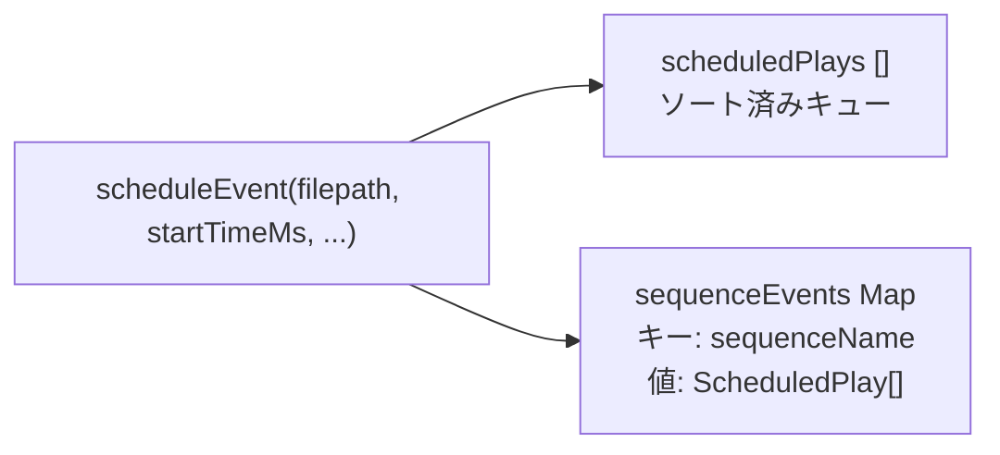
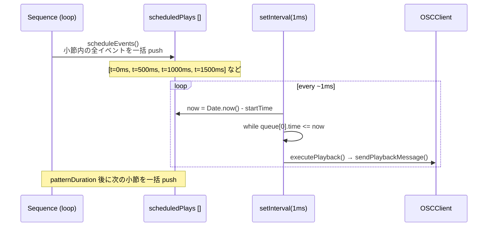
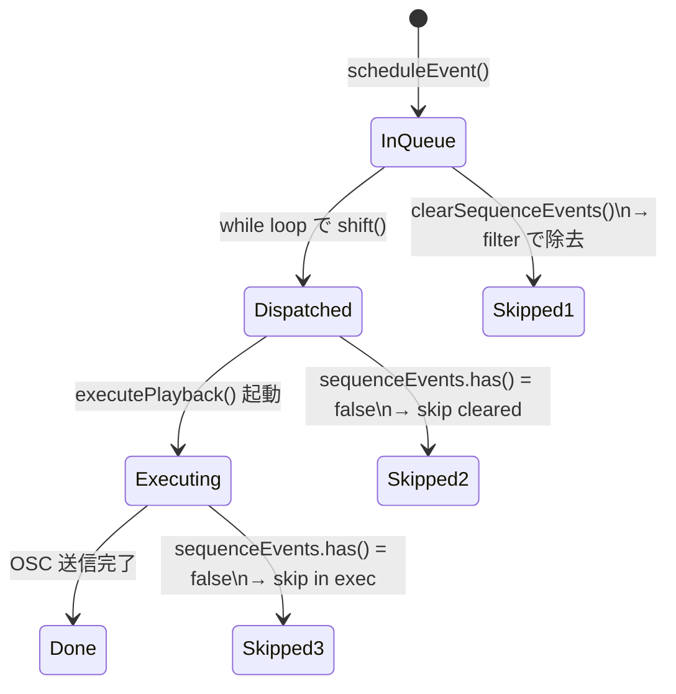
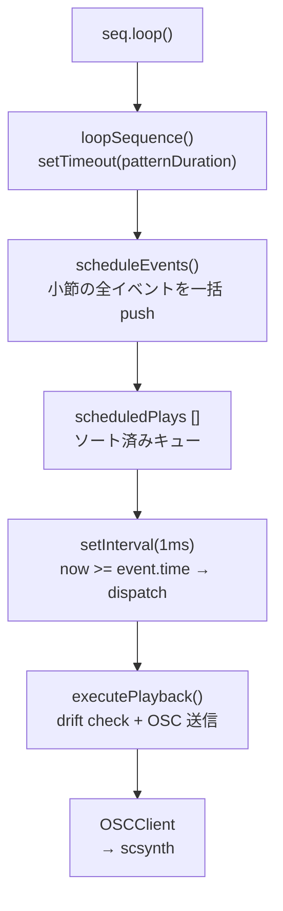

> **Note**: 本ページは 2026-05-05 時点での著者の reading の足跡です。code が真実、本ページはその時点の理解の snapshot に過ぎません。

# II-3. event queue と look-ahead

OrbitScore はどのように「正確なタイミング」で音を出しているのでしょうか。Node.js のイベントループは決して精密なリアルタイム環境ではありません。本章では、OrbitScore が採用している **look-ahead スケジューリング** の仕組みと、その中核を担う `EventScheduler` の実装を読み解きます。

## 問題: JavaScript タイマーの不確かさ

`setTimeout(fn, 100)` を呼んでも、fn が正確に 100ms 後に実行される保証はありません。Node.js のイベントループが他の処理を行っている場合、実際には 105ms や 110ms 後に実行されることがあります。この **ジッター (jitter)** が蓄積すると、音楽的なタイミングが崩れます。

OrbitScore が取る戦略は、**音を鳴らす直前ではなく、少し先のイベントを先行してスケジュールする** look-ahead アプローチです。

## ScheduledPlay: キューの要素

イベントキューの各要素は `ScheduledPlay` という型で表現されています。

```typescript
// packages/engine/src/audio/supercollider/types.ts:5-20
export interface ScheduledPlay {
  time: number
  filepath: string
  options: {
    gainDb?: number // Gain in dB (-60 to +12, default 0)
    pan?: number // Pan position (-100 to +100, default 0)
    startPos?: number // Start position in seconds
    duration?: number // Duration in seconds
    rate?: number // Playback rate (1.0 = normal, 2.0 = double speed, 0.5 = half speed)
  }
  sequenceName: string
}
```

`time` はスケジューラー起動時点を 0 とした相対時刻 (ms) です。OSC メッセージを送出すべき時刻を表します。

## scheduleEvent: キューへの積み込み

新しいイベントをキューに積む関数が `scheduleEvent()` です。

```typescript
// packages/engine/src/audio/supercollider/event-scheduler.ts:24-48
  scheduleEvent(
    filepath: string,
    startTimeMs: number,
    gainDb = 0,
    pan = 0,
    sequenceName = '',
  ): void {
    const play: ScheduledPlay = {
      time: startTimeMs,
      filepath,
      options: { gainDb, pan },
      sequenceName,
    }

    this.scheduledPlays.push(play)
    this.scheduledPlays.sort((a, b) => a.time - b.time)

    // Track sequence events
    if (sequenceName) {
      if (!this.sequenceEvents.has(sequenceName)) {
        this.sequenceEvents.set(sequenceName, [])
      }
      this.sequenceEvents.get(sequenceName)!.push(play)
    }
  }
```

注目したいのは `this.scheduledPlays.sort((a, b) => a.time - b.time)` という行です。**push するたびに毎回ソートしています**。これは `O(n log n)` のコストですが、キューに積まれるイベント数が現実的に少ない (1 秒あたり数十件程度) なのでパフォーマンス問題にはなりません。ソート済みを維持することで、後述の dispatch ループを単純な `while (queue[0].time <= now)` という形で書けます。

イベントは `scheduledPlays` (ソート済みキュー) と `sequenceEvents` (シーケンス別の Map) の両方に登録されます。この 2 重管理の理由は後述の「クリアの仕組み」で説明します。



## start(): 1ms ポーリングループ

スケジューラーを起動すると `setInterval(callback, 1)` が始動します。1ms ごとにキューを確認し、時刻が来たイベントを dispatch します。

```typescript
// packages/engine/src/audio/supercollider/event-scheduler.ts:143-177
  start(): void {
    if (this.isRunning) {
      return
    }

    this.isRunning = true
    this.startTime = Date.now()

    console.log('✅ Global starting')

    this.scheduledPlays.sort((a, b) => a.time - b.time)

    this.intervalId = setInterval(() => {
      const now = Date.now() - this.startTime

      while (this.scheduledPlays.length > 0 && this.scheduledPlays[0].time <= now) {
        const play = this.scheduledPlays.shift()!

        // Skip if this sequence's events have been cleared
        // (sequenceEvents.has() returns false if clearSequenceEvents() was called)
        if (play.sequenceName && !this.sequenceEvents.has(play.sequenceName)) {
          console.log(
            `🔧 [skip cleared] ${play.sequenceName}: skipping event at ${play.time}ms (cleared)`,
          )
          continue
        }

        // Execute playback asynchronously but handle errors
        this.executePlayback(play.filepath, play.options, play.sequenceName, play.time).catch(
          (error) => {
            console.error(`❌ Playback error for ${play.sequenceName}:`, error)
          },
        )
      }
    }, 1)
  }
```

`startTime = Date.now()` でスケジューラー起動時刻を記録し、以後 `now = Date.now() - startTime` という相対時刻で時間を計算します。これにより `ScheduledPlay.time` も同じ相対座標系で扱えます。

`while` ループは `scheduledPlays[0].time <= now` が真である限り、先頭からイベントを取り出して実行します。1 回の interval で複数のイベントをまとめて処理できる構造になっています。

## look-ahead の実現: 先行スケジュール

「1ms ポーリング」だけでは jitter 問題は解決しません。Node.js の `setInterval(1)` は実際には 1ms より長い間隔になることがあるからです。

OrbitScore の jitter 対策は「**OSC メッセージを事前にキューへ積んでおく**」という look-ahead アプローチです。

1 小節分のイベントをループ開始時にまとめてキューへ push する (`scheduleEvents()` が小節内の全イベントを一括登録)
→ ポーリングループはキューを確認するだけでよい
→ ポーリングループ自体に数ms の遅延があっても、イベントはすでにキューにある

このアプローチのポイントを sequence diagram で確認しましょう。



この設計では「スケジュールする行為 (bulk push)」と「実行する行為 (polling dispatch)」が分離されています。Sequence の loop タイマーがどれだけ遅れても、小節内のイベントはすでにキューに並んでいるので dispatch タイミングに影響しません。

## clearSequenceEvents: 2 重管理の意味

シーケンスを停止したり、`Cmd+Enter` で新しいパターンを評価した場合、既存のキューに残っているイベントをキャンセルする必要があります。`clearSequenceEvents()` がその役割を担います。

```typescript
// packages/engine/src/audio/supercollider/event-scheduler.ts:204-226
  clearSequenceEvents(sequenceName: string): void {
    const beforeCount = this.scheduledPlays.length

    // Log events that will be cleared
    const eventsToRemove = this.scheduledPlays.filter((play) => play.sequenceName === sequenceName)
    if (eventsToRemove.length > 0) {
      console.log(
        `🔧 [clearEvents] ${sequenceName}: removing events at times: ${eventsToRemove.map((e) => e.time).join(', ')}ms`,
      )
    }

    this.scheduledPlays = this.scheduledPlays.filter((play) => play.sequenceName !== sequenceName)
    const afterCount = this.scheduledPlays.length
    const cleared = beforeCount - afterCount
    console.log(
      `🔧 [clearEvents] ${sequenceName}: cleared ${cleared} events (${beforeCount} → ${afterCount})`,
    )
    if (cleared > 0) {
      console.log(`⏹ ${sequenceName} (stopped)`)
    }
    // Delete from Map so that any events still in scheduledPlays will be skipped
    this.sequenceEvents.delete(sequenceName)
  }
```

`scheduledPlays` からそのシーケンスのイベントを filter で除去し、`sequenceEvents` Map からも `delete` します。

なぜ Map からの削除が必要なのでしょうか。ここが 2 重管理の理由です。非同期の `executePlayback()` が実行待ちになっている間に `clearSequenceEvents()` が呼ばれた場合、`scheduledPlays` からはすでに `shift()` で取り出されてしまっているので filter では消せません。そのような「取り出されたけどまだ実行中」のイベントをスキップするために、`sequenceEvents.has(sequenceName)` という二次チェックが `start()` の while ループ内と `executePlayback()` 内の両方に設けられています。



## executePlayback: drift チェックと OSC 送信

実際に OSC を送るのは `executePlayback()` です。ここでも別の保護機構が働いています。

```typescript
// packages/engine/src/audio/supercollider/event-scheduler.ts:240-273
  private async executePlayback(
    filepath: string,
    options: PlaybackOptions,
    sequenceName: string,
    scheduledTime: number,
  ): Promise<void> {
    // Only perform checks if sequenceName is provided (non-empty)
    if (sequenceName) {
      const now = Date.now() - this.startTime
      const drift = now - scheduledTime

      // Double-check: Skip if sequence was cleared while waiting in async queue
      if (!this.sequenceEvents.has(sequenceName)) {
        console.log(
          `🔧 [skip in exec] ${sequenceName}: skipping event at ${scheduledTime}ms (cleared during async wait)`,
        )
        return
      }

      // Skip events with excessive drift (> 1000ms)
      // These are likely old events that should have been cleared
      if (drift > 1000) {
        console.log(
          `🔧 [skip drift] ${sequenceName}: skipping event at ${scheduledTime}ms (drift: ${drift}ms > 1000ms)`,
        )
        return
      }
    }

    this.logPlaybackDebugInfo(sequenceName, scheduledTime)
    const { bufnum } = await this.bufferManager.loadBuffer(filepath)
    const amplitude = this.convertGainToAmplitude(options.gainDb)
    await this.sendPlaybackMessage(bufnum, amplitude, options)
  }
```

重要な点が 2 つあります。

1. **drift > 1000ms のイベントはスキップ**: 予定時刻より 1 秒以上遅れているイベントは「古すぎる」と判断してスキップします。これはシステムのスリープ解除後や高負荷時に古いイベントが大量再生されるのを防ぐ安全弁です。

2. **シーケンスクリア後の二次チェック**: 非同期で `loadBuffer()` を待っている間に `clearSequenceEvents()` が呼ばれる可能性があります。`sequenceEvents.has()` を再チェックすることで、その間に削除されたイベントをスキップします。

## ゲインの変換: dB → amplitude

OSC に渡す音量は amplitude (0.0 〜 1.0+) 形式です。DSL で指定する gain は dB 形式なので、`convertGainToAmplitude()` で変換されます。

```typescript
// packages/engine/src/audio/supercollider/event-scheduler.ts:294-302
  private convertGainToAmplitude(gainDb: number | undefined): number {
    if (gainDb === undefined) {
      return 1.0 // 0 dB default
    }
    if (gainDb === -Infinity) {
      return 0.0 // Complete silence
    }
    return Math.pow(10, gainDb / 20)
  }
```

$$
\text{amplitude} = 10^{\text{gainDb} / 20}
$$

`gainDb = 0` なら `amplitude = 1.0` (等倍)、`gainDb = -20` なら `amplitude = 0.1` (10 分の 1)、`gainDb = -Infinity` なら `amplitude = 0.0` (無音) です。

## stop / stopAll: タイマーの後始末

`stop()` はインターバルを止め、`stopAll()` はさらにキューを空にします。

```typescript
// packages/engine/src/audio/supercollider/event-scheduler.ts:183-199
  stop(): void {
    if (this.intervalId) {
      clearInterval(this.intervalId)
      this.intervalId = null
    }
    this.isRunning = false
    console.log('✅ Global stopped')
  }

  stopAll(): void {
    this.stop()
    this.scheduledPlays = []
    this.sequenceEvents.clear()
  }
```

`stop()` はタイマーを止めるだけで、`scheduledPlays` は消しません。`stopAll()` は両方クリアします。`TransportControl.stop()` は全シーケンスを止めてから `globalScheduler.stopAll()` を呼びます。

## まとめ: look-ahead の全体像

OrbitScore の event queue は次の役割分担で動いています。



キーになる設計判断は 2 つです。

- **bulk push** (look-ahead): 小節内のすべてのイベントを事前に積むことで、dispatch タイミングの揺らぎを音に影響させない
- **1ms ポーリング**: `setInterval(1)` は精確ではないが、すでにキューにあるイベントを「遅れても見つける」だけなのでタイミング精度に与える影響が小さい

> NOTE: unverified — `setInterval(1)` の実際の発火間隔 (Node.js の libuv タイマー精度) と、実際の OSC 送信タイミングの drift 測定値は code から確認できていない。architecture-overview.md の「次の深掘り候補」に記載がある通り、精度の実測は別途確認が必要。

## 次の深掘り候補

- `setInterval(1)` の実際の発火間隔 (libuv タイマーの最小分解能は OS 依存で 4〜15ms 程度)
- `scheduleEvents()` での look-ahead 幅の設定 (現在は次の 1 小節分だけ、2 小節先まで先読みする場合との比較)
- `scheduleSliceEvent()` と `chop()` 修飾子の組み合わせ — スライス位置と rate 計算の詳細
- `drift > 1000ms` のしきい値の根拠 — スリープ明けで何 ms 程度の drift が生じうるか
- バッファキャッシュ (`bufferManager.loadBuffer()`) がキャッシュヒットした場合と miss した場合の遅延差

## Sources

- `packages/engine/src/audio/supercollider/event-scheduler.ts:9-14` — `EventScheduler` のフィールド定義 (`scheduledPlays`, `sequenceEvents` の 2 重管理)
- `packages/engine/src/audio/supercollider/event-scheduler.ts:24-48` — `scheduleEvent()`: push + sort + sequenceEvents 登録
- `packages/engine/src/audio/supercollider/event-scheduler.ts:143-177` — `start()`: `setInterval(1)` と dispatch ループ
- `packages/engine/src/audio/supercollider/event-scheduler.ts:183-199` — `stop()` / `stopAll()`
- `packages/engine/src/audio/supercollider/event-scheduler.ts:204-226` — `clearSequenceEvents()`: filter + Map.delete による 2 段階クリア
- `packages/engine/src/audio/supercollider/event-scheduler.ts:240-273` — `executePlayback()`: drift チェックと二次クリアチェック
- `packages/engine/src/audio/supercollider/event-scheduler.ts:294-302` — `convertGainToAmplitude()`: dB → amplitude 変換
- `packages/engine/src/audio/supercollider/types.ts:5-20` — `ScheduledPlay` 型定義
- `packages/engine/src/core/sequence/scheduling/event-scheduler.ts:48-105` — `scheduleEvents()`: 小節内イベントの一括 push
- `sites/dev/orientation/architecture-overview.md` — sequence diagram (play() → 音の全体フロー、EventScheduler の setInterval と OSC 送信の関係)
