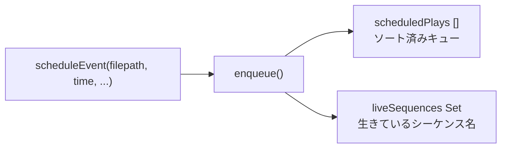
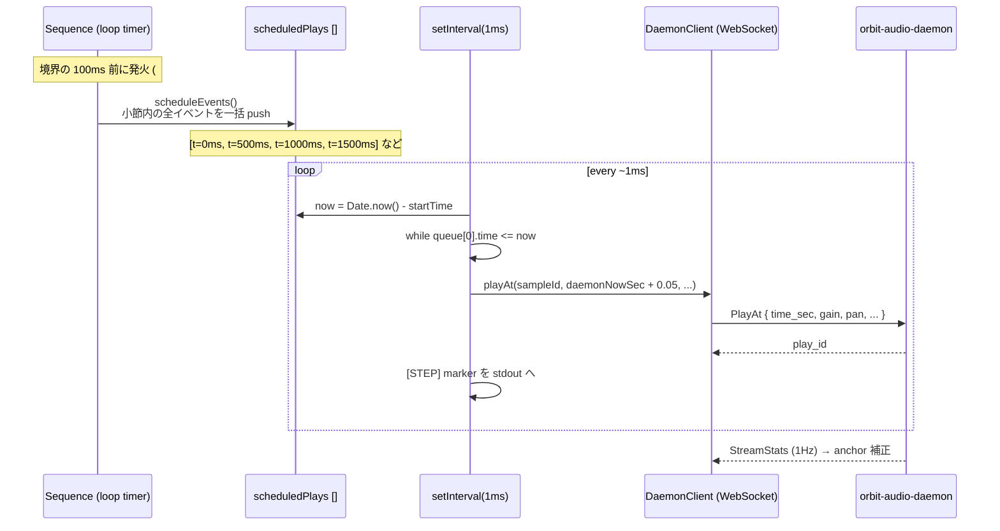
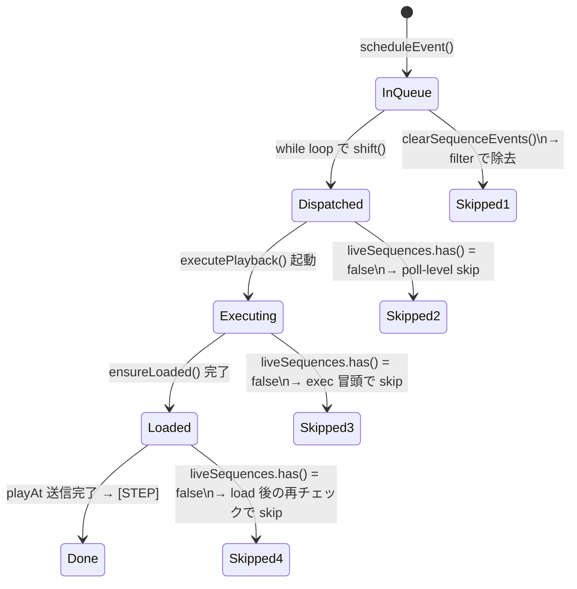
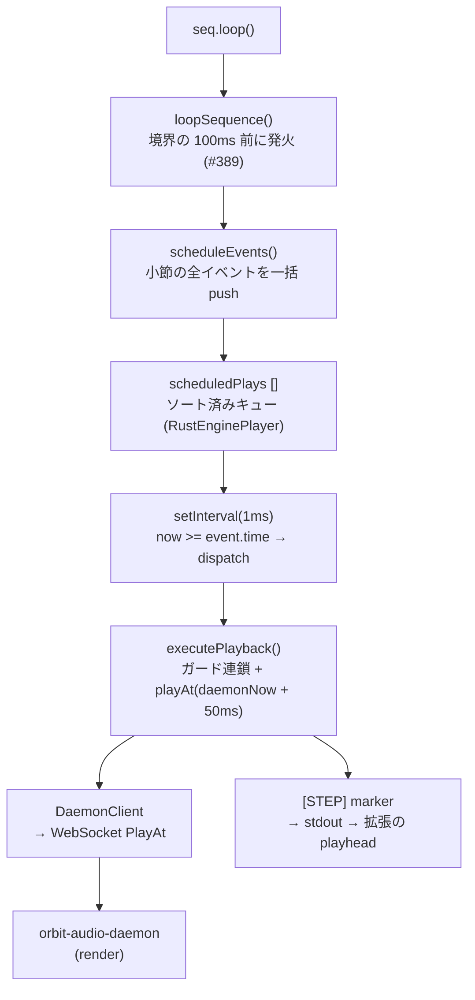

> **Note**: 本ページは 2026-09-01 時点での著者の reading の足跡です。code が真実、本ページはその時点の理解の snapshot に過ぎません。

# II-3. event queue と look-ahead

OrbitScore はどのように「正確なタイミング」で音を出しているのでしょうか。Node.js のイベントループは決して精密なリアルタイム環境ではありません。本章では、OrbitScore が採用している **look-ahead スケジューリング** の仕組みと、その中核を担うイベントキューの実装を読み解きます。

## 2026-09 時点の drift: 既定バックエンドは Rust daemon

本章の 2026-05-05 版は、SuperCollider 経路の `EventScheduler` (`packages/engine/src/audio/supercollider/event-scheduler.ts`) を「イベントキューの実装」として読んでいました。2026-07-03 の cutover #108 (WORK_LOG 6.179) 以降、**既定の音声バックエンドは Rust daemon (`orbit-audio-daemon`)** で、キューを持つのは `RustEnginePlayer` (`packages/engine/src/audio/rust-engine/rust-engine-player.ts`) です。SC 経路は `ORBITSCORE_ENGINE=sc` で opt-out すると使えるように温存されています。

バックエンドを選ぶのは `createAudioEngine()` です。

```typescript
// packages/engine/src/audio/create-audio-engine.ts:17-22
export function createAudioEngine(env: NodeJS.ProcessEnv = process.env): AudioEngineBackend {
  const raw = env[ENGINE_ENV_VAR]
  if (resolveEngineKind(raw) === 'supercollider') {
    console.log(`🎛️ [engine] using SuperCollider backend (opt-out via ORBITSCORE_ENGINE=${raw})`)
    return new SuperColliderPlayer()
  }
```

両バックエンドは同じ契約 `AudioEngineBackend` を満たします。この interface は `Scheduler` を extends したもので、`Scheduler` の側に「イベントキュー」の面 (`scheduleEvent` / `start` / `stop` / `clearSequenceEvents` など) が定義されています。

```typescript
// packages/engine/src/audio/engine-backend.ts:26-27
export interface AudioEngineBackend extends Scheduler {
  boot(outputDevice?: string): Promise<void>
```

```typescript
// packages/engine/src/core/global/types.ts:10-63 (scheduleEvent 以降のシグネチャ詳細を // ... で省略)
// Common scheduler interface
export interface Scheduler {
  isRunning: boolean
  startTime: number // Timestamp when scheduler started
  sequenceTimeouts?: Record<string, NodeJS.Timeout> // For tracking sequence timeouts
  start(): void
  stop(): void
  stopAll(): void
  clearSequenceEvents(name: string): void
  reinitializeSequenceTracking(name: string): void
  // ...
  scheduleStepMarker?(time: number, sequenceName: string, argPath: string, gainDb: number): void
  // ...
```

大事なのは、**musical timing は TS 側に残す**という設計方針 (rust-engine-player.ts のヘッダコメント、Epic #105 の原則) です。`RustEnginePlayer` は SC の `EventScheduler` と同じ「1ms ポーリング + ソート済みキュー」モデルを *lean* に写し取った独立実装で、発火時に daemon へ `PlayAt` を WebSocket で送る点だけが違います。したがって 2026-05 版の説明の骨格 (bulk push / 1ms ポーリング / 2 段階のクリア / drift ガード) はそのまま生きています。本章は **Rust 経路を主線として書き直し、SC 経路は「歴史的 / opt-out 経路」として要点だけ残します**。

look-ahead が「どこに」あるかも整理しておきます。Rust 経路には 3 段の先読みがあります:

| 段 | 場所 | 幅 | 役割 |
|---|---|---|---|
| 1 | `scheduleEvents()` (sequence 層) | 1 小節 | 小節内の全イベントを一括でキューに積む (2026-05 版と同じ) |
| 2 | `LOOP_TIMER_LEAD_MS` (loop-sequence.ts、#389) | 100ms | ループタイマーを境界の 100ms 前に発火させ、小節頭を「未来」として enqueue する ([II-2](/scheduling/polymeter) で扱いました) |
| 3 | `DEFAULT_LOOKAHEAD_SEC` (rust-engine-player.ts) | 50ms | poll 発火時に `PlayAt{time_sec = daemonNow + 0.05}` を送り、daemon の render cursor を確実に上回らせる |

さらに #390 (2026-07-07) で `[STEP]` マーカー (live playhead) が dispatch 経路に加わり、#654 (2026-08-30) で MIDI 側にも同じマーカーが配線されました。これも本章で扱います。

## 問題: JavaScript タイマーの不確かさ

`setTimeout(fn, 100)` を呼んでも、fn が正確に 100ms 後に実行される保証はありません。Node.js のイベントループが他の処理を行っている場合、実際には 105ms や 110ms 後に実行されることがあります。この **ジッター (jitter)** が蓄積すると、音楽的なタイミングが崩れます。

OrbitScore が取る戦略は、**音を鳴らす直前ではなく、少し先のイベントを先行してスケジュールする** look-ahead アプローチです。

## ScheduledPlay: キューの要素

イベントキューの各要素は `ScheduledPlay` という型で表現されています。Rust 経路の版は SC 版より平たい構造で、`options` の入れ子がなく、chop の slice 情報を `slice` にまとめて持ちます。

```typescript
// packages/engine/src/audio/rust-engine/rust-engine-player.ts:169-200
/** lean scheduler が保持する 1 発音イベント。SC `ScheduledPlay` の daemon 版。 */
export interface ScheduledPlay {
  /** 再生開始時刻（`startTime` からの相対 ms）。 */
  time: number
  filepath: string
  /** dB ゲイン（`scheduleEvent` の gainDb）。発火時に linear amplitude へ変換。 */
  gainDb: number
  /** DSL pan（-100..100）。発火時に daemon の [-1,1] へ変換。 */
  pan: number
  sequenceName: string
  /** chop slice 情報。未指定なら全体再生。発火時に load 済み尺から領域を計算する。 */
  slice?: SliceSpec
  /** LinkAudio ルーティング先チャンネル名。非空の時のみ daemon の PlayAt へ転送する。 */
  outputChannel?: string
  /**
   * per-sequence insert bus 名（`seq.effect()`・PH.2b・#434 S3）。非空の時のみ daemon の
   * PlayAt へ転送する。`outputChannel` と同時に立つことはない（LinkAudio と plugin
   * hosting は v1 で排他）。
   */
  insertBus?: string
  /**
   * #390 live playhead: 由来する play() 引数のドット結合インデックス（"2"、ネストは
   * 後段で "1.0"）。dispatch 成功時に `[STEP]` marker を stdout へ出すためだけの
   * observational フィールド。timing / 音響には一切影響しない。
   */
  argPath?: string
  /**
   * #390: 休符 (0) スロットの marker-only イベント。daemon への dispatch は行わず、
   * 発火タイミングで `[STEP]` だけを出す（filepath は空文字）。
   */
  markerOnly?: boolean
}
```

`time` はスケジューラー起動時点を 0 とした相対時刻 (ms) です。「daemon へ `PlayAt` を送出すべき時刻」を表します。`gainDb` は dB のまま持ち、発火時に amplitude へ変換します。`outputChannel` (LinkAudio) と `insertBus` (`seq.effect()`) はルーティングのタグで、`argPath` / `markerOnly` は #390 の live playhead 用です。

参考までに、SC 経路の `ScheduledPlay` は次の形です。`options` の入れ子の中に `startPos` / `duration` / `rate` (chop 用) を平たく持っています。

```typescript
// packages/engine/src/audio/supercollider/types.ts:10-25
export interface ScheduledPlay {
  time: number
  filepath: string
  options: {
    gainDb?: number // Gain in dB (-60 to +12, default 0)
    pan?: number // Pan position (-100 to +100, default 0)
    startPos?: number // Start position in seconds
    duration?: number // Duration in seconds
    rate?: number // Playback rate (1.0 = normal, 2.0 = double speed, 0.5 = half speed)
    // LinkAudio dispatch: when set, route to LinkAudio plugin via channel id
    // (set by Sequence layer only when Global.linkAudio() is enabled). Absent
    // means hardware bus routing via the existing orbitPlayBuf SynthDef.
    outputChannel?: string
  }
  sequenceName: string
}
```

## scheduleEvent と enqueue: キューへの積み込み

新しいイベントをキューに積むのは `scheduleEvent()` で、Rust 版は内部の `enqueue()` に委譲します。

```typescript
// packages/engine/src/audio/rust-engine/rust-engine-player.ts:1399-1415
  scheduleEvent(
    filepath: string,
    time: number,
    gainDb = 0,
    pan = 0,
    sequenceName = '',
    outputChannel?: string,
    argPath?: string,
    insertBus?: string,
  ): void {
    // outputChannel の feature-gap signal は `registerLinkAudioChannel`（`sequence.output()` 経由）が
    // authoritative に出す（A4-2b-2b で egress 配線済み）。scheduleEvent は channel を tag するだけで、
    // 「egress is not wired」の旧 warn は stale なので出さない（egress 有効な daemon では誤誘導になる）。
    // pan は daemon PlayAt で実装済み（#304・equal-power = SC Pan2 一致）。発火時に
    // executePlayback が DSL の -100..100 を daemon の [-1,1] へ変換して送る。
    this.enqueue({ time, filepath, gainDb, pan, sequenceName, outputChannel, argPath, insertBus })
  }
```

```typescript
// packages/engine/src/audio/rust-engine/rust-engine-player.ts:1538-1544
  private enqueue(play: ScheduledPlay): void {
    this.scheduledPlays.push(play)
    this.scheduledPlays.sort((a, b) => a.time - b.time)
    if (play.sequenceName) {
      this.liveSequences.add(play.sequenceName)
    }
  }
```

注目したいのは `this.scheduledPlays.sort((a, b) => a.time - b.time)` という行です。**push するたびに毎回ソートしています**。これは `O(n log n)` のコストですが、キューに積まれるイベント数が現実的に少ない (1 秒あたり数十件程度) なのでパフォーマンス問題にはなりません。ソート済みを維持することで、後述の dispatch ループを単純な `while (queue[0].time <= now)` という形で書けます。

2026-05 版で「2 重管理」と呼んでいた仕組みは、Rust 版では **`liveSequences` という `Set<string>`** に簡略化されています。SC 版は `sequenceEvents: Map<string, ScheduledPlay[]>` にイベントの配列まで持っていましたが、実際に使われるのは「そのシーケンス名が生きているか」という真偽だけなので、Set で十分だったわけです。


```mermaid
flowchart LR
  SE["scheduleEvent(filepath, time, ...)"] --> EQ["enqueue()"]
  EQ --> SP["scheduledPlays []\nソート済みキュー"]
  EQ --> SET["liveSequences Set\n生きているシーケンス名"]
```

## start(): 1ms ポーリングループ

スケジューラーを起動すると `setInterval(callback, POLL_INTERVAL_MS)` が始動します。定数はファイル上部にまとまっています。

```typescript
// packages/engine/src/audio/rust-engine/rust-engine-player.ts:330-335
const DEFAULT_LOOKAHEAD_SEC = 0.05
const PLUGIN_UI_OPEN_TIMEOUT_MS = 30_000
const PLUGIN_UI_CLOSE_TIMEOUT_MS = 20_000
const POLL_INTERVAL_MS = 1
/** SC EventScheduler と同じく、過大 drift のイベントは古い残骸として skip する閾値。 */
const MAX_DRIFT_MS = 1000
```

1ms ごとにキューを確認し、時刻が来たイベントを dispatch します。

```typescript
// packages/engine/src/audio/rust-engine/rust-engine-player.ts:1467-1484
  start(): void {
    if (this.isRunning) return
    this.isRunning = true
    this.startTime = Date.now()
    this.scheduledPlays.sort((a, b) => a.time - b.time)

    this.intervalId = setInterval(() => {
      const now = Date.now() - this.startTime
      while (this.scheduledPlays.length > 0 && this.scheduledPlays[0].time <= now) {
        const play = this.scheduledPlays.shift()!
        // clear 済みシーケンスのイベントは skip（poll-level チェック）。
        if (play.sequenceName && !this.liveSequences.has(play.sequenceName)) {
          continue
        }
        this.executePlayback(play).catch((err) => this.onPlaybackError(play, err))
      }
    }, POLL_INTERVAL_MS)
  }
```

`startTime = Date.now()` でスケジューラー起動時刻を記録し、以後 `now = Date.now() - startTime` という相対時刻で時間を計算します。これにより `ScheduledPlay.time` も同じ相対座標系で扱えます。

`while` ループは `scheduledPlays[0].time <= now` が真である限り、先頭からイベントを取り出して実行します。1 回の interval で複数のイベントをまとめて処理できる構造になっています。SC 版 (`event-scheduler.ts:355-390`) との違いは、`console.log('✅ Global starting')` と skip 時のログが無いことだけです。

## look-ahead の実現: 3 段の先読み

「1ms ポーリング」だけでは jitter 問題は解決しません。Node.js の `setInterval(1)` は実際には 1ms より長い間隔になることがあるからです。OrbitScore の jitter 対策は「先に積んでおく」の積み重ねで、Rust 経路では 3 段あります。

### 第 1 段: 小節単位の bulk push (sequence 層)

1 小節分のイベントは、ループ開始時に `scheduleEvents()` がまとめてキューへ push します。この関数は sequence 層 (`packages/engine/src/core/sequence/scheduling/event-scheduler.ts`) にあり、バックエンドに依存しません。

```typescript
// packages/engine/src/core/sequence/scheduling/event-scheduler.ts:97-153 (gain/pan の計算と scheduleSliceEvent / scheduleEvent の引数列を // ... で省略)
  // Schedule events for current iteration
  const loopOffset = loopIteration * patternDuration

  for (const event of timedEvents) {
    if (event.sliceNumber > 0) {
      // 0 is silence
      const startTimeMs = baseTime + event.startTime + loopOffset

      // ...
    } else if (event.sliceNumber === 0 && event.argPath !== undefined) {
      // 0 is silence — no audio dispatch, but the live playhead still steps
      // through the rest slot (#390 owner request 2026-07-07): the sequence is
      // processing the silence, so the highlight should land on it. gainDb
      // carries the slot's mute/master gain so muted sequences skip markers
      // exactly like they skip notes.
      scheduler.scheduleStepMarker?.(
        baseTime + event.startTime + loopOffset,
        sequenceName,
        event.argPath,
        calculateEventGain(gainDb, gainRandom, masterGainDb, isMuted),
      )
    }
  }
}
```

`startTimeMs = baseTime + event.startTime + loopOffset` が [II-1](/scheduling/time-representation) の `TimedEvent.startTime` (小節内相対 ms) を、スケジューラーの絶対相対時刻に変換している箇所です。`sliceNumber === 0` の休符スロットは音を出しませんが、#390 以降は `scheduleStepMarker?.()` で **marker-only イベント**を積みます (`?.` なので、`scheduleStepMarker` を持たない SC 版では何もしません)。

→ ポーリングループはキューを確認するだけでよい
→ ポーリングループ自体に数 ms の遅延があっても、イベントはすでにキューにある

### 第 2 段: ループタイマーの lead 発火 (#389)

bulk push を「いつ」行うかも重要です。小節境界ちょうどにタイマーを仕掛けると、`setTimeout` は決して早く発火しないため、小節頭のイベントは enqueue した瞬間にすでに過去になり、即時 dispatch で遅れて鳴ります。#389 (2026-07-07) はループタイマーを境界の `LOOP_TIMER_LEAD_MS` (100ms) 前に発火させ、次の小節を「未来」として積むようにしました。詳細は [II-2](/scheduling/polymeter) の `armDelay()` を参照してください。ファイル冒頭のコメントに「the daemon has its own lookahead」とあるとおり、この 100ms はイベントループの遅れを吸収するためのもので、オーディオ経路の先読みは第 3 段が担います。

### 第 3 段: daemon への定数 lookahead (50ms)

poll がイベントを検出した時点で、Rust 版は「今すぐ鳴らせ」ではなく **「daemon の transport clock で今 + 50ms に鳴らせ」** という `PlayAt` を送ります。SC 版が poll 検出で即 `/s_new` を送っていた (fire-now) のと対照的です。理由はヘッダコメントに書かれています。

```typescript
// packages/engine/src/audio/rust-engine/rust-engine-player.ts:16-21
 *  - **timing モデル = poll-and-fire-now + 定数 lookahead**。SC は fire-now（poll 検出で
 *    即 `/s_new`）。daemon は自前 transport clock（boot で 0 開始）上の `PlayAt{time_sec}`
 *    で schedule-ahead。poll 発火時に `playAt(daemonNowSec + lookahead)` を送ることで
 *    **相対 timing（quantize/polymeter）を保存**しつつ daemon render cursor を確実に
 *    上回らせ onset clip を避ける（絶対 latency は定数シフト＝音楽的に無影響）。lookahead は
 *    実機計測で確定する（A0 受け入れ基準）。
```

「絶対 latency は定数シフト = 音楽的に無影響」というのがポイントです。全イベントが一律に 50ms 遅れるので、polymeter や quantize の相対関係は保たれます。

この方式には「TS の `Date.now()` と daemon の transport clock を対応づける」という新しい問題が伴います。daemon は 1Hz の `StreamStats` で自分の `now_sec` を報告し、TS 側はそれを anchor として蓄積します。#389 の機構 B で、単一 anchor から **直近 30 サンプルの最小二乗フィット**に変わりました (`ANCHOR_WINDOW`、`fitAnchorSamples()`)。dispatch のホットパスで呼ばれる `daemonNowSec()` は、そのフィットを O(1) で評価します。

```typescript
// packages/engine/src/audio/rust-engine/rust-engine-player.ts:1700-1706
  private daemonNowSec(): number {
    const fit = this.anchorFit
    if (fit) {
      return fit.intercept + fit.slope * ((Date.now() - fit.t0Ms) / 1000)
    }
    return this.clockAnchor.daemonSec + (Date.now() - this.clockAnchor.tsMs) / 1000
  }
```

フィットが無い間 (boot 直後や respawn 直後) は「最新 anchor + 経過時間」に落ちます。

全体を sequence diagram で確認しましょう。


```mermaid
sequenceDiagram
  participant SEQ as Sequence (loop timer)
  participant QUEUE as scheduledPlays []
  participant POLL as setInterval(1ms)
  participant DC as DaemonClient (WebSocket)
  participant D as orbit-audio-daemon

  Note over SEQ: 境界の 100ms 前に発火 (#389)
  SEQ->>QUEUE: scheduleEvents()<br/>小節内の全イベントを一括 push
  Note over QUEUE: [t=0ms, t=500ms, t=1000ms, t=1500ms] など

  loop every ~1ms
    POLL->>QUEUE: now = Date.now() - startTime
    POLL->>POLL: while queue[0].time <= now
    POLL->>DC: playAt(sampleId, daemonNowSec + 0.05, ...)
    DC->>D: PlayAt { time_sec, gain, pan, ... }
    D-->>DC: play_id
    POLL->>POLL: [STEP] marker を stdout へ
  end

  D-->>DC: StreamStats (1Hz) → anchor 補正
```

この設計では「スケジュールする行為 (bulk push)」と「実行する行為 (polling dispatch)」と「鳴らす行為 (daemon の render)」が分離されています。Sequence の loop タイマーが多少遅れても小節内のイベントはすでにキューに並んでいますし、poll が多少遅れても daemon 側の 50ms の余裕の中で吸収されます。

## clearSequenceEvents: 2 段階のスキップ

シーケンスを停止したり、`Cmd+Enter` で新しいパターンを評価した場合、既存のキューに残っているイベントをキャンセルする必要があります。`clearSequenceEvents()` がその役割を担います。Rust 版はとても短くなりました。

```typescript
// packages/engine/src/audio/rust-engine/rust-engine-player.ts:1515-1523
  clearSequenceEvents(sequenceName: string): void {
    this.scheduledPlays = this.scheduledPlays.filter((p) => p.sequenceName !== sequenceName)
    // 集合から消すことで、まだ queue に残るイベントも poll/exec 時に skip される。
    this.liveSequences.delete(sequenceName)
  }

  reinitializeSequenceTracking(sequenceName: string): void {
    this.liveSequences.add(sequenceName)
  }
```

`scheduledPlays` からそのシーケンスのイベントを filter で除去し、`liveSequences` からも `delete` します。

なぜ Set からの削除が必要なのでしょうか。非同期の `executePlayback()` が実行待ちになっている間に `clearSequenceEvents()` が呼ばれた場合、`scheduledPlays` からはすでに `shift()` で取り出されてしまっているので filter では消せません。そのような「取り出されたけどまだ実行中」のイベントをスキップするために、`liveSequences.has(sequenceName)` という二次チェックが `start()` の while ループ内と `executePlayback()` 内 (しかも `ensureLoaded()` の await の前後で 2 回) に設けられています。`reinitializeSequenceTracking()` は unmute 時に Set へ名前を戻す関数で、[II-2](/scheduling/polymeter) の unmute 分岐から呼ばれます。


```mermaid
stateDiagram-v2
  [*] --> InQueue: scheduleEvent()
  InQueue --> Dispatched: while loop で shift()
  Dispatched --> Executing: executePlayback() 起動
  Executing --> Loaded: ensureLoaded() 完了
  Loaded --> Done: playAt 送信完了 → [STEP]

  InQueue --> Skipped1: clearSequenceEvents()\n→ filter で除去
  Dispatched --> Skipped2: liveSequences.has() = false\n→ poll-level skip
  Executing --> Skipped3: liveSequences.has() = false\n→ exec 冒頭で skip
  Loaded --> Skipped4: liveSequences.has() = false\n→ load 後の再チェックで skip
```

SC 版の `clearSequenceEvents()` (`event-scheduler.ts:440-462`) は同じ構造に加えて、除去したイベントの時刻一覧や件数を `console.log` で出します。Rust 版がログを落としたぶん、SC 版はデバッグ時の情報源として読む価値があります。

## executePlayback: ガードの連鎖と PlayAt 送信

実際に daemon へ送るのは `executePlayback()` です。ここには複数の保護機構が直列に並んでいます。関数冒頭の respawn 関連のコメントは長いので、ガードの本体から引用します。

```typescript
// packages/engine/src/audio/rust-engine/rust-engine-player.ts:1570-1614
    if (this.respawning || !this.daemon.isRunning()) return
    if (play.sequenceName) {
      // poll 検出から executePlayback 実行までの microtask gap で clear された場合の skip。
      if (!this.liveSequences.has(play.sequenceName)) return
      const drift = Date.now() - this.startTime - play.time
      if (drift > MAX_DRIFT_MS) return
    }

    const amplitude = gainDbToAmplitude(play.gainDb)
    if (amplitude <= 0) return // 無音はロード前にスキップ（音響的に同一）。

    // #390: 休符 (0) スロットの marker-only イベント。daemon dispatch は行わず
    // marker だけ出して終わる（上の amplitude ガードを通過している = mute されて
    // いないシーケンスのみ。音イベントとの一貫性）。filepath は空なので
    // ensureLoaded より前に抜けること。
    if (play.markerOnly) {
      this.emitStepMarker(play)
      return
    }

    const sampleId = await this.ensureLoaded(play.filepath)
    // ロード（async round-trip）中に clear された場合の再チェック（mute/stop への応答性）。
    if (play.sequenceName && !this.liveSequences.has(play.sequenceName)) return
    // 音響パラメータ（amplitude/pan/slice 領域）は本番発火と検証ハーネス（#311）で共有する
    // 変換に集約する。slice 領域は ensureLoaded 後の尺（this.durations）を使う（lazy load）。
    const { gain, pan, offsetSec, durationSec, rate } = this.toDaemonParams(play)
    // daemonNowSec と wallMs は送信「前」に同一瞬間で採取する（onDispatch の lead/drift 計測が
    // coherent になるよう。playAt の await 後だと round-trip 分ずれる）。
    const wallMs = Date.now()
    const daemonNowSec = this.daemonNowSec()
    const timeSec = daemonNowSec + this.lookaheadSec
    const { playId } = await this.daemon.playAt(
      sampleId,
      timeSec,
      gain,
      pan,
      offsetSec,
      durationSec,
      rate,
      play.outputChannel,
      play.insertBus,
    )
    // #390 live playhead: emitted only after a successful dispatch (emission-only
    // — no timing / semantics change).
    this.emitStepMarker(play)
```

順番に読んでいきましょう。

1. **respawn 中 / 未接続なら drop**: daemon がクラッシュして再起動中 (#300 の recovery floor) は、古い clock anchor のまま新しい daemon に「数秒先」を送って desync するのを防ぐため、dispatch そのものを捨てます。
2. **シーケンスクリア後の二次チェック**: poll 検出から `executePlayback()` 実行までの microtask gap で clear された場合のスキップです。
3. **drift > 1000ms (`MAX_DRIFT_MS`) のイベントはスキップ**: 予定時刻より 1 秒以上遅れているイベントは「古すぎる」と判断して捨てます。スリープ解除後などに古いイベントが大量再生されるのを防ぐ安全弁で、[II-2](/scheduling/polymeter) の `armDelay()` の追いつき経路と対になっています。
4. **amplitude ≤ 0 なら skip**: mute 中のシーケンスは gain が `-Infinity` で来るので、サンプルをロードする前に抜けます。
5. **marker-only なら `[STEP]` だけ出して終了**: 休符スロットです。amplitude ガードの後ろに置くことで、mute 中は音と同様に marker も出ません。
6. **`ensureLoaded()` の後にもう一度 `liveSequences` を確認**: ロードは WebSocket の往復なので、その間に stop / mute されている可能性があります。
7. **`daemonNowSec + lookaheadSec` を `time_sec` として `playAt()`**: 第 3 段の look-ahead です。`wallMs` と `daemonNowSec` を送信前の同一瞬間に採るのは、`onDispatch` (計測フック) の lead/drift が一貫するようにするためです。
8. **成功後に `emitStepMarker()`**: 送信が失敗したら marker は出ません。

`daemon.playAt()` は `DaemonClient` の薄いラッパーで、JSON の `PlayAt` リクエストを WebSocket で送ります。

```typescript
// packages/engine/src/audio/rust-engine/daemon-client.ts:414-424
  async playAt(
    sampleId: string,
    timeSec: number,
    gain: number,
    pan = 0,
    offsetSec = 0,
    durationSec = 0,
    rate = 1,
    channel?: string,
    bus?: string,
  ): Promise<{ playId: string }> {
```

## `[STEP]` マーカー: live playhead (#390 / #654)

`emitStepMarker()` は、エディタ拡張が `play()` の引数をハイライトする live playhead のための、機械可読な 1 行を stdout に出します。

```typescript
// packages/engine/src/audio/rust-engine/rust-engine-player.ts:1546-1562
  /**
   * #390 live playhead: machine-readable step marker for the editor extension.
   * The epoch ms is the event's GRID time (startTime + play.time — the same
   * base the drift check uses), NOT "now": dispatch runs lookahead-early, so
   * the extension delays the decoration until this timestamp. Actual audio
   * lands ~lookaheadSec (50ms) after the grid time — a uniform constant shift
   * across all sequences, so the playhead stays mutually consistent. Rounded
   * because play.time can be fractional (bar subdivision) and the marker
   * grammar keeps integers.
   */
  private emitStepMarker(play: ScheduledPlay): void {
    if (play.sequenceName && play.argPath !== undefined) {
      console.log(
        `[STEP] ${play.sequenceName} ${play.argPath} ${Math.round(this.startTime + play.time)}`,
      )
    }
  }
```

タイムスタンプが「今」ではなく **グリッド時刻** (`startTime + play.time`) なのが設計上のポイントです。dispatch は lookahead ぶん早く走るので、拡張側はこのタイムスタンプまで装飾を遅らせます。`argPath` は [II-1](/scheduling/time-representation) で見た `TimedEvent.argPath` が `scheduleEvents()` → `scheduleEvent()` → `ScheduledPlay` と貫通してきたものです。

面白いのは #654 (2026-08-30、WORK_LOG 6.421) の経緯です。#390 は audio 経路にしか配線されておらず、`instrument()` / `midi()` シーケンスでは playhead がまったく動きませんでした。修正は `MidiScheduler` に同じ文法のマーカーを積む `scheduleStepMarker()` を足すことでした。

```typescript
// packages/engine/src/midi/midi-scheduler.ts:171-176
  scheduleStepMarker(time: number, owner: string, argPath: string): void {
    const atEpochMs = Math.round(time)
    this.enqueue(time, owner, () => {
      console.log(`[STEP] ${owner} ${argPath} ${atEpochMs}`)
    })
  }
```

audio 側と MIDI 側の両方が「グリッド時刻」を打つので、層どうしの playhead を比べられる、というのが WORK_LOG に書かれた判断です。なお `[STEP]` 行は通常モードでは output channel からフィルタされるので、実機で観測するには `debug: true` で起動する必要があります (WORK_LOG 6.421)。

## ゲインの変換: dB → amplitude

daemon に渡す音量は linear amplitude 形式です。DSL で指定する gain は dB なので、変換が必要です。2026-05 版では SC の `EventScheduler` 内の `convertGainToAmplitude()` を引用していましたが、その関数はもう存在せず、**両バックエンド共通の `gainDbToAmplitude()`** に統合されています。

```typescript
// packages/engine/src/audio/audio-gain-utils.ts:1-16
/**
 * 音声バックエンド共通のゲイン変換ユーティリティ。
 *
 * dB → linear amplitude の単一情報源。SuperCollider 経路（EventScheduler）と
 * Rust daemon 経路（RustEnginePlayer）の両方がこれを使う。
 */

/**
 * dB ゲインを linear amplitude へ変換する。`amplitude = 10^(dB/20)`。
 * 既定（undefined）= 0 dB = 1.0、`-Infinity` = 完全無音 = 0.0。
 */
export function gainDbToAmplitude(gainDb: number | undefined): number {
  if (gainDb === undefined) return 1.0
  if (gainDb === -Infinity) return 0.0
  return Math.pow(10, gainDb / 20)
}
```

$$
\text{amplitude} = 10^{\text{gainDb} / 20}
$$

`gainDb = 0` なら `amplitude = 1.0` (等倍)、`gainDb = -20` なら `amplitude = 0.1` (10 分の 1)、`gainDb = -Infinity` なら `amplitude = 0.0` (無音) です。

なお、ここで変換されるのはシーケンスの gain だけです。マスターゲイン (`global.gain()`) は #643 (2026-08-29) で **event 側に畳み込まなくなり**、daemon の mixer が `SetGlobalGain` の ramp として 1 回だけ掛ける方式に変わりました (`event-scheduler.ts` の `calculateEventGain()` に長いコメントがあります)。`masterGainDb === -Infinity` のときだけは、ramp が 0 に落ちるまでの漏れを防ぐため event 側でも `-Infinity` を返します。

## stop / stopAll: タイマーの後始末

`stop()` はインターバルを止め、`stopAll()` はさらにキューを空にして daemon 側の発音も止めます。

```typescript
// packages/engine/src/audio/rust-engine/rust-engine-player.ts:1486-1513 (daemon.stopAll() のエラー処理コメントを // ... で省略)
  stop(): void {
    if (this.intervalId) {
      clearInterval(this.intervalId)
      this.intervalId = null
    }
    this.isRunning = false
  }

  stopAll(): void {
    this.stop()
    this.scheduledPlays = []
    this.liveSequences.clear()
    this.warned = freshWarned()
    // daemon 側の in-flight voice（varispeed の rate<1.0 で長尺化した slice 含む）も即時
    // hard-stop する（#319）。stopAll は同期契約なので fire-and-forget。失敗（接続喪失）は
    // supervisor 任せで静かに drop する。teardown(quit)/respawn 中は対象が無い/置換されるので
    // skip する（quit は daemon.quit() が、respawn は新 daemon が空であることが各々始末する）。
    if (!this.disposed && !this.respawning && this.daemon.isRunning()) {
      void this.daemon.stopAll().catch((err) => {
        // ...
        if (err instanceof DaemonConnectionError || err instanceof DaemonQuitError) return
        console.warn('⚠️  [rust-engine] stopAll() failed unexpectedly:', err)
      })
    }
  }
```

`stop()` はタイマーを止めるだけで、`scheduledPlays` は消しません。`stopAll()` は両方クリアし、さらに daemon へ `StopAll` を送って鳴っている最中の voice (rate < 1.0 で長くなった slice など) も切ります。`TransportControl.stop()` は全シーケンスを止めてから `globalScheduler.stopAll()` を呼びます ([II-4](/scheduling/transport))。

SC 版 (`event-scheduler.ts:395-435`) の `stopAll()` は代わりに LinkAudio の keepalive synth を解放し、チャンネル割り当てをリセットします。

## SC 経路 (歴史的 / opt-out) の要点

`ORBITSCORE_ENGINE=sc` で選ぶ `SuperColliderPlayer` は、内部に `EventScheduler` を持ちます。2026-05 版の本章が読んでいたのはこちらです。構造は Rust 版と同じで、違いは次の点です:

- キュー要素は `options` 入れ子の `ScheduledPlay` (上述)
- 「生きているシーケンス」の管理は `sequenceEvents: Map<string, ScheduledPlay[]>` (Set ではなく Map)
- dispatch は fire-now: poll 検出で即 `/s_new` を OSC で送る (`sendPlaybackMessage()`、`event-scheduler.ts:537-605`)。daemon 側の lookahead に相当するものは無い
- `scheduleStepMarker` を実装していないので、`[STEP]` は出ない (`Scheduler` 型で optional になっている理由)
- LinkAudio (`outputChannel`) をチャンネル登録込みで扱う (`resolveLinkAudioChannel()` 以下、`event-scheduler.ts:96-172`)
- クリアや skip のたびに `console.log` を出す

`start()` (`event-scheduler.ts:355-390`)、`clearSequenceEvents()` (`440-462`)、`executePlayback()` (`476-509`) は Rust 版と読み比べると、何が「lean」に落とされたかがよく分かります。

## まとめ: look-ahead の全体像

OrbitScore の event queue は次の役割分担で動いています。


```mermaid
flowchart TB
  DSL["seq.loop()"] --> LS["loopSequence()\n境界の 100ms 前に発火 (#389)"]
  LS --> SE["scheduleEvents()\n小節の全イベントを一括 push"]
  SE --> QUEUE["scheduledPlays []\nソート済みキュー (RustEnginePlayer)"]
  QUEUE --> POLL["setInterval(1ms)\nnow >= event.time → dispatch"]
  POLL --> EP["executePlayback()\nガード連鎖 + playAt(daemonNow + 50ms)"]
  EP --> DC["DaemonClient\n→ WebSocket PlayAt"]
  DC --> D["orbit-audio-daemon\n(render)"]
  EP --> STEP["[STEP] marker\n→ stdout → 拡張の playhead"]
```

キーになる設計判断は 3 つです。

- **bulk push** (look-ahead 第 1 段): 小節内のすべてのイベントを事前に積むことで、dispatch タイミングの揺らぎを音に影響させない
- **1ms ポーリング**: `setInterval(1)` は精確ではないが、すでにキューにあるイベントを「遅れても見つける」だけなのでタイミング精度に与える影響が小さい。#389 の lead 発火で「小節頭だけ過去になる」穴も塞がれた
- **定数 lookahead で daemon に先送り** (第 3 段): 絶対 latency を 50ms ずらす代わりに、相対 timing を保ったまま daemon の render cursor を確実に上回る

> NOTE: unverified — `setInterval(1)` の実際の発火間隔 (Node.js の libuv タイマー精度) は code から確認できていない。ただし end-to-end の精度は WORK_LOG 6.198 に実測がある: #389 修正後の 150 秒 capture で mean|dev| = 0.52ms / max|dev| = 2.0ms (120bpm・4 分音符 LOOP)。

## 関連用語

- [scsynth](/glossary#scsynth) — SuperCollider のオーディオサーバーバイナリ。`ORBITSCORE_ENGINE=sc` の opt-out 経路で OSC 経由にイベントを受け取る
- [OSC (Open Sound Control)](/glossary#osc-open-sound-control) — SC 経路の engine と scsynth の通信プロトコル。Rust 経路では WebSocket + JSON (`PlayAt`) に置き換わる
- [orbitPlayBuf](/glossary#orbitplaybuf) — SC 経路の SynthDef 名。Rust 経路には対応物がなく、daemon がサンプルを直接 render する
- [chop](/glossary#chop) — オーディオファイルを等分割するメソッド。`scheduleSliceEvent()` が `slice` 情報を積み、発火時に `resolveSliceRegion()` が領域を計算する

## 次の深掘り候補

- `setInterval(1)` の実際の発火間隔 (libuv タイマーの最小分解能は OS 依存で 4〜15ms 程度) と、`DEFAULT_LOOKAHEAD_SEC` = 50ms がその上限をどれだけ余裕を持って覆っているか
- `fitAnchorSamples()` の最小二乗フィットの棄却条件 (`slope` が [0.95, 1.05] を外れる) と、フィット無し時の単一 anchor フォールバックの精度差
- `scheduleEventsFromTime()` (unmute 時の途中再開) が「進行中の iteration + 次の iteration」の 2 小節を積む理由
- `drift > MAX_DRIFT_MS` のしきい値の根拠 — スリープ明けで何 ms 程度の drift が生じうるか
- `ensureLoaded()` の single-flight (同一 filepath の並行ロードの直列化) と、`loadBuffer()` による pre-load が first-hit latency をどれだけ縮めるか
- daemon 側の respawn (#300) 中に捨てられた dispatch が、復旧後にどう「無かったこと」になるか (可聴ギャップの許容範囲)
- `onDispatch` 計測フックを使った lead/drift の実機計測ハーネス (A0 受け入れ基準) の読み方

## Sources

- `packages/engine/src/audio/create-audio-engine.ts:17-22` — `createAudioEngine()`: `ORBITSCORE_ENGINE` によるバックエンド選択 (既定 Rust)
- `packages/engine/src/audio/engine-backend.ts:26-27` — `AudioEngineBackend extends Scheduler`
- `packages/engine/src/core/global/types.ts:10-63` — `Scheduler` interface (イベントキューの契約面、`scheduleStepMarker?` が optional)
- `packages/engine/src/audio/rust-engine/rust-engine-player.ts:1-40` — ヘッダコメント: timing モデル (poll-and-fire-now + 定数 lookahead) と TS↔daemon クロックマッピング
- `packages/engine/src/audio/rust-engine/rust-engine-player.ts:169-200` — Rust 版 `ScheduledPlay`
- `packages/engine/src/audio/rust-engine/rust-engine-player.ts:330-335` — `DEFAULT_LOOKAHEAD_SEC` / `POLL_INTERVAL_MS` / `MAX_DRIFT_MS`
- `packages/engine/src/audio/rust-engine/rust-engine-player.ts:1399-1415` — `scheduleEvent()`
- `packages/engine/src/audio/rust-engine/rust-engine-player.ts:1467-1513` — `start()` / `stop()` / `stopAll()`
- `packages/engine/src/audio/rust-engine/rust-engine-player.ts:1515-1523` — `clearSequenceEvents()` / `reinitializeSequenceTracking()`
- `packages/engine/src/audio/rust-engine/rust-engine-player.ts:1538-1544` — `enqueue()`: push + sort + liveSequences 登録
- `packages/engine/src/audio/rust-engine/rust-engine-player.ts:1546-1562` — `emitStepMarker()`: `[STEP]` はグリッド時刻を打つ
- `packages/engine/src/audio/rust-engine/rust-engine-player.ts:1564-1625` — `executePlayback()`: ガード連鎖と `playAt(daemonNowSec + lookahead)`
- `packages/engine/src/audio/rust-engine/rust-engine-player.ts:1700-1706` — `daemonNowSec()`: anchor フィットの O(1) 評価
- `packages/engine/src/audio/rust-engine/daemon-client.ts:414-445` — `DaemonClient.playAt()`: `PlayAt` リクエストの組み立て
- `packages/engine/src/audio/audio-gain-utils.ts:1-16` — `gainDbToAmplitude()`: 両バックエンド共通の dB → amplitude
- `packages/engine/src/core/sequence/scheduling/event-scheduler.ts:70-153` — `scheduleEvents()`: 小節内イベントの一括 push と休符の marker-only 積み込み
- `packages/engine/src/core/sequence/scheduling/event-scheduler.ts:30-65` — `calculateEventGain()`: master gain を event に畳み込まない (#643)
- `packages/engine/src/core/sequence/playback/loop-sequence.ts:3-14` — `LOOP_TIMER_LEAD_MS` (look-ahead 第 2 段)
- `packages/engine/src/midi/midi-scheduler.ts:157-176` — MIDI 側の `scheduleStepMarker()` (#654)
- `packages/engine/src/audio/supercollider/event-scheduler.ts:355-390` — SC 版 `start()` (歴史的 / opt-out 経路)
- `packages/engine/src/audio/supercollider/event-scheduler.ts:440-462` — SC 版 `clearSequenceEvents()`
- `packages/engine/src/audio/supercollider/event-scheduler.ts:476-509` — SC 版 `executePlayback()` (fire-now)
- `packages/engine/src/audio/supercollider/types.ts:10-25` — SC 版 `ScheduledPlay`
- `docs/development/WORK_LOG.md` 6.179 — cutover #108 (2026-07-03)
- `docs/development/WORK_LOG.md` 6.194 / 6.198 — #390 `[STEP]` マーカー / #389 timing jitter の 2 機構と実測
- `docs/development/WORK_LOG.md` 6.421 — #654 MIDI 側 playhead
- Issue [#108](https://github.com/signalcompose/orbitscore/issues/108) / [#389](https://github.com/signalcompose/orbitscore/issues/389) / [#390](https://github.com/signalcompose/orbitscore/issues/390) / [#654](https://github.com/signalcompose/orbitscore/issues/654)
- `sites/dev/orientation/architecture-overview.md` — sequence diagram (play() → 音の全体フロー)
