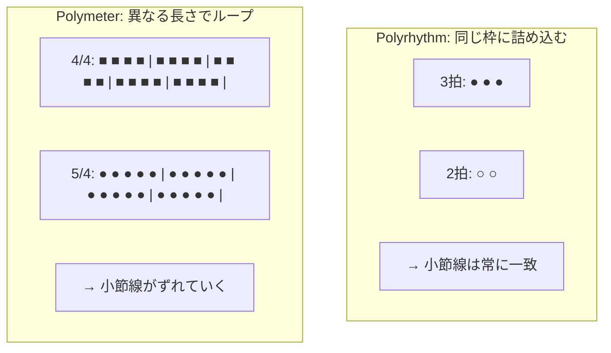
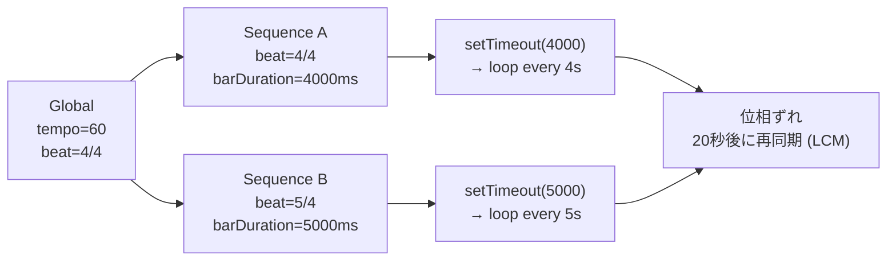

> **Note**: 本ページは 2026-05-05 時点での著者の reading の足跡です。code が真実、本ページはその時点の理解の snapshot に過ぎません。

# II-2. Polymeter / Polyrhythm

OrbitScore の特徴的な機能のひとつが **polymeter (ポリメーター)** です。複数のシーケンスが異なる拍子でループすることで、徐々にずれていく位相を音として楽しめます。本章では polymeter の数学的な意味と、OrbitScore がそれをどう実装しているかを見ていきます。

## Polymeter と Polyrhythm の違い

まず言葉の整理から始めましょう。

**Polyrhythm (ポリリズム)** は、同じ時間の中に複数の異なる「拍の分割」を当てはめることです。たとえば「3 対 2」のポリリズムでは、ある声部が 3 拍でひとまとまりを刻んでいる間に、別の声部が 2 拍でひとまとまりを刻みます。どちらも **同じ小節の終わりで揃います**。

**Polymeter (ポリメーター)** は、複数の声部がそれぞれ異なる長さの小節を持ち、それぞれの速さでループすることです。たとえば 4/4 でループするシーケンスと 5/4 でループするシーケンスを並べると、小節の境界がだんだんずれていきます。**再び揃うのはずっと先です**。

OrbitScore が実現するのは後者、**polymeter** です。



## 位相の数学: LCM と再同期

4/4 と 5/4 を tempo = 60 で並べた場合、何秒後に再び位相が揃うのでしょうか。

$$
\text{barDuration}_{4/4} = \frac{60000}{60} \times \frac{4}{4} \times 4 = 4000 \text{ ms}
$$

$$
\text{barDuration}_{5/4} = \frac{60000}{60} \times \frac{5}{4} \times 4 = 5000 \text{ ms}
$$

再同期するのは両方の barDuration の最小公倍数 (LCM) のときです。

$$
\text{LCM}(4000, 5000) = 20000 \text{ ms} = 20 \text{ 秒}
$$

4/4 シーケンスは 5 小節ループし、5/4 シーケンスは 4 小節ループした 20 秒後に、ふたたび同じ位置から始まります。

**ただし重要な注意点があります**: この LCM 計算は OrbitScore の **コードには存在しません**。各シーケンスが独立して自分のループを回した結果として、20 秒後に偶然同期する、という **創発的な性質** です。実装を読むと、その潔さがよく分かります。

## 実装: Sequence ごとに独立した barDuration

polymeter の核心は、`Sequence` が**自分専用の `Meter` を上書き設定できる**という仕組みにあります。実装は `core/sequence/parameters/tempo-manager.ts` の `calculateEventTiming()` メソッドです。

```typescript
// packages/engine/src/core/sequence/parameters/tempo-manager.ts:86-102
  calculateEventTiming(
    elements: PlayElement[],
    globalTempo: number,
    globalBeat: Meter,
  ): TimedEvent[] {
    const tempo = this._tempo || globalTempo
    const meter = this._beat || globalBeat

    // これにより、シーケンスごとに異なる拍子で1小節の長さを変えられる（ポリメーター）
    // 例: global.beat(4 by 4) = 2000ms, seq.beat(5 by 4) = 2500ms, seq.beat(9 by 8) = 2250ms
    const barDuration = this.calculateBarDuration(tempo, meter)

    // Apply length multiplier to bar duration (stretches each event)
    const effectiveBarDuration = barDuration * (this._length || 1)

    return calculateEventTiming(elements, effectiveBarDuration)
  }
```

注目すべきは `const meter = this._beat || globalBeat` の 1 行です。

- シーケンスが `beat()` を呼んでいる → `this._beat` が設定されている → シーケンス独自の Meter を使う
- シーケンスが `beat()` を呼んでいない → `this._beat` は `undefined` → `globalBeat` を使う

このフォールバックの仕組みにより、「beat を設定したシーケンスだけが独自の barDuration を持ち、未設定のシーケンスはグローバルの拍子に従う」という自然な挙動が生まれます。

同様に `calculatePatternDuration()` も同じロジックでパターン全体の長さを返します。

```typescript
// packages/engine/src/core/sequence/parameters/tempo-manager.ts:73-81
  calculatePatternDuration(globalTempo: number, globalBeat: Meter): number {
    const tempo = this._tempo || globalTempo
    const meter = this._beat || globalBeat
    const barDuration = this.calculateBarDuration(tempo, meter)

    // length() multiplies the duration of each event, not the number of bars
    // So the pattern duration is: 1 bar × length multiplier
    return barDuration * (this._length || 1)
  }
```

## DSL での記述方法

DSL では次のように書きます。

```js
global.tempo(60)
global.beat(4 by 4)        // グローバル: 4秒/小節

var kick = init global.seq
kick.beat(4 by 4)          // キック: グローバルと同じ 4秒/小節

var snare = init global.seq
snare.beat(5 by 4)         // スネア: 5秒/小節（グローバルより長い）
```

このとき kick は 4 秒ごとにパターンが戻り、snare は 5 秒ごとにパターンが戻ります。20 秒後に再び位相が揃います。

## Loop の仕組みと位相ずれの累積

各シーケンスは `loopSequence()` という関数でループを回します。その核心は `setTimeout` を使った自己再帰的なチェーンです。

```typescript
// packages/engine/src/core/sequence/playback/loop-sequence.ts:76-129 (mute->unmute 分岐の内部を // ... で省略)
  const scheduleNextIteration = () => {
    loopTimer = setTimeout(() => {
      const isMuted = getIsMutedFn()
      const isLooping = getIsLoopingFn()

      if (!isLooping) {
        return // Stop the loop
      }

      // Save the duration that this setTimeout was based on
      // (the setTimeout interval matched this value)
      const previousDuration = patternDuration

      // Recalculate pattern duration for the NEXT cycle
      // (may have changed due to tempo/beat/length changes)
      patternDuration = getPatternDurationFn()

      // Detect mute -> unmute transition
      if (wasMuted && !isMuted) {
        // ...
      } else if (!isMuted) {
        // Advance by the PREVIOUS duration (matches the setTimeout interval)
        // This keeps the bar boundary aligned with when the callback actually fired
        nextScheduleTime += previousDuration
        // Clear old scheduled events for this sequence before scheduling new ones
        clearSequenceEventsFn(sequenceName)
        scheduleEventsFn(scheduler, 0, nextScheduleTime)
      }

      // Update previous mute state for next iteration
      wasMuted = isMuted

      // Schedule next iteration with current pattern duration
      scheduleNextIteration()
    }, patternDuration)
    // Update stateManager with current timer ID so stop() can cancel it
    setLoopTimerFn?.(loopTimer)
  }
```

`setTimeout` の待機時間が `patternDuration` に設定されているため、シーケンスごとに異なる間隔でループが回ります。4/4 シーケンスは 4000ms ごと、5/4 シーケンスは 5000ms ごとに次の小節のイベントをスケジュールします。この非同期タイマーが独立して動くことで、位相のずれが自然に生まれます。

興味深い点として、`patternDuration = getPatternDurationFn()` はループごとに再計算されます。これは **テンポや拍子を再生中に変更した場合に次のループから反映される** という動的な挙動を実現しています。

## 位相変化のシミュレーション

4/4 と 5/4 を tempo = 60 で同時に走らせた場合の、最初 20 秒の位相関係を見てみましょう。

```mermaid
gantt
  title 4/4 と 5/4 の位相 (tempo = 60)
  dateFormat  X
  axisFormat  %ss

  section 4/4 (4秒/小節)
  Bar 1    :0, 4000
  Bar 2    :4000, 8000
  Bar 3    :8000, 12000
  Bar 4    :12000, 16000
  Bar 5    :16000, 20000

  section 5/4 (5秒/小節)
  Bar 1    :0, 5000
  Bar 2    :5000, 10000
  Bar 3    :10000, 15000
  Bar 4    :15000, 20000
```



縦の境界を見ると、0 秒と 20 秒だけで小節線が重なっているのが分かります。それ以外の時刻では、ふたつのシーケンスは互いに「ずれた」関係にあります。

## 現在の実装状況と今後の仕様

BEAT_METER_SPECIFICATION.md では 2 つのフェーズが定義されています。

**Phase 1 (現在)**: 分母に制限なし。任意の正の数値を受け付け、数学的に正しく計算する。

**Phase 2 (将来)**: 分母を `1, 2, 4, 8, 16, 32, 64, 128` (2 の冪) に制限する。音楽理論の枠組みを維持し、MIDI との整合性を確保するため。

現在の実装では `TempoManager.setBeat()` は任意の分母を受け付けます。

```typescript
// packages/engine/src/core/sequence/parameters/tempo-manager.ts:28-30
  setBeat(numerator: number, denominator: number): void {
    this._beat = { numerator, denominator }
  }
```

分母のバリデーションは存在せず、`beat(7 by 6)` のような音楽理論的に非標準な拍子も計算上は動作します。

## Polyrhythm との実装的違い

ここで polyrhythm との実装的な違いを改めて確認しておきましょう。

もし OrbitScore が polyrhythm を実現したいなら、「同じ barDuration の中に異なる数のイベントを詰め込む」必要があります。しかし現在の `calculateEventTiming()` は、barDuration を等分してイベントを配置します。

```typescript
// packages/engine/src/timing/calculation/calculate-event-timing.ts:34-35
  // Calculate duration for each element at this level
  const elementDuration = barDuration / elements.length
```

たとえば `seq.play(1, 2, 3)` は barDuration を 3 等分し、`seq.play(1, 2, 3, 4)` は 4 等分します。これは **各シーケンスが自分の barDuration を均等に分割する** という一貫したルールです。

したがって OrbitScore での「拍の数が違うふたつのパターン」は、barDuration が異なる = polymeter に自然に帰着します。厳密な意味での polyrhythm (同じ小節枠に異なる分割) は現在の設計では直接には実現されません。

## まとめ

OrbitScore の polymeter は、実装を見ると驚くほどシンプルな構造になっています。



「各シーケンスが独自の barDuration を計算し、その長さの setTimeout でループを回す」というシンプルな設計が、polymeter という音楽的に豊かな挙動を生み出しています。LCM による再同期は意図して実装されたものではなく、独立したタイマーが生み出す創発的な性質です。

## 関連用語

- [DSL](/glossary#dsl) — OrbitScore が定義するドメイン固有言語。`beat(n by m)` 構文でシーケンスごとの拍子を指定する
- [chop](/glossary#chop) — オーディオファイルを等分割するメソッド。chop 数が barDuration の分割単位となる
- [play パターン](/glossary#play-パターン) — サンプルのトリガー列。polymeter では各シーケンスが独立した長さのパターンを持つ

## 次の深掘り候補

- `setInterval` ではなく `setTimeout` の自己再帰チェーンを使う理由 (ループ途中での `patternDuration` 変更への対応)
- `nextScheduleTime += previousDuration` のドリフト補正ロジックの精度 (累積誤差への影響)
- 3 つ以上のシーケンスで異なる拍子を持つ場合の LCM 計算 (例: 3/4、4/4、5/4 なら LCM = 60 秒)
- Phase 2 の分母バリデーション実装時の Parser 修正箇所の予測 (`parse-expression.ts` での validDenominators チェック)
- mute / unmute 時の位相リセットのない seamless 再開ロジック (`scheduleEventsFromTimeFn` と `reinitializeSequenceTracking`)

## Sources

- `packages/engine/src/core/sequence/parameters/tempo-manager.ts:86-102` — `calculateEventTiming()`: シーケンス独自の meter を `globalBeat` にフォールバックする核心ロジック
- `packages/engine/src/core/sequence/parameters/tempo-manager.ts:73-81` — `calculatePatternDuration()`: パターン全体の長さ計算 (length 修飾子込み)
- `packages/engine/src/core/sequence/parameters/tempo-manager.ts:64-68` — `calculateBarDuration()`: tempo + meter → ms の変換式
- `packages/engine/src/core/sequence/parameters/tempo-manager.ts:28-30` — `setBeat()`: 現在は分母バリデーションなし
- `packages/engine/src/core/sequence/playback/loop-sequence.ts:76-129` — `scheduleNextIteration()`: setTimeout チェーンによるループと patternDuration の動的再計算
- `packages/engine/src/timing/calculation/calculate-event-timing.ts:34-35` — `barDuration / elements.length` による均等分割
- `packages/engine/src/core/global/types.ts:5-8` — `Meter` interface
- [BEAT_METER_SPECIFICATION.md](https://github.com/signalcompose/orbitscore/blob/main/docs/development/BEAT_METER_SPECIFICATION.md) — Phase 1/2 の仕様と将来の分母制約計画、ICMC 実績の polymeter 例 (4/4 vs 5/4)
