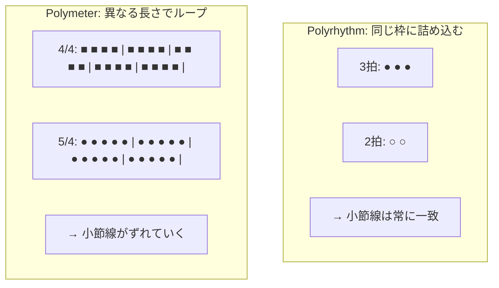
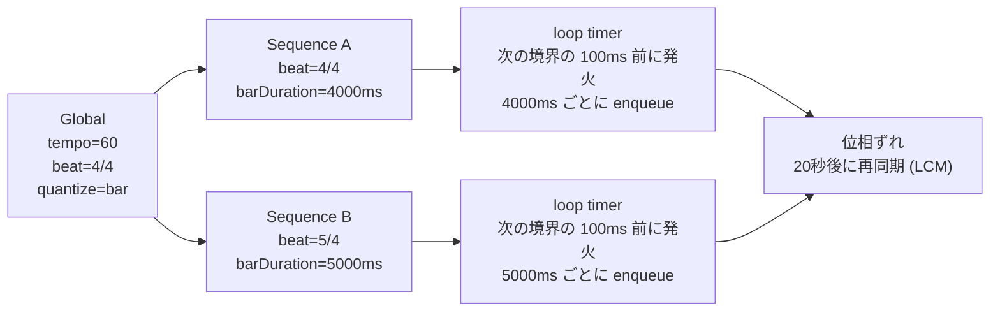

> **Note**: 本ページは 2026-09-01 時点での著者の reading の足跡です。code が真実、本ページはその時点の理解の snapshot に過ぎません。

# II-2. Polymeter / Polyrhythm

OrbitScore の特徴的な機能のひとつが **polymeter (ポリメーター)** です。複数のシーケンスが異なる拍子でループすることで、徐々にずれていく位相を音として楽しめます。本章では polymeter の数学的な意味と、OrbitScore がそれをどう実装しているかを見ていきます。

## 2026-09-01 の再検証メモ

本章は 2026-05-05 (0a4b598) に書いた内容を 2026-09-01 (69dc968) の code に突き合わせて更新したものです。polymeter の核心 (`Sequence` ごとの `_beat || globalBeat` フォールバックと、シーケンスごとに独立したループタイマー) は変わっていません。大きく変わったのはループタイマーの**再アームの仕方**です:

- 2026-07-07 の #389 で、`setTimeout(patternDuration)` を素朴に再アームする方式から、**絶対グリッドから逆算した delay で境界の 100ms 前に発火する**方式 (`LOOP_TIMER_LEAD_MS`) に変わりました。2026-05 版の本章が「次の深掘り候補」に挙げていた「`nextScheduleTime += previousDuration` のドリフト補正の精度」は、まさにこの修正で扱われた問題です
- launch quantize (`global.quantize()` / `seq.quantize()`、#212 / PR #215) により、`seq.loop()` の最初の 1 小節は**グローバルの小節境界**に揃えて開始されるようになりました。polymeter との関係で重要なので、本章でも触れます
- `calculateEventTiming()` の末尾に #390 (live playhead) のコメントが入り、行番号がずれました

## Polymeter と Polyrhythm の違い

まず言葉の整理から始めましょう。

**Polyrhythm (ポリリズム)** は、同じ時間の中に複数の異なる「拍の分割」を当てはめることです。たとえば「3 対 2」のポリリズムでは、ある声部が 3 拍でひとまとまりを刻んでいる間に、別の声部が 2 拍でひとまとまりを刻みます。どちらも **同じ小節の終わりで揃います**。

**Polymeter (ポリメーター)** は、複数の声部がそれぞれ異なる長さの小節を持ち、それぞれの速さでループすることです。たとえば 4/4 でループするシーケンスと 5/4 でループするシーケンスを並べると、小節の境界がだんだんずれていきます。**再び揃うのはずっと先です**。

OrbitScore が実現するのは後者、**polymeter** です。


```mermaid
flowchart TB
  subgraph PR["Polyrhythm: 同じ枠に詰め込む"]
    direction LR
    P3["3拍: ● ● ●"]
    P2["2拍: ○ ○"]
    PNote["→ 小節線は常に一致"]
  end
  subgraph PM["Polymeter: 異なる長さでループ"]
    direction LR
    M4["4/4: ■ ■ ■ ■ | ■ ■ ■ ■ | ■ ■ ■ ■ | ■ ■ ■ ■ | ■ ■ ■ ■ |"]
    M5["5/4: ● ● ● ● ● | ● ● ● ● ● | ● ● ● ● ● | ● ● ● ● ● |"]
    PMNote["→ 小節線がずれていく"]
  end
```

## 位相の数学: LCM と再同期

4/4 と 5/4 を tempo = 60 で並べた場合、何秒後に再び位相が揃うのでしょうか。

$$
\text{barDuration}_{4/4} = \frac{60000}{60} \times \frac{4}{4} \times 4 = 4000 \text{ ms}
$$

$$
\text{barDuration}_{5/4} = \frac{60000}{60} \times \frac{5}{4} \times 4 = 5000 \text{ ms}
$$

再同期するのは両方の barDuration の最小公倍数 (LCM) のときです。

$$
\text{LCM}(4000, 5000) = 20000 \text{ ms} = 20 \text{ 秒}
$$

4/4 シーケンスは 5 小節ループし、5/4 シーケンスは 4 小節ループした 20 秒後に、ふたたび同じ位置から始まります。

**ただし重要な注意点があります**: この LCM 計算は OrbitScore の **コードには存在しません**。各シーケンスが独立して自分のループを回した結果として、20 秒後に偶然同期する、という **創発的な性質** です。実装を読むと、その潔さがよく分かります。

## 実装: Sequence ごとに独立した barDuration

polymeter の核心は、`Sequence` が**自分専用の `Meter` を上書き設定できる**という仕組みにあります。実装は `core/sequence/parameters/tempo-manager.ts` の `calculateEventTiming()` メソッドです。

```typescript
// packages/engine/src/core/sequence/parameters/tempo-manager.ts:86-105
  calculateEventTiming(
    elements: PlayElement[],
    globalTempo: number,
    globalBeat: Meter,
  ): TimedEvent[] {
    const tempo = this._tempo || globalTempo
    const meter = this._beat || globalBeat

    // これにより、シーケンスごとに異なる拍子で1小節の長さを変えられる（ポリメーター）
    // 例: global.beat(4 by 4) = 2000ms, seq.beat(5 by 4) = 2500ms, seq.beat(9 by 8) = 2250ms
    const barDuration = this.calculateBarDuration(tempo, meter)

    // Apply length multiplier to bar duration (stretches each event)
    const effectiveBarDuration = barDuration * (this._length || 1)

    // #390 live playhead: each event carries its full argPath ("1.0" for
    // nested slots) — tagged inside the timing walk itself (see
    // calculateEventTiming's argPathPrefix). Observational only.
    return calculateEventTiming(elements, effectiveBarDuration)
  }
```

注目すべきは `const meter = this._beat || globalBeat` の 1 行です。

- シーケンスが `beat()` を呼んでいる → `this._beat` が設定されている → シーケンス独自の Meter を使う
- シーケンスが `beat()` を呼んでいない → `this._beat` は `undefined` → `globalBeat` を使う

このフォールバックの仕組みにより、「beat を設定したシーケンスだけが独自の barDuration を持ち、未設定のシーケンスはグローバルの拍子に従う」という自然な挙動が生まれます。

同様に `calculatePatternDuration()` も同じロジックでパターン全体の長さを返します。

```typescript
// packages/engine/src/core/sequence/parameters/tempo-manager.ts:73-81
  calculatePatternDuration(globalTempo: number, globalBeat: Meter): number {
    const tempo = this._tempo || globalTempo
    const meter = this._beat || globalBeat
    const barDuration = this.calculateBarDuration(tempo, meter)

    // length() multiplies the duration of each event, not the number of bars
    // So the pattern duration is: 1 bar × length multiplier
    return barDuration * (this._length || 1)
  }
```

## DSL での記述方法

DSL では次のように書きます。

```js
global.tempo(60)
global.beat(4 by 4)        // グローバル: 4秒/小節

var kick = init global.seq
kick.beat(4 by 4)          // キック: グローバルと同じ 4秒/小節

var snare = init global.seq
snare.beat(5 by 4)         // スネア: 5秒/小節（グローバルより長い）
```

このとき kick は 4 秒ごとにパターンが戻り、snare は 5 秒ごとにパターンが戻ります。20 秒後に再び位相が揃います。

## Loop の仕組み: グリッドに錨を下ろした setTimeout チェーン

各シーケンスは `loopSequence()` という関数でループを回します。その核心は `setTimeout` を使った自己再帰的なチェーンです。ただし 2026-07-07 の #389 以降、「次の setTimeout を何 ms 後に仕掛けるか」の決め方が大きく変わりました。まずはファイル冒頭の定数とその説明を見てみましょう。

```typescript
// packages/engine/src/core/sequence/playback/loop-sequence.ts:3-14
/**
 * How far BEFORE a bar boundary the loop timer fires (#389 mechanism A).
 *
 * setTimeout never fires early, so a timer aimed exactly AT the boundary
 * fires late by the event-loop's current lag — and the bar-head event it
 * enqueues (time = boundary) is already in the past, dispatching immediately
 * and audibly late. Firing with this lead keeps every enqueued event in the
 * future, so the scheduler's 1ms poll releases it ON the grid. The lead also
 * absorbs ordinary callback jitter; it only needs to cover event-loop lag,
 * not the audio path (the daemon has its own lookahead).
 */
export const LOOP_TIMER_LEAD_MS = 100
```

ポイントは「`setTimeout` は決して早くは発火しない」という性質です。小節境界ちょうどを狙ってタイマーを仕掛けると、イベントループの遅れの分だけ必ず**遅れて**発火し、そのとき enqueue する小節頭のイベント (`time = 境界`) はすでに過去になっています。過去のイベントはポーリングループが即座に dispatch するので、小節頭だけが可聴レベルで遅れる、という構造的な問題がありました。WORK_LOG 6.198 の実測では、この遅れは 1 小節あたり約 +0.19ms ずつ単調に蓄積していました。

そこで #389 は、境界の **100ms 前**にタイマーを発火させ、次の小節のイベントを「未来」として enqueue するようにしました。delay の計算は `armDelay()` に集約されています。

```typescript
// packages/engine/src/core/sequence/playback/loop-sequence.ts:152-162
  const armDelay = (boundary: number): number => {
    const leadMs = Math.min(LOOP_TIMER_LEAD_MS, patternDuration / 2)
    const raw = boundary + patternDuration - leadMs - (Date.now() - scheduler.startTime)
    if (raw < -patternDuration && Date.now() - lastLagLogMs > 5000) {
      lastLagLogMs = Date.now()
      console.warn(
        `⚠️ ${sequenceName}: loop timer lagged ${Math.round(-raw)}ms behind the grid (system stall?) — catching up; stale bars may be skipped`,
      )
    }
    return Math.max(0, raw)
  }
```

`raw = (次の境界) − lead − (今の相対時刻)` という式が要点です。`boundary` は「いま enqueue した小節の基準時刻」、`boundary + patternDuration` が次の境界で、そこから `leadMs` を引いた時刻までの残り時間を**毎回 `Date.now()` から計算し直す**ので、コールバックが遅れてもその遅れは次の delay に持ち越されません (絶対グリッドへの錨)。`Math.min(LOOP_TIMER_LEAD_MS, patternDuration / 2)` は、パターンが 100ms 未満の極端に短いケースで delay が常に 0 になる退化を防ぐための保護です。`Math.max(0, raw)` は OS のスリープや GC で大きく遅れたときの追いつき経路で、この場合は小節単位で即時に再発火し、古い小節はスケジューラー側の drift ガード ([II-3](/scheduling/event-queue) で扱います) が捨てます。

その `armDelay()` を使って自己再帰するのが `scheduleNextIteration()` です。

```typescript
// packages/engine/src/core/sequence/playback/loop-sequence.ts:164-225 (mute->unmute 分岐の内部を // ... で省略)
  const scheduleNextIteration = (delayMs: number) => {
    loopTimer = setTimeout(() => {
      const isMuted = getIsMutedFn()
      const isLooping = getIsLoopingFn()

      if (!isLooping) {
        return // Stop the loop
      }

      // Save the duration that this setTimeout was based on
      // (the setTimeout interval matched this value)
      const previousDuration = patternDuration

      // Recalculate pattern duration for the NEXT cycle
      // (may have changed due to tempo/beat/length changes)
      patternDuration = getPatternDurationFn()

      // Detect mute -> unmute transition
      if (wasMuted && !isMuted) {
        // ...
      } else if (!isMuted) {
        // Advance by the PREVIOUS duration (matches the setTimeout interval)
        // This keeps the bar boundary aligned with when the callback actually fired
        nextScheduleTime += previousDuration
        // Clear old scheduled events for this sequence before scheduling new ones
        clearSequenceEventsFn(sequenceName)
        safeSchedule(() => scheduleEventsFn(scheduler, 0, nextScheduleTime))
      }

      // Update previous mute state for next iteration
      wasMuted = isMuted

      // Re-arm anchored to the absolute grid (#389 mechanism A): the delay is
      // recomputed from the NEXT boundary minus now, so a late callback does
      // not push every subsequent one later (the old fixed-patternDuration
      // re-arm accumulated ~+0.2ms/bar forever). While muted there is nothing
      // scheduled and nextScheduleTime is deliberately stale (the unmute
      // branch re-baselines it), so a plain idle wait avoids a negative-delay
      // hot loop.
      if (isMuted) {
        scheduleNextIteration(patternDuration)
      } else {
        scheduleNextIteration(armDelay(nextScheduleTime))
      }
    }, delayMs)
    // Update stateManager with current timer ID so stop() can cancel it
    setLoopTimerFn?.(loopTimer)
  }
```

polymeter の観点で大事なのは、`nextScheduleTime += previousDuration` で小節の基準時刻が**シーケンスごとの `patternDuration`** だけ進む点です。4/4 シーケンスは 4000ms ごと、5/4 シーケンスは 5000ms ごとに次の小節のイベントを enqueue します。この独立したタイマーが並走することで、位相のずれが自然に生まれます。

`patternDuration = getPatternDurationFn()` はループごとに再計算されます。これは **テンポや拍子を再生中に変更した場合に次のループから反映される** という動的な挙動を実現しています。`previousDuration` を別に保存しているのは、「この setTimeout が仕掛けられたときの長さ」で基準時刻を進めるためで、変更後の長さは次の `armDelay()` から効きます。

もうひとつ、2026-05 版には無かった `safeSchedule()` というラッパーが挟まっています。`setTimeout` の中で起きた例外や reject は誰も await していないので、そのままではプロセスのクラッシュ (Node 22 以降は unhandled rejection が致命的) になります。ループ中に `play()` を差し替えて不正な度数が入ったようなケースを、ログを出しつつループを生かしたまま (直前の正常なスケジュールで) やり過ごすための保護です。

## quantize と polymeter: 最初の 1 小節だけはグローバルに揃う

launch quantize (`global.quantize("bar")` が既定) が入ったことで、`seq.loop()` の**最初の小節の開始時刻**はシーケンス自身の拍子ではなく、**グローバルの `tempo()` × `beat()` が作る小節境界**に揃えられます。`loopSequence()` はそれを `startTime` オプションで受け取ります。

```typescript
// packages/engine/src/core/sequence/playback/loop-sequence.ts:84-104
  // Quantized start: if startTime is in the future, the first iteration is
  // scheduled at startTime and the first wait is reduced from one full
  // patternDuration to (patternDuration - leadIn) so subsequent boundaries
  // stay on startTime + n × patternDuration.
  const effectiveStart =
    startTime !== undefined && startTime > currentTime ? startTime : currentTime
  const leadInMs = effectiveStart - currentTime

  if (leadInMs > 0) {
    console.log(
      `🔄 ${sequenceName} (loop queued, +${Math.round(leadInMs)}ms to next quantize boundary)`,
    )
  } else {
    console.log(`🔄 ${sequenceName} (loop started)`)
  }

  // Track next scheduled time (cumulative, to avoid drift)
  let nextScheduleTime = effectiveStart

  // Schedule first iteration at the quantized start
  scheduleEventsFn(scheduler, 0, nextScheduleTime)
```

`startTime` を渡しているのは `Sequence.loop()` で、`nextQuantizedTime()` (グローバルの tempo と beat から計算) の結果です。

```typescript
// packages/engine/src/core/sequence.ts:1828-1836
    // Quantize the loop start to the next bar boundary on the master grid so
    // newly-started LOOPs slot in cleanly with whatever is already running.
    const startTime = this.nextQuantizedTime(currentTime)

    const result = loopSequence({
      sequenceName: this.stateManager.getName(),
      scheduler,
      currentTime,
      startTime,
```

つまり polymeter の「4/4 と 5/4 が 20 秒後に揃う」という説明は、**両方のシーケンスが同じグローバル小節境界から出発した**場合に成り立ちます。core spec (INSTRUCTION_ORBITSCORE_DSL.md §5) もこの点を明記していて、「`seq.beat(5 by 4)` のような per-seq meter override がある場合でも、グローバル小節境界が起動の基準」であり、シーケンス自身の小節境界に揃えるオプションは post-1.1 の検討事項とされています。出発点を揃えたあとは、各シーケンスが自分の `patternDuration` で独立に進むので、位相のずれと LCM での再同期は 2026-05 版の説明どおりです。

## 位相変化のシミュレーション

4/4 と 5/4 を tempo = 60 で同時に走らせた場合の、最初 20 秒の位相関係を見てみましょう。


```mermaid
gantt
  title 4/4 と 5/4 の位相 (tempo = 60)
  dateFormat  X
  axisFormat  %ss

  section 4/4 (4秒/小節)
  Bar 1    :0, 4000
  Bar 2    :4000, 8000
  Bar 3    :8000, 12000
  Bar 4    :12000, 16000
  Bar 5    :16000, 20000

  section 5/4 (5秒/小節)
  Bar 1    :0, 5000
  Bar 2    :5000, 10000
  Bar 3    :10000, 15000
  Bar 4    :15000, 20000
```

縦の境界を見ると、0 秒と 20 秒だけで小節線が重なっているのが分かります。それ以外の時刻では、ふたつのシーケンスは互いに「ずれた」関係にあります。

## 実装状況と BEAT_METER_SPECIFICATION の Phase

BEAT_METER_SPECIFICATION.md では 2 つのフェーズが定義されています。

**Phase 1 (2026-09-01 時点の実装)**: 分母に制限なし。任意の正の数値を受け付け、数学的に正しく計算する。

**Phase 2 (未実装)**: 分母を `1, 2, 4, 8, 16, 32, 64, 128` (2 の冪) に制限する。音楽理論の枠組みを維持し、MIDI との整合性を確保するため。

2026-09-01 時点の `TempoManager.setBeat()` は任意の分母を受け付けます。

```typescript
// packages/engine/src/core/sequence/parameters/tempo-manager.ts:28-30
  setBeat(numerator: number, denominator: number): void {
    this._beat = { numerator, denominator }
  }
```

分母のバリデーションは存在せず、`beat(7 by 6)` のような音楽理論的に非標準な拍子も計算上は動作します。

## Polyrhythm との実装的違い

ここで polyrhythm との実装的な違いを改めて確認しておきましょう。

もし OrbitScore が polyrhythm を実現したいなら、「同じ barDuration の中に異なる数のイベントを詰め込む」必要があります。しかし `calculateEventTiming()` は、barDuration を等分してイベントを配置します。

```typescript
// packages/engine/src/timing/calculation/calculate-event-timing.ts:104-105
  // Calculate duration for each element at this level
  const elementDuration = barDuration / elements.length
```

たとえば `seq.play(1, 2, 3)` は barDuration を 3 等分し、`seq.play(1, 2, 3, 4)` は 4 等分します。これは **各シーケンスが自分の barDuration を均等に分割する** という一貫したルールです。

したがって OrbitScore での「拍の数が違うふたつのパターン」は、barDuration が異なる = polymeter に自然に帰着します。厳密な意味での polyrhythm (同じ小節枠に異なる分割) は 2026-09-01 時点の設計では直接には実現されません。ただし `seq.play([1, 2, 3], [1, 2])` のようにネストを使えば、1 小節を 2 等分したうえで前半を 3 分割・後半を 2 分割できるので、「小節の中で 3 対 2」に近い書き方は可能です (ネストは親スロットの `elementDuration` をさらに等分します)。

## まとめ

OrbitScore の polymeter は、実装を見ると驚くほどシンプルな構造になっています。


```mermaid
flowchart LR
  G["Global\ntempo=60\nbeat=4/4\nquantize=bar"] --> S1["Sequence A\nbeat=4/4\nbarDuration=4000ms"]
  G --> S2["Sequence B\nbeat=5/4\nbarDuration=5000ms"]
  S1 --> L1["loop timer\n次の境界の 100ms 前に発火\n4000ms ごとに enqueue"]
  S2 --> L2["loop timer\n次の境界の 100ms 前に発火\n5000ms ごとに enqueue"]
  L1 --> PHASE["位相ずれ\n20秒後に再同期 (LCM)"]
  L2 --> PHASE
```

「各シーケンスが独自の barDuration を計算し、その長さぶん基準時刻を進めながら、グリッドに錨を下ろした setTimeout でループを回す」というシンプルな設計が、polymeter という音楽的に豊かな挙動を生み出しています。LCM による再同期は意図して実装されたものではなく、独立したタイマーが生み出す創発的な性質です。launch quantize は出発点をグローバルの小節境界に揃えるだけで、その後の独立性には手を触れません。

## 関連用語

- [DSL](/glossary#dsl) — OrbitScore が定義するドメイン固有言語。`beat(n by m)` 構文でシーケンスごとの拍子を指定する
- [chop](/glossary#chop) — オーディオファイルを等分割するメソッド。chop 数が barDuration の分割単位となる
- [play パターン](/glossary#play-パターン) — サンプルのトリガー列。polymeter では各シーケンスが独立した長さのパターンを持つ

## 次の深掘り候補

- `setInterval` ではなく `setTimeout` の自己再帰チェーンを使う理由 (ループ途中での `patternDuration` 変更への対応) と、#389 のグリッドアンカー化がそれをどう補強したか
- 3 つ以上のシーケンスで異なる拍子を持つ場合の LCM 計算 (例: 3/4、4/4、5/4 なら LCM = 60 秒)
- Phase 2 の分母バリデーション実装時の Parser 修正箇所の予測 (`parse-expression.ts` での validDenominators チェック)
- mute / unmute 時の位相リセットのない seamless 再開ロジック (`scheduleEventsFromTimeFn` と `reinitializeSequenceTracking`)
- `armDelay()` の `Math.max(0, raw)` による追いつき経路と、スケジューラー側の `MAX_DRIFT_MS` (1000ms) ガードの組み合わせで、スリープ明けに何小節が捨てられるか
- `seq.quantize("off")` を使って polymeter のシーケンスをグローバル境界と無関係に出発させた場合、LCM の再同期点がどこに移るか
- `safeSchedule()` がループを生かしたまま握りつぶす例外の種類 (§2.1 の度数拒否など) と、それがログにどう現れるか

## Sources

- `packages/engine/src/core/sequence/parameters/tempo-manager.ts:86-105` — `calculateEventTiming()`: シーケンス独自の meter を `globalBeat` にフォールバックする核心ロジック
- `packages/engine/src/core/sequence/parameters/tempo-manager.ts:73-81` — `calculatePatternDuration()`: パターン全体の長さ計算 (length 修飾子込み)
- `packages/engine/src/core/sequence/parameters/tempo-manager.ts:64-68` — `calculateBarDuration()`: tempo + meter → ms の変換式
- `packages/engine/src/core/sequence/parameters/tempo-manager.ts:28-30` — `setBeat()`: 分母バリデーションなし
- `packages/engine/src/core/sequence/playback/loop-sequence.ts:3-14` — `LOOP_TIMER_LEAD_MS` (100ms) と #389 機構 A の説明
- `packages/engine/src/core/sequence/playback/loop-sequence.ts:84-104` — quantized start (`startTime` オプション) の扱い
- `packages/engine/src/core/sequence/playback/loop-sequence.ts:145-155` — `armDelay()`: 絶対グリッドから逆算する再アーム delay
- `packages/engine/src/core/sequence/playback/loop-sequence.ts:157-218` — `scheduleNextIteration()`: setTimeout チェーンによるループと patternDuration の動的再計算
- `packages/engine/src/core/sequence.ts:1747-1755` — `Sequence.loop()`: `nextQuantizedTime()` の結果を `startTime` として渡す
- `packages/engine/src/core/global/quantize-manager.ts:56-73` — `nextQuantizedTime()`: グローバル tempo/beat からの次の境界計算
- `packages/engine/src/timing/calculation/calculate-event-timing.ts:104-105` — `barDuration / elements.length` による均等分割
- `packages/engine/src/core/global/types.ts:5-8` — `Meter` interface
- `docs/core/INSTRUCTION_ORBITSCORE_DSL.md` §5 "Launch Quantize" — 「ポリメーター時の挙動」(グローバル小節境界が起動の基準)
- `docs/archive/WORK_LOG_2026-07.md` 6.198 — #389 の実測 (fix 前 +0.19ms/小節の蓄積、fix 後 mean|dev| 0.52ms)
- Issue [#389](https://github.com/signalcompose/orbitscore/issues/389) — sawtooth timing jitter (グリッドアンカー化の経緯)
- Issue [#212](https://github.com/signalcompose/orbitscore/issues/212) / PR [#215](https://github.com/signalcompose/orbitscore/pull/215) — launch quantize
- [BEAT_METER_SPECIFICATION.md](https://github.com/signalcompose/orbitscore/blob/main/docs/development/BEAT_METER_SPECIFICATION.md) — Phase 1/2 の仕様と将来の分母制約計画、ICMC 実績の polymeter 例 (4/4 vs 5/4)
