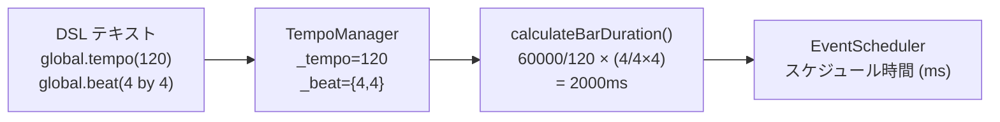
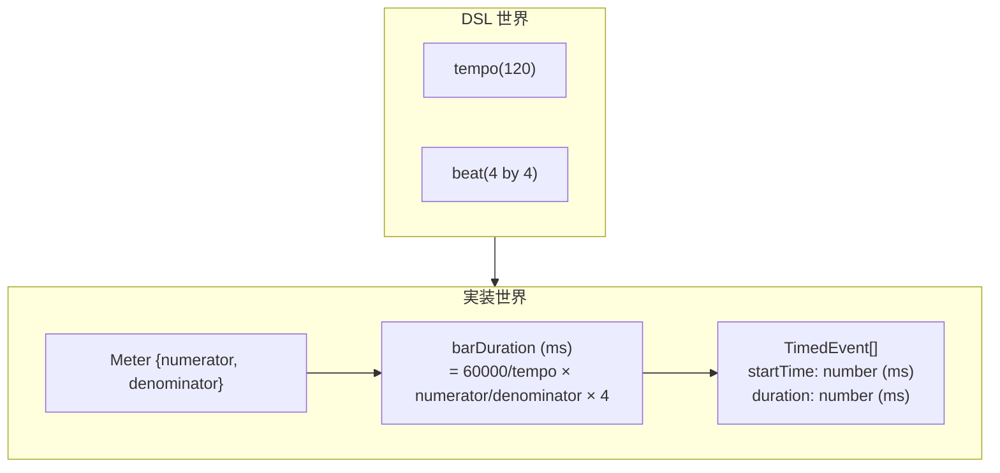

> **Note**: 本ページは 2026-05-05 時点での著者の reading の足跡です。code が真実、本ページはその時点の理解の snapshot に過ぎません。

# II-1. 時間表現

OrbitScore は音楽を「いつ音を出すか」という問いに答えながら動きます。その答えを作るためには、**tempo・beat・bar** という概念を計算できる形に変換する必要があります。本章では、DSL の `global.tempo(120)` や `global.beat(4 by 4)` という記述がどのように内部で時間 (ms) に変換されるのか、実装を追って確認します。

## 基本的な時間の単位

OrbitScore の時間表現には 3 つの概念的な単位があります。

| 概念 | 説明 | 単位 |
|---|---|---|
| **tempo** | 1 分間に刻む 4 分音符の回数 (BPM) | bpm |
| **beat / meter** | 1 小節の拍の構成 (分子 / 分母) | — |
| **bar duration** | 1 小節の実時間の長さ | ms |

DSL ユーザーが見る世界は tempo と beat で記述されていますが、スケジューラーが扱う世界はすべて **ms 単位の浮動小数点数** です。

## Meter 型: 拍子の数値表現

拍子の情報は `Meter` という interface で表現されています。

```typescript
// packages/engine/src/core/global/types.ts:5-8
export interface Meter {
  numerator: number
  denominator: number
}
```

`numerator` (分子) と `denominator` (分母) をそれぞれ整数として持ちます。たとえば 4/4 拍子なら `{ numerator: 4, denominator: 4 }`、5/4 拍子なら `{ numerator: 5, denominator: 4 }` です。

ここで注目したいのは、`Meter` 型はあくまで「DSL の `beat(n1 by n2)` を構造化した入れ物」であって、**OrbitScore は有理数型を使っていない**という点です。`Fraction` や `Rational` という専用クラスは存在せず、分子・分母を整数で保持したあと、すぐに浮動小数点数の ms に変換します。

> NOTE: unverified — 将来のバージョンで有理数ライブラリを導入する計画があるかどうかは docs を確認していない。BEAT_METER_SPECIFICATION.md は計算例をすべて float で示しており、現在は有理数型を使わない設計であることが読み取れる。

## Global の Tempo 管理

`Global` クラスの tempo と beat は `TempoManager` に委譲されています。

```typescript
// packages/engine/src/core/global/tempo-manager.ts:1-36
/**
 * Tempo and meter management for Global class
 */

import { Meter } from './types'

export class TempoManager {
  private _tempo: number = 120
  private _beat: Meter = { numerator: 4, denominator: 4 }

  // Note: tick and key have been removed
  // - tick: MIDI resolution, not needed for audio implementation
  // - key: Will be added when MIDI support is implemented

  // Property accessors with method chaining
  tempo(value?: number): number | this {
    if (value === undefined) {
      return this._tempo
    }
    this._tempo = value
    return this
  }

  beat(numerator: number, denominator: number): this {
    this._beat = { numerator, denominator }
    return this
  }

  // Get current state
  getState() {
    return {
      tempo: this._tempo,
      beat: this._beat,
    }
  }
}
```

デフォルト値は `tempo = 120`、`beat = 4/4` です。`tempo()` や `beat()` メソッドは **method chaining** を可能にするため `this` を返します。

## bar duration の計算式

tempo と meter が決まれば、1 小節の長さ (bar duration) を ms で計算できます。計算ロジックは `Sequence` の `TempoManager` に実装されています。

```typescript
// packages/engine/src/core/sequence/parameters/tempo-manager.ts:64-68
  private calculateBarDuration(tempo: number, meter: Meter): number {
    // 1小節の長さ = 4分音符の長さ × (分子 / 分母 × 4)
    const quarterNoteDuration = 60000 / tempo
    return quarterNoteDuration * ((meter.numerator / meter.denominator) * 4)
  }
```

この式を数式で表すと次のようになります。

$$
\text{quarterNote} = \frac{60000}{\text{tempo}} \text{ (ms)}
$$

$$
\text{barDuration} = \text{quarterNote} \times \frac{\text{numerator}}{\text{denominator}} \times 4 \text{ (ms)}
$$

具体例でイメージしてみましょう。

### 計算例

**例1: tempo = 60、beat = 4/4**

```
quarterNote = 60000 / 60 = 1000ms
barDuration = 1000 × (4 / 4 × 4) = 4000ms
→ 1拍 = 1秒、1小節 = 4秒
```

**例2: tempo = 60、beat = 5/4**

```
quarterNote = 60000 / 60 = 1000ms
barDuration = 1000 × (5 / 4 × 4) = 5000ms
→ 1拍 = 1秒、1小節 = 5秒
```

**例3: tempo = 120、beat = 7/8**

```
quarterNote = 60000 / 120 = 500ms
barDuration = 500 × (7 / 8 × 4) = 500 × 3.5 = 1750ms
→ 1拍（8分音符）= 250ms、1小節 = 1.75秒
```

数式の `× 4` は「基準が 4 分音符」という意味です。分母が 4 なら 4 分音符で割る、分母が 8 なら 8 分音符で割る、という拍子記号の音楽的意味をそのまま計算しています。

## 一般化した計算フロー



DSL から EventScheduler に至るまで、時間は一度も「拍数」や「tick 数」という単位に変換されません。すべて **ms 単位の浮動小数点数**として一貫して流れます。

## バーオフセット: 絶対時間への変換

bar duration が決まれば、n 番目の小節の開始時刻は次の関数で計算できます。

```typescript
// packages/engine/src/timing/calculation/convert-to-absolute-timing.ts:18-29
export function convertToAbsoluteTiming(
  events: TimedEvent[],
  barNumber: number,
  barDuration: number,
): TimedEvent[] {
  const barOffset = barNumber * barDuration

  return events.map((event) => ({
    ...event,
    startTime: event.startTime + barOffset,
  }))
}
```

`barOffset = barNumber × barDuration` を各イベントの `startTime` に加算するだけです。シンプルですが、これが「小節内の相対時刻」から「スケジューラーが使う絶対時刻」への橋渡しになっています。

## TimedEvent: スケジューラーの基本単位

タイミング計算の中間結果は `TimedEvent` という型で表現されています。

```typescript
// packages/engine/src/timing/calculation/types.ts:8-13
export interface TimedEvent {
  sliceNumber: number // 0 for silence, 1-n for slice
  startTime: number // Start time in milliseconds relative to bar start
  duration: number // Duration in milliseconds
  depth: number // Nesting depth (for debugging)
}
```

`startTime` と `duration` はどちらも ms です。`sliceNumber` は「何番目のオーディオスライスを再生するか」を指し、`0` は休符を意味します。`depth` はネストしたパターン (`seq.play(1, [2, 3], 4)` のような入れ子構造) のデバッグ用フィールドです。

## デバッグ支援: formatTiming

`TimedEvent[]` を人間が読みやすい文字列に変換するヘルパー関数があります。

```typescript
// packages/engine/src/timing/calculation/format-timing.ts:17-38
export function formatTiming(events: TimedEvent[], bpm: number = 120): string {
  const lines: string[] = []
  const beatDuration = 60000 / bpm // ms per beat

  for (const event of events) {
    const startBeat = event.startTime / beatDuration
    const durationBeats = event.duration / beatDuration
    const indent = '  '.repeat(event.depth)

    if (event.sliceNumber === 0) {
      lines.push(
        `${indent}[silence] @ beat ${startBeat.toFixed(2)} for ${durationBeats.toFixed(2)} beats`,
      )
    } else {
      lines.push(
        `${indent}Slice ${event.sliceNumber} @ beat ${startBeat.toFixed(2)} for ${durationBeats.toFixed(2)} beats`,
      )
    }
  }

  return lines.join('\n')
}
```

この関数は ms から拍数に逆変換して表示します。注目したいのは、**内部では ms で計算しながら、デバッグ表示だけ拍数に戻す** という設計です。計算精度は ms のまま保ち、可読性のためだけに拍数表示を使っています。

## まとめ

OrbitScore の時間表現をひとことで言えば、「DSL は音楽的な単位 (tempo, beat) で記述し、実装はすべて ms に変換して扱う」です。



変換の核心は `calculateBarDuration()` の 2 行の計算式です。この式を理解すれば、次章で扱う polymeter がなぜ自然に実現できるのか、という問いにも答えられます。

## 関連用語

- [DSL](/glossary#dsl) — OrbitScore が定義するドメイン固有言語。`tempo()` / `beat()` 構文が本章の時間表現の起点
- [chop](/glossary#chop) — オーディオファイルを等分割するメソッド。`TimedEvent` の `duration` フィールドと直結する
- [play パターン](/glossary#play-パターン) — サンプルのトリガー列。スケジューラーが ms に変換して並べる対象

## 次の深掘り候補

- `formatTiming()` の逆変換 (ms → 拍数) が浮動小数点誤差をどう扱っているか (`.toFixed(2)` の影響)
- `calculateBarDuration()` が `numerator / denominator × 4` という順序で計算することの数値精度への影響 (先に整数演算してから float にするとどう変わるか)
- BEAT_METER_SPECIFICATION.md の Phase 2 案 (分母を 2 の冪に制限する) が実装された場合、Parser 側での validation のコストとスケジューラー側への影響
- `length()` 修飾子が `_length` フィールドを通じて `effectiveBarDuration` に掛け算される仕組み (`tempo-manager.ts:99`)

## Sources

- `packages/engine/src/core/global/types.ts:5-8` — `Meter` interface の定義 (`numerator`, `denominator` の整数フィールド)
- `packages/engine/src/core/global/tempo-manager.ts:1-36` — `TempoManager`: `_tempo` デフォルト 120、`_beat` デフォルト 4/4
- `packages/engine/src/core/sequence/parameters/tempo-manager.ts:64-68` — `calculateBarDuration()`: bar duration の計算式
- `packages/engine/src/core/sequence/parameters/tempo-manager.ts:73-101` — `calculatePatternDuration()` / `calculateEventTiming()`: length 修飾子の適用
- `packages/engine/src/timing/calculation/types.ts:8-13` — `TimedEvent` interface (`startTime`, `duration` が ms)
- `packages/engine/src/timing/calculation/convert-to-absolute-timing.ts:18-29` — `convertToAbsoluteTiming()`: barNumber × barDuration でオフセット計算
- `packages/engine/src/timing/calculation/format-timing.ts:17-38` — `formatTiming()`: ms → 拍数の逆変換 (デバッグ用)
- [BEAT_METER_SPECIFICATION.md](https://github.com/signalcompose/orbitscore/blob/main/docs/development/BEAT_METER_SPECIFICATION.md) — 小節長計算式の仕様と将来の分母制約案
