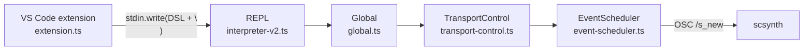
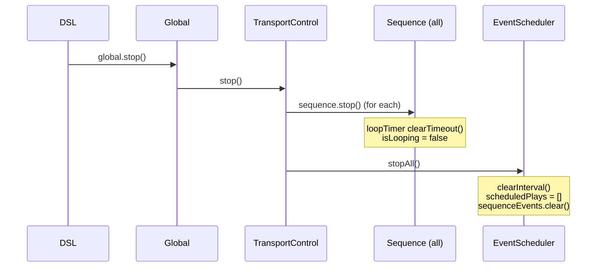
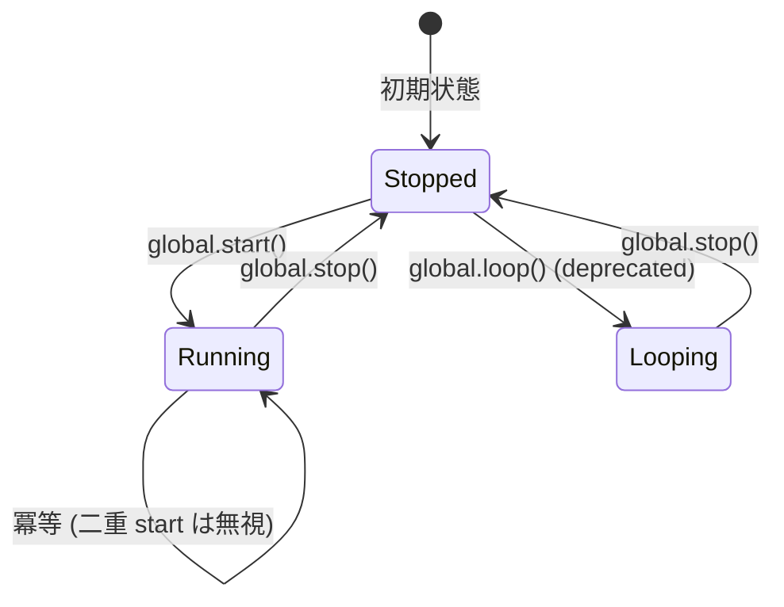
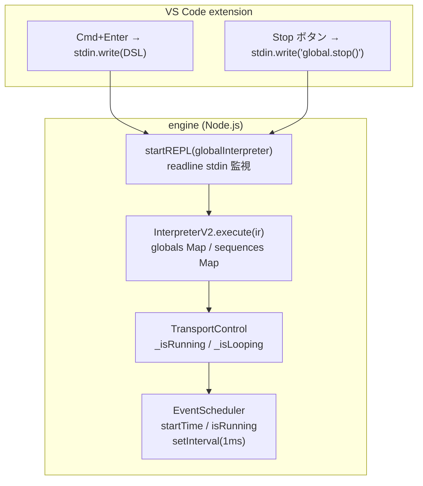

> **Note**: 本ページは 2026-05-05 時点での著者の reading の足跡です。code が真実、本ページはその時点の理解の snapshot に過ぎません。

# II-4. transport

ユーザーが `global.start()` と書いたとき、OrbitScore の内部で何が起きるのでしょうか。また `Cmd+Enter` で一部のコードだけを再評価した場合、それまでのシーケンスの状態はどうなるのでしょうか。本章では再生制御 (transport) の仕組みと、selective execution (部分評価) との相互作用を見ていきます。

## Transport の全体像

OrbitScore における transport の責務は **3 つのレイヤー** に分散しています。

| レイヤー | クラス | 責務 |
|---|---|---|
| VS Code extension | `extension.ts` | ユーザー操作 (Cmd+Enter / stop ボタン) の受付、DSL テキストの stdin 送信 |
| engine / REPL | `InterpreterV2` | DSL の解釈と実行、`Global` / `Sequence` オブジェクトの状態管理 |
| scheduler | `EventScheduler` | `setInterval(1ms)` の起動/停止、イベントキューの管理 |

これら 3 つが連携することで「音を出す / 止める」という操作が実現されます。



## global.start(): スケジューラーの起動

`global.start()` を DSL で呼ぶと、次の呼び出し連鎖が始まります。

まず `Global.start()` が `TransportControl.start()` に委譲します。

```typescript
// packages/engine/src/core/global.ts:144-148
  start(): this {
    this.transportControl.start()
    this.effectsManager.setRunningState(true)
    return this
  }
```

次に `TransportControl.start()` が `globalScheduler.start()` を呼び出します。

```typescript
// packages/engine/src/core/global/transport-control.ts:19-32
  start(): this {
    // If already running, do nothing (idempotent)
    if (this._isRunning) {
      return this
    }

    this._isRunning = true

    // Start the global scheduler (will restart if needed)
    this.globalScheduler.start()
    console.log('✅ Global starting')

    return this
  }
```

ここで重要なのは **冪等性 (idempotent)** です。`_isRunning` が既に `true` なら何もしません。これにより `global.start()` を複数回呼んでも安全です。`Cmd+Enter` で同じブロックを繰り返し評価しても、スケジューラーが二重起動する心配はありません。

最終的に `EventScheduler.start()` が `setInterval(1)` を起動し、`startTime = Date.now()` で再生開始時刻を記録します。

## global.stop(): 連鎖的な停止

`global.stop()` は逆方向に連鎖します。

```typescript
// packages/engine/src/core/global/transport-control.ts:43-59
  stop(): this {
    // Stop all sequences first
    for (const [, sequence] of this.sequences.entries()) {
      sequence.stop()
    }

    // Stop the scheduler
    this.globalScheduler.stopAll()

    // Stop transport
    if (this._isRunning) {
      this._isRunning = false
      this._isLooping = false
      console.log('✅ Global stopped')
    }
    return this
  }
```

注目したいのは **シーケンスを先に止めてからスケジューラーを止める** という順序です。各シーケンスの `stop()` がループタイマーをキャンセルし、続いて `globalScheduler.stopAll()` がイベントキューを空にして `setInterval` を止めます。逆の順序では、スケジューラーを先に止めても、シーケンスのループタイマーが生き残って新しいイベントを積もうとする可能性があります。



## InterpreterV2: 状態を持つ interpreter

`InterpreterV2` は REPL セッション全体を通じて **単一のインスタンスが保持されます**。

```typescript
// packages/engine/src/cli/repl-mode.ts:27-39
export async function startREPLMode(options: REPLOptions = {}): Promise<void> {
  console.log('🎵 OrbitScore Audio Engine')
  console.log('✅ Initialized')

  // Create a global interpreter
  const globalInterpreter = new InterpreterV2()

  // Boot SuperCollider once at startup with optional audio device
  await globalInterpreter.boot(options.audioDevice)

  console.log('🎵 Live coding mode')
  await startREPL(globalInterpreter)
}
```

`globalInterpreter` は `startREPLMode()` の中で 1 回だけ生成され、その後の REPL ループ全体でずっと使い続けられます。これが重要で、`InterpreterV2` が持つ `state` (globals Map、sequences Map) が **REPL セッション全体を通じて蓄積**されることを意味します。

```typescript
// packages/engine/src/interpreter/interpreter-v2.ts:25-37
  constructor() {
    this.state = {
      audioEngine: new SuperColliderPlayer(),
      globals: new Map(),
      sequences: new Map(),
      currentGlobal: undefined,
      isBooted: false,
      // Initialize unidirectional toggle groups
      runGroup: new Set(),
      loopGroup: new Set(),
      muteGroup: new Set(),
    }
  }
```

`globals` と `sequences` は `Map<string, Global>` / `Map<string, Sequence>` です。一度作成されたオブジェクトはマップに蓄積され、後続の評価でも同じオブジェクトが使われます。

## Selective Execution: 部分評価と state 引き継ぎ

`Cmd+Enter` を押すと、VS Code extension はカーソル位置のブロック (または選択範囲) のテキストだけを stdin に書き込みます。

```
engineProcess.stdin?.write(codeToSend + '\n')
```

> 上記のコードは `extension.ts` の stdin 送信箇所です (詳細は [アーキテクチャ概要](../orientation/architecture-overview.md) 参照)。

engine の REPL は受け取ったテキストを `parseAudioDSL()` → `interpreter.execute()` で評価します。重要なのは、`globalInterpreter` は同一インスタンスなので、**前の評価で作られた `Global` オブジェクトや `Sequence` オブジェクトがそのまま生きている** という点です。

たとえば次のようなシナリオを考えてみましょう。

**評価 1**: `global.start()` を含むブロックを `Cmd+Enter`

→ スケジューラーが起動し、`globals` Map に Global が登録される。`EventScheduler.isRunning = true`

**評価 2**: `kick.beat(5 by 4)` を含むブロックを `Cmd+Enter`

→ `sequences` Map の `kick` Sequence に beat が更新される。スケジューラーはそのまま動き続ける。次のループイテレーションから新しい barDuration が反映される。

このように、selective execution は「止めて再起動」ではなく「動かしたままパラメータを更新」する操作です。

## execute(): skipTransportCommands オプション

`InterpreterV2.execute()` には `skipTransportCommands` というオプションがあります。

```typescript
// packages/engine/src/interpreter/interpreter-v2.ts:62-86
  async execute(ir: AudioIR, options?: { skipTransportCommands?: boolean }): Promise<void> {
    const skipTransport = options?.skipTransportCommands ?? false

    // Ensure SuperCollider is booted
    await this.ensureBooted()

    // Process global initialization
    if (ir.globalInit) {
      await processGlobalInit(ir.globalInit, this.state)
    }

    // Process sequence initializations
    for (const seqInit of ir.sequenceInits) {
      await processSequenceInit(seqInit, this.state)
    }

    // Process statements
    for (const statement of ir.statements) {
      // Skip transport commands if requested (e.g., on file save)
      if (skipTransport && statement.type === 'transport') {
        continue
      }
      await processStatement(statement, this.state)
    }
  }
```

`skipTransportCommands: true` が渡されると、`statement.type === 'transport'` のステートメントをスキップします。コメントによれば「file save 時」に使われる想定です。ファイルを保存するたびに自動再評価する機能がある場合、`global.start()` や `global.stop()` が誤って実行されるのを防ぐためのガードです。

> NOTE: unverified — `skipTransportCommands` が実際に VS Code extension のどのイベント (onSave など) から呼ばれているかは `extension.ts` を精査していない。comments には "on file save" とあるが、呼び出し側での確認が必要。

## 再生位置の管理: startTime の役割

「再生位置」は OrbitScore では **スケジューラーの起動時刻 (`startTime`)** として保持されています。

```typescript
// packages/engine/src/audio/supercollider/event-scheduler.ts:143-149 (start() の前半。setInterval ループ部分は event-queue.md で扱う)
  start(): void {
    if (this.isRunning) {
      return
    }

    this.isRunning = true
    this.startTime = Date.now()
    // ...
```

すべての `ScheduledPlay.time` はこの `startTime` を基準とした **相対時刻 (ms)** です。ポーリングループも `now = Date.now() - this.startTime` で相対時刻に変換して比較します。

重要なのは `stop()` を呼んでも `startTime` はリセットされないという点です。

```typescript
// packages/engine/src/audio/supercollider/event-scheduler.ts:183-190
  stop(): void {
    if (this.intervalId) {
      clearInterval(this.intervalId)
      this.intervalId = null
    }
    this.isRunning = false
    console.log('✅ Global stopped')
  }
```

`isRunning = false` と `clearInterval` だけで、`startTime` は変更しません。これは意図的な設計で、`stop()` 後に `start()` を再度呼ぶと `startTime` が新しい `Date.now()` で上書きされ、新鮮なタイムラインが始まります。逆に言えば、stop → start の間に何秒経っても、再生は「0 から始まる新しいタイムライン」で動き直します。

## Transport の状態遷移

Transport の状態は `isRunning` と `isLooping` の 2 つのフラグで表されます。



`loop()` は deprecated になっており、シーケンスのループは `seq.loop()` で個別に制御するのが推奨です。

## Sequence の start / stop

シーケンス側にも `run()` と `loop()` と `stop()` があります。global の transport とは独立して動きます。

- `seq.run()` → 1 回だけパターンを再生して止まる (one-shot)
- `seq.loop()` → `setTimeout` チェーンで永続的にループ
- `seq.stop()` → ループタイマーをキャンセルし、`clearSequenceEvents()` でキューを空にする

global が止まれば `EventScheduler` のポーリングが止まるので音は出なくなりますが、各シーケンスの loop タイマー自体は動き続けます。再度 `global.start()` したとき、各シーケンスは自分の次のイテレーションで再び音を出します。

## まとめ: Transport レイヤー図



OrbitScore の transport は「DSL テキストを stdin に送り込む」という単純な入力モデルの上に、interpreter が状態を蓄積し、scheduler が時刻を管理するという構造で動いています。selective execution は「止めずに更新する」パラダイムであり、状態の引き継ぎは interpreter の `Map` に保持されたオブジェクトが生き続けることで実現しています。

## 関連用語

- [global](/glossary#global) — `global.start()` / `global.stop()` のレシーバ。TransportControl を保持するシングルトン
- [RUN](/glossary#run) — 片記号方式のトランスポートコマンド。`processTransportStatement()` が `handleRunCommand()` にディスパッチ
- [LOOP](/glossary#loop) — 片記号方式のループコマンド。差分計算 (`calculateLoopDiff`) でシーケンスの起動・停止を制御
- [MUTE / UNMUTE](/glossary#mute--unmute) — 片記号方式のミュートコマンド。`muteGroup` Set で管理
- [片記号方式](/glossary#片記号方式) — `RUN()` / `LOOP()` / `MUTE()` が「現在のグループを完全置換」するセマンティクス
- [init](/glossary#init) — `var seq = init global.seq` で InterpreterV2 に Sequence を登録する構文
- [scsynth](/glossary#scsynth) — EventScheduler が OSC 経由で `/s_new` を送る先のオーディオサーバー
- [OSC (Open Sound Control)](/glossary#osc-open-sound-control) — extension → engine → scsynth の通信に使われるプロトコル
- [subject-based block evaluation](/glossary#subject-based-block-evaluation) — selective execution が利用する、カーソル行の subject に基づくブロック収集方式

## 関連 ADR

- [ADR-001 SuperCollider ベース実装の選択](/decisions/adr-001-supercollider) — EventScheduler が scsynth に接続する設計判断の背景
- [ADR-002 DSL v3 Pivot](/decisions/adr-002-dsl-v3-pivot) — `RUN()` / `LOOP()` / `MUTE()` 片記号方式を導入した DSL v3.0 の経緯

## 次の深掘り候補

- `skipTransportCommands` が実際にどのイベントから呼ばれているかの extension.ts 追跡
- `global.stop()` 後に `global.start()` すると新しい startTime になる挙動と、それが各シーケンスの loop タイマー (cumulative nextScheduleTime) にどう影響するか
- `InterpreterV2.state.globals` / `state.sequences` が Map なので、同名の変数を再宣言した場合に上書きされるか新規追加されるかの挙動 (process-initialization.ts の確認)
- `global.loop()` が deprecated になった経緯と、`seq.loop()` 個別制御への移行の意図
- Boot の冪等性: `isBooted` フラグで二重 boot を防いでいるが、scsynth が落ちた場合の再 boot はどこで扱われるか

## Sources

- `packages/engine/src/core/global.ts:144-148` — `Global.start()`: TransportControl と effectsManager への委譲
- `packages/engine/src/core/global.ts:159-163` — `Global.stop()`: TransportControl への委譲
- `packages/engine/src/core/global/transport-control.ts:19-32` — `TransportControl.start()`: 冪等性ガード
- `packages/engine/src/core/global/transport-control.ts:43-59` — `TransportControl.stop()`: sequence 停止 → scheduler 停止の順序
- `packages/engine/src/audio/supercollider/event-scheduler.ts:143-149` — `EventScheduler.start()`: `startTime = Date.now()` の記録
- `packages/engine/src/audio/supercollider/event-scheduler.ts:183-190` — `EventScheduler.stop()`: `startTime` を保持したまま interval のみ止める
- `packages/engine/src/audio/supercollider/event-scheduler.ts:195-199` — `EventScheduler.stopAll()`: stop + キュークリア
- `packages/engine/src/interpreter/interpreter-v2.ts:25-37` — `InterpreterV2` constructor: `globals` / `sequences` Map の初期化
- `packages/engine/src/interpreter/interpreter-v2.ts:62-86` — `InterpreterV2.execute()`: `skipTransportCommands` オプション
- `packages/engine/src/cli/repl-mode.ts:27-39` — `startREPLMode()`: 単一 `globalInterpreter` インスタンスの生成と REPL への引き渡し
- `packages/engine/src/cli/repl-mode.ts:50-157` — `startREPL()`: readline stdin 監視と buffer 蓄積ロジック
- `sites/dev/orientation/architecture-overview.md` — extension の stdin 送信 (`extension.ts:1107`) と engine の全体アーキテクチャ
