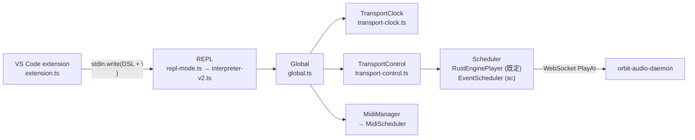
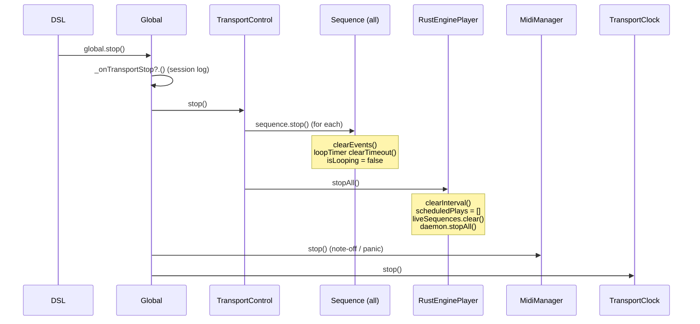
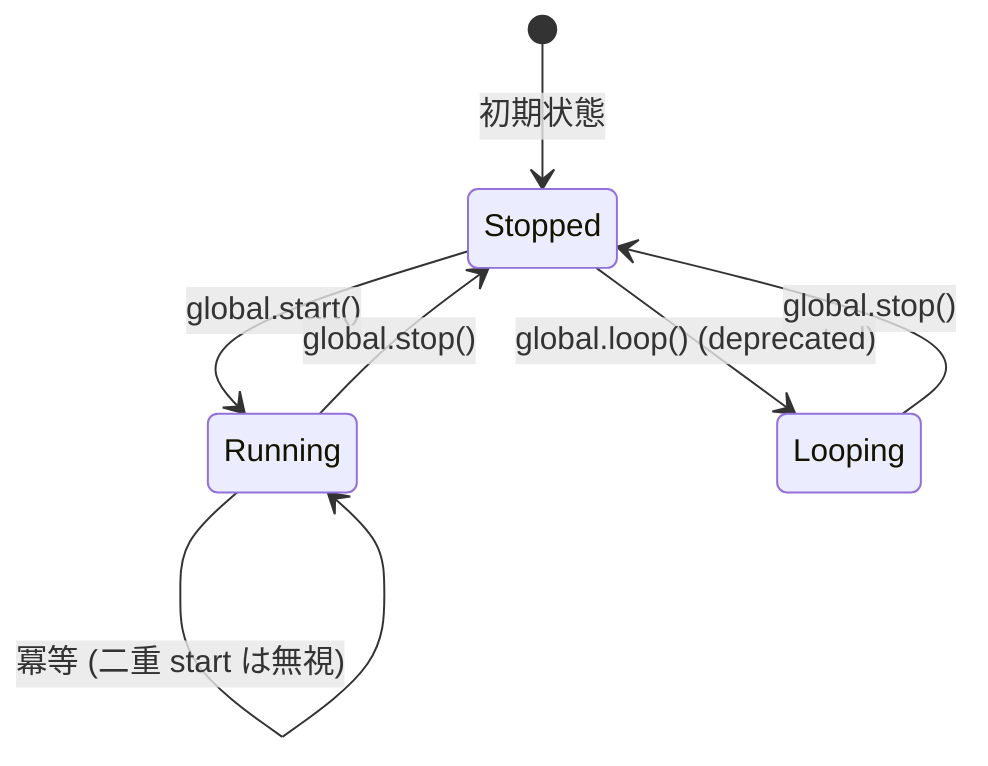
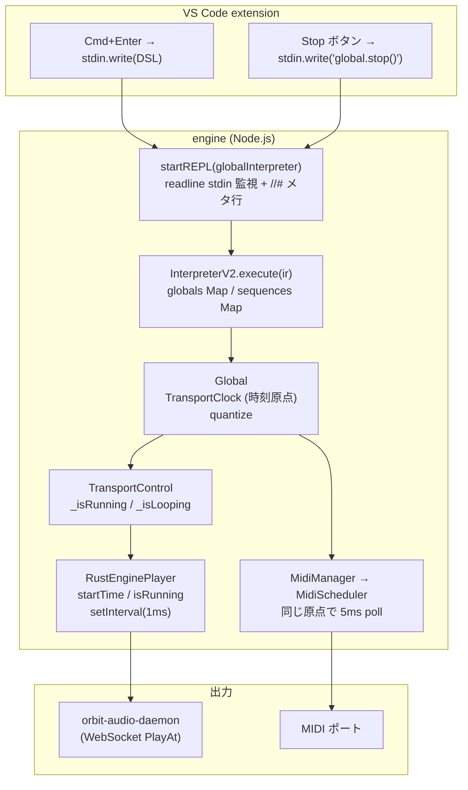

> **Note**: 本ページは 2026-09-01 時点での著者の reading の足跡です。code が真実、本ページはその時点の理解の snapshot に過ぎません。

# II-4. transport

ユーザーが `global.start()` と書いたとき、OrbitScore の内部で何が起きるのでしょうか。また `Cmd+Enter` で一部のコードだけを再評価した場合、それまでのシーケンスの状態はどうなるのでしょうか。本章では再生制御 (transport) の仕組みと、selective execution (部分評価) との相互作用を見ていきます。

## 2026-09 時点の drift: TransportClock・Rust daemon・launch quantize

本章の 2026-05-05 版は「`Global.start()` → `TransportControl.start()` → SC の `EventScheduler.start()`」という 3 段の連鎖として transport を読んでいました。2026-09-01 (69dc968) の code では、次の点が変わっています:

- **既定の音声バックエンドは Rust daemon** (cutover #108、2026-07-03)。`Global` が `start()` を呼ぶ `globalScheduler` は `AudioEngineBackend` 型で、既定では `RustEnginePlayer`、`ORBITSCORE_ENGINE=sc` のときだけ `SuperColliderPlayer` (内部に `EventScheduler`) です。連鎖の形は同じで、末端のクラスが差し替わりました
- **`TransportClock` が時刻原点の唯一の持ち主**になりました。audio スケジューラーと MIDI スケジューラーが同じ `Date.now()` 原点を共有するために、`Global.start()` は `transportControl.start()` の**前に** `transportClock.start()` を打ちます
- **`Global.start()` / `stop()` が太りました**: MIDI マネージャの起動・停止、session log (§L1、2.0.0 では dormant) の hook、Link テンポの再主張 (#283)、stop 時のプラグイン状態の自動スナップショットが加わっています
- **launch quantize** (`global.quantize()` / `seq.quantize()`、#212 / PR #215): `seq.loop()` の起動と LOOP 中の `play()` 差し替えは、既定でグローバルの次の小節境界まで待ちます。`global.start()` 自体は待ちません
- **`skipTransportCommands` の呼び出し元**: 2026-05 版が unverified としていた点ですが、2026-09-01 時点で `packages/` 配下の非テストコードにこのオプションを `true` で渡す呼び出しは見つかりませんでした (REPL は `source` / `evalSource` / `documentDirectory` だけを渡します)。interpreter 側に残った未使用のガードと読むのが妥当です
- **`[STEP]` マーカー** (#390 / #654) が transport の観測面に加わりました ([II-3](/scheduling/event-queue))

## Transport の全体像

OrbitScore における transport の責務は **4 つのレイヤー** に分散しています。

| レイヤー | クラス | 責務 |
|---|---|---|
| VS Code extension | `extension.ts` | ユーザー操作 (Cmd+Enter / stop ボタン) の受付、DSL テキストの stdin 送信 |
| engine / REPL | `InterpreterV2` | DSL の解釈と実行、`Global` / `Sequence` オブジェクトの状態管理 |
| Global | `TransportClock` + `TransportControl` + `MidiManager` | 時刻原点の確定、シーケンスの一括停止、MIDI スケジューラーの起動/停止 |
| scheduler | `RustEnginePlayer` (既定) / `EventScheduler` (SC) | `setInterval(1ms)` の起動/停止、イベントキューの管理 |

これらが連携することで「音を出す / 止める」という操作が実現されます。


```mermaid
flowchart LR
  EXT["VS Code extension\nextension.ts"] -->|"stdin.write(DSL + \\n)"| REPL["REPL\nrepl-mode.ts → interpreter-v2.ts"]
  REPL --> GLOBAL["Global\nglobal.ts"]
  GLOBAL --> CLK["TransportClock\ntransport-clock.ts"]
  GLOBAL --> TC["TransportControl\ntransport-control.ts"]
  GLOBAL --> MIDI["MidiManager\n→ MidiScheduler"]
  TC --> SCHED["Scheduler\nRustEnginePlayer (既定)\nEventScheduler (sc)"]
  SCHED -->|"WebSocket PlayAt"| D["orbit-audio-daemon"]
```

## global.start(): 時刻原点を打ってからスケジューラーを起動する

`global.start()` を DSL で呼ぶと、次の呼び出し連鎖が始まります。まず `Global.start()` です。

```typescript
// packages/engine/src/core/global.ts:654-677
  // Transport control
  start(): this {
    // §L1: only open a NEW session on an actual stopped→running transition —
    // transportClock.start() is idempotent, so a redundant start() while running
    // must not open a second (orphaned) log file.
    const wasRunning = this.transportClock.running
    // Stamp the shared clock origin FIRST so the audio scheduler (started by
    // transportControl) and the MIDI scheduler share the same Date.now() base.
    this.transportClock.start()
    this.transportControl.start()
    this.effectsManager.setRunningState(true)
    this.midiManager.start()
    if (!wasRunning) {
      // §L1: best-effort — a log-open failure must never break playback.
      try {
        this._onTransportStart?.()
      } catch (e) {
        console.warn(`⚠️  session-log: start hook failed (playback continues): ${e}`)
      }
    }
    // #283: re-assert Link tempo leadership once the transport is running.
    this.pushLinkTempoIfLeading()
    return this
  }
```

順番が大事です。**最初に `transportClock.start()`** で共有の時刻原点を打ち、そのあとで `transportControl.start()` (audio スケジューラー) と `midiManager.start()` (MIDI スケジューラー) を起動します。両者が同じ `Date.now()` を基準にするのは、この順序によって保証されています。

`TransportClock` はとても小さなクラスです。

```typescript
// packages/engine/src/core/global/transport-clock.ts:20-44
export class TransportClock {
  /** Epoch ms (`Date.now()`) when the transport last started; 0 before start. */
  private _startTime = 0
  private _running = false

  /** Begin the transport, stamping the shared origin. Idempotent while running. */
  start(): void {
    if (this._running) return
    this._startTime = Date.now()
    this._running = true
  }

  /** Stop the transport. The origin is retained for inspection until restart. */
  stop(): void {
    this._running = false
  }

  get startTime(): number {
    return this._startTime
  }

  get running(): boolean {
    return this._running
  }
}
```

ファイル冒頭のコメントによれば、MIDI 経路が audio エンジンの `startTime` / `isRunning` を直接読まずにこのクラスを経由するのは、**MIDI だけのセッションが SuperCollider (や daemon) に触れずに済む**ようにするためです。MIDI シーケンスには `MidiTransportScheduler` という `Scheduler` 型のアダプタが渡され、`startTime` / `isRunning` を `TransportClock` から読むだけで、audio 用のメソッドはすべて no-op になっています (`packages/engine/src/core/global/midi-transport-scheduler.ts`)。

次に `TransportControl.start()` が `globalScheduler.start()` を呼び出します。ここは 2026-05 版から変わっていません。

```typescript
// packages/engine/src/core/global/transport-control.ts:19-32
  start(): this {
    // If already running, do nothing (idempotent)
    if (this._isRunning) {
      return this
    }

    this._isRunning = true

    // Start the global scheduler (will restart if needed)
    this.globalScheduler.start()
    console.log('✅ Global starting')

    return this
  }
```

ここで重要なのは **冪等性 (idempotent)** です。`_isRunning` が既に `true` なら何もしません。これにより `global.start()` を複数回呼んでも安全です。`Cmd+Enter` で同じブロックを繰り返し評価しても、スケジューラーが二重起動する心配はありません。`Global.start()` 側でも `wasRunning` を見て、session log を二重に開かないようにしています。

最終的に `RustEnginePlayer.start()` が `setInterval(1)` を起動し、`startTime = Date.now()` で再生開始時刻を記録します。

```typescript
// packages/engine/src/audio/rust-engine/rust-engine-player.ts:1467-1471
  start(): void {
    if (this.isRunning) return
    this.isRunning = true
    this.startTime = Date.now()
    this.scheduledPlays.sort((a, b) => a.time - b.time)
```

`TransportClock.startTime` と `RustEnginePlayer.startTime` は別々に `Date.now()` を呼んでいる点に注意してください。同じ同期スタックの中で連続して呼ばれるので実用上は同一ですが、厳密に同じ値ではありません。

> NOTE: unverified — 2 つの `Date.now()` の差が実際に何 ms になるか (同一 tick 内なら 0〜1ms のはず) は計測していない。

## global.stop(): 連鎖的な停止

`global.stop()` は逆方向に連鎖します。こちらも session log と自動スナップショットのぶん太っています。

```typescript
// packages/engine/src/core/global.ts:688-718 (プラグイン状態の auto-snapshot ブロックを // ... で省略)
  stop(options?: { autoSnapshot?: boolean }): this {
    // §L1: write the stop record BEFORE the clock clears, only if actually
    // running, and never let a log-write error block the note-offs below (a
    // throw here would otherwise leave MIDI notes hanging — music unstoppable).
    if (this.transportClock.running) {
      try {
        this._onTransportStop?.()
      } catch (e) {
        console.warn(`⚠️  session-log: stop hook failed (playback continues): ${e}`)
      }
      // ...
    }
    this.transportControl.stop()
    this.effectsManager.setRunningState(false)
    this.midiManager.stop()
    this.transportClock.stop()
    return this
  }
```

コメントの「music unstoppable」が印象的です。stop の hook で例外が出ても、その下の note-off (MIDI マネージャの停止) を止めてはいけない、という設計判断が try/catch に表れています。`transportClock.stop()` が**最後**なのは、stop record が transport の時刻を読めるようにするためです。

`TransportControl.stop()` はシーケンスの一括停止とスケジューラーの停止を担います。

```typescript
// packages/engine/src/core/global/transport-control.ts:43-59
  stop(): this {
    // Stop all sequences first
    for (const [, sequence] of this.sequences.entries()) {
      sequence.stop()
    }

    // Stop the scheduler
    this.globalScheduler.stopAll()

    // Stop transport
    if (this._isRunning) {
      this._isRunning = false
      this._isLooping = false
      console.log('✅ Global stopped')
    }
    return this
  }
```

注目したいのは **シーケンスを先に止めてからスケジューラーを止める** という順序です。各シーケンスの `stop()` がループタイマーをキャンセルし、続いて `globalScheduler.stopAll()` がイベントキューを空にして `setInterval` を止めます (Rust 経路ではさらに daemon へ `StopAll` を送って鳴っている最中の voice も切ります)。逆の順序では、スケジューラーを先に止めても、シーケンスのループタイマーが生き残って新しいイベントを積もうとする可能性があります。


```mermaid
sequenceDiagram
  participant USER as DSL
  participant G as Global
  participant TC as TransportControl
  participant SEQ as Sequence (all)
  participant SCHED as RustEnginePlayer
  participant MIDI as MidiManager
  participant CLK as TransportClock

  USER->>G: global.stop()
  G->>G: _onTransportStop?.() (session log)
  G->>TC: stop()
  TC->>SEQ: sequence.stop() (for each)
  Note over SEQ: clearEvents()<br/>loopTimer clearTimeout()<br/>isLooping = false
  TC->>SCHED: stopAll()
  Note over SCHED: clearInterval()<br/>scheduledPlays = []<br/>liveSequences.clear()<br/>daemon.stopAll()
  G->>MIDI: stop() (note-off / panic)
  G->>CLK: stop()
```

## InterpreterV2: 状態を持つ interpreter

`InterpreterV2` は REPL セッション全体を通じて **単一のインスタンスが保持されます**。

```typescript
// packages/engine/src/cli/repl-mode.ts:30-53
export async function startREPLMode(options: REPLOptions = {}): Promise<void> {
  console.log('🎵 OrbitScore Audio Engine')
  console.log('✅ Initialized')

  // Create a global interpreter
  const globalInterpreter = new InterpreterV2()
  // 🔴 #607: startREPLMode() は返らないので、戻り値経由では shutdown ハンドラに
  // 届かない。生成した時点で publish する（詳細は active-interpreter.ts）。
  setActiveInterpreter(globalInterpreter)

  // §L1 (#229): session-log は 2.0.0 では dormant（既定 off）。file-scoped ログが
  // 複数ファイルをまたぐライブセッションに合わない設計ミスマッチのため、session-scoped で
  // 再設計するまで明示 opt-in に退避（writer/API/ユニットは保持・resurrect 可）。
  // 詳細・redesign 北極星: docs/development/POST_2.0_ROADMAP_NOTES.md
  if (shouldEnableSessionLog()) {
    globalInterpreter.enableSessionLog({ cwd: process.cwd() })
  }

  // Boot the audio engine backend once at startup with optional audio device
  await globalInterpreter.boot(options.audioDevice)

  console.log('🎵 Live coding mode')
  await startREPL(globalInterpreter)
}
```

`globalInterpreter` は `startREPLMode()` の中で 1 回だけ生成され、その後の REPL ループ全体でずっと使い続けられます。2026-05 版と比べると、`setActiveInterpreter()` (graceful shutdown のために #607 で追加) と session log の opt-in が挟まっていますが、「1 個だけ作って使い回す」構造は同じです。これが重要で、`InterpreterV2` が持つ `state` (globals Map、sequences Map) が **REPL セッション全体を通じて蓄積**されることを意味します。

```typescript
// packages/engine/src/interpreter/interpreter-v2.ts:48-64
  constructor(opts?: { audioEngine?: AudioEngineBackend }) {
    this.state = {
      audioEngine: opts?.audioEngine ?? createAudioEngine(),
      globals: new Map(),
      sequences: new Map(),
      mixers: createMixerRuntimeRegistry(),
      currentGlobal: undefined,
      isBooted: false,
      // Initialize unidirectional toggle groups
      runGroup: new Set(),
      loopGroup: new Set(),
      muteGroup: new Set(),
      // §L1: the rolling-buffer origin (§3 wall). The writer itself stays absent
      // until enableSessionLog() — so logging is inert in unit-test paths.
      engineT0: Date.now(),
    }
  }
```

2026-05 版では `audioEngine: new SuperColliderPlayer()` と直書きでしたが、いまは `createAudioEngine()` (env で Rust / SC を選ぶ) か、テスト用に注入された `opts.audioEngine` です。`globals` と `sequences` は `Map<string, Global>` / `Map<string, Sequence>` で、一度作成されたオブジェクトはマップに蓄積され、後続の評価でも同じオブジェクトが使われます。`mixers` (#643 のミキサー DSL) と `engineT0` (session log の壁時計原点) が増えています。

## Selective Execution: 部分評価と state 引き継ぎ

`Cmd+Enter` を押すと、VS Code extension はカーソル位置のブロック (または選択範囲) のテキストだけを stdin に書き込みます。

```typescript
// packages/vscode-extension/src/extension.ts:3031-3031
  engineProcess.stdin.write(codeToSend + '\n')
```

engine の REPL は受け取ったテキストを `parseAudioDSL()` → `interpreter.execute()` で評価します。

```typescript
// packages/engine/src/cli/repl-mode.ts:370-378
    try {
      const metaDir = extractDocumentDirectoryMeta(code)
      if (metaDir) sessionDocumentDirectory = metaDir
      await interpreter.execute(ir, {
        source: code,
        evalSource: 'human',
        documentDirectory: sessionDocumentDirectory,
      }) // §L1
      console.log('✓') // Success indicator
```

`//#documentDirectory <path>` というメタ行 (#456) を拡張が eval ごとに先頭に付け、REPL がそれを `documentDirectory` として渡します。`import` の基準ディレクトリを statement より先に確定させるための帯域外チャネルです。同じ仕組みで `//#selectAudioDevice` (#484) や `//#evalMark` (#614) などのメタ行も REPL が処理します。

重要なのは、`globalInterpreter` は同一インスタンスなので、**前の評価で作られた `Global` オブジェクトや `Sequence` オブジェクトがそのまま生きている** という点です。

たとえば次のようなシナリオを考えてみましょう。

**評価 1**: `global.start()` を含むブロックを `Cmd+Enter`

→ `TransportClock` に原点が打たれ、スケジューラーが起動し、`globals` Map に Global が登録される。`RustEnginePlayer.isRunning = true`

**評価 2**: `kick.beat(5 by 4)` を含むブロックを `Cmd+Enter`

→ `sequences` Map の `kick` Sequence に beat が更新される。スケジューラーはそのまま動き続ける。次のループイテレーションから新しい barDuration が反映される ([II-2](/scheduling/polymeter) の `getPatternDurationFn()`)

このように、selective execution は「止めて再起動」ではなく「動かしたままパラメータを更新」する操作です。

## execute(): skipTransportCommands オプション

`InterpreterV2.execute()` には `skipTransportCommands` というオプションがあります。オプション型は §L1 と import (#456) で増えましたが、transport に関わる部分は冒頭と末尾だけです。

```typescript
// packages/engine/src/interpreter/interpreter-v2.ts:133-230 (§L1 の記録・import・global/sequence init を // ... で省略)
  async execute(
    ir: AudioIR,
    options?: {
      skipTransportCommands?: boolean
      documentDirectory?: string
      /** §L1: the verbatim evaluated source (the `code` field). */
      source?: string
      /** §L1: the originating `.orbs` (drives `sourceFile` + filename). */
      sourceFile?: string | null
      /** §L1: who evaluated this (default `human`). */
      evalSource?: EvalSource
    },
  ): Promise<void> {
    const skipTransport = options?.skipTransportCommands ?? false

    // ...

    // Process statements
    for (const statement of ir.statements) {
      // Skip transport commands if requested (e.g., on file save)
      if (skipTransport && statement.type === 'transport') {
        continue
      }
      await processStatement(statement, this.state)
    }
  }
```

`skipTransportCommands: true` が渡されると、`statement.type === 'transport'` のステートメント (`RUN()` / `LOOP()` / `MUTE()` など) をスキップします。コメントによれば「file save 時」に使われる想定です。ただし 2026-09-01 時点で、`packages/engine` / `packages/vscode-extension` / `packages/mcp-server` の非テストコードにこのオプションを渡す呼び出し元は見つかりませんでした。REPL の `execute()` 呼び出し (上で引用) も渡していません。「保存時に自動再評価する」機能の名残のガードと読むのが妥当で、2026-05 版の unverified はこの形で解消されました。

## launch quantize: LOOP はグローバルの小節境界で入る

2026-05 版に無かった transport の要素が **launch quantize** です。`global.quantize()` は `"bar"` を既定値として持ち、`LOOP()` の起動と LOOP 中の `play()` 差し替えを次の境界まで待たせます。

```typescript
// packages/engine/src/core/global.ts:555-573
  /**
   * Set the global launch-quantize value.
   *
   * Controls when LOOP() starts and when LOOP-time play() updates take
   * effect, by waiting until the next quantized boundary derived from the
   * global tempo and meter. RUN() (one-shot) is unaffected and stays
   * immediate. Sequences may override this with `seq.quantize("...")`.
   *
   * Accepted values: "off" | "beat" | "bar" | "2bar" | "4bar" | "8bar".
   * Default: "bar".
   */
  quantize(value: QuantizeValue): this {
    this.quantizeManager.setQuantize(value)
    return this
  }

  getQuantize(): QuantizeValue {
    return this.quantizeManager.getQuantize()
  }
```

境界の計算は純関数 `nextQuantizedTime()` です。`currentTime` はスケジューラー起動からの相対 ms で、次の境界に「切り上げ」ます。

```typescript
// packages/engine/src/core/global/quantize-manager.ts:56-73
/**
 * Compute the next quantized boundary at or after `currentTime` (ms since
 * scheduler start). Returns `currentTime` unchanged when quantize is 'off' or
 * the duration is 0.
 */
export function nextQuantizedTime(
  currentTime: number,
  value: QuantizeValue,
  tempo: number,
  beat: Meter,
): number {
  const durationMs = quantizeDurationMs(value, tempo, beat)
  if (durationMs <= 0) return currentTime
  if (currentTime <= 0) return durationMs

  const boundaries = Math.ceil(currentTime / durationMs)
  return boundaries * durationMs
}
```

`Sequence.loop()` はこの結果を `loopSequence()` の `startTime` として渡します ([II-2](/scheduling/polymeter) で引用しました)。`RUN()` は quantize の影響を受けず常に即時で、`global.start()` 自体も待ちません (core spec §5)。グリッドは常に**グローバルの** `tempo()` × `beat()` なので、5/4 のシーケンスも 4/4 のグローバル小節境界で入ります。

面白いのは、`nextQuantizedTime()` が session log にも使われている点です。`Global.getQuantizedEffectPosition()` は「いま評価した quantized な操作が効き始める `"bar:beat"` 位置」を返し、LOOP を含む eval の `effect` フィールドとして記録されます (`interpreter-v2.ts` の `recordEval`)。

## 再生位置の管理: startTime と bar:beat

「再生位置」は OrbitScore では **transport の起動時刻** として保持されています。2026-05 版では SC の `EventScheduler.startTime` がそれでしたが、2026-09-01 時点では `TransportClock.startTime` が正本で、各スケジューラーの `startTime` はそれと (ほぼ) 同時に打たれる自分用の原点です。

`Global` は経過 ms を `"bar:beat"` に変換する関数を持っています (§L1 の session log 用に追加)。

```typescript
// packages/engine/src/core/global.ts:726-729
  getTransportPosition(): string | null {
    if (!this.transportClock.running) return null
    return this.msToBarBeat(Date.now() - this.transportClock.startTime)
  }
```

```typescript
// packages/engine/src/core/global.ts:762-767
    const { tempo, beat } = params
    const beatUnitMs = ((60_000 / tempo) * 4) / beat.denominator // one meter-beat
    const totalBeatUnits = Math.max(0, elapsedMs) / beatUnitMs
    const bar = Math.floor(totalBeatUnits / beat.numerator) + 1
    const beatInBar = (totalBeatUnits % beat.numerator) + 1
    return `${bar}:${beatInBar.toFixed(3)}`
```

ここでの「1 拍」は `beatUnitMs = 4 分音符 × 4 / denominator`、つまり **拍子の分母の音価**です。quantize の `"beat"` が 4 分音符固定だったのとは単位が違うので、7/8 のような拍子では両者がずれます ([II-1](/scheduling/time-representation) の「二重化された式」の項も参照)。

すべての `ScheduledPlay.time` はスケジューラーの `startTime` を基準とした **相対時刻 (ms)** です。ポーリングループも `now = Date.now() - this.startTime` で相対時刻に変換して比較します。

重要なのは `stop()` を呼んでも `startTime` はリセットされないという点です。

```typescript
// packages/engine/src/audio/rust-engine/rust-engine-player.ts:1486-1492
  stop(): void {
    if (this.intervalId) {
      clearInterval(this.intervalId)
      this.intervalId = null
    }
    this.isRunning = false
  }
```

`isRunning = false` と `clearInterval` だけで、`startTime` は変更しません (`TransportClock.stop()` も同様に原点を保持します — コメントに "retained for inspection until restart" とあります)。`stop()` 後に `start()` を再度呼ぶと `startTime` が新しい `Date.now()` で上書きされ、新鮮なタイムラインが始まります。逆に言えば、stop → start の間に何秒経っても、再生は「0 から始まる新しいタイムライン」で動き直します。

## Transport の状態遷移

Transport の状態は `TransportControl` の `_isRunning` / `_isLooping` と、`TransportClock.running` で表されます。


```mermaid
stateDiagram-v2
  [*] --> Stopped: 初期状態

  Stopped --> Running: global.start()
  Running --> Stopped: global.stop()

  Stopped --> Looping: global.loop() (deprecated)
  Looping --> Stopped: global.stop()

  Running --> Running: 冪等 (二重 start は無視)
```

`loop()` は deprecated のままで、シーケンスのループは `seq.loop()` / `LOOP()` で個別に制御するのが推奨です。

```typescript
// packages/engine/src/core/global.ts:679-686
  /**
   * @deprecated Not needed. Use LOOP(seq) for sequences instead.
   */
  loop(): this {
    this.transportControl.loop()
    this.effectsManager.setRunningState(true)
    return this
  }
```

## Sequence の start / stop

シーケンス側にも `run()` と `loop()` と `stop()` があります。DSL からは `RUN()` / `LOOP()` / `MUTE()` の片記号方式で呼ばれ、メソッド直接呼び出しは `@internal` 扱いです。

- `seq.run()` → 1 回だけパターンを再生して止まる (one-shot)。quantize の影響を受けない
- `seq.loop()` → `nextQuantizedTime()` で求めた次の境界から、`setTimeout` チェーンで永続的にループ
- `seq.stop()` → イベントをクリアし、ループタイマーをキャンセルする

```typescript
// packages/engine/src/core/sequence.ts:1855-1880
  stop(): this {
    const sequenceName = this.stateManager.getName()
    const wasLooping = this.stateManager.isLooping()

    // Clear scheduled events (MIDI: also releases sounding notes, §7-2)
    this.clearEvents(sequenceName)

    // Cancel a pending one-shot completion so it cannot clear later playback.
    this.clearRunTimer()

    // Clear loop timer (only exists if loop() was called, not run())
    // Note: run() sets loopTimer to undefined, so this check prevents redundant clearInterval
    const loopTimer = this.stateManager.getLoopTimer()
    if (loopTimer) {
      clearTimeout(loopTimer)
      this.stateManager.setLoopTimer(undefined)
    }

    // Clear state
    this.stateManager.setPlaying(false)
    this.stateManager.setLooping(false)

    // Log stop message for loop sequences
    if (wasLooping) {
      console.log(`⏹ ${sequenceName} (loop stopped)`)
    }
```

ここで 2026-05 版の記述を 1 つ訂正しておきます。2026-05 版は「global が止まっても各シーケンスの loop タイマー自体は動き続け、再度 `global.start()` したとき各シーケンスは自分の次のイテレーションで再び音を出す」と書いていましたが、`TransportControl.stop()` は**全シーケンスの `stop()` を先に呼ぶ**ので、ループタイマーはそこで `clearTimeout` されます。`global.stop()` → `global.start()` のあとにシーケンスを鳴らすには、`LOOP()` / `RUN()` を再評価する必要があります。2026-05 時点の `transport-control.ts:43-59` も同じ code だったので、これは drift ではなく元の読み違いです。

## まとめ: Transport レイヤー図


```mermaid
flowchart TB
  subgraph EXT["VS Code extension"]
    CMD["Cmd+Enter → stdin.write(DSL)"]
    STOP["Stop ボタン → stdin.write('global.stop()')"]
  end

  subgraph ENGINE["engine (Node.js)"]
    REPL["startREPL(globalInterpreter)\nreadline stdin 監視 + //# メタ行"]
    INTERP["InterpreterV2.execute(ir)\nglobals Map / sequences Map"]
    G["Global\nTransportClock (時刻原点)\nquantize"]
    TC["TransportControl\n_isRunning / _isLooping"]
    SCHED["RustEnginePlayer\nstartTime / isRunning\nsetInterval(1ms)"]
    MIDI["MidiManager → MidiScheduler\n同じ原点で 5ms poll"]
  end

  subgraph OUT["出力"]
    D["orbit-audio-daemon\n(WebSocket PlayAt)"]
    M["MIDI ポート"]
  end

  CMD --> REPL
  STOP --> REPL
  REPL --> INTERP
  INTERP --> G
  G --> TC
  G --> MIDI
  TC --> SCHED
  SCHED --> D
  MIDI --> M
```

OrbitScore の transport は「DSL テキストを stdin に送り込む」という単純な入力モデルの上に、interpreter が状態を蓄積し、`TransportClock` が時刻原点を 1 か所で管理し、audio と MIDI のスケジューラーがその原点を共有して時刻を進める、という構造で動いています。selective execution は「止めずに更新する」パラダイムであり、状態の引き継ぎは interpreter の `Map` に保持されたオブジェクトが生き続けることで実現しています。launch quantize は、その「止めずに更新する」操作のうち LOOP の起動と `play()` 差し替えだけを、グローバルの小節境界に揃える仕組みです。

## 関連用語

- [global](/glossary#global) — `global.start()` / `global.stop()` / `global.quantize()` のレシーバ。TransportClock と TransportControl を保持する
- [RUN](/glossary#run) — 片記号方式のトランスポートコマンド。one-shot で quantize の影響を受けない
- [LOOP](/glossary#loop) — 片記号方式のループコマンド。差分計算 (`calculateLoopDiff`) でシーケンスの起動・停止を制御し、起動は次の quantize 境界で入る
- [MUTE / UNMUTE](/glossary#mute--unmute) — 片記号方式のミュートコマンド。`muteGroup` Set で管理
- [片記号方式](/glossary#片記号方式) — `RUN()` / `LOOP()` / `MUTE()` が「現在のグループを完全置換」するセマンティクス
- [init](/glossary#init) — `var seq = init global.seq` で InterpreterV2 に Sequence を登録する構文
- [scsynth](/glossary#scsynth) — `ORBITSCORE_ENGINE=sc` の opt-out 経路で EventScheduler が OSC 経由に `/s_new` を送る先
- [OSC (Open Sound Control)](/glossary#osc-open-sound-control) — SC 経路の engine → scsynth 通信プロトコル。Rust 経路では WebSocket + JSON
- [subject-based block evaluation](/glossary#subject-based-block-evaluation) — selective execution が利用する、カーソル行の subject に基づくブロック収集方式

## 関連 ADR

- [ADR-001 SuperCollider ベース実装の選択](/decisions/adr-001-supercollider) — SC 経路の設計判断の背景 (cutover #108 で既定からは外れた)
- [ADR-002 DSL v3 Pivot](/decisions/adr-002-dsl-v3-pivot) — `RUN()` / `LOOP()` / `MUTE()` 片記号方式を導入した DSL v3.0 の経緯

## 次の深掘り候補

- `skipTransportCommands` を渡す呼び出し元が本当に無いか (vscode-extension の onSave 系の履歴を git log で追う) と、無いなら削除できるか
- `TransportClock.startTime` と `RustEnginePlayer.startTime` / `MidiScheduler` の原点が別々の `Date.now()` である影響 (同一 tick 内なら無視できるはず)
- `InterpreterV2.state.globals` / `state.sequences` が Map なので、同名の変数を再宣言した場合に上書きされるか新規追加されるかの挙動 (process-initialization.ts の確認)
- `global.loop()` が deprecated になった経緯と、`seq.loop()` 個別制御への移行の意図
- Boot の冪等性: `isBooted` フラグで二重 boot を防いでいるが、daemon が落ちた場合の respawn (#300) と `isBooted` の関係
- session log (§L1) が dormant になった設計ミスマッチ (file-scoped vs session-scoped) と、`POST_2.0_ROADMAP_NOTES.md` の redesign 方針
- `Global.stop()` の auto-snapshot (プラグイン状態の保存) が fire-and-forget であることの failure mode
- LOOP 中の `play()` 差し替えが quantize 境界まで待つ経路 (`seamlessParameterUpdate` の `deferToNextCycle`)

## Sources

- `packages/engine/src/core/global.ts:555-573` — `Global.quantize()` / `getQuantize()`: launch quantize の設定面
- `packages/engine/src/core/global.ts:654-677` — `Global.start()`: TransportClock → TransportControl → MidiManager の順序、session log hook、Link テンポ
- `packages/engine/src/core/global.ts:679-686` — `Global.loop()` (deprecated)
- `packages/engine/src/core/global.ts:688-718` — `Global.stop()`: stop record → auto-snapshot → 連鎖停止 → clock 停止
- `packages/engine/src/core/global.ts:726-729` — `getTransportPosition()`: `"bar:beat"` の再生位置
- `packages/engine/src/core/global.ts:762-767` — `msToBarBeat()`: 経過 ms → bar:beat (分母の音価が 1 拍)
- `packages/engine/src/core/global/transport-clock.ts:20-44` — `TransportClock`: 共有の時刻原点
- `packages/engine/src/core/global/transport-control.ts:19-32` — `TransportControl.start()`: 冪等性ガード
- `packages/engine/src/core/global/transport-control.ts:43-59` — `TransportControl.stop()`: sequence 停止 → scheduler 停止の順序
- `packages/engine/src/core/global/midi-transport-scheduler.ts:21-49` — `MidiTransportScheduler`: MIDI シーケンス用の `Scheduler` アダプタ
- `packages/engine/src/core/global/quantize-manager.ts:56-73` — `nextQuantizedTime()`: 次の quantize 境界
- `packages/engine/src/audio/rust-engine/rust-engine-player.ts:1467-1471` — `RustEnginePlayer.start()`: `startTime = Date.now()` の記録
- `packages/engine/src/audio/rust-engine/rust-engine-player.ts:1486-1492` — `RustEnginePlayer.stop()`: `startTime` を保持したまま interval のみ止める
- `packages/engine/src/audio/supercollider/event-scheduler.ts:355-361` — SC 版 `EventScheduler.start()` (opt-out 経路)
- `packages/engine/src/interpreter/interpreter-v2.ts:48-64` — `InterpreterV2` constructor: `createAudioEngine()` と `globals` / `sequences` Map の初期化
- `packages/engine/src/interpreter/interpreter-v2.ts:133-230` — `InterpreterV2.execute()`: `skipTransportCommands` オプション
- `packages/engine/src/cli/repl-mode.ts:30-53` — `startREPLMode()`: 単一 `globalInterpreter` インスタンスの生成と REPL への引き渡し
- `packages/engine/src/cli/repl-mode.ts:370-378` — REPL の `interpreter.execute()` 呼び出し (渡しているオプション)
- `packages/engine/src/core/sequence.ts:1774-1799` — `Sequence.stop()`: イベントクリアとループタイマーのキャンセル
- `packages/vscode-extension/src/extension.ts:3030-3030` — extension の stdin 送信
- `docs/core/INSTRUCTION_ORBITSCORE_DSL.md` §5 "Transport Commands" — launch quantize の仕様と `global.start()` が待たないこと
- Issue [#212](https://github.com/signalcompose/orbitscore/issues/212) / PR [#215](https://github.com/signalcompose/orbitscore/pull/215) — launch quantize
- Issue [#108](https://github.com/signalcompose/orbitscore/issues/108) — cutover (既定バックエンドを Rust に)
- `sites/dev/orientation/architecture-overview.md` — engine の全体アーキテクチャ
