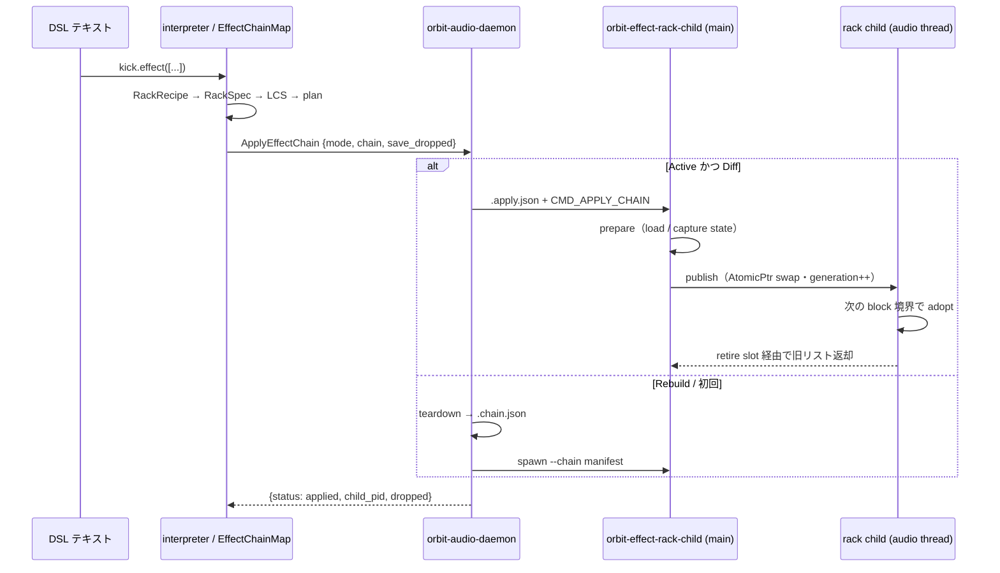

> **Note**: 本ページは 2026-09-01 時点での著者の reading の足跡です。code が真実、本ページはその時点の理解の snapshot に過ぎません。

# SC-1. ラック — チェーンを値として書く（SC.10）

`kick.effect(["TAL Reverb 4", Gain(db: -6)])` のように、エフェクトの並びを **配列の値** として
書く記法が「ラック」です。Issue [#628](https://github.com/signalcompose/orbitscore/issues/628)
で設計され、仕様は `docs/specs-v2/SIGNAL_CHAIN_DSL_SPEC_v1.md` の **SC.10**（2026-08-27 制定）に
まとまっています。本章では、DSL のテキストが TypeScript のレシピになり、daemon への 1 コマンドに
畳まれ、1 つの child プロセスの中で N 段のプラグインが直列に回るまでの配線を追います。

読み進める前提として、[RE-3 per-sequence insert bus](/rust-engine/insert-bus)（`seq.effect()` が
bus を確保する仕組み）と [RE-2 OOP children](/rust-engine/oop-children)（shm transport と
watchdog）を先に読んでおくと、本章で「bus」「child」「mailbox」と書いたときに何を指しているかが
すぐ分かります。

## なぜ「ラック」なのか — DAW の insert チェーンと同型に置く

#628 の出発点は「削除・バイパス・チェーンは 3 つの決定ではなく 1 つのモデルである」という
owner の指摘でした。設計メモ `docs/archive/design/628-effect-chain-model.md` は Bitwig と Live を
参照 DAW に置いて、DAW のスロットが「有る / 無い」の 2 状態ではなく **4 状態**
（空スロット / 有効 / バイパス / 無効化）で設計されていることを確認しています。

#628 より前の OrbitScore は次の状態でした（同メモ §1 の実測表から）:

| | #628 前 |
|---|---|
| 1 レシーバあたりの insert 数 | **1** |
| daemon のホスティング | **1 bus = 1 child**・child は `--plugin` 1 つ |
| 削除 | `remove("名前")`（#625） |
| 音色の保持 | 差し替え・削除の直前に自動保存され、同じ spec の再宣言で復元 |

つまり「Bitwig の deactivate（アンロードするが音色は保つ）」に相当する**機構**は #625 で
既にあり、足りなかったのは**語彙**でした。ラック記法はその語彙を、配列という 1 つの値の形で
まとめて与えるものです。複数 insert の実現方式としては、メモ §5 の 3 案のうち
**B「1 child が N プラグインをホストする」**（Bitwig の "Together" 相当）が採られました。
shm の往復回数が段数に比例しないことが理由です。

## 二層意味論の中でラックはどこにいるか

SC.1 は DSL の文を **宣言層**（可換・後勝ち）と **信号層**（相対順序が接続順）に分けています。

| 層 | 属するもの | 順序の意味 |
|----|----|----|
| **宣言層** | audio / chop / play / gain / pan / 出力先ノード名 / instrument 役のプラグイン呼び出し / ミキサー宣言 | **可換**。同一項目の再宣言は後勝ち |
| **信号層** | effect 役のプラグイン呼び出し / send | **この層内の相対順序だけ**が接続順になる |

ラックは信号層の中身を「1 つの値」として書く方法です。配列の要素順がそのまま接続順になり、
`effect()` という 1 つの宣言が **チェーン全体の像** を運びます。SC.1 の規範 (2) が言うとおり、
トポロジーは **パターン(play) → instrument → エフェクト列 → 出力先** で固定されていて、
利用者が順序で制御できるのは「エフェクト列の中身」だけです。ラックはまさにその部分を担います。

## DSL の形（SC.10.1 / SC.10.3b / SC.10.4）

仕様が示す完全形は次のとおりです（SC.10.1 より）:

```js
kick.effect([
  "FabFilter Pro-C 2",
  plugin("FabFilter Pro-Q 3", enabled: false),
  layer([
    [],
    ["ValhallaRoom", Gain(db: -10)],
  ]),
  "FabFilter Pro-L 2",
])
```

| 語 | 意味 |
|----|----|
| `[...]` | **直列チェーン**。`chain([...])` の糖衣 |
| `"名前"` | **カタログのプラグイン**（既定値）。`plugin("名前")` の糖衣 |
| `layer([...])` | **並列**。effect / instrument で同じ語（v1 は記法のみ予約・SC.10.11） |
| `plugin("名前", ...)` | 引数が要る時の完全形 |
| `Gain(db: n)` | **標準プラグイン**（大文字始まりの呼び出し・SC.10.8） |

ここで気をつけたいのは、SC.10.1 規範 (3) の「**3 つのカテゴリは構文で区別される**」という点です。
`"文字列"` = カタログ、`Gain(...)` のような**大文字始まり**の呼び出し = 標準プラグイン、
`layer(...)` のような**小文字**の呼び出し = 構造。名前を照合する前にカテゴリが決まるので、
3rd-party の "Gain" と標準の `Gain` は衝突しません（`"Gain"` と書けば必ずカタログ側が取れます）。

もう 2 つ、実装を読むときに効いてくる規範があります。

- **SC.10.3b 文字列単発形は「完全な像」**: `receiver.effect("名前")` は `receiver.effect(["名前"])` と
  完全に等価です。`effect([A1, A2])` の後に `effect("B")` を評価すると A1 と A2 はアンロードされ、
  チェーンは `[B]` になります。
- **SC.10.4 ラックは値（レシピ）**: `var glue = [...]` は**レシピを束縛するだけ**でプラグインを
  起動しません。同じラックを複数レシーバへ適用してもインスタンスは共有されず、束縛を
  書き換えても適用済みのレシーバは「その文を再評価するまで」変化しません。

## TS モデル: `RackRecipe` と 3 カテゴリの構文分類

実装は `packages/engine/src/signal-chain/rack.ts` にあります。まず型を見てみましょう。

```typescript
// packages/engine/src/signal-chain/rack.ts:12-34
export interface CatalogRackRecipe {
  readonly kind: 'catalog'
  readonly spec: string
  readonly pluginId?: string
  readonly enabled: boolean
  readonly format?: string
  readonly vendor?: string
}

export interface StandardRackRecipe {
  readonly kind: 'standard'
  readonly name: 'Gain'
  readonly params: Readonly<Record<string, number>>
  readonly enabled: boolean
}

export interface LayerRackRecipe {
  readonly kind: 'layer'
  readonly source: ValueCall
}

export type RackRecipeElement = CatalogRackRecipe | StandardRackRecipe | LayerRackRecipe
export type RackRecipe = readonly RackRecipeElement[]
```

`RackRecipe` は要素の**読み取り専用配列**で、要素は `catalog` / `standard` / `layer` の
3 種類です。`StandardRackRecipe.name` が `'Gain'` のリテラル型になっている点に、
v1 の標準プラグインが `Gain` 1 つであることが型の形で現れています。`LayerRackRecipe` は
`source: ValueCall` を丸ごと持つだけで、v1 では適用時にエラーになります（後述）。

### 呼び出しの分類 — 大文字か小文字か

呼び出し（`ValueCall`）をどのカテゴリに落とすかは `resolveCall` が決めます。

```typescript
// packages/engine/src/signal-chain/rack.ts:148-171
function resolveCall(call: ValueCall, env: RackBindingEnvironment): RackRecipe {
  if (/^[A-Z]/.test(call.name)) return [resolveStandardCall(call)]
  switch (call.name) {
    case 'plugin':
      return [resolvePluginCall(call)]
    case 'chain': {
      const positional = positionalArgs(call)
      if (namedArgs(call).length > 0 || positional.length !== 1 || !isValueArray(positional[0])) {
        throw new Error('chain() requires exactly one array argument.')
      }
      return resolveRackValue(positional[0], env)
    }
    case 'layer':
      return [{ kind: 'layer', source: structuredClone(call) }]
    case 'gain':
      throw new Error(
        'unknown rack word "gain"; the standard gain plugin is capitalized: Gain(db: -6)',
      )
    default:
      throw new Error(
        `unknown rack word "${call.name}"; rack structure words are plugin(), chain(), and layer().`,
      )
  }
}
```

最初の 1 行 `/^[A-Z]/.test(call.name)` が SC.10.1 規範 (3) そのものです。大文字始まりなら
名前を見る前に「標準プラグイン」と決め、`resolveStandardCall` へ渡します。小文字の
`gain` を書いた場合は専用の文言で `Gain(db: -6)` へ誘導し、それ以外の未知の小文字語は
「rack structure words are plugin(), chain(), and layer()」と拒否します。

標準プラグインの解決は静的で、**カタログを引きません**（SC.10.8 規範 (4)）。

```typescript
// packages/engine/src/signal-chain/rack.ts:124-146
function resolveStandardCall(call: ValueCall): StandardRackRecipe {
  if (call.name !== 'Gain') {
    throw new Error(
      `no standard plugin named "${call.name}"; catalog plugins are written as strings: effect("${call.name}")`,
    )
  }
  if (positionalArgs(call).length > 0) {
    throw new Error('Gain() accepts named arguments only, for example Gain(db: -6).')
  }
  const allowed = new Set(['db', 'enabled'])
  const unsupported = namedArgs(call).find((arg) => !allowed.has(arg.name))
  if (unsupported) throw new Error(`Gain() has no parameter named "${unsupported.name}".`)
  const db = oneNamedValue(call, 'db') ?? 0
  if (typeof db !== 'number' || !Number.isFinite(db)) {
    throw new Error('Gain() db: must be a finite number.')
  }
  return {
    kind: 'standard',
    name: 'Gain',
    params: { db },
    enabled: expectBoolean(call, 'enabled', true),
  }
}
```

`db` を省略すると `0`（素通し）になり、有限でない数は弾かれます。受理する名前付き引数は
`db` と `enabled` の 2 つだけで、それ以外は「no parameter named」で止まります。
ここで受け取った `params: { db }` が、そのまま wire を通って CLAP の param `db` へ届きます
（後述の「dB 契約」）。

### 値の再帰解決 — 文字列・変数・呼び出し・配列

配列の要素は `resolveRackValue` が再帰的に平坦化します。

```typescript
// packages/engine/src/signal-chain/rack.ts:173-203
export function resolveRackValue(value: ValueExpression, env: RackBindingEnvironment): RackRecipe {
  if (typeof value === 'string') {
    return [{ kind: 'catalog', spec: value, enabled: true }]
  }
  if (isValueRef(value)) {
    if (value.octaveShift !== 0) {
      throw new Error(`rack variable "${value.name}" cannot use a chord octave shift (^N).`)
    }
    const rack = env.getRack(value.name)
    if (rack) return cloneRack(rack)
    if (env.getBinding(value.name)?.kind === 'chord') {
      throw new Error(`"${value.name}" is a chord variable, not a rack variable.`)
    }
    if (value.type === 'value_ref' && /^[A-Z]/.test(value.name)) {
      throw new Error(
        `rack variable "${value.name}" not found; did you mean \`${value.name}(...)\`?`,
      )
    }
    throw new Error(`rack variable "${value.name}" not found.`)
  }
  if (isValueCall(value)) return resolveCall(value, env)
  if (isValueArray(value)) {
    if ((value.octaveShift ?? 0) !== 0) {
      throw new Error('rack arrays cannot use a chord octave shift (^N).')
    }
    return value.elements.flatMap((element) => resolveRackValue(element, env))
  }
  throw new Error(
    `rack elements must be catalog strings, rack variables, calls, or arrays; got ${JSON.stringify(value)}.`,
  )
}
```

読みどころは 3 つです。

1. **文字列はそのままカタログ要素**になります（`enabled: true` 既定）。
2. **変数参照**（`value_ref`）は `env.getRack(name)` で引き、見つかれば `cloneRack` で
   **コピー**を返します。chord 変数を渡した場合や、大文字の未定義名（`Gain` を `Gain()` と
   書き忘れた場合）にはそれぞれ専用の文言があります。
3. **配列は `flatMap`** で平坦化されます。`["A", ["B", "C"]]` は `["A", "B", "C"]` と同じ直列に
   なり、入れ子の `[...]` が意味を変えることはありません（SC.10.1 規範 (1)）。

### `var x = [...]` は chord か rack か

パーサは `[...]` を文脈中立の `ValueArray` として保持し、chord と rack の分類は interpreter が
行います（設計書 §4 決定 13: `[m7]` と `[glue]` は構文で区別できないため）。

```typescript
// packages/engine/src/parser/types.ts:151-159
/**
 * Context-neutral `[ ... ]` value. The interpreter classifies it as a chord or rack after
 * resolving identifier bindings; nested arrays remain arrays until that classification.
 */
export type ValueArray = {
  type: 'value_array'
  elements: ValueExpression[]
  octaveShift?: number
}
```

interpreter 側の分岐は次のとおりです。

```typescript
// packages/engine/src/interpreter/process-statement.ts:333-343
/** Process `var NAME = [ ... ]` (§6): bind the evaluated chord value. */
function processArrayBinding(statement: ChordBinding, state: InterpreterState): void {
  const global = requireGlobal(state, `array "${statement.variableName}"`)
  if (!global) return
  const classified = classifyArrayBinding(statement.value, global)
  if (classified.kind === 'chord') {
    global.defineChord(statement.variableName, classified.voices)
  } else {
    global.defineRack(statement.variableName, classified.rack)
  }
}
```

`classifyArrayBinding` は、文字列・呼び出し・配列のいずれかを含むか、空配列なら rack と
判定します。識別子だけの配列（`[m7]` / `[glue]`）は束縛の種類で決め、chord 変数と rack 変数が
1 つの配列に混ざっていれば明示エラーにします（`rack.ts:231-249`）。

```typescript
// packages/engine/src/signal-chain/rack.ts:223-230
/** Runtime classification for `var x = [...]`; identifier kinds are consulted here, not in the parser. */
export function classifyArrayBinding(
  value: ValueArray,
  env: RackBindingEnvironment,
): { kind: 'chord'; voices: StackElement[] } | { kind: 'rack'; rack: RackRecipe } {
  if (value.elements.some(containsRackSyntax) || value.elements.length === 0) {
    return { kind: 'rack', rack: resolveRackValue(value, env) }
  }
```

rack と判定された値は `Global.defineRack` へ渡り、`structuredClone` で保存されます。取り出す
`getRack` も**コピー**を返すので、SC.10.4 規範 (2)(3) の「値であって参照ではない」が
データの配置で守られています。

```typescript
// packages/engine/src/core/global.ts:352-366
  /** Bind a rack recipe by value; later rebinding never mutates an already-applied receiver. */
  defineRack(name: string, rack: RackRecipe): this {
    if (this.rackRegistry.has(name) || this.chordRegistry.has(name)) {
      console.warn(`⚠️  value namespace: "${name}" redefined (last-write-wins).`)
    }
    this.chordRegistry.delete(name)
    this.rackRegistry.set(name, structuredClone(rack) as RackRecipe)
    return this
  }

  /** A fresh recipe copy prevents two receivers from sharing mutable rack instances. */
  getRack(name: string): RackRecipe | undefined {
    const rack = this.rackRegistry.get(name)
    return rack === undefined ? undefined : (structuredClone(rack) as RackRecipe)
  }
```

### `effect()` の引数 → レシピ

`effect()` 呼び出しは `process-statement.ts` で捕まえられ、引数がレシピへ変換されてから
レシーバのメソッドに渡されます。

```typescript
// packages/engine/src/interpreter/process-statement.ts:263-266
    if (method === 'effect') {
      if (!valueGlobal) throw new Error('effect() rack resolution requires an initialized global.')
      return callMethod(receiver, method, [effectArgumentsToRack(args, valueGlobal)])
    }
```

```typescript
// packages/engine/src/signal-chain/rack.ts:252-277
export function effectArgumentsToRack(
  args: readonly unknown[],
  env: RackBindingEnvironment,
): RackRecipe {
  if (args.length === 0) throw new Error('effect() requires a catalog plugin or rack value.')
  const first = args[0]
  if (typeof first === 'string') {
    if (args.length > 2 || (args[1] !== undefined && typeof args[1] !== 'string')) {
      throw new Error(
        'effect("...") accepts only an optional pluginId string as its second argument.',
      )
    }
    return [
      {
        kind: 'catalog',
        spec: first,
        enabled: true,
        ...(typeof args[1] === 'string' ? { pluginId: args[1] } : {}),
      },
    ]
  }
  if (args.length !== 1 || (!isValueArray(first) && !isValueRef(first) && !isValueCall(first))) {
    throw new Error('effect() expects one rack array, rack variable, or rack value call.')
  }
  return resolveRackValue(first, env)
}
```

文字列単発形は **長さ 1 のレシピ**になります。SC.10.3b が求める「単発形と配列形は同じ規則」が、
ここで構文の差を消すことで成立しています。第 2 引数の `pluginId` 文字列は互換のため残されて
います。

ちなみに、SC.10.9 で撤回された「メソッド形のカタログ呼び出し」（`kick.TALReverb4()`）は、
`dispatch.ts` で**診断専用**に残っています。`resolve.ts` の `normalizeCatalogName` はここで
のみ使われ、一致するカタログ名が見つかった場合に文字列形へ誘導する文言を投げます。

```typescript
// packages/engine/src/signal-chain/dispatch.ts:42-53
  // Catalog lookup is diagnostic-only. Method-form catalog declarations were withdrawn by SC.10.9.
  const catalog = loadPluginCatalog()
  const matchingEntry = catalog?.plugins.find(
    (entry) => normalizeCatalogName(entry.name) === methodName,
  )
  if (matchingEntry) {
    throw new Error(
      `Catalog plugins are written as strings (SC.10.9): use effect(${JSON.stringify(
        matchingEntry.name,
      )})`,
    )
  }
```

## 4 つの manager は同じ脱糖を通る

`effect()` を受けるレシーバは master（`PluginEffectManager`）・per-seq
（`SequenceEffectManager`）・sum と aux（`MixerManager`）の 4 つで、コメントが「4 manager
（master / seq / sum / aux）」と呼ぶものです。いずれも `effect-slot.ts` の 2 つの関数を通ります。

```typescript
// packages/engine/src/core/global/effect-slot.ts:290-302
/**
 * 単発の文字列形 `effect("X")` を **1 要素のラック**へ脱糖する（SC.10.3b）。
 *
 * 単発形は「完全な像」なので `effect([X])` と等価であり、**特殊経路を作らずに同じラック機構へ
 * 流し込む**のが設計の意図。4 manager（master / seq / sum / aux）が同じ脱糖を必要とするので、
 * ここに 1 本だけ置く — このモジュールは「manager に複製されていたロジックを一本化する」
 * ために作られたので、**新しい複製をそこへ足さない**。
 */
export function toRackRecipe(value: string | RackRecipe, pluginId?: string): RackRecipe {
  return typeof value === 'string'
    ? [{ kind: 'catalog', spec: value, pluginId, enabled: true }]
    : value
}
```

`toRackRecipe` は文字列を 1 要素ラックに脱糖するだけの関数ですが、コメントが述べるとおり
「4 manager が同じ脱糖を必要とするので 1 本だけ置く」という意図があります。次に
`resolveEffectRack` が、カタログ要素のパス解決（`resolveEffectSpec`）を行い、
`RackRecipe`（interpreter の分類済みレシピ）を `RackSpec`（解決済みの宣言）へ変換します。

```typescript
// packages/engine/src/core/global/effect-slot.ts:132-143
/** Resolve the interpreter's category-classified recipe immediately before applying a rack. */
export function resolveEffectRack(
  recipe: RackRecipe,
  deps: { audioManager: AudioManager; linkAudioManager: LinkAudioManager },
  linkAudioErrorMessage: string,
): RackSpec {
  if (recipe.some((element) => element.kind === 'layer')) {
    throw new Error(
      'layer() (parallel racks) is staged behind PDC (SC.10.11); v1 supports serial chains only',
    )
  }
  return recipe.map((element): RackElementSpec => {
```

`layer` がここで弾かれる点に注目してください。「layer() (parallel racks) is staged behind PDC
(SC.10.11); v1 supports serial chains only」という文言は、記法だけ受理して適用は明示エラーに
するという SC.10.11 の段階をそのまま実装しています。map の本体（`effect-slot.ts:143-171`）は、
standard 要素なら `params` をコピーして返し、catalog 要素なら `format:` / `vendor:` を
`"format/名前"` の形に畳んでから `resolveEffectSpec` に渡し、`normalizedName` と
`resolvedPath` を持つ `CatalogElementSpec` を返します。

per-seq の manager がこの 2 関数を呼ぶ様子は次のとおりです。bus の確保と、失敗時に
free-list へ返す条件は [RE-3](/rust-engine/insert-bus) の `SequenceEffectManager` と同じです。

```typescript
// packages/engine/src/core/global/sequence-effect-manager.ts:107-122
  async effect(
    sequenceName: string,
    value: string | RackRecipe,
    pluginId?: string,
  ): Promise<string> {
    const recipe = toRackRecipe(value, pluginId)
    if (this.linkAudioManager.isEnabled()) {
      throw new Error(
        `Sequence '${sequenceName}': seq.effect() cannot be used while LinkAudio is enabled in v1.`,
      )
    }
    const rack = resolveEffectRack(
      recipe,
      { audioManager: this.audioManager, linkAudioManager: this.linkAudioManager },
      `Sequence '${sequenceName}': seq.effect() cannot be used while LinkAudio is enabled in v1.`,
    )
```

## 再評価 = 差分: LCS と occurrence の固定

SC.10.5 の規範を要約すると、(1) 後勝ち、(2) 新旧配列は**名前の並びの LCS**（最長共通部分列）で
対応づけ、対応した要素は生かしたまま、(3) **出現順（occurrence）はインスタンスに固定**され
テキストから数え直さない、(4) LCS が一意でなければ前方一致を優先、(5) 同名の並べ替えは
表現できない、となります。実装は `EffectChainMap.applyRackBody` です。

### LCS のトークンはカテゴリ付き

```typescript
// packages/engine/src/core/global/effect-slot.ts:248-252
function elementToken(element: ChainElement | RackElementSpec): string {
  return element.kind === 'catalog'
    ? `catalog:${element.normalizedName}`
    : `standard:${element.name}`
}
```

LCS の表自体は素朴な DP（`effect-slot.ts:255-271`）で、対応の取り出しがこうなっています。

```typescript
// packages/engine/src/core/global/effect-slot.ts:272-288
  const pairs: Array<{ previousIndex: number; nextIndex: number }> = []
  let i = 0
  let j = 0
  while (i < oldTokens.length && j < nextTokens.length) {
    if (oldTokens[i] === nextTokens[j]) {
      pairs.push({ previousIndex: i, nextIndex: j })
      i += 1
      j += 1
    } else if (lengths[i + 1]![j]! > lengths[i]![j + 1]!) {
      i += 1
    } else {
      // Tie: advance the new side, preserving the earlier old candidate for a later match.
      j += 1
    }
  }
  return pairs
}
```

トークンが `catalog:` / `standard:` の接頭辞付きになっているため、標準の `Gain` とカタログの
`"Gain"` が LCS で対応することは決してありません（設計書 §4 決定 9）。同点のときは新側を
進めて「前方の旧要素を後続の一致のために残す」— これが SC.10.5 規範 (4) の実装です。

LCS で対応がついた要素を **keep** するか **replace** するかは、カタログ要素なら
「解決済みパス・pluginId・declaredStatePath」の 3 つで決まります。

```typescript
// packages/engine/src/core/global/effect-slot.ts:304-319
/**
 * カタログ要素の**同一性**（LCS で対応づいた要素を keep するか replace するかの判定）。
 *
 * 比較する 3 フィールドは `RackElementSpec`（未解決の宣言）と `ChainElement`（登記済み）で
 * 構造的に同じなので、**1 本にまとめてある** — 2 つに分けると、フィールドを足したとき
 * 片方だけ直して食い違う。
 */
function sameCatalogIdentity(old: ChainElement, other: RackElementSpec | ChainElement): boolean {
  return (
    old.kind === 'catalog' &&
    other.kind === 'catalog' &&
    old.resolvedPath === other.resolvedPath &&
    old.pluginId === other.pluginId &&
    old.declaredStatePath === other.declaredStatePath
  )
}
```

### diff か rebuild か、そして occurrence

```typescript
// packages/engine/src/core/global/effect-slot.ts:459-472
  private async applyRackBody(key: K, rack: RackSpec): Promise<void> {
    if (!this.audioEngine.applyEffectChain) {
      throw new Error('Effect rack hosting requires the Rust engine backend.')
    }
    const bus = this.effectBus?.(key)
    // A failed post-respawn replay means the fresh daemon has no rack registry. Reuse the
    // existing per-declaration active seam so an idempotent evaluation joins uncertain recovery.
    if (this.audioEngine.isPluginActive?.('effect', bus) === false) {
      this.rackChains.delete(key)
      this.uncertainRacks.add(key)
    }
    const previous = this.rackChains.get(key) ?? []
    const mode: EffectChainApplyRequest['mode'] = this.uncertainRacks.has(key) ? 'rebuild' : 'diff'
    const pairs = mode === 'rebuild' ? [] : lcsPairs(previous, rack)
```

`mode` は通常 `'diff'` で、直前の適用が「daemon 側の登記が不明」で終わった key だけ
`'rebuild'`（LCS を使わず全段 load）になります。respawn 後に `isPluginActive` が `false` を
返す場合も同じ経路で `uncertainRacks` に入ります。

occurrence の割り当てを見てみましょう。

```typescript
// packages/engine/src/core/global/effect-slot.ts:496-516
    // Every LCS-corresponding element survives as the same identity, including an in-place
    // catalog spec replacement. Unmatched dropped identities are free for deterministic reuse.
    for (const nextIndex of rack.keys()) {
      const previousIndex = previousForNew.get(nextIndex)
      const old = previousIndex === undefined ? undefined : previous[previousIndex]
      if (old) reserve(old.normalizedName, old.occurrence)
    }

    const next: ChainElement[] = []
    for (const [nextIndex, spec] of rack.entries()) {
      const previousIndex = previousForNew.get(nextIndex)
      const old = previousIndex === undefined ? undefined : previous[previousIndex]
      const sameSpec =
        old !== undefined && (old.kind === 'standard' || sameCatalogIdentity(old, spec))
      const occurrence =
        old && (sameSpec || previousIndex !== undefined)
          ? old.occurrence
          : allocate(spec.kind === 'catalog' ? spec.normalizedName : spec.name)
      if (old) reserve(old.normalizedName, occurrence)
      const normalizedName = spec.kind === 'catalog' ? spec.normalizedName : spec.name
      const instanceId = old?.instanceId ?? `${receiver}/${normalizedName}#${occurrence + 1}`
```

LCS で対応した旧要素の `(normalizedName, occurrence)` を先に予約し、新規要素には「生存中でない
最小値」を割り当てます。`instanceId` は `${receiver}/${normalizedName}#${occurrence + 1}` で、
旧要素があればそれを引き継ぎます。SC.10.5 の背景説明にある「`[A, B, A]` から先頭の `A` を
消しても、残った `A` は自分の state を保ち続ける」は、この予約順序で成立しています。
state ファイル名は `[receiver, role, normalizedName, occurrence]` から作られるため、
既存の保存済み state はそのまま読めます。

### plan の組み立てと発行

```typescript
// packages/engine/src/core/global/effect-slot.ts:586-600
    const operations: EffectChainPlanStage[] = []
    for (const [nextIndex, element] of next.entries()) {
      const previousIndex = previousForNew.get(nextIndex)
      const old = previousIndex === undefined ? undefined : previous[previousIndex]
      const keep =
        old !== undefined && (old.kind === 'standard' || sameCatalogIdentity(old, element))
      if (keep) {
        operations.push({
          op: 'keep',
          prev_index: previousIndex!,
          enabled: element.enabled,
          ...(element.kind === 'standard' ? { params: element.params } : {}),
        })
        continue
      }
```

keep できる要素は `op: 'keep'` に `prev_index`（**適用前**チェーンの index）と `enabled` を載せ、
標準プラグインならさらに `params` を載せます。つまり `Gain(db: -6)` を `Gain(db: -3)` に書き換えた
再評価は、ロードし直しではなく keep op のパラメータ更新になります。

```typescript
// packages/engine/src/core/global/effect-slot.ts:644-669
    const request: EffectChainApplyRequest = {
      ...(bus === undefined ? {} : { bus }),
      mode,
      chain: operations,
      saveDropped: [...saveByPrevious.entries()].map(([prev_index, saved]) => ({
        prev_index,
        path: saved.absolutePath,
      })),
    }
    let result: Awaited<ReturnType<NonNullable<AudioEngine['applyEffectChain']>>>
    try {
      // Deliberately no empty-diff early return: this command is also the daemon health check.
      result = await this.audioEngine.applyEffectChain(request)
    } catch (error) {
      if (!isEffectChainRegistryIntact(error)) {
        this.rackChains.delete(key)
        this.uncertainRacks.add(key)
      }
      if (error instanceof DaemonProtocolError) {
        throw rackApplyProtocolError(error, rack)
      }
      throw error
    }

    this.rackChains.set(key, next)
    this.uncertainRacks.delete(key)
```

「Deliberately no empty-diff early return」というコメントが load-bearing です。全要素 keep で
diff が空でも `ApplyEffectChain` を**必ず発行**します。これは daemon 側で「child が死んでいる
Active slot」を検分して rebuild へ倒す経路（設計書 §2.3・#626 の解消）を、TS が短絡して
潰さないためです。失敗時は `isEffectChainRegistryIntact` で「確定拒否（登記温存）」と
「不明（登記を忘れて rebuild へ）」を分けます。

## wire: `ApplyEffectChain` の形

TS が daemon へ送る request の型は次のとおりです。

```typescript
// packages/engine/src/audio/types.ts:22-52
export type EffectChainStageConfig =
  | {
      kind: 'catalog'
      path: string
      plugin_id?: string
      state?: string
      enabled: boolean
    }
  | {
      kind: 'standard'
      name: string
      params: Readonly<Record<string, number>>
      enabled: boolean
    }

export type EffectChainPlanStage =
  | { op: 'keep'; prev_index: number; enabled: boolean; params?: Readonly<Record<string, number>> }
  | ({ op: 'load' } & EffectChainStageConfig)

export interface EffectChainApplyRequest {
  bus?: string
  mode: 'diff' | 'rebuild'
  chain: readonly EffectChainPlanStage[]
  saveDropped: readonly { prev_index: number; path: string }[]
}

export interface EffectChainApplyResult {
  status: 'applied'
  childPid: number | null
  dropped: Array<{ prevIndex: number; path: string; bytesWritten: number }>
}
```

daemon client は JSON-RPC の `ApplyEffectChain` に `role: 'effect'` と `save_dropped` を付けて
送ります。

```typescript
// packages/engine/src/audio/rust-engine/daemon-client.ts:538-545
  async applyEffectChain(request: EffectChainApplyRequest): Promise<EffectChainApplyResult> {
    const result = await this.request('ApplyEffectChain', {
      role: 'effect',
      ...(request.bus ? { bus: request.bus } : {}),
      mode: request.mode,
      chain: request.chain,
      save_dropped: request.saveDropped,
    })
```

`RustEnginePlayer` は自分の帳簿 `loadedEffectRacks` に「解決済み stage 列」を持ち、
respawn 後は `mode: 'rebuild'` で全段 load の plan を再発行します。

```typescript
// packages/engine/src/audio/rust-engine/rust-engine-player.ts:1341-1351
  private async reloadEffectRacksAfterRespawn(): Promise<void> {
    for (const { bus, chain } of this.loadedEffectRacks.values()) {
      const key = RustEnginePlayer.pluginKey('effect', bus)
      try {
        await this.daemon.applyEffectChain({
          ...(bus === undefined ? {} : { bus }),
          mode: 'rebuild',
          chain: chain.map((stage) => ({ op: 'load' as const, ...stage })),
          saveDropped: [],
        })
        this.pluginActiveByKey.delete(key)
```

### daemon 側の型は共有 crate に 1 つだけ

daemon（`outproc_effect.rs`）と child（`orbit-effect-rack-child`）が使う wire の要素型は、
`orbit-audio-sandbox` の `rack_wire` モジュールに 1 つだけ置かれています。

```rust
// rust/crates/orbit-audio-sandbox/src/rack_wire.rs:46-68
pub enum StageSpec {
    /// カタログのプラグイン。実ファイルを指す。
    Catalog {
        path: PathBuf,
        #[serde(default)]
        plugin_id: Option<String>,
        #[serde(default)]
        state: Option<PathBuf>,
        #[serde(default = "enabled_by_default")]
        enabled: bool,
    },
    /// 標準プラグイン。**記号で運び、実パス解決は child が自分の exe の隣で行う**
    /// （インストールレイアウトの知識を daemon / TS に置かない・SC.10.8 規範 2）。
    Standard {
        name: String,
        #[serde(default)]
        params: BTreeMap<String, f64>,
        #[serde(default = "enabled_by_default")]
        enabled: bool,
    },
    /// 並列ブランチ。**v1 は予約のみ**で、child は BAD_ARG で拒否する（SC.10.11）。
    Layer { branches: serde_json::Value },
}
```

```rust
// rust/crates/orbit-audio-sandbox/src/rack_wire.rs:109-124
pub enum PlanStage {
    /// 旧チェーンの要素をそのまま生かす。`prev_index` は**適用前**チェーンの index なので
    /// シフトの曖昧さが無い。`params` は standard 要素のパラメータ更新にのみ有効。
    Keep {
        prev_index: usize,
        #[serde(default = "enabled_by_default")]
        enabled: bool,
        #[serde(default)]
        params: BTreeMap<String, f64>,
    },
    /// 新規ロード。
    Load {
        #[serde(flatten)]
        stage: StageSpec,
    },
}
```

面白いのは、この共有化が最初からそうだったわけではない点です。`rack_wire.rs` のモジュール
コメントによると、初版は daemon と child が同一の型を独立に持っていて、実機ゲートで
「`unknown field enabled`（daemon 側）→ 直した直後に `unknown field kind`（child 側）」と
**同じ serde 欠陥が 2 回**出ました。ユニットテストは両側とも緑で、wire を跨いだ実物だけが
落ちていたそうです。

ただし外側の容器は経路ごとに違います。TS → daemon の JSON-RPC は要素配列を **`chain`** と呼び、
daemon → child の `.apply.json` は **`stages`** と呼びます。

```rust
// rust/crates/orbit-audio-daemon/src/outproc_effect.rs:94-111
/// TS → daemon の `ApplyEffectChain` が運ぶ plan。
///
/// 🔴 **`orbit_audio_sandbox::rack_wire::ApplyPlan` とは別型**である。**ワイヤが違う**:
///
/// | 経路 | 要素配列のフィールド名 | 契約 |
/// |---|---|---|
/// | TS → daemon（JSON-RPC） | **`chain`** | `docs/research/ENGINE_DAEMON_PROTOCOL.md` に明記・変えられない |
/// | daemon → child（`.apply.json`） | **`stages`** | 内部・`rack_wire::ApplyPlan` が持つ |
///
/// 要素の型（`EffectChainPlanStage` / `SaveDroppedStage`）は共有しているので、
/// **2 回出た serde 欠陥のクラスは塞がっている**。外側の容器だけが経路ごとに違う。
#[derive(Debug, Clone, serde::Serialize, serde::Deserialize, PartialEq)]
#[serde(deny_unknown_fields)]
pub struct EffectChainPlan {
    pub chain: Vec<EffectChainPlanStage>,
    #[serde(default)]
    pub save_dropped: Vec<SaveDroppedStage>,
}
```

### daemon はどの経路で適用するか

`engine_wrap.rs` の `apply_outproc_effect_chain` は、slot の状態と mode から 3 つの経路を
選びます。

```rust
// rust/crates/orbit-audio-daemon/src/engine_wrap.rs:5080-5088
    /// Apply one receiver's complete serial effect rack. Diff mode uses the live rack mailbox;
    /// rebuild mode (and an unhealthy Active slot) reuses the #625 quiesce/teardown path.
    #[cfg(feature = "outproc-effect")]
    pub fn apply_outproc_effect_chain(
        &self,
        bus: Option<String>,
        plan: crate::outproc_effect::EffectChainPlan,
        mode: crate::outproc_effect::ApplyEffectChainMode,
    ) -> Result<AppliedEffectChainSummary, WrapError> {
```

```rust
// rust/crates/orbit-audio-daemon/src/engine_wrap.rs:5151-5173
        let mut route = {
            let slot = lock_child_slot_recovering(&child_slot, "effect chain route inspection");
            let registry_is_intact = effect_chain_registry_is_intact(&slot, &stats);
            match &*slot {
                ChildSlot::Active {
                    mailbox,
                    ui_index_binding: Some(index_binding),
                    ..
                } if mode == crate::outproc_effect::ApplyEffectChainMode::Diff
                    && registry_is_intact =>
                {
                    ApplyRoute::Mailbox {
                        mailbox: mailbox.clone(),
                        index_binding: index_binding.clone(),
                    }
                }
                ChildSlot::Active { mailbox, .. } => {
                    ApplyRoute::Rebuild(registry_is_intact.then(|| mailbox.clone()))
                }
                ChildSlot::Empty(_) if desired.is_empty() && previous.is_empty() => {
                    ApplyRoute::Empty
                }
                ChildSlot::Empty(_) => ApplyRoute::Rebuild(None),
```

| slot の状態 | mode | 経路 |
|---|---|---|
| `Active` かつ登記が健全 | `Diff` | **Mailbox** — 生きている child に `.apply.json` を書き `CMD_APPLY_CHAIN` を送る |
| `Active`（不健全 or `Rebuild`） | いずれか | **Rebuild** — #625 の teardown を通し、`--chain` manifest で spawn し直す |
| `Empty` かつ新旧とも空 | — | **Empty** — 何もしない |
| `Empty` | — | **Rebuild** — 初回 spawn |

plan は shm パスの隣の `.apply.json` として書かれます（初回 spawn 用の manifest
`.chain.json` も同じ場所・`write_chain_manifest`）。

```rust
// rust/crates/orbit-audio-daemon/src/outproc_effect.rs:174-184
pub(crate) fn write_apply_plan(shm_path: &Path, plan: &EffectChainPlan) -> io::Result<PathBuf> {
    let path = apply_plan_path(shm_path);
    let bytes = serde_json::to_vec(&ApplyPlanManifest {
        version: 1,
        stages: &plan.chain,
        save_dropped: &plan.save_dropped,
    })
    .map_err(io::Error::other)?;
    std::fs::write(&path, bytes)?;
    Ok(path)
}
```

rack child の spawn は `--shm` / `--chain` / `--sample-rate` の 3 引数です。旧 child が
`--plugin <絶対パス>` で起動していたのと違い、manifest は一時ファイルなので `pgrep -f` では
捕まりません。そのため直後の `tracing::info!`（`outproc_effect.rs:670-674`）で自分の PID を
名乗り、E2E の PID オラクルは `get_log` からこれを読みます。`eprintln!` で書くと ERROR に
分類されて E2E 自身を落とす、という罠がコメントに残っています。

```rust
// rust/crates/orbit-audio-daemon/src/outproc_effect.rs:646-660
pub fn spawn_effect_child(
    child_exe: &Path,
    shm_path: &Path,
    chain_manifest: &Path,
    sample_rate: u32,
) -> io::Result<Child> {
    let mut cmd = Command::new(child_exe);
    cmd.arg("--shm")
        .arg(shm_path)
        .arg("--chain")
        .arg(chain_manifest)
        .arg("--sample-rate")
        .arg(sample_rate.to_string())
        .stderr(Stdio::inherit());
    let child = cmd.spawn()?;
```

child 実行ファイルの既定パスは daemon と同じディレクトリの `orbit-effect-rack-child` です。

```rust
// rust/crates/orbit-audio-daemon/src/outproc_effect.rs:450-458
/// daemon 実行ファイルと同一ディレクトリの format 対応 child を既定パスとする
/// （spike の sibling-of-exe を踏襲・設計 §4.5）。インストール時は daemon と child が並んで置かれる前提。
fn default_rack_child_exe() -> Result<PathBuf, String> {
    let exe = std::env::current_exe().map_err(|e| format!("current_exe: {e}"))?;
    let dir = exe
        .parent()
        .ok_or_else(|| "current_exe has no parent directory".to_string())?;
    Ok(dir.join("orbit-effect-rack-child"))
}
```

全体の流れを図にすると次のようになります。



## rack child: 1 プロセスが N stage を直列に回す

crate のモジュールコメントが設計を 4 行で言い切っています。

```rust
// rust/crates/orbit-effect-rack-child/src/lib.rs:1-6
//! Serial effect-rack core for `orbit-effect-rack-child` (#628).
//!
//! The main thread owns plugin construction, state, and UI endpoints. The audio thread sees only
//! stable audio-stage cells through a generation-tagged `AtomicPtr<StageList>`. A replacement is
//! prepared completely and published once; the audio thread adopts it only at a block boundary
//! and returns the old list through the retire slot for main-thread destruction.
```

### audio スレッド: `process_block`

```rust
// rust/crates/orbit-effect-rack-child/src/lib.rs:394-425
    /// Process one whole block through the list captured at the block boundary.
    pub fn process_block(&mut self, block: &mut [f32], active_stage: &AtomicU32) -> usize {
        self.adopt_at_block_boundary();
        if self.current.apply_params_once {
            for entry in &self.current.entries {
                if !entry.params.is_empty() {
                    let stage = unsafe { &mut *(*entry.audio).0.get() };
                    // 🔴 ここは audio スレッド。**確保・ロック・syscall は禁止**なので
                    // `eprintln!` を呼んではいけない（フォーマット確保 + stderr ロック +
                    // write syscall がオーディオコールバック内で走る）。失敗は atomic の
                    // カウンタに積むだけにして、**実際のログ出力は main スレッド**が行う。
                    if stage.apply_params(&entry.params).is_err() {
                        self.param_apply_errors.fetch_add(1, Ordering::Relaxed);
                    }
                }
            }
            self.current.apply_params_once = false;
        }

        let mut errors = 0;
        for (index, entry) in self.current.entries.iter().enumerate() {
            active_stage.store(index as u32, Ordering::Relaxed);
            if !entry.enabled {
                continue;
            }
            let stage = unsafe { &mut *(*entry.audio).0.get() };
            if !stage.process_block(block) {
                errors += 1;
            }
        }
        errors
    }
```

`enabled` が `false` の stage は `continue` で飛ばされます。これが SC.10.2「無効化はその合成の
単位元になる」の直列側の実装です — 信号はそのまま次の stage へ渡り、プラグインはロードされた
まま state も保持されます。各 stage の処理直前に `active_stage.store(index)` する 1 行は、
crash 時に watchdog が「どの stage で落ちたか」を報告するための観測点です
（設計書 §2.3 緩和 (b)）。

audio スレッドから `eprintln!` を呼ばない理由がコメントに書かれています。確保・ロック・
syscall が禁止なので、失敗は atomic カウンタに積み、main スレッドが読み出して報告します。

### 差し替えは generation 付きポインタの 1 回 swap

```rust
// rust/crates/orbit-effect-rack-child/src/lib.rs:356-392
    fn adopt_at_block_boundary(&mut self) {
        let generation = self.exchange.generation.load(Ordering::Acquire);
        if generation == self.observed_generation {
            return;
        }
        // This is the only read/exchange of the pending pointer, and it occurs before traversal.
        let next = self
            .exchange
            .pending
            .swap(ptr::null_mut(), Ordering::AcqRel);
        if next.is_null() {
            return;
        }
        let next = unsafe { Box::from_raw(next) };
        let mut previous = std::mem::replace(&mut self.current, next);
        // Stamp the generation this thread just adopted into the box it is about to hand back.
        // `previous` is still exclusively owned here, so a plain field write is enough — and it
        // rides the retire CAS's Release instead of needing an ordering rule of its own.
        previous.retired_at_generation = generation;
        let previous = Box::into_raw(previous);
        #[cfg(test)]
        self.exchange.wait_at_adopt_interlock();
        if self
            .exchange
            .retired
            .compare_exchange(
                ptr::null_mut(),
                previous,
                Ordering::Release,
                Ordering::Relaxed,
            )
            .is_err()
        {
            panic!("rack retire slot was not collected before the next swap");
        }
        self.observed_generation = generation;
    }
```

`adopt_at_block_boundary` は block の先頭で `generation` を見て、変わっていれば `pending` を
1 回だけ swap して新リストを採用し、旧リストを `retired` へ CAS で返します。旧リストの破棄は
main スレッドが行うので、プラグインの deactivate / drop が audio スレッドで走ることは
ありません。

`StageList` の `retired_at_generation` がリストの**中**に置かれている理由もコメントで説明
されています。別の atomic に置くと「store を CAS の前に行う」という順序が慣習でしか守れず、
テストで検出できないためです（CLAUDE.md の「不変条件をデータの配置で強制する」の実例）。

```rust
// rust/crates/orbit-effect-rack-child/src/lib.rs:202-217
struct StageList {
    entries: Vec<StageEntry>,
    apply_params_once: bool,
    /// The generation the audio thread adopted when it stopped using this list, written by the
    /// audio thread while it still exclusively owns the box and read by main after the retire
    /// pointer publication hands the box over.
    ///
    /// 🔴 This lives *in the retired list* rather than in a separate atomic on purpose. A separate
    /// atomic would only be correct if its store were ordered before the retire CAS, and that
    /// ordering is a convention no test can hold down — moving the store after the CAS left every
    /// test green. Carrying the value inside the object the CAS publishes makes the ordering a
    /// property of the pointer hand-off instead of a rule someone has to remember.
    retired_at_generation: u64,
    #[cfg(test)]
    drop_threads: Option<Arc<std::sync::Mutex<Vec<std::thread::ThreadId>>>>,
}
```

### main スレッド: `RackController::apply` は prepare-commit

```rust
// rust/crates/orbit-effect-rack-child/src/lib.rs:629-648
    pub fn apply(
        &mut self,
        plan: &ApplyPlan,
        factory: &mut impl StageFactory,
    ) -> Result<(), ApplyFailure> {
        if plan.version != 1 {
            return Err(ApplyFailure {
                kind: ApplyFailureKind::BadArgument,
                failed_index: None,
                detail: format!("unsupported chain plan version {}", plan.version),
            });
        }
        self.collect_retired();
        if self.exchange.has_pending() || !self.pending_stage_drops.is_empty() {
            return Err(ApplyFailure {
                kind: ApplyFailureKind::Busy,
                failed_index: None,
                detail: "previous chain swap has not reached a block boundary".into(),
            });
        }
```

前回の swap がまだ block 境界に達していなければ `Busy` で拒否されます。その後、
`save_dropped` の state capture → 各 op の prepare（`Keep` は `resolve_params`、`Load` は
`factory.load`）→ `StageEntry` の組み立て、と失敗しうる操作をすべて済ませてから、
1 回の `publish` でコミットします。

```rust
// rust/crates/orbit-effect-rack-child/src/lib.rs:773-781
        // Commit is exactly one pointer publication after every fallible prepare operation.
        // Root 1 fix: every stage this apply drops below is tagged with *this* publish's
        // generation, so `collect_retired` can tell whether the audio thread has actually
        // adopted the list that no longer references them.
        let publish_generation = self.exchange.publish(next_list).map_err(|_| ApplyFailure {
            kind: ApplyFailureKind::Busy,
            failed_index: None,
            detail: "chain publish slot is busy".into(),
        })?;
```

この構造が、SC.5 注記の「#628 以降、effect チェーンの編集はすべて (i) prepare-commit 型である。
編集中も旧チェーンが鳴り続け、失敗すれば旧チェーンが無傷のまま残る。差し替えの dry 窓は
存在しない」を実装しています。(ii) in-place 型（teardown・dry 素通し）が残るのは
「チェーン → 空」・stream 停止・crash respawn の 3 経路だけです。

## 標準プラグイン `Gain` と dB 契約

SC.10.8 の規範を要約すると、(1) 1st-party のエフェクトは **engine に DSP を抱えず標準プラグイン
として提供**、(2) 形式は CLAP、(3) アプリに同梱、(4) 言語の語彙として解決しカタログを引かない、
(5) UI を持たない、(6) state ファイルを持たない、となります。`Gain` はその初号です。

### crate `orbit-std-gain`

```rust
// rust/crates/orbit-std-gain/src/lib.rs:17-22
//! ## 🔴 DSL との契約
//!
//! **CLAP param 名 = DSL の名前付き引数名**（SC.10.8 規範 5-6）。`Gain(db: -6)` と書いたときの
//! `db` が、そのまま CLAP param `db` へ写る。両端とも 1st-party なのでこの契約が成立する。
//! 破ると DSL から値が届かなくなるが、**型エラーにはならず無言で効かなくなる**ため、
//! [`tests::param_name_matches_the_dsl_argument`] が名前そのものを固定している。
```

```rust
// rust/crates/orbit-std-gain/src/lib.rs:44-64
/// CLAP プラグイン ID。daemon / TS はこの ID ではなく**記号名**でこのプラグインを指すが
/// （`{kind:"standard", name:"Gain"}`）、bundle の Info.plist と揃える必要がある。
pub const PLUGIN_ID: &str = "com.signalcompose.orbit-std-gain";

/// DSL 表面の名前。`Gain(db: -6)` の `Gain`、および同梱ファイル名 `std-plugins/Gain.clap`。
pub const PLUGIN_NAME: &str = "Gain";

/// 🔴 `db` パラメータの CLAP 名。**DSL の名前付き引数名と一字一句一致していなければならない。**
pub const PARAM_DB_NAME: &[u8] = b"db";

/// `db` パラメータの CLAP id。
pub const PARAM_DB_ID: u32 = 0;

/// `db` の下限。この値以下は完全な無音として扱う（-96 dB ≒ 16bit の量子化下限）。
pub const DB_MIN: f64 = -96.0;

/// `db` の上限。ライブ中の事故を防ぐため +24 dB で頭打ちにする。
pub const DB_MAX: f64 = 24.0;

/// `db` の既定値。`Gain()` と引数なしで書いたときの値 = 素通し。
pub const DB_DEFAULT: f64 = 0.0;
```

`PARAM_DB_NAME = b"db"` が DSL との契約の実体です。`Gain(db: -6)` の `db` は、TS の
`params: { db }` → wire の `params` → child の `resolve_params` → CLAP param 名の照合、と
**名前で**辿られます。両端が 1st-party なのでこの契約が成立します。

dB → 線形係数の変換は次のとおりです。

```rust
// rust/crates/orbit-std-gain/src/lib.rs:66-86
/// dB 値を線形ゲイン係数へ変換する。
///
/// `DB_MIN` 以下は **完全な 0.0**（-96 dB の残響が残らないように）。範囲外は飽和させる。
pub fn db_to_linear(db: f64) -> f32 {
    if !db.is_finite() {
        return 1.0;
    }
    let clamped = clamp_db(db);
    if clamped <= DB_MIN {
        return 0.0;
    }
    10f64.powf(clamped / 20.0) as f32
}

/// dB 値を受理範囲へ丸める。NaN は既定値へ倒す（RT スレッドで判断を残さないため）。
pub fn clamp_db(db: f64) -> f64 {
    if db.is_nan() {
        return DB_DEFAULT;
    }
    db.clamp(DB_MIN, DB_MAX)
}
```

$g = 10^{\,\mathrm{db}/20}$ で、$-6\,\mathrm{dB}$ なら $g \approx 0.5012$ です。下限 $-96\,\mathrm{dB}$
以下は**完全な 0.0**に落とします（微小な残響が「無音にした」stage から漏れないため）。
NaN は既定値へ倒し、非有限値は乗算の手前で潰しています。

`gui` / `state` 拡張を宣言しないことは、`declare_extensions` の 2 行で決まります。

```rust
// rust/crates/orbit-std-gain/src/lib.rs:99-104
    fn declare_extensions(builder: &mut PluginExtensions<Self>, _shared: Option<&StdGainShared>) {
        // 🔴 `gui` も `state` も宣言しない — 標準プラグインは UI も state も持たない（SC.10.8）。
        builder
            .register::<PluginAudioPorts>()
            .register::<PluginParams>();
    }
```

これが daemon 側の「標準要素への UI open / state save は明示エラー」の根拠です。
`desired_chain` は `save_dropped` に standard 要素が指定されると
「standard plugins have no UI/state; parameters live in the DSL (SC.10.8)」で拒否します。

### child は記号 `Gain` を自分の隣で解決する

wire には `{kind: "standard", name: "Gain", params: {db: -6}}` と**記号で**運ばれ、実ファイルへの
解決は child が行います（設計書 §4 決定 6）。

```rust
// rust/crates/orbit-effect-rack-child/src/lib.rs:85-102
/// Resolve a standard plugin beside the child executable, with the documented env override.
pub fn resolve_standard_plugin_path(
    executable: &Path,
    env_override: Option<&Path>,
    name: &str,
) -> Result<PathBuf, String> {
    if name.is_empty() || name.contains('/') || name.contains('\\') {
        return Err(format!("invalid standard plugin name {name:?}"));
    }
    let directory = match env_override {
        Some(directory) => directory.to_path_buf(),
        None => executable
            .parent()
            .ok_or_else(|| format!("executable has no parent: {}", executable.display()))?
            .join("std-plugins"),
    };
    Ok(directory.join(format!("{name}.clap")))
}
```

```rust
// rust/crates/orbit-effect-rack-child/src/macos.rs:360-367
            StageSpec::Standard { name, params, .. } => {
                let path = resolve_standard_plugin_path(
                    &self.executable,
                    self.standard_dir.as_deref(),
                    name,
                )?;
                self.load_clap(&path, None, None, params, true, index)
            }
```

既定は child 実行ファイルの隣の `std-plugins/<name>.clap`、テストや CI は
`ORBIT_STD_PLUGIN_DIR` で上書きします。標準プラグインは `load_clap` へ `true` フラグ付きで
渡され、以後は「カタログのプラグインと同じ 1 stage」として扱われます。

### 契約を CI で守る

この契約は破っても**型エラーにならず、無言で効かなくなる**ので、テストで名前そのものを
固定しています。

```rust
// rust/crates/orbit-std-gain/tests/contract.rs:130-138
    // 🔴 リテラルで固定する。`PARAM_DB_NAME` と比べるだけだと、定数を書き換えた瞬間に
    // **両辺が一緒に動いてテストが緑のまま通る**（変異検証で実際に素通りした）。
    assert_eq!(
        info.name, b"db",
        "🔴 CLAP param 名が DSL の引数名と食い違っている。\
         DSL で Gain(db: n) と書いても値が届かなくなる（SC.10.8 規範 5-6）"
    );
    // 定数と実際に公開される名前が一致していること（配線の検査）。
    assert_eq!(info.name, PARAM_DB_NAME, "定数と公開名がずれている");
```

WORK_LOG 6.386 によると、最初は `PARAM_DB_NAME` 定数と比較していたため「定数を書き換えると
両辺が一緒に動いて緑のまま通る」トートロジーになっていて、変異検証で素通りしたそうです。
リテラル `b"db"` との比較を足したのはその修正です。`contract.rs` はプラグインを in-process で
起こす（`load_from_clack`）ため、ubuntu の `cargo test --workspace` でも走ります。

実機側は `release.yml`（macos-14）が bundle を組んで rack child の `#[ignore]` テストを回し、
さらに packaging 後の `.vsix` の中に `std-plugins/Gain.clap` があることを確かめます。

```yaml
# .github/workflows/release.yml:92-98
          # 標準プラグイン（#628 / SC.10.8）。cdylib をビルドして .clap bundle に組む。
          bash rust/crates/orbit-std-gain/bundle-macos.sh --release

      - name: Test rack child against the bundled Gain.clap
        # `--lib` is load-bearing: `--ignored` must not pick up future gated integration tests
        # that require a real audio device (#629).
        run: ORBIT_STD_PLUGIN_DIR="$PWD/rust/target/release/std-plugins" cargo test --release -p orbit-effect-rack-child --lib --manifest-path rust/Cargo.toml -- --ignored
```

```yaml
# .github/workflows/release.yml:191-200
          # 標準プラグイン（#628 / SC.10.8）: child は自分の実行ファイルの隣の
          # `std-plugins/<name>.clap` を見て解決する。同梱が落ちると DSL の
          # `Gain(db: …)` が実行時に「解決できない」で落ちるだけで、
          # **ビルドもテストも緑のまま**すり抜ける。ここで loud に止める。
          for STD_PLUGIN in Gain; do
            STD_BUNDLE="$VSIX_CHECK/extension/engine/bin/darwin-arm64/std-plugins/$STD_PLUGIN.clap"
            STD_EXE="$STD_BUNDLE/Contents/MacOS/$STD_PLUGIN"
            if [ ! -d "$STD_BUNDLE" ]; then
              echo "::error::standard plugin $STD_PLUGIN.clap missing from packaged .vsix at engine/bin/darwin-arm64/std-plugins/ — DSL racks using $STD_PLUGIN(...) would fail to resolve at runtime" >&2
              exit 1
```

同梱の名前が DSL 表面と 1 対 1 であることは、`bundle-macos.sh` のヘッダにも書かれています。
plugin 名は手打ちせず `lib.rs` の定数から読み出します。

```sh
# rust/crates/orbit-std-gain/bundle-macos.sh:1-14
#!/bin/bash
# bundle-macos.sh — orbit-std-gain の cdylib をビルドし、macOS の .clap bundle に組む。
#
# 使い方: ./bundle-macos.sh [--release] [--out <dir>]
#
# 既定の出力先:
#   rust/target/<profile>/std-plugins/Gain.clap
#
# `--out <dir>` を渡すと <dir>/Gain.clap へ組む（アプリ同梱時に child 実行ファイルの隣の
# `std-plugins/` を指すために使う — SC.10.8 規範 2 の解決規約）。
#
# 🔴 bundle 名 `Gain.clap` は DSL 表面 `Gain(db: …)` と 1 対 1 で対応する。child は
#    `std-plugins/<name>.clap` で解決するため、**名前を変えると解決が無言で外れる**。

```

`CLAUDE.md` のマージ前ゲートが `bundle-macos.sh` と
`cargo test -p orbit-effect-rack-child --lib -- --ignored` を「無条件で回す」と定めているのも、
`rust-ci.yml` が全ジョブ ubuntu で macOS 限定のこの 3 件が存在しないためです。

### E2E の数値設計は定数 1 つに集約されている

gated E2E（`ORBIT_GATED_ORBITSTUDIO=1`）は、カタログ 2 つ（0.8 倍・0.63 倍）と `Gain(db: -6)` の
3 段チェーンを組み、capture WAV の RMS 比率で「全段」「1 段抜き」を区別します。

```typescript
// tests/e2e/rack-chain-gain-expectations.ts:1-34
const catalogA = 0.8
const catalogB = 0.63
const standardDb = -6
const standardUnityDb = 0
const standardLinear = 10 ** (standardDb / 20)

/**
 * #628 gated rack E2E のゲイン入力と期待比率の唯一の正本。
 *
 * full と各 leave-one-out の予測値は、15% の RMS 許容に対して少なくとも
 * 25% 離れるように選んでいる。この表を E2E と純 unit が共有することで、
 * 数値設計が崩れたまま実機ゲートまで進むことを防ぐ。
 */
export const RACK_CHAIN_GAIN_EXPECTATIONS = {
  stages: {
    catalogA,
    catalogB,
    standardDb,
    standardUnityDb,
    standardLinear,
  },
  ratios: {
    full: catalogA * catalogB * standardLinear,
    withoutCatalogA: catalogB * standardLinear,
    withoutCatalogB: catalogA * standardLinear,
    withoutStandard: catalogA * catalogB,
  },
  audible: {
    busDryRms: 0.104,
    floorRms: 0.002,
    minimumFloorMultiple: 5,
  },
  minimumSeparation: 0.25,
} as const
```

`npm test` に載る純 unit が、leave-one-out の全ペアが 25% 以上離れていること、full 積が可聴
フロアの 5 倍以上であることを守っています。

```typescript
// tests/e2e/rack-chain-gain-expectations.spec.ts:5-29
describe('R28 rack-chain gain expectations', () => {
  it('keeps every leave-one-out product mutually and fully separated by at least 25%', () => {
    const { minimumSeparation, ratios } = RACK_CHAIN_GAIN_EXPECTATIONS
    const products = Object.entries(ratios)

    for (let leftIndex = 0; leftIndex < products.length; leftIndex += 1) {
      for (let rightIndex = leftIndex + 1; rightIndex < products.length; rightIndex += 1) {
        const [leftName, left] = products[leftIndex]!
        const [rightName, right] = products[rightIndex]!
        const separation = Math.max(left, right) / Math.min(left, right) - 1
        expect(
          separation,
          `${leftName} and ${rightName} must remain at least ${minimumSeparation * 100}% apart`,
        ).toBeGreaterThanOrEqual(minimumSeparation)
      }
    }
  })

  it('keeps the full-chain signal at least five times above the audible floor', () => {
    const { audible, ratios } = RACK_CHAIN_GAIN_EXPECTATIONS
    expect(
      ratios.full * audible.busDryRms,
      'full-chain RMS must retain the designed audible-floor margin',
    ).toBeGreaterThanOrEqual(audible.floorRms * audible.minimumFloorMultiple)
  })
```

WORK_LOG 6.397 には、設計原案の `Gain(db: -20)` を入れるとこの unit が赤くなる
（full 積が可聴フロアを割る）実出力が残っています。実機を回す前に `npm test` で数値設計が
守られる、という配置です。gated 側でラックを組む文は次のとおりで、`var` 束縛 → `effect(変数)`
という SC.10.4 の形をそのまま実機で通しています。

```typescript
// tests/e2e/orbitstudio-mcp-gated.spec.ts:4079-4086
        await activeClient.call('evaluate_orbitscore', {
          code: [
            `var rack628 = [${JSON.stringify(catalog.clapEffectName)}, ${JSON.stringify(
              catalog.vst3EffectName,
            )}, Gain(db: ${stages.standardDb})]`,
            'fx628.effect(rack628)',
          ].join('\n'),
        })
```

## ライブコーディング意味論のまとめ

ここまでの配線を、演奏者の操作の側から並べ直します。

| 操作 | 何が起きるか | 根拠 |
|---|---|---|
| 同じ配列を再評価 | 全要素 keep の plan を**必ず発行**。child が健全なら音は変わらない。不健全なら daemon が rebuild へ倒す | `effect-slot.ts:655`・設計書 §2.3 |
| 要素を 1 つ足す | LCS で既存要素は keep、新要素だけ `load`。旧要素の state・リバーブテールは切れない | SC.10.5 (2) |
| 要素を配列から消す | drop 対象の state を capture してから swap。書き戻せば復元される | SC.10.3・`apply` の save_dropped |
| `plugin("X", enabled: false)` / `Gain(db: n, enabled: false)` | keep op の `enabled` だけ変わる。child は `continue` で素通し。ロードは維持 | SC.10.2・`process_block` |
| `Gain(db: -6)` → `Gain(db: -3)` | keep op の `params` 更新。再ロードしない | `effect-slot.ts:593-598` |
| `effect("X")` の単発形 | 長さ 1 のラックとして**完全な像**を置き換える | SC.10.3b・`toRackRecipe` |
| `var glue = [...]` を書き換える | レシピが差し替わるだけ。適用済みレシーバは再評価まで不変 | SC.10.4・`defineRack` |
| `layer([...])` を適用 | `resolveEffectRack` が明示エラー（PDC 待ち） | SC.10.11 |
| `remove("X")` | 未知メソッドとして拒否（撤去済み） | SC.10.3c・T25 |

失敗モデルは、編集経路がすべて prepare-commit 型（旧チェーン無傷）で、TS 側は
`rackApplyProtocolError` が「the previous chain is kept」か「the daemon registry is uncertain;
the next evaluation will rebuild the chain」かを文言で区別します。

## Try it: 3 段ラックを組んで差分編集する

ユーザーマニュアル（`docs/user/ja/USER_MANUAL.md`）の例をもとに、最小の `.orbs` を書きます。
`"TAL Reverb 4"` は手元のカタログにある任意のエフェクト名に読み替えてください。

```js
var global = init global
global.tempo(120)

var kick = init global.seq
kick.audio("kick.wav").chop(4).play(1, 3)

// 1. 2 段のラックを値として束縛し、kick に適用する
var glue = ["TAL Reverb 4", Gain(db: -6)]
kick.effect(glue)
kick.loop
```

評価したら、次の手順で「配線の全長」を観測します（CLAUDE.md のマージ前ゲートと同じ動線です）。

1. OrbitStudio を `ORBITSCORE_MCP_PORT=39123` 付きで起動し、`get_engine_state` でエンジン起動を確認する
2. 上の楽譜を `evaluate_orbitscore` で評価する。**`ok` だけでは何も証明されない**ので、
   `get_log` で ERROR が増えていないことと、`[orbit-effect-rack] child spawned pid=...` の行が
   1 行だけ出ていることを確認する
3. `ps` で child を見ると、`orbit-effect-rack-child --shm ... --chain ...chain.json --sample-rate ...`
   が **1 プロセスだけ**いるはずです（2 段でも child は 1 つ）
4. 次のブロックを評価して差分編集を試す:

```js
// 2. Gain だけ書き換える → keep op の params 更新（再ロードなし・child PID 不変）
kick.effect(["TAL Reverb 4", Gain(db: -12)])

// 3. Gain を素通しにする → enabled だけ変わる（ロード維持）
kick.effect(["TAL Reverb 4", Gain(db: -12, enabled: false)])

// 4. リバーブを配列から消す → state が states/ に保存されてから swap
kick.effect([Gain(db: -12)])
```

WORK_LOG 6.396 に、`kick.effect(["CLAP Test Effect", Gain(db: -6)])` を実機で評価したときの
manifest が残っています:

```json
{"version":1,"stages":[
  {"kind":"catalog","path":".../CLAPTestEffect.clap",
   "plugin_id":"com.signalcompose.clap-test-effect","state":null,"enabled":true},
  {"kind":"standard","name":"Gain","params":{"db":-6.0},"enabled":true}]}
```

> NOTE: unverified — needs confirmation: 本章の執筆環境（Linux sandbox）では OrbitStudio と
> rack child（macOS 限定）を起動できないため、上の 4 ステップは著者が本セッションで実行して
> いません。各ステップで期待する観測（child が 1 つ・PID 不変・`states/` への保存）は
> gated E2E `#628 R28` のアサーションと WORK_LOG 6.396 / 6.401 の実測に基づいています。

なお、手で回すときは **`stop_engine` → プロセス消滅確認 → アプリ終了** までを一組にしてください。
WORK_LOG 6.396 には `LOOP` を止め忘れて音が鳴り続けた記録があります。

## 次の深掘り候補

- `RackController::apply` の失敗経路: `PreparedStage::Load` が途中で失敗したときに構築済みの
  新インスタンスがどこで破棄されるか（`lib.rs:731-742` の `?` の先）と、`Busy` 拒否を TS が
  どう扱うか（`APPLY_CHAIN_MAILBOX_TIMEOUT` = 60 秒との関係）
- `effect_chain_registry_is_intact` の判定条件（`engine_wrap.rs:5153`）— 「不健全な Active slot」を
  何で見分けているか（`current_child_pid` / `measurement_invalid` / `CMD_RESULT_CHILD_EXITED`）
- `save_dropped` → `registerSavedState` の非同期登記（`effect-slot.ts:670-680`）と
  `project.yaml` の `states/` エントリの形
- `layer([...])` を実装する際の PDC（#634 / #635）— 設計書 `628-plan-reset.md` §5.3 の決定ゲート
- `ui("名前")` 名前形（SC.10.10.1）が `chain_path` へ写る経路と、複数一致を全部開く実装
- `EffectChainMap` の per-key 直列化キュー（`enqueue`）が rack と旧 `declare()` 経路で共有されて
  いる理由（#527 review Important 1）
- instrument 側のラック（SC.10.6）: `instrumentArguments` が v1 で単要素だけを受理する制約と、
  `layer` 解禁時に必要になる強制 note-off

## Sources

- `docs/specs-v2/SIGNAL_CHAIN_DSL_SPEC_v1.md:36-47` — SC.1 二層意味論（宣言層 / 信号層）
- `docs/specs-v2/SIGNAL_CHAIN_DSL_SPEC_v1.md:151-170` — SC.5 ライブコーディング意味論と失敗モデル (i)/(ii) の注記
- `docs/specs-v2/SIGNAL_CHAIN_DSL_SPEC_v1.md:198-415` — SC.10 ラック（形・無効化・削除・値・LCS・標準プラグイン・v1 の段階）
- `docs/archive/design/628-effect-chain-model.md:17-31,53-69,188-232` — DAW リサーチ（4 状態・機構 B）と確定モデル
- `docs/archive/design/628-rack-chain-implementation-design.md:127-291,751-774` — 採用機構と却下案・決定事項 20 項目
- `docs/archive/design/628-plan-reset.md:57-120` — 実機ゲートの前倒し検出（ゲイン定数の純 unit）
- `packages/engine/src/signal-chain/rack.ts:12-34,124-203,223-277` — `RackRecipe` 型・3 カテゴリ解決・chord/rack 分類・`effect()` 引数の脱糖
- `packages/engine/src/signal-chain/dispatch.ts:42-53` — 撤回されたメソッド形の診断専用照合（SC.10.9）
- `packages/engine/src/parser/types.ts:144-159` — `ValueCall` / `ValueArray` AST
- `packages/engine/src/interpreter/process-statement.ts:257-273,333-343` — `effect()` / `var x = [...]` の interpreter 分岐
- `packages/engine/src/core/global.ts:352-366` — `defineRack` / `getRack`（値意味論）
- `packages/engine/src/core/global/effect-slot.ts:132-172,248-319,455-681` — `resolveEffectRack`・LCS・`applyRackBody`
- `packages/engine/src/core/global/sequence-effect-manager.ts:106-160` — per-seq manager の `effect()`
- `packages/engine/src/core/global/plugin-effect-manager.ts:49-61` — master manager の `effect()`
- `packages/engine/src/audio/types.ts:22-52` — `EffectChainApplyRequest` / `EffectChainApplyResult`
- `packages/engine/src/audio/rust-engine/daemon-client.ts:538-576` — `ApplyEffectChain` の送信と応答検証
- `packages/engine/src/audio/rust-engine/rust-engine-player.ts:1170-1214,1341-1364` — 帳簿 `loadedEffectRacks` と respawn 後の rebuild
- `rust/crates/orbit-audio-sandbox/src/rack_wire.rs:1-142` — wire 型の唯一の定義と、二重定義が生んだ serde 欠陥の記録
- `rust/crates/orbit-audio-daemon/src/outproc_effect.rs:55-138,163-184,450-458,641-676` — `ChainStageConfig` / `EffectChainPlan`・manifest 書き出し・child spawn
- `rust/crates/orbit-audio-daemon/src/engine_wrap.rs:5080-5180` — `apply_outproc_effect_chain` の経路選択
- `rust/crates/orbit-effect-rack-child/src/lib.rs:1-6,85-102,196-217,330-426,491-824` — rack child の core（stage list・generation swap・`RackController::apply`）
- `rust/crates/orbit-effect-rack-child/src/macos.rs:345-372` — stage のロード（拡張子でホスト選択・標準は `std-plugins/`）
- `rust/crates/orbit-std-gain/src/lib.rs:1-104,269-309` — 標準 `Gain` の契約・変換・process
- `rust/crates/orbit-std-gain/tests/contract.rs:114-145,159-215` — param 名の固定と実バッファ処理の契約テスト
- `rust/crates/orbit-std-gain/bundle-macos.sh:1-45` — `.clap` bundle の組み立て
- `scripts/copy-daemon-bin.sh:131-132` — `std-plugins/Gain.clap` の同梱
- `.github/workflows/release.yml:86-98,191-200` — 実 Gain テストと `.vsix` 内の同梱ゲート
- `tests/e2e/rack-chain-gain-expectations.ts:1-34` / `tests/e2e/rack-chain-gain-expectations.spec.ts:1-30` — E2E の数値設計とその純 unit
- `tests/e2e/orbitstudio-mcp-gated.spec.ts:4090-4120` — `#628 R28` 実機ブロックの full rack 区間
- `tests/core/rack-chain.spec.ts:105-414` — T3〜T23（LCS・occurrence・keep 更新・uncertain 復旧）
- `tests/interpreter/rack-value-resolution.spec.ts:62-188` — T1〜T19（配列分類・3 カテゴリ・layer 拒否）
- `tests/interpreter/signal-chain-dispatch.spec.ts:170-184,581-611` — T24（メソッド形の診断）・T25（`remove()` 撤去）
- `docs/development/WORK_LOG.md:1726-1876,2379-2509,2582-2736,3046-3075` — 6.379 / 6.386〜6.389 / 6.396〜6.397（制定・Gain・rack child・daemon 配線・DSL・実機）
- `docs/user/ja/USER_MANUAL.md:599-615` — ユーザー向けのラック記法の説明
- Issue [#628](https://github.com/signalcompose/orbitscore/issues/628) — ラック形チェーン（削除・バイパス・複数 insert の統合モデル）
- Issue [#625](https://github.com/signalcompose/orbitscore/issues/625) — 差し替え・削除の前提機構
- Issue [#626](https://github.com/signalcompose/orbitscore/issues/626) — watchdog 放棄後の無言復旧不能（rack の ensure 意味論で effect 側を解消）
- PR [#639](https://github.com/signalcompose/orbitscore/pull/639) — #628 の実装 PR（WORK_LOG 6.396 / 6.397 が参照）
