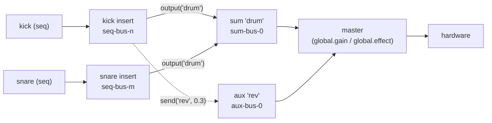

> **Note**: 本ページは 2026-09-01 時点での著者の reading の足跡で、2026-09-04 に #611 PR-O0（[#728](https://github.com/signalcompose/orbitscore/pull/728)）の測定に関する発見、2026-09-05 に #649 PR-O2（[#754](https://github.com/signalcompose/orbitscore/pull/754)）の master ライン導入、2026-09-08 に #611 PR-O3a（[#811](https://github.com/signalcompose/orbitscore/pull/811)）の line program 化と PR-O3b（[#823](https://github.com/signalcompose/orbitscore/pull/823)）の `SetBusLine` wire まで追従しました。code が真実、本ページはその時点の理解の snapshot に過ぎません。

# SC-2. ミキサーとオーディオライン — sum / aux / send / output / master gain

本章は OrbitScore の「ミキサー」を追います。`global.sum()` / `global.aux()` で宣言した bus に
`seq.output()` / `seq.send()` で音を流し込み、`global.gain()` でマスターを絞る — DAW なら
ミキサー画面で当たり前にやる操作が、TS の DSL 層から Rust daemon の render callback まで
どう配線されているかを、仕様（core spec MX.1〜MX.5）と実装の両方から読みます。

対象 Issue は 4 つです。ミキサー DSL の仕様を決めた
[#453](https://github.com/signalcompose/orbitscore/issues/453) /
[#459](https://github.com/signalcompose/orbitscore/issues/459)、instrument をミキサーの
source に載せ替えてマスターフェーダーを配線し直した
[#643](https://github.com/signalcompose/orbitscore/issues/643)、そして「フェーダーという段を
作らない」オーディオライン設計の
[#649](https://github.com/signalcompose/orbitscore/issues/649)。最後の #649 は 2026-08-30 時点で
**設計のみ**で実装されていないので、本章では「決まっていること」と「まだ決まっていないこと」を
分けて読みます。

per-sequence insert bus（`seq.effect()`）そのものは [RE-3](/rust-engine/insert-bus) が扱って
いるので、本章は「insert bus の**先**」— bus 同士の合流と master への出口 — に集中します。
capture E2E の仕組みは [RE-4](/rust-engine/capture-verification) を参照してください。

## ルーティングモデル — source は行き先を指す

まず仕様の絵を頭に入れましょう。core spec MX.1 は次の一文でモデルを定義しています。

> 各 source（seq）・各バスは **オーディオライン**を 1 本持つ。ラインは要素の列であり、要素は
> **ラック**（`effect([...])`・SC.10）・**ゲイン**（`gain(db)`）・**パン**（`pan(v)`）・
> **出口**（`output(dest, thru:, db:)` / その糖衣の `send`）の 4 種だけである。
> 信号はラインを**先頭から順に**通り、出口に達した位置の信号が宛先へ加算される。
>
> — `docs/core/INSTRUCTION_ORBITSCORE_DSL.md` MX.1

> ⚠️ **この一文は 2026-09-03 に書き換わりました**（#611 / #649）。それ以前の MX.1 は
> 「source → insert → sum → master の直列と send → aux → master の並列タップ」という
> **固定トポロジ**を規定していました。以下で読む**実装は今もその固定トポロジのまま**で、
> ラインへの一般化は PR-O3（wire）→ PR-O4（DSL）で入ります。本章は
> **「今の実装」と「これから向かう先」の両方**を扱います。

図にするとこうなります。



ポイントは「**エッジは source が行き先を指す**」という向きです。sum bus 側が「メンバーは kick と
snare」と列挙するのではなく、kick と snare がそれぞれ `output("drum")` と宣言します。
これは後で見る `SetBusRouting` の形（seq bus が output 先と send 先を持つ）にそのまま対応します。

仕様の DSL サンプルも引用しておきます（spec の Markdown から逐語）。

```js
// docs/core/INSTRUCTION_ORBITSCORE_DSL.md:1782-1786
global.sum("drum")                    // group bus 宣言（冪等）
kick.output("drum")                   // メンバーシップ = 行き先指定
snare.output("drum")                  // 同じ宛先なので加算される
sum("drum").effect("GlueComp.clap")   // group bus 自身の insert（PH.2b と同規則）
sum("drum").remove("GlueComp")        // 外す（差し替え・削除は PH.2d）
```

```js
// docs/core/INSTRUCTION_ORBITSCORE_DSL.md:1876-1878
global.aux("rev")                     // return bus 宣言
aux("rev").effect("Reverb.clap")      // return の insert（v1 必須要素）
kick.send(verb, -12)                  // ≡ kick.output(verb, thru: true, db: -12)
```

v1 の制約として、MX.5 は **PDC（plugin latency 補償）なし・sum のネスト不可・
LinkAudio と相互排他** を明記しています。

かつてここには「**send は post-fader 固定**」も並んでいました。この項目は 2026-09-03 の
spec 改訂で MX.5 から**削除**されています — フェーダーという段が無くなり、送りの位置は
「ラインのどこに `output` を置いたか」で決まるようになったためです（MX.1 / MX.3）。
ただし**実装は今も post-insert 固定**で、この乖離は PR-O4 で解消されます。
後半でもう一度触れます。

## DSL の入口: `global.sum()` / `global.aux()` → `MixerManager`

TS 側の司令塔は `packages/engine/src/core/global/mixer-manager.ts` の `MixerManager` です。
`Global.sum(name)` / `Global.aux(name)`（`global.ts:481-489`）は `this.mixerManager.sum(name)` /
`.aux(name)` へ委譲するだけの薄い入口で、実体は `declareBus`（`mixer-manager.ts:251-283`）に
あります。空文字チェックの後に、bus 名の予約・LinkAudio 排他・pool からの確保、という 3 段が
並びます。

```typescript
// packages/engine/src/core/global/mixer-manager.ts:263-283
    if (name === 'master') {
      throw new Error(
        `global.${kind}("master") is reserved: "master" names the output endpoint, not a ` +
          `${kind} bus. Choose a different name for this ${kind} bus.`,
      )
    }
    if (this.linkAudioManager.isEnabled()) {
      throw new Error(`global.${kind}() cannot be used while LinkAudio is enabled in v1.`)
    }

    const state = this.kinds[kind]
    let bus = state.buses.get(name)
    if (bus === undefined) {
      bus = state.pool.acquire(name)
      state.buses.set(name, bus)
      if (this.kindsWithBus(name).length > 1) {
        console.warn(MixerManager.ambiguousMessage(name))
      }
    }
    return this.makeHandle(kind, name, bus)
  }
```

`"master"` が予約語として弾かれている理由がコメントに書かれています。後述の
`SetBusRouting` は `output: "master"` を「sum への出力を解除して master へ戻す」という
予約語として解釈するので、同名の sum bus が存在すると黙って影に隠れてしまうのです。
`var master = mix.sum` のような Signal Chain のノード宣言形も同じ `sum()` に到達するため、
ここ 1 箇所でガードする、という設計です。

冪等性にも注目してください。`state.buses.get(name)` が既にあれば pool から取らずに同じ bus を
返します。仕様の「同名 = 同一 node・再評価は再束縛」を、名前をキーにした `Map` で
そのまま実現しています。

### bus 名の契約: TS と Rust で prefix を共有する

pool から確保される名前は `sum-bus-0` … `sum-bus-3` / `aux-bus-0` … `aux-bus-3` です。
prefix と上限は TS 側の定数として置かれていて、コメントが「Rust 側と一致させること」と
明言しています。

```typescript
// packages/engine/src/core/global/mixer-manager.ts:16-29
/**
 * `sum-bus-<n>` / `aux-bus-<n>` default pool prefixes. Must match
 * `DEFAULT_SUM_BUS_POOL_PREFIX` / `DEFAULT_AUX_BUS_POOL_PREFIX` in
 * `rust/crates/orbit-audio-daemon/src/engine_wrap.rs` (MX.4, #459/#453 M3) — changing
 * one requires changing the other.
 */
export const SUM_BUS_PREFIX = 'sum-bus-'
export const AUX_BUS_PREFIX = 'aux-bus-'

/**
 * v1 cap: at most 4 sum buses and 4 aux buses concurrently declared. Must match
 * `DEFAULT_SUM_BUS_POOL_SIZE` / `DEFAULT_AUX_BUS_POOL_SIZE` in `engine_wrap.rs`.
 */
export const MIXER_BUS_POOL_SIZE = 4
```

対応する Rust 側の定数は daemon の `engine_wrap.rs` にあります。

```rust
// rust/crates/orbit-audio-daemon/src/engine_wrap.rs:2123-2136
/// `sum-bus-<n>` 既定プールの名前 prefix。TS 側 `seq.output(sum)` が同じ規則で名前を組み立てる
/// （M3 で配線予定）。
#[cfg(feature = "outproc-effect")]
pub const DEFAULT_SUM_BUS_POOL_PREFIX: &str = "sum-bus-";
/// `aux-bus-<n>` 既定プールの名前 prefix。TS 側 `seq.send(aux, gain)` が同じ規則で名前を組み立てる
/// （M3 で配線予定）。
#[cfg(feature = "outproc-effect")]
pub const DEFAULT_AUX_BUS_POOL_PREFIX: &str = "aux-bus-";
/// `ORBIT_SUM_BUS_POOL` の既定サイズ（未設定時）。
#[cfg(feature = "outproc-effect")]
const DEFAULT_SUM_BUS_POOL_SIZE: usize = 4;
/// `ORBIT_AUX_BUS_POOL` の既定サイズ（未設定時）。
#[cfg(feature = "outproc-effect")]
const DEFAULT_AUX_BUS_POOL_SIZE: usize = 4;
```

つまり `global.sum("drum")` と書いたとき、daemon には `"drum"` という名前は届きません。
TS が `"drum" → "sum-bus-0"` と束縛し、daemon へは常に `sum-bus-0` のような pool 名で
話しかけます。daemon 側は起動時に `ORBIT_SUM_BUS_POOL` / `ORBIT_AUX_BUS_POOL`（既定 4）の
数だけ inactive な stage を確保して待っている、という構図です（insert bus の
`ORBIT_EFFECT_BUS_POOL` と同じ機構・[RE-3](/rust-engine/insert-bus) 参照）。

面白いのは、daemon が bus の「種類」を prefix 文字列からではなく構築時の enum
`BusKind { Insert, Sum, Aux }`（`engine_wrap.rs:1950-1961`）で持っている点です。doc コメントは
「`SetBusRouting` の検証を prefix 文字列比較に依存させないため、構築時に確定した値として明示的に
持つ」と説明しています。この `BusKind` が、後で見る `SetBusRouting` の検証（output 先は sum のみ・send 先は aux のみ）の
根拠になります。名前の規則と種類の検証を分離しておくことで、prefix を変えても検証ロジックが
壊れない作りです。

## `seq.output()` の 3 分岐と `seq.send()`

次に、sequence 側から bus へ「行き先を指す」入口を読みます。`Sequence.output()` は引数が
sum 名なのか、数値の render bus なのか、LinkAudio channel 名なのかで **3 分岐** します。
解決順は仕様（#598 §4.4）で固定されていて、コード上もその順で並んでいます。

> ⚠️ **この 3 分岐のうち 2 つは、2026-09-03 の spec 改訂で行き先が変わりました**（#611 / #649）。
> **数値 render bus の分岐（`kick.output(1)`）は撤回**されました（core spec MX.2.3）— 宛先はすべて
> 「宣言されたノード」であるという裁定と整合しないためで、stem への書き出しは `mix.render(...)` の
> ノードを宛先に取る形へ移ります。**LinkAudio channel の分岐は解決順の最後**へ後退し、その手前に
> 予約語 `"master"`・宣言済み sum / aux 名・`"3,4"` 形式の物理アウト対が入ります（core spec MX.2.1）。
> 🔴 **以下で読むコードはどちらの改訂にも追従していません** — `kick.output(1)` は今日も受理されて
> `_renderBus` に記録され、`kick.output("master")` は今日も LinkAudio channel 名として記録されます。
> 追従は #598 の PR-R 系（撤回）と #611 の PR-O4（解決順）です。

```typescript
// packages/engine/src/core/sequence.ts:381-406
  output(channelName: string | number): this {
    const name = this.stateManager.getName() || 'sequence'
    const destinationName = typeof channelName === 'number' ? String(channelName) : channelName
    if (!destinationName || !destinationName.trim()) {
      throw new Error(`Sequence '${name}': output(channelName) requires a non-empty channel name.`)
    }

    // Resolution order is normative (#598 §4.4): an existing sum named "1" must still win over
    // numeric render-bus interpretation. This lookup therefore deliberately precedes the number
    // branch below.
    const sumBus = this.global.resolveSumBus(destinationName)
    if (sumBus) {
      if (this.isMidi()) {
        throw new Error(
          `Sequence '${name}': output("${destinationName}") cannot target a mixer bus. ` +
            `MIDI is sent to an external device and therefore has no mixer output destination.`,
        )
      }
      // §4.4.1: live 宛先の宣言は render bus をクリアする（stale な offline 宛先を残さない）。
      this._renderBus = undefined
      this._insertBus = this._insertBus ?? this.global.ensureSequenceInsertBus(name)
      this._sumOutputBus = sumBus
      this.syncBusRouting()
      this.syncInstrumentSourceRouting()
      return this
    }
```

sum 分岐で注目したいのは `this._insertBus ?? this.global.ensureSequenceInsertBus(name)` です。
`seq.effect()` を宣言していない sequence でも、`output(sum)` を呼んだ瞬間に
**plugin を載せない pass-through の insert bus** が確保されます。daemon にとって routing の
source は常に「seq bus」なので、bus が無いと `SetBusRouting` の主語が作れないからです。
`SequenceEffectManager.ensureBus()` の doc コメント（`sequence-effect-manager.ts:89-97`）が
「DAW の、insert plugin は無いが routing 可能な track」と例えてこの事情を説明しています。本体は
短く、`Map` にあれば返し、無ければ pool から取るだけです。

```typescript
// packages/engine/src/core/global/sequence-effect-manager.ts:98-104
  ensureBus(sequenceName: string): string {
    const existing = this.buses.get(sequenceName)
    if (existing) return existing
    const bus = this.pool.acquire(sequenceName)
    this.buses.set(sequenceName, bus)
    return bus
  }
```

残りの 2 分岐（数値 render bus は `sequence.ts:377-401`・LinkAudio channel は `403-432`）には
#643 PR-2 で instrument 向けのガードが追加されました。instrument の `output(1)` は「offline render
bus は instrument 未対応」、`output("Kick Ch")` は「LinkAudio は instrument 向けに未配線」として
それぞれ throw します。「宛先だけ記録して音が従わない silent failure」を避けるためです
（設計文書 §12 の 3 分岐表・midi 側は破壊的変更になるため据え置き）。

MIDI シーケンスは sum 分岐で例外になります（`isMidi()` → throw）。#643 の設計文書が owner
の言葉として記録している「三条」— **ミキサーの bus 仕様は audio と instrument で同一・
midi だけがミキサーと無関係・例外は LinkAudio が出力先の時だけ** — が、ここのガード分割に
そのまま現れています。

`send()` も同じ形です。aux が未宣言ならエラー、`amount` は有限値のみ、複数回呼べば
fan-out、同じ aux 名なら上書きです。

```typescript
// packages/engine/src/core/sequence.ts:490-517
  send(auxName: string, amount: number): this {
    const name = this.stateManager.getName() || 'sequence'
    if (!auxName || !auxName.trim()) {
      throw new Error(`Sequence '${name}': send(auxName, amount) requires a non-empty aux name.`)
    }
    if (this.isMidi()) {
      throw new Error(
        `Sequence '${name}': send() cannot target a mixer bus. ` +
          `MIDI is sent to an external device and therefore has no mixer output destination.`,
      )
    }
    const auxBus = this.global.resolveAuxBus(auxName)
    if (!auxBus) {
      throw new Error(
        `Sequence '${name}': send("${auxName}", ...) references an undeclared aux bus. ` +
          `Call global.aux("${auxName}") first.`,
      )
    }
    if (!Number.isFinite(amount)) {
      throw new Error(`Sequence '${name}': send("${auxName}", ${amount}) gain must be finite.`)
    }

    this._insertBus = this._insertBus ?? this.global.ensureSequenceInsertBus(name)
    this._auxSends.set(auxBus, amount)
    this.syncBusRouting()
    this.syncInstrumentSourceRouting()
    return this
  }
```

`_auxSends` が `Map<string, number>` で、キーが **pool 名（`aux-bus-n`）** になっている点は
覚えておいてください。#649 の設計が「メソッドは完全に独立したスライスを更新する」と
確認した根拠の 1 つがこの Map です。

## routing を daemon へ届ける: `SetBusRouting`

`output()` / `send()` の末尾で呼ばれる `syncBusRouting()`（`sequence.ts:543-570`）は
fire-and-forget で、`this.global.setBusRouting(bus, this._sumOutputBus, buildRoutingSends(this._auxSends))`
と **output + 全 send を毎回まとめて** `SetBusRouting` に載せます。差分ではなく全量を送るのは、
再送が冪等になるようにするためです。失敗時は `_busRoutingStale` を立て、`DaemonProtocolError`
（daemon 側の決定的な拒否）なら `console.error` で「routing was NOT applied」、それ以外は
`console.warn` で「will re-sync」と出し分けます。Signal Chain 構文から呼ばれる awaitable 版が
`pushBusRouting()`（`522-535`）で、同じ引数を組み立てます。

`RustEnginePlayer.setBusRouting`（`rust-engine-player.ts:949-969`）は intent-first のキャッシュ
`busRoutings` を持ち、transport 断では intent を残して respawn 後に `reapplyBusRoutingAfterRespawn`
が再送、daemon が `DaemonProtocolError` で決定的に拒否した場合だけキャッシュを巻き戻します。
respawn した daemon は routing atomic が既定値に戻っているので、この再送が無いと sum / aux への
routing が黙って per-sequence 出力に退化します。

daemon 側 `set_bus_routing` の検証を見ると、「output 先は自分より後ろの stage で、かつ
`BusKind::Sum`」「send 先は後ろの stage で `BusKind::Aux`」「1 件でも失敗したら何も反映しない」
という規則が読み取れます。

```rust
// rust/crates/orbit-audio-daemon/src/engine_wrap.rs:6725-6745
        // 1. output target を検証（反映はまだしない・部分適用を避ける）。
        let resolved_output = match output {
            Some("master") => Some(1),
            Some(name) => {
                let target_index = *control.bus_index.get(name).ok_or_else(|| {
                    WrapError::OutProcEffect(format!("SetBusRouting output: unknown bus '{name}'"))
                })?;
                if target_index <= seq_index {
                    return Err(WrapError::OutProcEffect(format!(
                        "SetBusRouting output '{name}' (index {target_index}) must be a later stage than '{seq_bus}' (index {seq_index})"
                    )));
                }
                if control.bus_kinds.get(name) != Some(&BusKind::Sum) {
                    return Err(WrapError::OutProcEffect(format!(
                        "SetBusRouting output '{name}' must be a sum bus"
                    )));
                }
                Some(target_index + 2)
            }
            None => None,
        };
```

`Some("master") => Some(1)` が、先ほど TS 側で予約していた `"master"` の受け口です。
`target_index + 2` というエンコードは「0 = 変更なし / 1 = Master / 2 以降 = bus index」の
三状態を 1 つの atomic に詰めるためのもので、native 側の `routing_override` がこれを
読みます。

#611 PR-O3a 以降、この関数は検証のあとに **line program を 1 回 publish** し、旧 atomic には
**受理済みの値をミラーするだけ**になりました。ハンドルの解決順にも意味があります。

```rust
// rust/crates/orbit-audio-daemon/src/engine_wrap.rs:6771-6786
        // 3. Every compatibility handle is resolved before the one program publication, so a
        // missing slot cannot leave only part of the requested routing applied.
        let routing_handle = if resolved_output.is_some() {
            Some(control.bus_routing.get(seq_bus).ok_or_else(|| {
                WrapError::OutProcEffect(format!("bus '{seq_bus}' has no routing handle"))
            })?)
        } else {
            None
        };
        let send_slots = if resolved_sends.is_empty() {
            None
        } else {
            Some(control.bus_sends.get(seq_bus).ok_or_else(|| {
                WrapError::OutProcEffect(format!("bus '{seq_bus}' has no send slots"))
            })?)
        };
```

routing handle も send slot も、**何かを書き込む前に**すべて取り終えます。以前は output を
atomic へ store してから send slot を引いていたので、send slot が無い bus では
「output だけ反映された状態でエラーを返す」ことがあり得ました。doc コメントが最初から
掲げていた「1 件でも検証に失敗したら何も反映しない」を、実装が満たすようになった形です。

publish されるのは、既存の send を読み直して**列挙されなかったぶんも含めた完全な program**
です（`enabled_sends` は gain が `0.0` でない slot だけを拾います）。旧 API の「列挙された
send だけを反映する」という部分更新の意味論を、毎回まるごと組み直すことで再現しています。

### render 側: post-loop がトポロジカル順に合流させる

daemon が atomic に書いた routing を、native の render callback はどう消費するのでしょうか。
`output.rs` の `render_engine_with_insert_buses_and_source_outputs` の後半、いわゆる
**post-loop** がその場所です。

```rust
// rust/crates/orbit-audio-native/src/output.rs:2229-2255
    let feeds = collect_source_feeds(sources, rendered_units, &bus_positions, bs);
    engine.render_multi_feeds(hw, &mut targets, &feeds);
    drop(targets);

    // post-loop: execute each captured line in topological stage order. Bus outputs retain the
    // existing split_at_mut(i + 1) discipline; every target was validated before publication.
    for i in 0..buses.len() {
        if !render_targets[i] {
            continue;
        }
        // SAFETY: paired with the Acquire load above and the generation completion below.
        let program = unsafe { &*programs[i] };
        let mut first_output = true;
        let mut reached_end = true;
        for (op_index, op) in program.ops.iter().enumerate() {
            match *op {
                LineOp::Rack => {
                    if active_flags[i] {
                        if let Some(processor) = buses[i].processor.as_mut() {
                            processor.process(&mut buses[i].buffer[..bs]);
                        }
                    }
                }
                LineOp::Gain(target) => {
                    let gain = line_gain(
                        program,
                        op_index,
```

読み方はこうです。

1. `engine.render_multi_feeds(hw, &mut targets, &feeds)` で、scheduler が event を各 bus buffer
   （`targets`）と `hw` に混合し、feed（instrument の出力）も加算し、**master gain ramp を
   全 buffer に 1 回だけ**適用します（core 側の実装は次節）。ただし #649 PR-O2 以降、この
   `hw` は**デバイスのバッファではなく 2ch の `master.buffer`** で、core の gain も production では
   1.0 に固定されています（後述の「master gain の適用点が移った」を参照）
2. post-loop は stage を配列順（= トポロジカル順・MX.4）に回します。ただし #611 PR-O3a 以降、
   各 stage で何をするかは `effective_targets[i]` の分岐ではなく、その stage に **publish されて
   いる line program**（`LineOp` の列）が決めます。`LineOp::Rack` が insert の
   `processor.process`、`LineOp::Output` が `hw`（Master）か後ろの bus（`Bus(j)`）への加算です
3. 引用の続き（`output.rs:2160-2184`）が `LineOp::Output` の本体で、`gain` を掛けた copy 加算に
   なっています（fan-out は event の複製ではなく「bus 処理段の copy 加算」という MX.4 の規範どおり）

`split_at_mut(i + 1)` で左右に分けられるのは、構築時に `validate_bus_topology` が
「stage i の行き先は必ず i より後ろ」を検証しているからです。sum のネストや循環が
**構造的に**起きない、という仕様（MX.2「ネストは v1 不可」）の実装側の裏付けがここにあります。

### line program — 出口を「命令列」として持つ（#611 PR-O3a）

2026-09-08 の [#811](https://github.com/signalcompose/orbitscore/pull/811)（束 O-wire）で、
post-loop の中身が「`effective_targets[i]` を見て 1 箇所に足す」から
「stage ごとの命令列を頭から実行する」へ置き換わりました。命令の型はこの 3 つです。

```rust
// rust/crates/orbit-audio-native/src/output.rs:953-978
/// A resolved output destination for one line operation. Bus and channel names are converted to
/// stable indices on the control thread before a program is published.
#[derive(Debug, Clone, Copy, PartialEq, Eq)]
pub enum OutputDest {
    Master,
    Bus(usize),
    Device { left: usize, right: Option<usize> },
    Render(usize),
    Link(usize),
}

#[derive(Debug, Clone, Copy, PartialEq)]
pub struct LineOutput {
    pub dest: OutputDest,
    pub thru: bool,
    pub gain: f32,
}

/// One operation in a bus line. `Pan` is reserved for PR-O4; this PR does not generate it.
#[derive(Debug, Clone, Copy, PartialEq)]
pub enum LineOp {
    Rack,
    Gain(f32),
    Pan(f32),
    Output(LineOutput),
}
```

目を引くのは `LineOutput.thru` でしょう。「この出口に出したあとも命令列を続けるか」を表す
真偽値で、`false` なら post-loop はそこで `break` します。旧実装の「output_target へ 1 回
足して、あとは sends を全部足す」という形は、この語彙では
**`Output(output_target, thru = sends があるか)` に続けて send の本数だけ `Output(..)` を並べ、
最後だけ `thru = false`** と書けます。実際 `LineProgram::legacy` がその変換を行っており、
旧 API の呼び出しは内部で line program に写されてから RT へ渡ります。

出口の実行部分はこうなっています。

```rust
// rust/crates/orbit-audio-native/src/output.rs:2268-2292
                LineOp::Output(output) => {
                    let dest = effective_line_output_dest(
                        &mut first_output,
                        legacy_targets[i],
                        output.dest,
                    );
                    let gain = line_gain(
                        program,
                        op_index,
                        output.gain,
                        bs / output_channels,
                        buses[i].line.ramp_frames,
                    );
                    match dest {
                        OutputDest::Master => {
                            add_scaled(hw, &buses[i].buffer[..bs], gain);
                        }
                        OutputDest::Bus(target) => {
                            let (left, right) = buses.split_at_mut(i + 1);
                            add_scaled(
                                &mut right[target - i - 1].buffer[..bs],
                                &left[i].buffer[..bs],
                                gain,
                            );
                        }
```

`OutputDest` は 5 値ありますが、この束で RT が実行するのは `Master` / `Bus` / `Device` の
3 つだけです。`Pan` / `Render` / `Link` は **install の時点で弾かれます**。

```rust
// rust/crates/orbit-audio-native/src/output.rs:1294-1302
    for op in &program.ops {
        match op {
            // These arms are availability gates, not permanent format restrictions. Remove the
            // corresponding rejection when the follow-up PR wires that variant into RT execution;
            // until then accepting it would report success for a program the callback ignores.
            LineOp::Pan(_) => {
                return Err(OutputError::NoConfig(
                    "line program Pan is not wired into RT execution".into(),
                ));
```

「型としては先に置くが、RT が実行できないうちは install を成功させない」という書き方です。
受理してしまうと「呼び出しは成功したのに callback は無視する」という、いちばん見つけにくい
種類の silent failure になります。

#### 互換のための 2 つの仕掛け

この束の主張は「配線を入れ替えたが、音は変わっていない」なので、旧 API の意味論を
そのまま保つ仕掛けが 2 つ入っています。

1 つめが `effective_line_output_dest` です。

```rust
// rust/crates/orbit-audio-native/src/output.rs:1340-1351
fn effective_line_output_dest(
    first_output: &mut bool,
    legacy_target: Option<OutputDest>,
    program_target: OutputDest,
) -> OutputDest {
    if *first_output {
        *first_output = false;
        legacy_target.unwrap_or(program_target)
    } else {
        program_target
    }
}
```

`with_routing_overrides` で作られた stage は旧来の atomic（`routing_override`）を持ち続けており、
そこに値が入っていれば **命令列の最初の `Output` だけ**が上書きされます。2 つめ以降の
`Output`（= send）は program の値をそのまま使います。旧 API の「output だけ差し替える」という
部分更新が、命令列の世界でも同じ意味になるようにした対応付けです。

2 つめが `LineProgram::settled` です。`LineProgram::new` の gain セルは 1.0 から目標値へ
ramp しますが、旧経路の gain は**最初の callback から即座に効いていました**。`legacy` が
`settled`（= 全セルが最初から目標値）を使うのはそのためで、ramp の有無で 1 block 目の
音が変わることを避けています。

#### 差し替えは AtomicPtr + 世代カウンタ

line program は control スレッドが作って RT スレッドが読むので、差し替えの安全性を
どう取るかという問題が出ます。`LineExchange` の答えは「RT は Acquire load 1 回だけ・
回収は control 側」です。

```rust
// rust/crates/orbit-audio-native/src/output.rs:1092-1097
struct LineExchange {
    live: AtomicPtr<LineProgram>,
    retired: Mutex<Vec<RetiredLineProgram>>,
    /// Completed RT generations. The audio thread is the sole writer; control only Acquire-loads.
    generation: AtomicU64,
}
```

`install` は新しい `Box` を `swap` で publish し、外れた古い box を
**`completed + 2` 世代まで retired リストに保持**します（in-flight の読み手のぶん 1 + 予備 1）。
RT 側は callback の頭で全 stage 分のポインタを 1 回ずつ Acquire load し、
callback の最後に `finish_generation()` で世代を進めます。**alloc / lock / drop は
すべて control 側**に寄っているので、RT の契約は崩れません。

ここで面白いのは、**marking pass（`render_targets` の計算）と実行が同じポインタ snapshot を
共有している**点です。

```rust
// rust/crates/orbit-audio-native/src/output.rs:2157-2174
        // SAFETY: the line generation is not completed until after execution below. Control keeps
        // any replaced box retired for two later completed generations.
        let program = unsafe { &*programs[i] };
        let mut first_output = true;
        let mut reached_end = true;
        for op in &program.ops {
            if let LineOp::Output(output) = op {
                let dest =
                    effective_line_output_dest(&mut first_output, legacy_targets[i], output.dest);
                if let OutputDest::Bus(target) = dest {
                    render_targets[target] = true;
                }
                if !output.thru {
                    reached_end = false;
                    break;
                }
            }
        }
```

「どの bus を zero-fill して post-loop で処理するか」を決める pass と、実際に加算する pass が
**別々に program を load すると、その間に install が入ったときに 2 つの pass の意見が食い違い**、
合流先が前 block のゴミを持ち越したり、逆に鳴るはずのないバスが鳴ったりします。
1 callback につき 1 snapshot、世代の publish は両方が終わってから、という順序でそれを封じています。

`if !output.thru { break }` が **2 箇所ある**（marking pass と実行）ことも、ここから読み取れます。
片方だけ止まると「描画対象としては生きているのに加算されない」あるいはその逆になります。

### `SetBusLine` — ラインを丸ごと置き換える wire（#611 PR-O3b）

PR-O3a で daemon の内部は line program になりましたが、wire は `SetBusRouting`
（「output 先」と「send 一覧」という旧モデルの語彙）のままでした。#611 PR-O3b
（PR [#823](https://github.com/signalcompose/orbitscore/pull/823)）が、**ライン全体を 1 命令で
送る** `SetBusLine` をその隣に足します。旧 `SetBusRouting` は併存したままで、撤去は PR-O6 です。

wire の語彙は TS 側にも型として置かれました。`dest` が 5 種類、op が 3 種類という素直な直和です。

```typescript
// packages/engine/src/audio/rust-engine/daemon-client.ts:86-96
export type WireDest =
  | { kind: 'master' }
  | { kind: 'bus'; name: string }
  | { kind: 'device'; channels: [number, number] }
  | { kind: 'render'; id: string }
  | { kind: 'link'; channel: string }

export type WireLineOp =
  | { op: 'rack' }
  | { op: 'gain'; gain: number }
  | { op: 'output'; dest: WireDest; thru: boolean; gain: number }
```

送信側は 1 行です。ここで押さえておきたいのは、**この時点で呼び出し元が 1 つも無い**という点で、
DSL から実際に送るようになるのは PR-O4 からになります。

```typescript
// packages/engine/src/audio/rust-engine/daemon-client.ts:715-718
  /** Replace one daemon bus's complete ordered audio line (#611 wire contract §4.1). */
  async setBusLine(bus: string, line: WireLineOp[]): Promise<void> {
    await this.request('SetBusLine', { bus, line })
  }
```

#### 検証が 2 層に分かれている

面白いのは、検証が **session 層と `EngineWrap` 層に分けられた**ことです。session 側は JSON の
形（op 名・`gain` が有限で 0 以上・`rack` は 1 個まで・`master` ラインが `master` や bus を
指していないこと）だけを見て、名前から RT の index への解決には立ち入りません。

```rust
// rust/crates/orbit-audio-daemon/src/session.rs:304-316
/// `SetBusLine` の一方通行 wire shape を完全に検証してから engine 用 vocabulary を返す。
#[cfg(feature = "outproc-effect")]
fn parse_set_bus_line_params(params: &Value) -> Result<(String, Vec<BusLineOp>), ProtocolError> {
    let bus = match params.get("bus") {
        Some(Value::String(bus)) if !bus.trim().is_empty() => bus.clone(),
        _ => return Err(set_bus_line_malformed("'bus' must be a non-empty string")),
    };
    let items = params
        .get("line")
        .and_then(Value::as_array)
        .ok_or_else(|| set_bus_line_malformed("'line' must be an array"))?;
    let mut line = Vec::with_capacity(items.len());
    let mut rack_seen = false;
```

dispatch はその 3 段（形の検証 → デバイスチャンネルの範囲検証 → engine への委譲）を並べただけで、
feature が無いビルドには `UNSUPPORTED` を返す別腕が用意されています。

```rust
// rust/crates/orbit-audio-daemon/src/session.rs:2633-2656
        #[cfg(feature = "outproc-effect")]
        "SetBusLine" => match parse_set_bus_line_params(&params) {
            Ok((bus, line)) => {
                if let Err(error) =
                    validate_set_bus_line_device_channels(&line, engine.output_channels())
                {
                    err(&id, error)
                } else {
                    match engine.set_bus_line(&bus, &line) {
                        Ok(()) => ok(&id, json!({"status": "accepted"})),
                        Err(error) => err(&id, wrap_err_to_protocol(&error)),
                    }
                }
            }
            Err(error) => err(&id, error),
        },
        #[cfg(not(feature = "outproc-effect"))]
        "SetBusLine" => err(
            &id,
            ProtocolError::new(
                "UNSUPPORTED",
                "SetBusLine requires the outproc-effect build (mixer bus graph)",
            ),
        ),
```

なぜ `validate_line_program`（前節で見た install 時ゲート）に任せなかったのでしょうか。
あちらは `Pan` / `Render` / `Link` を
`OutputError::NoConfig` で拒否する **RT 実行の可用性ゲート**で、その文言をそのまま wire へ流すと
デバイス設定エラー扱いの code になってしまい、wire 契約の表のどの行とも噛み合いません。
そこで契約の表を**先に**適用し、可用性ゲートは無改変のまま後ろに残す、という順序になっています。

拒否の code は、テストが期待している値でそのまま読み取れます。

| 何を拒否したか | code |
|---|---|
| 形式不正・`rack` の二重・`master` ラインの自己参照・`render` 宛て | `MALFORMED_REQUEST` |
| `dest.device` のチャンネルが範囲外、または左右が同じ | `PARAM_OUT_OF_RANGE` |
| `dest.bus` が未知、または forward-only 違反 | `OUTPROC_EFFECT_RUNTIME` |
| `dest.link`（`link-audio` feature の無いビルド） | `LINK_AUDIO_UNAVAILABLE` |
| `outproc-effect` feature の無いビルド | `UNSUPPORTED` |

#### forward-only は残り、kind 制約は無い

`EngineWrap::set_bus_line` の側は、名前を index へ解決しながら **forward-only**（自分より後段の
bus しか指せない）を見ます。ここで気づきたいのは、`set_bus_routing` にあった **kind 制約
（output 先は sum のみ・send 先は aux のみ）が `SetBusLine` には無い**ことです。ライン上の
出口は「先の段のバス」であればよく、それが sum か aux かは問われません。

```rust
// rust/crates/orbit-audio-daemon/src/engine_wrap.rs:6616-6631
                    let dest = match dest {
                        BusLineDest::Master => OutputDest::Master,
                        BusLineDest::Bus(name) => {
                            let target = *control.bus_index.get(name).ok_or_else(|| {
                                WrapError::OutProcEffect(format!(
                                    "SetBusLine output: unknown bus '{name}'"
                                ))
                            })?;
                            if target <= bus_index {
                                return Err(WrapError::OutProcEffect(format!(
                                    "SetBusLine output '{name}' (index {target}) must be a later stage than '{bus}' (index {bus_index})"
                                )));
                            }
                            referenced_buses.push(name.as_str());
                            OutputDest::Bus(target)
                        }
```

解決が全部終わってから publish が 1 回だけ走る、という組み立ても `set_bus_routing` と同じです。
途中の 1 要素が失敗したら publish には到達しないので、**前のラインがそのまま生き残ります**。

```rust
// rust/crates/orbit-audio-daemon/src/engine_wrap.rs:6664-6679
        let installer = self
            .bus_line_programs
            .lock()
            .map_err(|_| WrapError::OutProcEffect("bus line mutex poisoned".into()))?
            .get(bus)
            .cloned()
            .ok_or_else(|| {
                WrapError::OutProcEffect(format!(
                    "SetBusLine: unknown bus '{bus}' (no registered RT line)"
                ))
            })?;
        installer(LineProgram::new(resolved), bus_index, bus_count).map_err(|error| {
            WrapError::OutProcEffectRequest(format!(
                "SetBusLine program failed validation: {error}"
            ))
        })?;
```

#### `master` も同じ publish に乗った

`SetBusLine` の `bus` は `"master"` を受け付けます。受け皿として PR-O3b は `MasterLine` にも
`line: LineSlot` を足し、publish 済みかどうかを `explicit_line` で見て render を分岐させました
（分岐は `rust/crates/orbit-audio-native/src/output.rs:1719-1721`、汎用側の実行は同 `:1765-1821`）。

その install ハンドルがこれです。

```rust
// rust/crates/orbit-audio-native/src/output.rs:790-798
    pub fn line_program_installer(&self) -> LineProgramInstaller {
        let control = self.line.line_control();
        let explicit = self.explicit_line.clone();
        Arc::new(move |program, bus_index, bus_count| {
            control.install_for_bus(program, bus_index, bus_count)?;
            explicit.store(true, Ordering::Release);
            Ok(())
        })
    }
```

`EngineWrap` はこのハンドルを **`SetBusLine("master", …)` だけでなく `SetGlobalGain` からも**
呼びます（`rust/crates/orbit-audio-daemon/src/engine_wrap.rs:9284-9290`）。つまり
`explicit_line` が立つ条件は「`SetBusLine("master", …)` が来たとき」ではなく
「master ラインが一度でも publish されたとき」で、`global.gain()` の 1 回がそれに当たります。
[RE-1](/rust-engine/) の master gain の節に、そこから読み取れる差分（ランプ長の出どころと
再 publish 時のランプ起点）を書いてあります。

## instrument をミキサーの source にする（#643）

ここまでの routing は、もともと audio シーケンス（`audio()` / `chop()`）のためのものでした。
instrument（`seq.instrument()`）の音は、2026-08-29 の #643 PR-1 までは daemon の
`CompositePostProcessor` で **master バッファへ直接加算**されており、bus グラフの外に
いました。設計文書（`docs/design/643-mixer-foundation-design.md`）が「発端」として記録して
いるのは、そのせいで `effect()` / `output()` / `send()` の 3 つが note シーケンスで全部例外に
なっていたことです。

PR-1 の解は「instrument を **premaster contributor** にする」でした。土台（core / native）は
instrument が何かを知らず、「render すると N 本の block をくれる何か」という抽象だけを
持ちます。

```rust
// rust/crates/orbit-audio-native/src/output.rs:829-842
/// A callback-owned source which renders one or more interleaved output units.
pub trait BlockSource: Send {
    fn render(&mut self, frames: usize, transport: &BlockTransport) -> usize;
    fn output(&self, unit: usize) -> &[f32];
}

/// Destination of one source output unit.
#[derive(Debug, Clone, Copy, PartialEq, Eq, Default)]
pub enum SourceDest {
    #[default]
    Master,
    Bus(usize),
    Link(usize),
}
```

`SourceDest` が `Master / Bus / Link` の 3 値なのは、設計の「アドレスモデルは
`(instance, unit)` で今決める」（owner 確定事項）に対応します。`SourceSlot.dests` が
`Vec<SourceDestCell>` で、unit ごとに行き先を持てる形です。ただし 2026-09-01 時点の TS は
`unit` を 0 固定で発行しています（後述）。

feed の収集は `collect_source_feeds`（`output.rs:772-801`）が行い、unit ごとの `SourceDest` を
core の `FeedDest` に写します。写像の部分だけ引用します。

```rust
// rust/crates/orbit-audio-native/src/output.rs:1969-1979
            let dest = match slot.dests[unit].load() {
                SourceDest::Master => FeedDest::Hardware,
                SourceDest::Bus(index) => bus_positions
                    .get(index)
                    .copied()
                    .flatten()
                    .map_or(FeedDest::Hardware, FeedDest::Channel),
                // Link source routing is wired in PR-3. Until then it is a total hardware fallback.
                SourceDest::Link(_) => FeedDest::Hardware,
            };
            feeds.push((output, dest));
```

`SourceDest::Link(_) => FeedDest::Hardware` のコメントにあるとおり、instrument → LinkAudio の
実配線は PR-3 として残されています。TS 側 `output()` の LinkAudio 分岐が instrument を
拒否していたのは、この fallback が「黙って hardware に出る」ことを silent failure として
封じるためです。

core 側の `render_multi_feeds`（`scheduler.rs:375-460`）を見ると、zero-fill → event 混合 →
feed 加算（`422-441`・`FeedDest::Hardware` なら `hardware_out`、`Channel(i)` なら該当 bus buffer に
`*dst += *sample`）→ gain ramp、の順になっています。gain ramp の部分を引用します。

```rust
// rust/crates/orbit-audio-core/src/scheduler.rs:447-460
        // master gain ramp を **1 回だけ**進め（next_gain_frame）、全バッファに同じ per-frame
        // gain を適用する（バッファごとに進めると ramp が多重に進み desync するため frame ループは 1 つ）。
        for frame in 0..frames_to_render {
            let g = self.next_gain_frame();
            let base = frame * output_channels;
            for ch in 0..output_channels {
                hardware_out[base + ch] *= g;
            }
            for (_, buf) in channels.iter_mut() {
                for ch in 0..output_channels {
                    buf[base + ch] *= g;
                }
            }
        }
```

設計文書 §5.1 はこの位置を「★ feed 加算ループ（新規 ~10行）」と書き、
「**これで `global.gain` が instrument に効かない現行欠陥が消える**（位置の修正のみ・別途の
手当て不要）」と結論していました。native の unit test
`global_gain_scales_instrument_contribution`（`output.rs:2017`）は、`set_global_gain(0.5, 0.0)` を
設定した状態で `SourceDest::Master` の feed を流し、出力が 0.5 倍になることを固定しています
（WORK_LOG 6.405 に red → green の実出力が残っています）。

### master gain の適用点が移った（#649 PR-O2）

ここまでの読みは 2026-09-05 に一度更新が要ります。#649 PR-O2
（[#754](https://github.com/signalcompose/orbitscore/pull/754)）で、**production の master gain は
この core の ramp を通らなくなりました**。daemon は `orbit_audio_core::Engine::set_global_gain` を
呼ばず、native 側の `MasterLine`（master ラック → gain → デバイス配置）の目標値へ atomic store
するだけになっています。実装の読み方は [RE-1](/rust-engine/) の「master ライン」節に
まとめました。

この移動で**順序が 1 つ入れ替わります**。core の ramp は「feed 加算の直後・post-loop の前」に
効いていたので、per-sequence insert の**前**に master gain が掛かっていました（DAW の
「fader は insert の後」と逆で、`docs/core/INSTRUCTION_ORBITSCORE_DSL.md` の PH.2b が
v1 の既知の制約として明記していた点です）。`MasterLine` の gain は全 stage が master へ合流し、
master ラックを通った**後**に掛かるので、per-sequence insert も `global.effect()` のラックも
master gain の**手前**に来ます。

設計文書（`docs/design/611-output-line-design.md` §5.4）はこの並びを「master のゲインは
master ラインの op としてラックの**後**に必ず来る」と書いています。掛ける位置という自由度を
無くすことで、位置ずれのバグをクラスとして消す、というのがこの並びの狙いです。

引用した core 側の gain ramp は消えたわけではなく、**core 単体テストとオフライン検証ハーネス
専用**として残っています（`render_offline` / `verify_schedule_pcm.rs` / `export_verify_pcm.rs`）。
`global_gain_scales_instrument_contribution` も同じ立場で、production の乗算経路ではなく core の
feed 合流位置を固定するテストとして読みます。オフラインレンダを production に載せる時は
master ラインを通さないと実時間レンダと音が食い違う、という注意が設計文書 §5.5 に追記されています。

### TS 側: `SetSourceRouting` の choke point

PR-2（TS 側）は、instrument sequence が insert bus を持った時点で
`SetSourceRouting { source: "plugin:<name>", unit: 0, target: <bus> }` を発行する経路を
1 箇所に集約しました。`instrument()` → `effect()` の順でも逆でも、ここを通ります。

```typescript
// packages/engine/src/core/sequence.ts:766-793
  private ensureInstrumentSourceRouting(): Promise<void> {
    if (!this.isInstrument() || !this._insertBus) return Promise.resolve()
    const bus = this._insertBus
    if (this._instrumentSourceRoutingBus === bus) {
      return this._instrumentSourceRoutingPromise ?? Promise.resolve()
    }
    if (!this.audioEngine.setSourceRouting) {
      return Promise.reject(new Error('Instrument mixer routing requires the Rust engine backend.'))
    }

    const name = this.stateManager.getName() || 'sequence'
    this._instrumentSourceRoutingBus = bus
    const pending = this.audioEngine
      .setSourceRouting(`plugin:${name}`, 0, bus)
      .catch((error) => {
        if (this._instrumentSourceRoutingBus === bus) {
          this._instrumentSourceRoutingBus = undefined
        }
        throw error
      })
      .finally(() => {
        if (this._instrumentSourceRoutingPromise === pending) {
          this._instrumentSourceRoutingPromise = undefined
        }
      })
    this._instrumentSourceRoutingPromise = pending
    return pending
  }
```

`_instrumentSourceRoutingBus` と `_instrumentSourceRoutingPromise` の 2 つで「同じ bus への
二重発行」を防ぎつつ、失敗時にはマーカーを外して再試行できるようにしています。
`output()` / `send()` の末尾で呼ばれていた `syncInstrumentSourceRouting()` は、この
Promise を fire-and-forget に包んだアダプタです。

E2E-4（後述）は、instrument が `output("sum643")` と `send("aux643", 0.5)` を同時に持つとき、
capture の RMS が dry の約 1.5 倍（sum 経由 1.0 + aux 経由 0.5）になることで、
この経路全体が実機で通っていることを示しています。

## マスターフェーダー `global.gain()` — 3 度読み直された配線

本章で一番読み応えがあるのがマスターゲインです。WORK_LOG 6.404 → 6.405 → 6.408 → 6.410 →
6.415 → 6.420 と、**同じ日（2026-08-29）から翌日にかけて理解が 3 回書き換わって**います。
順に追いましょう。

### (1) 旧実装: TS がイベントごとに畳み込んでいた

#643 PR-2 で直される前の `global.gain()` は、`masterGainDb` を **各 audio イベントの gain に足し込む**
方式でした（`event-scheduler.ts` の `sequenceGainDb + masterGainDb`）。instrument の note 経路には
この畳み込みが無かったため、**マスターが instrument に一切効かない**。しかも Rust 側には
最初から `set_global_gain`（gain ramp 付き）が存在していたのに、**TS が一度も呼んでいなかった**
のです（WORK_LOG 6.408）。

### (2) #643 PR-2: daemon の master gain に配線し直す

修正後の `Global.gain()` は dB を線形 amplitude に変換して `setGlobalGain` に渡します。

```typescript
// packages/engine/src/core/global.ts:601-613
  gain(valueDb?: number): number | this {
    const result = this.effectsManager.gain(valueDb)
    if (typeof result === 'number') {
      return result
    }
    // 線形 amplitude へ変換して daemon へ。fire-and-forget（DSL 表面を async にしない）。
    void this.audioEngine
      .setGlobalGain?.(gainDbToAmplitude(this.effectsManager.getMasterGainDb()))
      ?.catch((error) => {
        console.warn(`⚠️  global.gain(): failed to apply master gain to the mixer: ${error}`)
      })
    return this
  }
```

`AudioEngine` 側の契約は `setGlobalGain?(amplitude: number, rampSec?: number): Promise<void>`
の 1 行（`engine-backend.ts:46`）で、optional なので SC バックエンドでは何も起きません。
`RustEnginePlayer.setGlobalGain` は「daemon の状態に関わらず先に intent を記録する」のが要点です。

```typescript
// packages/engine/src/audio/rust-engine/rust-engine-player.ts:1286-1298
  async setGlobalGain(amplitude: number, rampSec = 0): Promise<void> {
    // 🔴 daemon の状態に関わらず**先に intent を記録する**。未接続時に捨てると、
    // 接続後に復元する手がかりが消える（`Global.gain()` を再評価する経路は存在しない）。
    this.globalGainIntent = { amplitude, rampSec }
    if (!this.daemon.isRunning()) {
      // daemon 未接続時は送らない。**intent は上で記録済み**なので、respawn 後に
      // `reapplyGlobalGainAfterRespawn()` が再送する。
      // （旧コメントは「次の起動時に global.gain() が再評価される」と書いていたが、
      //   そのような経路は存在しなかった — #648 レビューで指摘）
      return
    }
    await this.daemon.setGlobalGain(amplitude, rampSec)
  }
```

intent を残すのは respawn のためです。daemon は新プロセスで `global_gain = 1.0` から始まるので、
再送しないと「DSL 上は -6dB なのに実際は unity」がエラーもログも無く起きます。この退行は
PR #648 のレビュー（WORK_LOG 6.410・Critical 1 件目）で見つかり、
`reapplyGlobalGainAfterRespawn()` として `reapplyBusRoutingAfterRespawn` の鏡像に追加されました。

イベント側の畳み込みは外されましたが、`-Infinity`（完全無音）だけは残っています。
`calculateEventGain`（`event-scheduler.ts:30-65`）のコメントは、旧実装が `sequenceGainDb +
masterGainDb` を返していたこと、**insert との順序は変わっていない**こと（次節）を明記した上で、
残す理由をこう書いています。

```typescript
// packages/engine/src/core/sequence/scheduling/event-scheduler.ts:67-76
  // `masterGainDb === -Infinity`（完全無音）だけは残す — daemon 側の gain が 0.0 になるまでの
  // ramp 中に音が漏れるのを避けるため、発音側でも落とす。
  if (isMuted) {
    return -Infinity
  } else if (sequenceGainDb === -Infinity || masterGainDb === -Infinity) {
    return -Infinity
  } else {
    return sequenceGainDb
  }
}
```

### (3) 6.410 の訂正: master gain は今も insert の前

PR #648 の初稿は「バスに入る前に master を掛ける問題も解消」と 6 箇所に書いていましたが、
Fable 監査が spec の既知制約を指して誤りだと指摘しました。

> master gain ramp は per-sequence insert の**前**に適用される（DAW の「fader は insert 後」と逆・master unity なら影響なし）。
>
> — `docs/core/INSTRUCTION_ORBITSCORE_DSL.md` PH.2b 既知の v1 制約

先ほどの post-loop を読み直すと、たしかに `render_multi_feeds`（gain ramp）→
`processor.process`（insert）の順であり、#643 はこの順序を変えていません。「insert 後に
フェーダーを置く」は #649 の主題として持ち越されます。

> この節の「今も insert の前」は 6.410 時点の読みです。#649 PR-O2 で順序は入れ替わりました
> — 下の「(5) 4 度目の読み直し」を参照。

### (4) 6.415: capture E2E が「効いていない」を実機で捕まえた

ここからが本章の山場です。#633 の実機検証（WORK_LOG 6.415・2026-08-29）で、
`global.gain(-6)` を評価した区間の capture WAV を 0.25 秒窓で RMS 測定したところ、
**0.0886 のままフラット**（効いていれば 0.044）でした。両端に probe を仕込むと、TS は
`amp=0.5011872` を送り、daemon は `SetGlobalGain received value=0.5011872` を受けている。
**送受信は正常で、それでも音が変わらない**、という状況です。

6.415 はその時点の仮説として「post-loop の `BusTarget::Master` が gain 適用後の `hw` に
直接加算しているから、stage から master へ合流する音は master gain を素通りする」と書き、
#649 の issue にも同じ説明が載りました。

しかし翌日の #649 設計 v3（WORK_LOG 6.420）が、この説明を **自ら訂正**しています。

> 私が issue に書いた「post-loop が gain の後に stage を加算するから」は
> **E2E-1 を説明しない**（E2E-1 の instrument はバスを経由せず `FeedDest::Hardware` で
> gain ループの前に加算される）。**Fable が「特定し切れていない」と正直に書いたことで発覚。**
>
> — `docs/archive/WORK_LOG_2026-08.md` 6.420

実際、E2E-1 の DSL は sum も aux も宣言しないので、instrument の feed は
`render_engine_with_source_outputs`（`output.rs:1078`）から `render_multi_feeds` に渡り、
gain ループの**前**に `hw` へ加算されます。先ほど引用した core のコードを見るかぎり、
`hw` と全 `channels` buffer に同じ `g` が掛かるので、静的な読解だけでは「素通り」は
説明できません。#649 設計文書 §13 はこれを「**静的配線は完全**。したがって欠陥は静的欠線では
なく動的事象」と整理し、原因を仮説で埋めずに **B-0 測定ラダー**（core に `global_gain` の
getter を足して `get_engine_state` に露出 → probe 0.5 / 1.0 で二分 → TS を外して daemon
protocol を直接叩く）を先に組む、としています。

> NOTE: unverified — needs confirmation: 2026-09-01 時点（`69dc968`）で E2E-1 が実機で
> green か red かは、著者は実行して確認していません。#649 設計文書 §13 が「E2E-1 red + probe」
> を前提に組まれていることから、2026-08-30 時点では red だったと読んでいます。

### なぜ unit test では見えなかったのか

WORK_LOG 6.415 の表を引きます。

| 手段 | master gain の欠陥を捕まえたか |
|---|---|
| 変異検証 35 件（80 分以上） | 捕まえていない |
| ユニットテスト 2149 件 | 捕まえていない |
| ユーザーと同じ動線のキャプチャ E2E | **これだけ** |

native の unit test `global_gain_scales_instrument_contribution` は green です。つまり
`render_block_with_sources` を**単体で**呼べば gain は正しく掛かります。それでも実機で
効かないということは、欠陥は「部品」ではなく「配線」— production の stream 起動順・
instrument child の attach タイミング・複数の消費者が同じ状態を触る順序 — のどこかにある、
ということです。設計文書はこれを「新モデルで E2E-1 を green にするだけでは、旧経路の他の
消費者が壊れたままになりうる」と警告しています。

もう 1 つ、6.415 が但し書きとして残している点も重要です。この欠陥は**異常系ではない**。
各層は成功を返し、ERROR は 1 行も出ていません。ログは「壊れた時に気づく」ための装置で、
「正しく見えるが合成が違う」を捕まえるのは capture E2E だけだ、という整理です。

### (5) 4 度目の読み直し: 赤かったのはオラクル、残っていたのはラックの後ろ

2026-09-05 の #649 PR-O2（[#754](https://github.com/signalcompose/orbitscore/pull/754)）で、
この配線に 2 つの決着がつきました。どちらも、**推測ではなく capture WAV を残して測った**
結果として出ています。

1 つめは**帰属の訂正**です。E2E-1 が赤かった原因はミキサーではなく**判定側**でした。
前提条件が `windows(name).every((w) => w.rms >= 0.01)`、つまり「区間の窓が一度も途切れない」
になっていたのですが、120 BPM の 1 小節は 2 秒なので LOOP の折り返しに **80 ms の切れ目**が
必ず入ります。区間が 2 秒あればその境界を必ず 1 つ含むので、この条件は**原理的に満たせません**。
測りたいのは「音が出ているか」なので、大半の窓（既定 90%）が可聴であることを見る
`expectSegmentsSounding` へ置き換えられました。残した WAV での実測は
`0.0899 / 0.1794 = 0.501` — -6 dB の理論値そのままで、**実装は最初から正しかった**という結論です。

さらに、`global.gain()` が instrument に効かない症状そのものは、instrument をミキサーの
source へ移した `374e8b2d`（2026-08-29・main）で既に消えていました。main の Rust に
このブランチのテストだけを載せても E2E-1 は緑になります。つまり (4) で読んだ「効いていない」は
PR-O2 以前に解決済みで、E2E-1 は PR-O2 の Rust 差分を何も守っていません。

2 つめが、**同じクラスの残り半分**です。master ラック（`global.effect()` = 旧 `post`）は
core の gain ramp の**後**に走っていたので、**ラックが生成・変形した音は `global.gain()` を
逃れていました**。`MasterLine` が `rack → gain` の順を固定してこれを塞ぎます。あわせて (3) の
「master gain は今も insert の前」も解消され、per-sequence insert も master ラックも
master gain の**手前**に来ます。

ここで厄介なのは、**`Gain` のような線形ラックでは順序を区別できない**ことです（乗算は可換なので
どちらの順でも同じ値になります）。DSL 経由の E2E ではこの不変条件を測れないため、
ラックが**音を生成する**スタブを使うユニットテストが唯一の守り手になっています。

```rust
// rust/crates/orbit-audio-native/src/output.rs:4731-4736
        // 0.75（ラックが生成）× 0.5（master gain）= 0.375。
        // 順序が逆なら 0.75 のまま（gain は無音に掛かるだけ）。
        assert!(
            hw.iter().all(|&s| (s - 0.375).abs() < 1e-6),
            "master gain must attenuate what the master rack produced: {hw:?}"
        );
```

engine の schedule は空なので render は無音（0.0）、そこへ `FillPost(0.75)` がラックとして
0.75 を書き込み、master gain 0.5 が掛かって 0.375 になります。順序を main の形へ戻す変異を
入れると `hw` は 0.75 のまま（gain が無音に掛かるだけ）になって落ちます。

## capture E2E がどう測っているか

`tests/e2e/orbitstudio-mcp-gated.spec.ts` の `captureInstrumentScenario` は、実 OrbitStudio を
MCP 経由で駆動し、daemon の capture WAV を区間ごとに RMS 測定します。区間の RMS は
区間内の各 window の RMS を二乗平均して平方根を取ったもので、区間の両端に guard（既定
0.15 秒）を取って遷移の影響を除きます。

```typescript
// tests/e2e/helpers/capture-windows.ts:411-416
export function quadraticMeanRms(windows: ReadonlyArray<{ readonly rms: number }>): number {
  if (windows.length === 0) throw new Error('quadraticMeanRms requires at least one window')
  return Math.sqrt(
    windows.reduce((sum, window) => sum + window.rms * window.rms, 0) / windows.length,
  )
}
```

E2E-1 は `global.gain(0)` で 1 区間、`global.gain(-6)` を評価してもう 1 区間を取り、
比が 0.45〜0.55 に入ることを要求します（$10^{-6/20} \approx 0.501$）。

```typescript
// tests/e2e/orbitstudio-mcp-gated.spec.ts:1804-1840
  it.skipIf(!appAvailable)(
    '#643 E2E-1 applies global.gain(-6) to a playing instrument at about half the 0 dB RMS',
    async () => {
      const catalog = requireCatalogFixtures()
      const result = await captureInstrumentScenario(
        'global-gain',
        [
          'var global = init GLOBAL',
          'global.key("C")',
          'global.tempo(120)',
          'global.beat(4 by 4)',
          'global.gain(0)',
          'global.start()',
          'var gain643 = init global.seq',
          `gain643.instrument(${JSON.stringify(catalog.clapSynthName)})`,
          'gain643.gate(1)',
          'gain643.play(1, 1, 1, 1)',
          'LOOP(gain643)',
        ],
        async ({ captureSegment, evaluate }) => {
          await captureSegment('unity')
          await evaluate('global.gain(-6)')
          await captureSegment('half')
        },
      )
      // 🔴 `global.gain()` は **dB**（`gain(valueDb?)`・-60..+12 にクランプ）。線形値ではない。
      // 0 dB -> -6 dB で amplitude は 10^(-6/20) ≈ 0.501 = 約半分。
      const unity = result.rms('unity')
      const half = result.rms('half')
      expectSegmentsSounding(result, ['unity', 'half'])
      expect(unity, 'E2E-1 unity must measure the 0 dB instrument').toBeGreaterThan(0.15)
      expect(unity, 'E2E-1 unity instrument must be audible').toBeGreaterThan(0.05)
      expect(half / unity, `E2E-1 half/unity RMS ratio (${half}/${unity})`).toBeGreaterThan(0.45)
      expect(half / unity, `E2E-1 half/unity RMS ratio (${half}/${unity})`).toBeLessThan(0.55)
    },
    TEST_TIMEOUT_MS,
  )
```

ただしこの E2E-1 の測定そのものに疑いが向けられています。#611 PR-O0 が出口の golden を録る過程で、`captureSegment` を `run_selection` の直後に取ると窓の大半が発音前の無音になる、という問題が見つかりました。`LOOP()` は既定で次の小節境界まで待ってから鳴り始めるからです。窓に入るヒット数が実行ごとに変われば、RMS は音量ではなくヒット数を測ってしまいます（[IV-3 の「区間 RMS が音量を意味するのは窓に入るヒット数を固定したときだけ」](/editor/mcp-and-gated-e2e#区間-rms-が音量を意味するのは窓に入るヒット数を固定したときだけ)）。

E2E-1 の `unity` 区間は settle 400 ms で取るので、まさにこの形にあたります。2026-09-04 の 3 回の実測でも、`half` はほとんど動かない（0.08576 / 0.08579）のに `unity` は 11% 動き、1 回は 0 でした。不安定なのは `unity` 側です。

したがって「今日の half/unity 比」を golden として持つことはできません。`tests/e2e/output-line-expectations.ts:166-182` の `globalGainInstrument` は PR-O2 後の受け入れ値（$10^{-6/20}$）だけを置き、**E2E-1 を green にする前に、まず E2E-1 が定常状態を見ているかを確かめること**という条件を添えています。

E2E-4 は sum + aux の経路です。dry（bus 無し）と、`output("sum643")` + `send("aux643", 0.5)` を
持つ instrument を切り替え、比が 1.35〜1.65（理論値 1.5）に入ることを見ます（`1585-1592`）。
DSL 部分を引用します。

```typescript
// tests/e2e/orbitstudio-mcp-gated.spec.ts:1944-1963
        [
          'var global = init GLOBAL',
          'global.key("C")',
          'global.tempo(120)',
          'global.beat(4 by 4)',
          'global.sum("sum643")',
          'global.aux("aux643")',
          'global.start()',
          'var routeDry643 = init global.seq',
          `routeDry643.instrument(${JSON.stringify(catalog.clapSynthName)})`,
          'routeDry643.gate(1)',
          'routeDry643.play(1, 1, 1, 1)',
          'var routeWet643 = init global.seq',
          `routeWet643.instrument(${JSON.stringify(catalog.clapSynthName)})`,
          'routeWet643.output("sum643")',
          'routeWet643.send("aux643", 0.5)',
          'routeWet643.gate(1)',
          'routeWet643.play(1, 1, 1, 1)',
          'LOOP(routeDry643)',
        ],
```

`ORBIT_KEEP_CAPTURES=<dir>` を渡すと capture WAV が tmpRoot の掃除に巻き込まれず残ります。
ハーネスのコメントが書いているとおり、6.415 で欠陥に辿り着けたのは「窓の中の 1 つの数」では
なく、残した WAV の RMS を時系列で眺めたからです。

## オーディオライン設計（#649）— 決まったこと・まだ決まっていないこと

#649（`docs/design/649-audio-line-design.md`）は、6.415 で露わになった「フェーダーの位置」を
根本から扱い直す設計です。**2026-08-30 時点で設計のみ・実装はありません。**
`69dc968` の `packages/engine/src` / `rust/crates` を `_lineOrder` / `evalBegin` /
`gain_override` で grep しても該当がないことは著者が確認しました。

### owner 確定（再議論しない）

| 項目 | 決定 |
|---|---|
| 原理 | **メソッドチェーンの順序が、オーディオラインでは決定論になる**（§7.6） |
| 境界 | 「音が生まれる点」（`audio()` / `instrument()` / `play()` まで）より後ろがオーディオライン（§1） |
| フェーダー | 「フェーダーという段」は作らない。`gain` はチェーン上の 1 要素（§2.1） |
| pre / post | フラグを持たない。`send` を `gain` の前に置けば pre-fader、後ろなら post-fader（§2.2） |
| `seq.send()` メソッド形 | **廃止**（破壊的変更・owner 了承済み）。send はチェーン要素のみ（§7.2） |
| `output` | 終端ではない。後ろに音が届かないのは位置の帰結で、エンジンはエラーを投げない（§7.3） |
| 評価の粒度 | 既存の「主語ごとの全行」評価に従う。新規則を足さない（§7.4） |
| ラック | `effect([...])` のラック記法は維持。`Gain` はラックの**外**（§7.5） |
| bus / master | `sum("drum").effect([...])` / `global.effect([...])` も同じ資格で扱う（§2.3） |

`seq.send()` の廃止は、本章で読んだ `send()` メソッドが将来なくなることを意味します。
ただし `69dc968` では `send()` は動いていて、E2E-4 もそれを使っています。

### 実装設計 v3 で確定した「実装を読んで分かった事実」

v1・v2 の設計は「実装を読まずに発明した規則」で 3 回とも owner に訂正された、と設計文書
§15 が記録しています。v3 が実装から確定した事実は 3 つです。

1. **評価経路は 3 つ**（エディタ選択あり / 選択なし = 主語の全行 / MCP）で、すべて
   `writeCodeToEngine` に収束する
2. **エンジンは文書を持たない。** 評価とは stdin へテキストを書くことなので、「再評価のたびに
   ソースを読み直す」は物理的に不可能
3. `gain()` / `send()` / `output()` / `effect()` は**完全に独立したスライス**を更新する。
   本章で見た `_auxSends` / `_sumOutputBus` / `_insertBus` がその実体で、呼び出し順は
   `process-statement.ts` が `dispatchCall` した時点で失われる

v3 の設計はそこから、順列 `_lineOrder` を 1 つ新設し（値は既存スライスに残す）、評価バッチ
境界を `//#evalBegin` / `//#evalEnd` の注入で作り、gain / pan はラック外の native stage
スカラー（child プロセスを増やさない）として実装する、と組んでいます。

### 未決（実装前に決める）

| 項目 | 状態 |
|---|---|
| オーディオラインに乗る要素の集合（`mute` / `defaultGain` / `quantize` 等の分類） | §8 Q1・未決 |
| 1 本の PR か段階化か | §8 Q2・規模を測ってから |
| 単独文で初めて要素を作る時の既定位置（チャンネルストリップ順を推奨） | §10.4・owner 確認 1 件 |
| カーソル規則の移動方向 | §14 #2・確信度「中」 |
| `//#evalBegin/End` と既存メタ行処理の干渉 | §14 #3・確信度「中高」 |
| E2E-1 が red である原因 | §13 B-0 で測定してから（未特定） |

設計の完了条件（§5）はすべて capture で測る形になっています。「`send` を `effect` の前後に
置き分けると AUX の音が変わる」「`gain` を `effect` の後に置くと残響比が変わらない」— 本章で
読んだ E2E-1 / E2E-4 の延長線上に、この設計の検証が置かれることになります。

## Try it: sum / aux / send / master gain を最小構成で

以下は本章で読んだ経路をひととおり通す最小の `.orbs` です（著者作成・E2E-4 の DSL を
audio シーケンス向けに書き換えたもの）。

```
var global = init GLOBAL
global.tempo(120)
global.beat(4 by 4)
global.sum("drum")
global.aux("rev")
global.start()

var kick = init global.seq
kick.audio("kick.wav")
kick.output("drum")
kick.send("rev", 0.5)
kick.play(1, 1, 1, 1)

var hat = init global.seq
hat.audio("hat.wav")
hat.output("drum")
hat.play(1, 1, 1, 1)

LOOP(kick, hat)
```

期待される配線は次のとおりです。

1. `global.sum("drum")` → `MixerManager.declareBus('sum', 'drum')` → `sum-bus-0`
2. `global.aux("rev")` → `aux-bus-0`
3. `kick.output("drum")` → `ensureSequenceInsertBus('kick')` で `seq-bus-0` を pass-through
   確保 → `SetBusRouting(seq-bus-0, output=sum-bus-0, sends=[])`
4. `kick.send("rev", 0.5)` → `SetBusRouting(seq-bus-0, output=sum-bus-0, sends=[(aux-bus-0, 0.5)])`
   （全量再送）
5. `hat.output("drum")` → `seq-bus-1` → `SetBusRouting(seq-bus-1, output=sum-bus-0, sends=[])`
6. render callback: `seq-bus-0` / `seq-bus-1` の buffer に event が混合され、post-loop で
   `sum-bus-0` に加算、`seq-bus-0` からは 0.5 倍の copy が `aux-bus-0` に加算、最後に
   `sum-bus-0` と `aux-bus-0` が `hw` に合流

ここに `global.gain(-6)` を評価すると `SetGlobalGain(value=0.5011872)` が daemon に届き、
core の gain ramp が `hw` と全 bus buffer に掛かります。audio シーケンスでこの経路が実機で
どう振る舞うかは、著者は本章執筆時に測っていません。

注意点が 2 つあります。`SetBusRouting` は daemon の `outproc-effect` feature 専用なので、
feature 無しビルドでは `UNSUPPORTED` が返り、`syncBusRouting` が `console.error` で
「routing was NOT applied」と出します。また `global.linkAudio()` を宣言したセッションでは
`global.sum()` / `global.aux()` 自体が例外になります（v1 相互排他・PH.5）。

## 次の深掘り候補

- **E2E-1 が red になる動的事象の特定** — #649 §13 の B-0 測定ラダー（`global_gain` getter を
  `get_engine_state` に露出・probe 二分・daemon protocol 直叩き）を実際に回した記録を追う
- **`SetBusRouting` の `routing_override` エンコード（0 / 1 / index+2）と `SourceDestCell` の
  帯域分割** — 2 種類の atomic routing が native 側でどう decode されるか（`output.rs:286-330`）
- **`validate_bus_topology` と bus 配列の構築順** — insert → sum → aux の順が
  `build_effect_bus_stages` でどう固定されるか（`engine_wrap.rs:2050-2130` 付近）
- **respawn 後の再適用 3 兄弟**（`reapplyBusRoutingAfterRespawn` / `reapplySourceRoutingAfterRespawn`
  / `reapplyGlobalGainAfterRespawn`）の呼び出し順と失敗時の独立性
- **ミキサーの出口（#611）** — #643 設計 §1.5 が「未設計」と認めた「どの bus がデバイスの
  どのチャンネルへ出るか」。`SourceDest::Master` の先が stereo 固定である理由
- **#649 の実装が入った後の再読** — `_lineOrder` / `//#evalBegin` / native stage スカラーが
  本章の `_auxSends` / `syncBusRouting` をどう置き換えるか
- **`SetBusLine` を DSL から送るようになった後（PR-O4）の再読** — `seq.output()` の 3 分岐が
  `SetBusRouting` から `SetBusLine` へ移ったとき、kind 制約（output は sum のみ・send 先は
  aux のみ）が利用者からどう見えるか
- **`explicit_line` が立った後の master の実測** — `SetGlobalGain` 経由で汎用 program 実行へ
  移ったとき、ランプ長（`LineSlot` 既定の 240 フレーム）と再 publish 時のランプ起点が
  出力にどう出るか

## Sources

- `docs/core/INSTRUCTION_ORBITSCORE_DSL.md` Mixer / Routing（MX.1〜MX.5）規範
- `docs/core/INSTRUCTION_ORBITSCORE_DSL.md:1313-1325` — PH.2b 既知の v1 制約と、master gain の順序が入れ替わった注記（#649 PR-O2）
- `rust/crates/orbit-audio-native/src/output.rs:700-754,1253-1277` — `MasterLine`（ラック → gain）/ `place_master_into_device`
- `rust/crates/orbit-audio-native/src/output.rs:3290-3322` — unit test `master_gain_applies_after_the_master_rack_generates_sound`（順序を守る唯一のテスト）
- `docs/design/611-output-line-design.md` §5.2 / §5.4 / §5.5 — master ライン・乗算経路を 1 本にする設計正本
- `docs/design/643-mixer-foundation-design.md` — #643 設計（owner 三条・責務境界・feed 注入点 §5.1・`output()` 3 分岐 §12）
- `docs/design/649-audio-line-design.md` — #649 オーディオライン設計（§7 確定事項・§8 未決・§9-§14 実装設計 v3）
- `docs/archive/WORK_LOG_2026-08.md` 6.404 / 6.405 / 6.408 / 6.410 / 6.415 / 6.420 — #643 設計〜PR-1〜PR-2〜レビュー訂正〜実機発見〜#649 設計 v3
- `packages/engine/src/core/global/mixer-manager.ts:16-29` — `SUM_BUS_PREFIX` / `AUX_BUS_PREFIX` / `MIXER_BUS_POOL_SIZE`
- `packages/engine/src/core/global/mixer-manager.ts:251-283` — `declareBus`（`"master"` 予約・LinkAudio 排他・pool 確保）
- `packages/engine/src/core/global.ts:481-489` — `Global.sum()` / `Global.aux()`
- `packages/engine/src/core/global.ts:601-613` — `Global.gain()` → `setGlobalGain`
- `packages/engine/src/core/global/sequence-effect-manager.ts:89-104` — `ensureBus()`（pass-through insert）
- `packages/engine/src/core/sequence.ts:350-432` — `Sequence.output()` の 3 分岐
- `packages/engine/src/core/sequence.ts:454-481` — `Sequence.send()`
- `packages/engine/src/core/sequence.ts:522-570` — `pushBusRouting` / `syncBusRouting`
- `packages/engine/src/core/sequence.ts:724-757` — `ensureInstrumentSourceRouting`（`SetSourceRouting` choke point）
- `packages/engine/src/core/sequence/scheduling/event-scheduler.ts:30-65` — `calculateEventGain`（畳み込み除去・`-Infinity` 残置）
- `packages/engine/src/audio/engine-backend.ts:45-46` — `setGlobalGain` 契約
- `packages/engine/src/audio/rust-engine/rust-engine-player.ts:949-969` — `setBusRouting`（intent-first キャッシュ）
- `packages/engine/src/audio/rust-engine/rust-engine-player.ts:1023-1035` — `reapplyGlobalGainAfterRespawn`
- `packages/engine/src/audio/rust-engine/rust-engine-player.ts:1247-1259` — `setGlobalGain`（intent 記録）
- `rust/crates/orbit-audio-daemon/src/engine_wrap.rs:1950-1976` — `BusKind` / sum・aux pool prefix と既定サイズ
- `rust/crates/orbit-audio-daemon/src/engine_wrap.rs:6310-6480` — `set_bus_routing`（検証 → line program の 1 回 publish → 旧 atomic へのミラー・#611 PR-O3a）
- `rust/crates/orbit-audio-daemon/src/session.rs:2214-2236` — `SetGlobalGain` ハンドラ
- `rust/crates/orbit-audio-native/src/output.rs:269-282` — `BlockSource` / `SourceDest`
- `rust/crates/orbit-audio-native/src/output.rs:772-801` — `collect_source_feeds`
- `rust/crates/orbit-audio-native/src/output.rs:2119-2235` — `render_multi_feeds` 呼び出しと post-loop（line program 実行・#611 PR-O3a）
- `rust/crates/orbit-audio-native/src/output.rs:914-939` — `OutputDest` / `LineOutput` / `LineOp`
- `rust/crates/orbit-audio-native/src/output.rs:1043-1100` — `LineExchange`（AtomicPtr publish + 世代カウンタによる回収）
- `rust/crates/orbit-audio-native/src/output.rs:1249-1297` — `validate_line_program`（`Pan` / `Render` / `Link` の install 拒否）
- PR [#811](https://github.com/signalcompose/orbitscore/pull/811) / PR [#810](https://github.com/signalcompose/orbitscore/pull/810) — 束 O-wire・PR-O3a（line program 化・互換維持）
- PR [#823](https://github.com/signalcompose/orbitscore/pull/823) — 束 O-wire-b・PR-O3b（`SetBusLine` wire と TS client・`MasterLine.line`）
- `rust/crates/orbit-audio-daemon/src/session.rs:299-361` — `set_bus_line_malformed` / `parse_set_bus_line_params`（wire 形式の検証・`MALFORMED_REQUEST`）
- `rust/crates/orbit-audio-daemon/src/session.rs:435-464` — `validate_set_bus_line_device_channels`（`PARAM_OUT_OF_RANGE`）
- `rust/crates/orbit-audio-daemon/src/session.rs:2633-2656` — `SetBusLine` の dispatch と feature 無効時の `UNSUPPORTED`
- `rust/crates/orbit-audio-daemon/src/engine_wrap.rs:6499-6687` — `EngineWrap::set_bus_line`（forward-only・master 分岐・全検証後の 1 回 publish）
- `rust/crates/orbit-audio-daemon/src/engine_wrap.rs:9266-9294` — `EngineWrap::set_global_gain`（master line への再 publish が 1 段増えた）
- `rust/crates/orbit-audio-native/src/output.rs:739-742` — `MasterLine.line` / `explicit_line`
- `rust/crates/orbit-audio-native/src/output.rs:1765-1821` — `execute_master_line`（publish 後の master 実行）
- `packages/engine/src/audio/rust-engine/protocol-types.ts:33-34` — `CommandMethod` への `'SetBusLine'` 追加
- `packages/engine/src/audio/rust-engine/daemon-client.ts:86-96` — `WireDest` / `WireLineOp`
- `packages/engine/src/audio/rust-engine/daemon-client.ts:715-718` — `DaemonClient.setBusLine()`
- `tests/audio/rust-engine/daemon-client-line-wire.spec.ts:8-36` — TS 側の唯一の `SetBusLine` テスト（`request` を mock）
- `rust/crates/orbit-audio-native/src/output.rs:1078-1094` — bus 無し経路 `render_engine_with_source_outputs`
- `rust/crates/orbit-audio-native/src/output.rs:2017-2060` — unit test `global_gain_scales_instrument_contribution`
- `rust/crates/orbit-audio-core/src/scheduler.rs:375-460` — `render_multi_feeds`（feed 加算と gain ramp）
- `tests/e2e/orbitstudio-mcp-gated.spec.ts:500-600` — `captureInstrumentScenario` / `rms()`
- `tests/e2e/orbitstudio-mcp-gated.spec.ts:1429-1463` — E2E-1（`global.gain(-6)`）
- `tests/e2e/orbitstudio-mcp-gated.spec.ts:1550-1592` — E2E-4（`output(sum)` + `send(aux, 0.5)`）
- `tests/e2e/output-line-expectations.ts:166-182` — `globalGainInstrument`（E2E-1 の測定への疑いと PR-O2 の受け入れ値・#611 PR-O0）
- Issue [#453](https://github.com/signalcompose/orbitscore/issues/453) / [#459](https://github.com/signalcompose/orbitscore/issues/459) — ミキサー DSL（sum / aux / send）
- Issue [#643](https://github.com/signalcompose/orbitscore/issues/643) / PR [#648](https://github.com/signalcompose/orbitscore/pull/648) — ミキサーの土台と instrument source 化・マスターフェーダー配線
- Issue [#649](https://github.com/signalcompose/orbitscore/issues/649) — オーディオライン設計
- Issue [#611](https://github.com/signalcompose/orbitscore/issues/611) — ミキサーの出口（マルチアウト）設計
